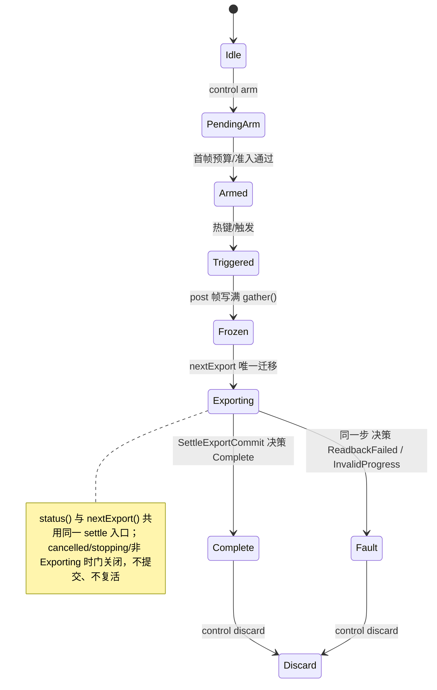
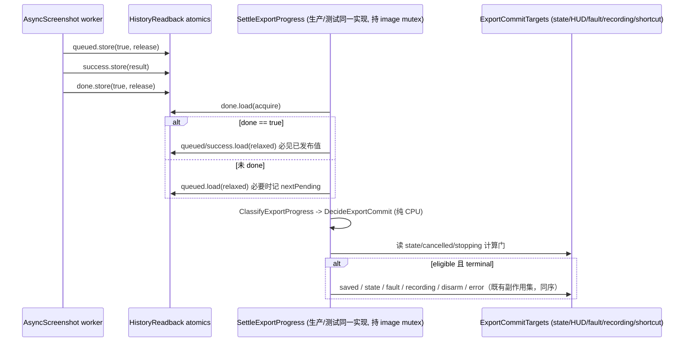

# 2026-09-16 DSH 架构线程（Kimi）：录制图像导出终态唯一提交

状态：本批候选已实现并完成离线静态 / 纯 Python 验证；**未经编译器、native、DLL、GPU 或实机
验收**。授权、分工与验收边界见 `docs/plan/2026-09-16-dsh-dual-agent-supervision.md` 和主线程
设计 `docs/plan/2026-09-16-recorder-export-terminal-contract.md`；本文件不改变这些计划，
也不修改总开发日志。本版吸收主线程第一轮监督意见：把**实际最小 CPU 提交步骤**也收进生产头
共用入口，测试侧只绑定存储，不再复刻提交分支。

## 问题（本批真正要解决的事实）

`FrameHistory::Impl::status()` 与 `FrameHistory::nextExport()` 各自判断图像导出是否完成，
副作用不一致：

- `status()` 在 `done==orderCount&&queued==orderCount` 时直接写
  `state=failed?Fault:Complete`，**不更新** `hud().state`、`hud().saved`、`hud().error`，
  失败时连 `fault` 字符串也不写。
- `nextExport()` 另算一份 `allDone/failed/saved`，自己写 `hud().saved`；终态时调
  `fail("image-export-failed")` 或写 `state=Complete;hud().state=Complete`。

因此当 `status()` 先观察到全部完成，`nextExport()` 下一次因 `state!=Exporting` 提前返回，
HUD 的 saved/state 与 fault 原因永远停留在旧值；同一事实有两个决策入口、两套提交动作。
此外原 `status()` 先读 `queued` 再 acquire 读 `done`，可能把"旧 `queued=false` + 新
`done=true`"拼成非法人口。

图像 Complete 只表示本轮图像读回/保存已结算，不代表 manifest/CPU 原始证据/incident 已成功；
`packageReady` 仍只能由整包导出成功或既有 acknowledge 决定。

## 冻结的跨线程接口（主线程签发，本批不改动）

新增 `src/d3d9/war3/tools/war3_frame_history_export_core.h`，namespace
`dxvk::war3::tools::history`：

- `struct ExportProgress { uint32_t retained, queued, done, failed; bool requestsValid; };`
- `enum class ExportOutcome { Pending, Complete, ReadbackFailed, InvalidProgress };`
- `inline ExportOutcome ClassifyExportProgress(const ExportProgress&) noexcept;`

语义顺序（严格按主线程签发）：`requestsValid=false`、`retained=0` 或 `>MaxSlots`、
`failed>done`、`done>queued`、`queued>retained` 均 `InvalidProgress`；合法人口
`1<=retained<=MaxSlots` 且 `failed<=done<=queued<=retained`，其中 `done<retained` 为
`Pending`（即使 `failed>0` 也等待全部结算）；全部 `done` 后 `failed>0` 为
`ReadbackFailed`，否则 `Complete`。`MaxSlots` 直接沿用 `war3_frame_history_core.h`，
不复制容量常量、不做溢出加总。

## 设计：一个提交边界，两个调用入口

新头放**纯 CPU 共享边界**（无分配、无 Rc、无 OS/GPU/日志），生产与 CPU 测试调用同一实现：

1. `ExportJobView` + `template<JobAt> SampleExportProgress(count, jobAt, nextPending)`：
   至多 `MaxSlots` 的单趟有界采样。每个 job **先 acquire 读 `done`**；只有 `done==true`
   才读它的 `queued/success`（生产者先 release `queued`、再写结果、最后 release `done`，
   acquire 读到 `done` 后二者必然可见，不可能拼出 `done>queued` 的撕裂人口）。未 `done`
   的 job 读 `queued`；第一个"未 done 且未 queued"的序号记入 `nextPending`（无则
   `MaxSlots`）。`orderCount`/order index/request 任一无效 → 空 view →
   `requestsValid=false`，**绝不解引用**，并在该 job 前停止读取。
2. `ExportCommitDecision` + `DecideExportCommit(progress)`：把分类映射为提交内容。
   `InvalidProgress` 只产出明确 CPU 故障 `"image-export-progress-invalid"`；
   `ReadbackFailed` 沿用既有 `"image-export-failed"`；`Complete` 产出 `Complete`。
   决策结构**没有 packageReady 字段**，也不含任何资源释放。`saved=done-failed`
   （InvalidProgress 时为 0）。
3. `ShouldCommitExport(exporting, cancelled, stopping)`：唯一提交门谓词。
4. **`ExportCommitTargets` + `SettleExportCommit(decision, targets)`：实际提交步骤**。
   `ExportCommitTargets` 是窄引用 view，只绑定唯一入口允许触碰的既有单元：图像生命周期
   `state`、`fault` 字符串、`recording` 标志、HUD 的 `state/saved/error`、以及经不透明
   回调表达的 shortcut mailbox disarm。它不拥有任何对象，不改变锁/GPU/fence/registry/
   资源寿命。`SettleExportCommit` 从 live targets 读门（`state==Exporting && !cancelled
   && !stopping`），eligible 时先写 `hudSaved`；terminal 时**恰好一次**执行完整既有副作用：
   Complete → `state=Complete; hudState=Complete`；否则与 `Impl::fail` 完全相同的六步、
   同序：`state=Fault; fault=reason; recording=false; shortcut disarm; hudState=Fault;
   hudError=reason`。返回 `{eligible, committed}`，`committed` 只在真实跃迁的那一次为 true。
5. `ExportSettleResult` + `template<JobAt> SettleExportProgress(count, jobAt, targets)`：
   采样→分类→决策→门→提交的完整组合；`ShouldForwardExportJob(result)` 给出 nextExport
   是否转发未排队 job 的判定。

生产侧唯一提交入口 `Impl::settleExportProgressLocked()`（调用者持 image mutex）只做两件
适配：用 `exportCommitTargets()` 把真实 `Impl` 成员与 HUD 单例绑进 `ExportCommitTargets`，
用 lambda 把 `order[i]`/`request` 校验后映射成 `ExportJobView`；随后调用
`history::SettleExportProgress` 得到结果，并把 `nextPending` 从序号换算成 `frames[]` 下标。
**提交本身不在 Impl 里重写**。

`status()` 与 `nextExport()` 都调用该入口：

- `status()` 用返回的 facts/decision 填既有 schema 2 JSON（键名、状态编号、
  `captureComplete/rootCauseReady=false` 不变）；轮询仍可推动结算，但副作用与 nextExport
  完全一致，消除绕过 HUD/fault 的路径。
- `nextExport()` 保留 Frozen→Exporting 迁移与 try_lock/取消检查；随后调用同一入口，
  仅在 `ShouldForwardExportJob` 为真时按 `nextPending` 返回尚未排队的 job；本调用刚提交
  终态则返回 `{}`，不再有自己的 Complete/Fault 分支。

### 状态图

### 锁与读写序

锁序不变：registry mutex →（控制动作内）image mutex；`settleExportProgressLocked` 只在
image mutex 内运行，不取新锁、不回调 worker/GPU。worker 只写 job 原子，从不回调 history。

### 提交决策表

| 分类 | eligible 时的提交 | fault 原因 | saved | packageReady |
| --- | --- | --- | --- | --- |
| Pending | 仅 `hudSaved` | 无 | done-failed | 不变 |
| Complete | `state=Complete; hudState=Complete` | 无 | done-failed(=retained) | **不变（不签发）** |
| ReadbackFailed | 与 `fail()` 相同六步 | image-export-failed | done-failed | 不变 |
| InvalidProgress | 与 `fail()` 相同六步 | image-export-progress-invalid | 0 | 不变 |
| 不 eligible（非 Exporting / cancelled / stopping） | 不提交，只返回事实 | 无 | 不改 | 不变 |

## 明确不做

- 不碰 GPU 资源、readback fence、registry/所有权、Release join 顺序、截图队列容量、
  分辨率、1 秒窗口、wire schema/状态编号、预算或窗口代码；不新增全局 Manager 或第二套状态机。
- InvalidProgress 只提交 CPU 故障，不释放/复用在途 GPU 或读回资源。
- `packageReady` 仍只由 acknowledge 或本地 worker 整包导出成功设置。
- HUD 仍是分立原子，不冒充跨字段事务快照。
- 不改 GLM 文件、原测试、其它 C++/header、Meson、shader、生产配置、总开发日志、旧树。
- 既有 `Impl::fail` 本身未改；导出终态的 Fault 路径由共享提交步骤执行与其完全相同的六步。

## 实施与验证

### 交付物身份（本批 4 路径）

| 文件 | size (bytes) | SHA-256 |
| --- | --- | --- |
| `src/d3d9/war3/tools/war3_frame_history.cpp`（修改） | 24146 | `23b2ad1faea142ed92a51114a0a67bc33a1acb1d0072aa484e0471e243791345` |
| `src/d3d9/war3/tools/war3_frame_history_export_core.h`（新增） | 8902 | `07593721ce71de8e27924adb293a97f4caa23387fe8e5f81ac4e5b746cc77bfb` |
| `AutoTest/test_frame_history_export_commit.cpp`（新增） | 20164 | `7385cb6af3c180eb8318deab705dee130a21ca57804bfc6277f846122901b7b` |
| `docs/agent-history/2026-09-16-dsh-export-architecture.md`（本文件） | 见回传 | 按合同不自哈希 |

修改前 `war3_frame_history.cpp` SHA-256 = `d9e357dba3bc088ebccfb7e7ab11a15666770a7a4bf58d2d45cc87dba6508b23`
（快照 `artifacts/.../war3_frame_history.cpp.before`），精确 diff =
`AutoTest/artifacts/dsh_export_architecture_20260916/war3_frame_history.cpp.patch`。

### 实际接线（供主线程与 GLM 核对）

- `Impl::settleExportProgressLocked()` 是唯一提交入口：`status()` 与 `nextExport()` 各调用一次。
  两处旧终态分支已删除——status 的 `state=failed?Fault:Complete`，以及 nextExport 的 `allDone` 扫描与
  `fail("image-export-failed")`/`state=Impl::Complete;hud().state=Impl::Complete`。
- 提交步骤本体在生产头 `SettleExportCommit`/`SettleExportProgress`；Impl 只经
  `exportCommitTargets()` 绑定真实 `state/cancelled/stopping/fault/recording` 与
  `hud().state/saved/error/shortcut`，再调 `history::SettleExportProgress`。
- 既有静态 pin 保留：`if(m->state==Impl::Frozen){m->state=Impl::Exporting`、
  `if(m->state!=Impl::Exporting)return {}`、`{"schema",2}`、`{"captureComplete",false}`、
  `{"rootCauseReady",false}`、`struct FrameHistory::Impl : history::CaptureLifecycle`、registry/lease 所有权边界。
- 唯一入口名字出现 3 次（定义 + 两个调用）；去掉注释/字符串后大括号/圆括号配平
  （cpp 265/265、443/443；header 29/29、58/58；test 76/76、365/365）。

### 测试如何覆盖真实共用提交边界（本轮修订核心）

`AutoTest/test_frame_history_export_commit.cpp` 的 `Harness` **只绑定存储**（真实
`std::atomic` 单元 + `disarmCount` 回调）并经 `ExportCommitTargets` 交给共享实现；
`settle()` 直接调 `SettleExportProgress`，`statusEntry`/`nextExportEntry` 只是同一 settle
加共享的 `ShouldForwardExportJob`。测试里**没有**任何自写的 eligible 判断、HUD/fault/
recording/shortcut 发布或状态分支（静态检查强制：无 `hudSaved.store`/`hudState.store`/
`hudError.store`/`recording.store`/`.disarm()`/自算 `apply.eligible` 等）。因此：

- 共享实现若漏更新 HUD saved/state/error 或 fault 字符串，对应断言立即失败；
- 共享实现若重复提交，第二次 settle 的 `disarmCount` 会变为 2 / error 被重写，立即失败；
- 两种入口先后顺序（status-first 与 nextExport-first）都断言到同一组真实副作用。

### 已跑验证（纯 CPU / 静态，cwd=集成树根，`python`=3.13.11，均 `-B`）

- 我方函数体级接线检查 `verify_wiring.py`：唯一入口、旧分支消失、冻结接口签名、`MaxSlots` 复用、
  共享提交步骤在头内且触碰全部既有副作用单元、生产绑定真实单元、测试不复刻提交、
  边界内无 `packageReady`、schema/状态编号/所有权 pin 保留 → `ok=true`（`verify_wiring_result.json`）。
- 7 份既有静态测试全部通过（61 tests，rc=0）：`test_frame_history_static.py`(10)、
  `test_frame_history_shortcut_static.py`(7)、`test_frame_recorder_self_contained_static.py`(8)、
  `test_frame_recorder_default_policy_static.py`(5)、`test_frame_evidence_control_static.py`(13)、
  `test_frame_recorder_memory_static.py`(5)、`test_analyze_frame_history.py`(13)。
- 基线核对：HEAD `ae890542d766470d1703f5bea7f5b73636039733`、branch
  `codex/v1.22-release-integration-20260914`、backup `codex/backup-before-dsh-dual-20260916`=`30c9163`。
  全程无 git 写入/commit/reset，旧 dxvk 树只读。

### 未跑 / 未验证（明确缺口，不伪称已验证）

- **未编译**：新头、测试 cpp、修改后的生产 TU 都未过编译器；配平检查与方法体审阅不等于可编译。
  建议主线程串行用现有 32 位编译器单文件编译并运行 `AutoTest/test_frame_history_export_commit.cpp`
  （`-std=c++17`，仅线程依赖，不需产品 DLL），并对生产 TU 做 `-fsyntax-only`。
- 测试与生产现在调用**同一个** `SettleExportProgress`/`SettleExportCommit`，提交逻辑本身已被
  CPU 测试真实覆盖；但 `Impl` 的**绑定**（`exportCommitTargets()` 把真实成员/HUD 单例接进 view）
  与 `settleExportProgressLocked` 的方法级真实运行仍需编译后才能证明，本批只做了接线静态检查。
- 未跑 native gate，未构建/部署 DLL，未接游戏/GPU，未做玩家视觉或性能验收。故不能声称
  HUD/fault 交接已在实机闭合，也不能声称任何 FPS、闪退或闪断修复。

### 行为变化与剩余风险（需主线程复核）

- 非法人口现在提交 `Fault("image-export-progress-invalid")`（旧 status 会停留 Exporting，
  旧 nextExport 可能误提交 Complete）；`cancelled/stopping` 时 status 轮询不再推动终态
  （旧 status 会绕过）。均符合设计合同，但属可见行为收紧。
- `hud().saved` 现由两个入口按同一 facts 更新（旧仅 nextExport 更新），Pending 期为全表计数
  （旧 nextExport 早退时可能只算前缀）；仍只是诊断原子，不冒充跨字段事务快照。
- 导出终态 Fault 的六步副作用由共享提交步骤执行，与既有 `Impl::fail` 完全相同且同序；
  `fail` 本身未改，仍服务其它非导出故障路径。
- 若主线程要求 Impl 方法级真实运行，或确认需要扩大路径/改接口，请停在精确提案等待巡检，
  不自行扩张本批次。