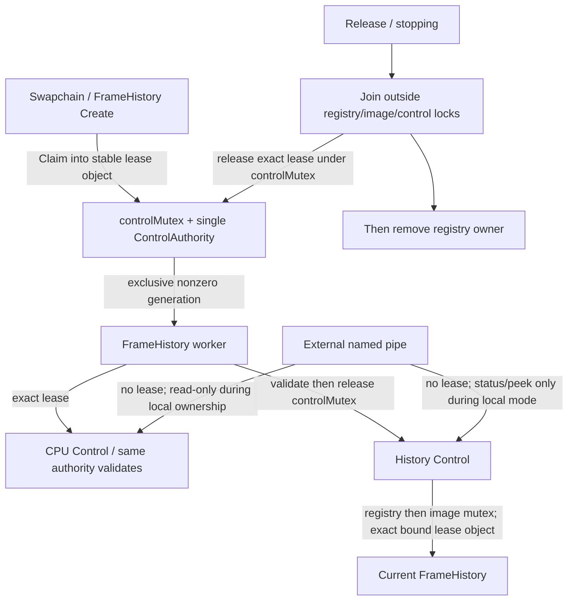

# Recorder Control Lease：现有CPU控制权交接收敛

2026-09-16 04:20，实施前合同。仅控制路径；不是本轮闪退根因/修复接受，也不是64位渲染接入。

## 现状与目标

`ClaimLocalRecorder()`/`ReleaseLocalRecorder()`目前操作一个无身份bool，worker通过`Control(...,true)`和
`FrameHistoryControl(...,true)`声明本地权限。当前实际调用者是swapchain-owned FrameHistory，Release在join以后；
尚无证据证明当前合法链已误释放。问题是接口无法表达“是哪一个owner、是否已释放”，后续新旧模块可误用裸true。

保留原有`controlMutex`和Store/FrameHistory所有者，不另起服务或Manager。以一个不可复制/不可移动、一次性签发的
`RecorderControlLease`替代bool权限。控制owner代际独立于ring session、map/device epoch和GPU fence，互不冒充。
外部pipe继续省略lease（nullptr）；JSON字段/调用方式不增加新的权限开关。

## 必须保持的规则

- Authority单一串行owner，由既有controlMutex保护；不在热路径加锁/查询。Claim仅CPU ring Idle且无owner时成功。
- 每个lease对象一生至多一次签发；拒绝占用输出、已用输出、计数耗尽，不回绕。失败不消耗新代际。
  Lease默认无效，不能复制/移动/赋值/自行填入generation；不通过析构假装worker已停止。
- Control对非空lease始终验证精确authority+generation；默认nullptr仅在无本地owner时允许修改，status仍可读。
  旧/空/其他Authority的lease均不被认作“外部无lease”而绕过门。
- Release必须精确匹配当前lease，只失效该lease；重复/陈旧/外来Release不得清掉新owner。丢弃凭据不自动释放权限。
- FrameHistory持有稳定lease对象，worker只在其寿命内借用；停止先join，再Release。删去冗余`claimed`bool。
  Image Control先通过CPU authority校验（释放controlMutex），再取registry、验证指针正是该image owner绑定的lease，
  最后使用image mutex。不得在持controlMutex时获取history registry，避免与Create(registry→control)反向。
  正在stopping时拒绝本地新image操作；worker最后CPU freeze仍可用自身租约收口，随后join/Release。
- 不把lease放入wire，不长期保存调用者指针，不允许借用超出FrameHistory/worker寿命。它不是恶意进程隔离令牌。
- 现有ring session、显式discard、CreateNew导出、内存准入、取消、热键邮箱、GPU读回/retirement、manifest与JSON格式保持。

## 验证

1. 编译真实core：空/外来/重复/旧lease、合法claim/control/release、释放后合法新owner恢复、busy ring拒绝、generation耗尽。
2. 直接链接生产`war3_frame_evidence.cpp`：外部与本地Control/状态/导出/取消原测试保持；加入陈旧lease不能控制或释放
   新录制，完整合法新session仍arm/freeze/discard；拒绝后population/owner不变化。不只测试独立模拟器。
3. 保留既有静态门，改为验证真实lease调用/锁序/worker join顺序，不删弱其他断言；对history/control-plane生产TU语法检查。
4. 不运行Ninja或生成/部署新DLL，不接触暂停debuggee；CPU runnable与语法成功不代替游戏/退出实机。

剩余边界：并发错误销毁FrameHistory本身、GPU在途读者、任意DLL卸载、跨进程payload传输不在本次小合同中。

## 04:33 实施与验证边界

- 生产CPU控制已使用`RecorderControlAuthority/Lease`；所有本地worker调用改为具体lease，外部控制默认nullptr。
  FrameHistory先join再释放，image control先校验authority、再registry绑定检查，未加采集热路径调用。
- `AutoTest/artifacts/overnight_architecture_20260916/recorder-lease-r2/receipt.json`：15个Win32 CPU入口通过。
  真实Session/Mailbox/Ring/Authority共9766检查；链接生产Control的runtime为723检查，另disabled3，
  memory45、实际Control内存拒绝/分配失败86，默认profile两种各5模式全部通过。
- 生产controlMutex下4线程共2000次claim尝试，实际255次成功、所有者重叠/错误释放为0；
  成功次数依调度变化，不设吞吐目标、不将未抢到租约当错误。之后合法owner仍可claim/release。
  原先导出schema7、本地owner bool字段、192条保留事件与精确序号/数据断言保持。
- history/evidence/control-plane/inputs四个生产TU，使用原compile_commands剔除对象/依赖输出参数后，
  仅`-fsyntax-only`通过；没有Ninja、对象更新或DLL链接。CPU编译保留既有focus函数unused-parameter warning，
  四个生产语法检查无warning。不为让测试输出变绿修改无关源码。
- 定向Python：frame72 + self-contained9 + render-host25 + 新gate5 =111项，通过；不是全量回归。
  新gate创建独立输出目录，核PE32、源码前后SHA、生产签名/锁序静态门、Windows命令行拆分与禁止输出参数。
- 当前只有CPU/语法证据，仍无实际swapchain退出、设备重建、游戏GPU或玩家验收；不声称闪退已修复。
