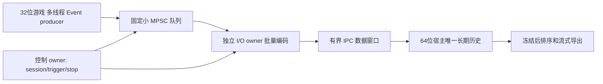

# CPU 取证历史外置：实施与双代理分工

2026-09-16 用户批准正式开始；第一目标为 CPU 事件历史，不是整个渲染器或原始 GPU 输入池。
本合同先于实现冻结。原 DLL/旧证据不覆盖，根 CHANGELOG 不晋升；实际进度写开发日志。

## 目标与分阶段验收

E1：真实 Event 的跨位数字节协议、64位历史核心、有界多生产者接入核心，实际32/64 CPU门。
E2：真实跨进程长历史和内存取证；协议/断连/慢消费/退出完整性，32位不映射长期历史。
E3：独立异步产品进程 owner，替换实际 CPU ring 后才做 exact DLL 构建及隔离2560×1440同配置对照。
E1/E2不宣称游戏节省内存。旧 RH1 lab 的阻塞取消/析构不直接链接产品，必须先闭合 E3。
原始 GPU 输入池和显存历史保留原所有者，本阶段不能承诺同时消除其内存压力或证明闪退修复。

游戏侧预算目标：事件 ingress 默认8192槽、约数MiB；worker和共享窗口固定小块，不动态扩容。
64位长期历史最多262144个真实Event（约98MiB原始记录），另有冻结排序索引。总体系统内存不一定下降。
慢消费可拒绝诊断事件，必须计数并将完整性判失败；不阻塞渲染线程、不静默回退100MiB本地环。
辅助进程不存在/失败时明确诊断不可用，不影响正常游戏渲染；最终产品禁止DLL卸载后存活回调。

## E1 权威边界

- 真实字段类型复用 `war3_frame_evidence_core.h::Event`，不修改旧Ring实现，不复制第二份字段定义。
- event.sequence 是成功入队的连续 publication 序号；失败尝试不占序号，另有 attempted/lost 计数。
  这与旧Ring“失败也可能占ticket”的计数语义不同，未来产品必须使用新版本标志，不得伪装旧schema7。
- 主线程负责有界MPSC队列和控制交接；现有SPSC不可被多线程直接调用。队列只负责字节拥有与顺序，
  不假装 GPU fence、会话 owner 或 IPC 已完成。生产者无堆分配/OS调用/等待消费者，有界CAS竞争失败计数。
- worker单消费者保序；同一session中Event.sequence严格1起连续，Event.session精确匹配。
  32位地址、owner/parent/data里的值只作原始证据，64位宿主永不解引用或赋予资源所有权。
- 触发cut取已成功claim的最后序号（包括尚未完成写入的claim）。worker在发送Data前采样cut；
  不能先发送cut之后的事件再告诉host触发。freeze须关闭准入、排空实际writers及队列后才能Seal。
  Begin/Data/Seal ACK只证明CPU；Seal不证明图像/inputs.bin/整包完成。

## WVE1 wire：独立payload，不放宽RH0/RH1

现阶段仅E1 codec/core；未来RH1接线需显式新capability及旧profile拒绝测试，不能冒充旧EnvelopeSamples。
Header固定80字节，little-endian，魔数WVE1；不memcpy native struct作为线协议，不使用reinterpret overlay。

| offset | bytes | 字段 |
|---|---|---|
|0|4|WVE1|
|4/6|2/2|major=1/minor=0|
|8/10|2/2|op=Begin1/Data2/Seal3，flags=0|
|12|4|headerBytes=80|
|16/20|4/4|payloadBytes=count*392，count<=160|
|24/32/40|8/8/8|session非0，ordinal非0，trigger cut或UINT64_MAX未触发|
|48/56|8/8|attempted/lost|
|64/68|4/4|capacity 4..262144，reason|
|72|8|accepted|

Event精确392字节：sequence/session/parent/qpc各u64（0..31）；owner/frame/mapEpoch/deviceEpoch各u64
（32..63）；thread/kind各u32（64..71）；label原始32字节（72..103）；data12*u64（104..199）；
bits48*u32（200..391）。保持浮点位模式/原始整数，不解析为地址；kind只接受1..18，label必须含NUL。
sequence非0且不为UINT64_MAX，session匹配header；其他原始字段允许0或任意bits，不凭codec冒充渲染语义验证。

- Begin：ordinal=1，count=0，trigger=UINT64_MAX，attempted/lost/accepted/reason=0。
- Data：count=1..160，attempted/lost/accepted/reason=0；trigger可无或已固定cut，capacity/session不变。
- Seal：count=0，reason=1..4（沿用Requested/PostWindow/Capacity/SequenceWrap标号），
  accepted<=attempted且lost=attempted-accepted，无溢出加法；trigger只能无或<=accepted。
- 每包精确长度，尾随/截断/未知版本/flag/op/非法形状均拒绝；Decode先清View，DecodeEvent先清Event，
  Encode先清written且必须全量验证后才写，禁止source/output重叠。编码不分配堆或做OS调用。
  主线程审查澄清：输出引用本身与输入/目标重叠时，必须在清空前返回Overlap且不写任何对象；
  否则“清空输出”会先破坏输入。仅该非法别名情况例外，正常独立输出的所有失败仍清空。
  地址/长度算术溢出同样视为无法证明不重叠，返回Overlap而不写；不凭畸形count建立合法源范围。
- byte codec不裁定会话状态；HistoryStore才拥有下一ordinal、连续事件seq、trigger一致性、历史存储及Seal。

## 64位历史核心合同（Kimi）

新增 `recorder_history_store.h/.cpp`，单线程调用、不依赖Windows/Vulkan；真实host最终为64位。
公开：`StoreError accept(const uint8_t*,size_t)`（自身Decode，不能信任调用方伪造View）；
`Summary summary() const noexcept`；`bool visitFrozen(const std::function<bool(const Event&)>&) const`。
状态 Empty/Recording/Frozen/Fault；任何无效包或申请失败永久Fault，旧对象不能重开，只能新对象/新会话。
Summary至少包括state、session、nextOrdinal、lastSequence、trigger、capacity、accepted、attempted、lost、
evicted、retained、reason、storageBytes、wireError/storeError；失败不得报告完整成功。

Begin一次性申请capacity个Event；前区pre=capacity-capacity/4，后区post=capacity/4。
无trigger或seq<=cut的事件落(seq-1)%pre，覆盖计evicted；post落pre+(seq-cut-1)，超出容量拒绝，不覆盖。
trigger可以首次在Data或Seal给出，之后必须完全相同；首次给出时cut>=此前lastSequence（不得追溯重分类），
未来cut可先于相应记录到达；Seal最终要求cut<=lastSequence。未触发Seal只导出前区。
同包先完整验证record/session/连续sequence/trigger/index范围，禁止半包写入再发现尾部错误而当成功。
accepted为实际已处理事件数（含被前区淘汰者），Seal必须精确相等；lastSequence==accepted，
lost=attempted-accepted。retained=accepted-evicted。冻结后只能按sequence排序遍历已有记录；
不得制作第二份Event大副本，可用有界指针/索引排序；visitor失败返回false且不能声称导出完成。
一个连接末端只允许一份Seal；迟到Data/重复Begin/Seal永久Fault。不提供未验证的重启继续。
先做纯CPU核心，不擅自加入磁盘、IPC、launcher或产品接线。

## 写入所有权与并行任务

备份：`D:/WarVK-Backups/20260916-recorder-offload/`，Git备份ref
`codex/backup-before-recorder-offload-20260916`，源HEAD/真实index/284 dirty原字节均保留。

- 主线程：本合同、共享wire声明、有界多生产者队列、聚合gate/后续接线、最终集成与开发总日志。
- Gemini（用户临时替换GLM；cli-proxy-api/gemini-3.8-flash-high）：仅新增
  `tools/render_host/recorder_event_wire.cpp`、`AutoTest/test_recorder_event_wire.cpp`、
  `AutoTest/test_recorder_event_wire_golden.py`、`docs/agent-history/2026-09-16-dsh-recorder-event-wire.md`。
- Kimi（cli-proxy-api/kimi-k3）：仅新增`tools/render_host/recorder_history_store.h/.cpp`、
  `AutoTest/test_recorder_history_store.cpp`、`docs/agent-history/2026-09-16-dsh-recorder-history-store.md`。
- 两方只apply_patch白名单，不改共同header/旧tests/协议/Meson/AGENTS/总日志；有疑问先报告，不扩协议。
  子线程不编译、Ninja、游戏或部署；纯Python可运行但实际C++门统一由主线程串行BelowNormal执行。
  输出仅各自新ignored目录，不删除/覆盖旧证据。双方完成后停笔等待审核，不自动接下一阶段。

## E1 最小测试门

Gemini：两位数golden与Python独立struct一致；0/1/160record形状，所有字段roundtrip，保留bits；
截断/尾随/错version/op/flags/count/size/session/kind/label/重叠，失败输出清空，边界溢出拒绝。
Kimi：实际store的正常前环覆盖/触发前后/freeze顺序、visitor失败、单包末记录损坏不部分提交，
错序/重放/错session/错capacity/trigger回退或变化/统计不闭合/超post容量/终态，且新对象正向恢复。
主线程：多生产者并发无重复/错内容、慢消费者队满立即返回、准入关闭与排空交接、旧session拒绝、
源字节/PE32/PE32+身份及native真实计数。静态和CPU门不能代替E2/E3及游戏内存/FPS/崩溃验证。

E1最终证据：`AutoTest/artifacts/recorder_offload_e1_parent_20260916/all-r2/receipt.json`；
两个子任务均已停笔，主线程收紧与失败回执见开发日志。禁止根据各子线程初次self-report跳过联合门。

E2开工前仍需冻结：触发请求与worker发送的线性化（不能发送cut之后的记录才发布旧cut）、
64位host唯一大分配/32位固定窗口及真实进程commit/VA测量、新capability与旧profile拒绝、
缺Seal/断连/慢消费/排空/进程退出的CPU合同。E1交接测试是同步安排cut的实际组件测试，
不是上述多线程控制交接或跨进程所有权证明。不可直接将lab阻塞取消/析构接入游戏。

## 一手依据

[微软跨位数IPC](https://learn.microsoft.com/en-us/windows/win32/winprog64/interprocess-communication)、
[MapViewOfFile](https://learn.microsoft.com/en-us/windows/win32/api/memoryapi/nf-memoryapi-mapviewoffile)。
共享大环映回x86仍占其VA；只共享固定在途窗口，长期存储放host私有地址空间。
CPU发布/共享槽ACK/GPU完成分别证明；本阶段不做外部GPU内存导入。

多生产者入口的可见性依据为[C++原子顺序规范](https://eel.is/c++draft/atomics.order)：
每槽发布release与consumer acquire配对；consumer归还release与下次producer acquire配对。
claimed只分配唯一slot/ticket，不授权读取event；close/writers用seq_cst协调最后准入，
析构仍须外部join全部调用者，不能以一次writers=0快照替代线程退出。attempt上限UINT32_MAX，
内部64位计数为已准入并发调用留余量；限制触发后关闭准入，绝不靠计数回绕复用旧代。
