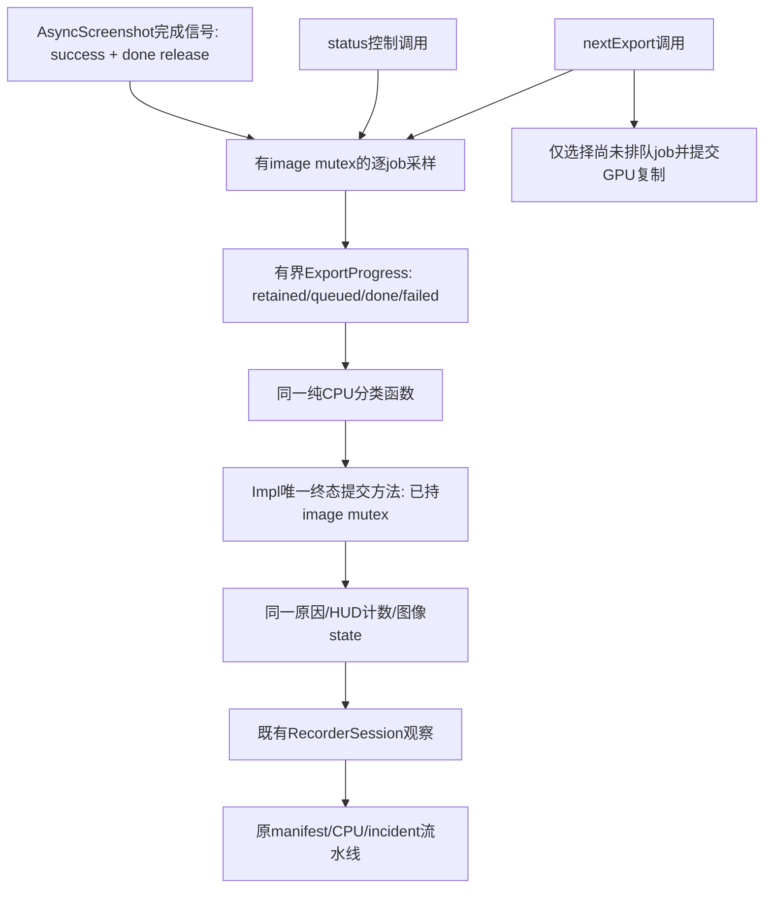

# 主线程设计：录制图像导出终态只由一个入口提交

状态：设计与待验收合同，尚未修改生产C++。本设计不交由DSH自行改变；DSH第一批仅做测试编排。
范围：`FrameHistory::Impl::status()`和`FrameHistory::nextExport()`之间的完成/失败交接。
不是完整录制模块重写，不是本次GPU驱动闪退根因声明。

## 源码事实与问题

当前status在持有image mutex时统计job，并可直接将Exporting改为Complete/Fault；
nextExport也统计job，但还负责HUD.saved/state以及fail("image-export-failed")。
如果status先观察到全部完成并提交state，下次nextExport因不再Exporting而提前返回，HUD或fault原因可能未同步更新。
同一个事实有两处决策/不同副作用。只抽出一个判断表达式而继续保留两套提交动作，不能算解决。

图像Complete只意味着本轮图像读回/保存已结算，不意味着manifest/CPU原始证据/incident已成功保存。
`packageReady`仍只能由原包导出成功或既有有效acknowledge决定，绝不由图像Complete直接设置。

## 决策和唯一责任

1. 继续由现有FrameHistory image mutex串行化导出元数据，不增加全局Manager、所有权系统或新wire编号。
2. status允许保留“轮询推动已完成元数据”的现有行为，避免无新Present时轮询永不结算；但必须调用唯一提交入口。
   nextExport调用同一入口，随后只决定是否还有未排队job，不再有自己的Complete/Fault写入分支。
3. 分类函数只接受数值事实并返回Pending/Complete/ReadbackFailed/InvalidProgress，不含Rc、OS、日志、分配或GPU调用。
   具体类型/接口由主线程实施时签发；不把纯分类测试冒充实际Impl接线证明。
4. 唯一提交入口只处理当前Exporting。其他状态不被此入口复活或覆盖；既有其它失败路径保持自己的语义。
   特别是图像Complete之后manifest/CPU导出仍可失败，此处不能把Complete错误地定义成整个incident永远不可失败。

## 采样与状态边界

- 合法人口：1 <= retained <= MaxSlots；0 <= failed <= done <= queued <= retained。
  retained/order/request有效性由当前owner检查；空导出或缺失request不能被视为成功。
- 对每个job先acquire读done。若done为true，再读queued与success；不能先缓存旧queued=false，
  再看到done=true后据此报告非法人口。生产者当前先发布queued，成功/失败结果先于done release。
- done=false时不消费success。允许并发完成只使本次采样保守地保持Pending，下次调用再推进；不能猜测GPU完成。
- 合法但尚未全部done/queued：保持Exporting，即使已经有一个failed，也保留既有全部结算的语义。
  全部已完成时failed=0才Complete；否则统一ReadbackFailed原因。重复观察相同终态无重复完成动作。
- 发现结构性InvalidProgress时只提交明确CPU故障/停止新增导出；不能据此释放或复用在途GPU/读回资源。
  Fault、cancelled、stopping、线程退出、实际GPU完成分别是不同事实，不相互授权。
- HUD和状态由同一方法根据同一facts更新；现有HUD字段为分立原子，不声称跨字段快照具有事务原子性。
  如未来需要一致快照，须另行设计，不能本轮悄悄新增热路径锁。
- 不改变owner registry、控制租约、Release的join顺序、源图Rc、readback fence、quarantine或DXVK最后使用跟踪。
  不提前drop图片、不变更截图队列容量、图像分辨率或1秒窗口。

## 实施前必须具备的红/绿测试

1. 全部成功：先status后nextExport与反序得到相同state/HUD.saved/error；重复查询保持稳定。
2. 全部结算但有失败：两种顺序都Fault且准确原因相同，不出现Fault+空error或HUD仍Exporting。
3. 部分已完成含失败：仍Pending；完成其余job后Fault。正常未排队job仍可被nextExport选择。
4. 空人口、超界、failed>done、done>queued、queued>retained、缺request分别拒绝；不能通过关闭全部采集过门。
5. success在done之前写入、queued/done在采样中改变的顺序案例：不提前Complete，不因旧queued值误Fault。
6. 取消/停止/已Fault不被轮询改回Complete；此测试不代替真正GPU在途销毁测试。
7. 图像Complete但CPU未Frozen、manifest失败或incident失败：packageReady仍false，原错误路径保留。
8. 保持manifest schema2、enum wire0..8、CreateNew、CPU schema/内存准入/控制租约及无GPU等待门。

要同时验证实际共享CPU分类函数、唯一提交方法的实际可测试边界及生产调用接线。
只写一个复刻status/nextExport逻辑的测试模型不合格；若为真实方法测试需要隔离额外依赖，先审设计再实施。
完成CPU/语法检查后仍需要独立DLL构建与真实导出/退出门，不能在文档或静态通过后标记产品已修复。

## 性能与分工

采集Armed稳态和每draw路径不加新操作；进度采样仅在已有导出/状态路径，最大MaxSlots有界。
避免status/nextExport一次调用内重复扫全表；消费不可变本次facts完成分类、HUD更新与回包。
纯机械后续可交DSH：按已冻结接口填边界测试表、更新接线断言；不得修改上述完成定义、锁序或GPU释放规则。
当前批次只完成设计，不启动本合同实现、native编译或实机。
