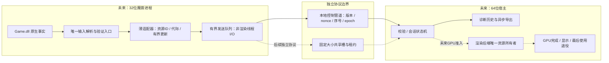
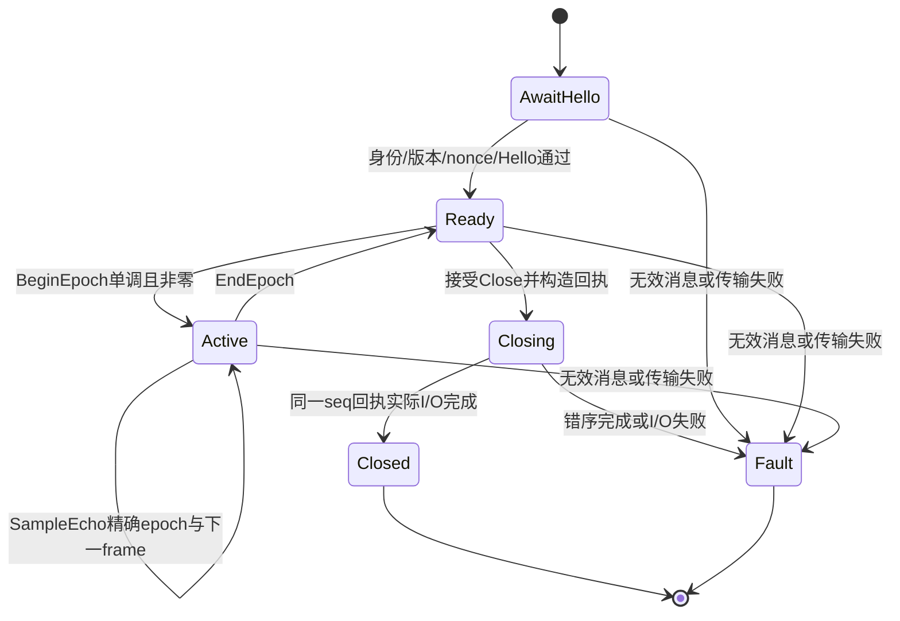

# ADR-RH0：64位辅助/渲染宿主基础协议

状态：实施前合同，2026-09-16；能力等级 **CPU protocol laboratory only**。
不是完整D3D9远程化方案落地，不加载游戏、不创建Vulkan设备、不减少当前游戏常驻内存。
本文先于RH0实现建立；实现/测试进度只在工作计划与开发日志记账。

## 决策与分层架构图

不先搬窗口，不用GPU→CPU→GPU逐帧搬图假装外置渲染。先证明控制协议/进程所有权，
之后按独立准入门搬走诊断历史，最后才研究渲染资源与D3D9语义代理。

RH0真实实施范围：独立32位测试客户端 ↔ 独立64位CPU宿主；仅Hello、BeginEpoch、
SampleEcho、EndEpoch、Close。图中的Game适配器、共享槽、GPU后端、显示均**尚未实现**。
原型放`tools/render_host/`，使用自己的构建/测试入口；不得加入产品DLL源列表或默认启动路径。
协议核心不依赖Windows/Vulkan/COM/STL对象布局；Windows传输和进程管理各自隔离。

## 责任与威胁模型

- 同一登录会话内的本地父/子进程；不提供网络服务、不跨用户、不提升权限、不加载任意插件。
- 传输建立必须：本地随机管道名、FIRST_PIPE_INSTANCE、单实例、REJECT_REMOTE_CLIENTS、
  显式logon-SID DACL，双向核对Windows报告的对端PID。子进程由精确绝对可执行路径创建，
  父保留进程句柄/创建时间；PID不能单独作为长期身份。随机nonce只绑定会话，不代替ACL/对端验证。
- 不接受命令执行、任意文件路径、内存地址、COM指针、Vulkan句柄或进程句柄作为消息payload。
- 同权限攻击者读取本进程、内核/管理员攻陷、GPU驱动漏洞不在此IPC隔离承诺内。
- 模糊数据、断连、超时、版本/位数/nonce/序号错误均终止本连接；不重同步扫描、不重放旧包、不隐式重连。

## RH0线格式（little-endian，无native struct overlay）

精确96-byte header + 精确payload；上限65536 bytes payload，总上限65632。
整数用逐字节编解码；不得reinterpret_cast后按C++结构读写，不传size_t/bool/pointer/enum布局。

| offset | bytes | 字段与约束 |
| --- | --- | --- |
| 0 | 4 | ASCII `WVK0` |
| 4 / 6 | 2 / 2 | major=0 / minor=1；RH0只接受精确相等 |
| 8 / 10 | 2 / 2 | headerBytes=96 / opcode=1..5 |
| 12 | 4 | flags=0请求，1响应；其他位拒绝 |
| 16 / 20 | 4 / 4 | payloadBytes≤65536 / reserved=0 |
| 24 / 32 | 8 / 8 | connection nonce low/high；不能同时0 |
| 40 | 8 | request sequence，从1严格递增；响应回显请求seq；不允许回绕 |
| 48 / 56 | 8 / 8 | mapEpoch / deviceEpoch |
| 64 / 72 | 8 / 8 | resourceId / resourceGeneration：RH0必须0，尚未授权资源协议 |
| 80 | 8 | frameId：SampleEcho从1严格递增，其他消息为0 |
| 88 / 92 | 4 / 4 | reserved=0 / reserved=0 |

不需要按字节布局的CRC来充当身份认证；Windows管道提供可靠字节传输，原始包长度和字段严格校验。
离线产物用SHA256定身份，不把hash本身当作生命周期/内容语义证明。
解析借用输入buffer只在同步处理期间有效；任何后续队列必须拥有bytes，不能保存MessageView裸指针。

### 消息语义

1. Hello：seq1、epoch/frame/resource=0；payload24 bytes：senderBits u32、expectedPeerBits u32、
   requiredCaps u64、supportedCaps u64。bits必须32/64且与实际构建/预期对端一致；
   RH0仅capability bit0=CpuEcho，required=supported=1；不接受未知位，不协商GPU能力。
   响应使用本端实际位数/对端预期，不能直接回显伪造身份。nonce由启动方绑定到此进程对。
2. BeginEpoch：Ready状态、empty payload；两epoch都非0且相对上次逐分量不后退、至少一项前进。
   即使值达到UINT64_MAX，也绝不回绕到1；需要全新连接nonce才能重开计数域。
3. SampleEcho：Active状态、精确当前epoch、frameId从1递增；payload可空到65536。
   响应只证明CPU收取并回显这些bytes，**不证明frame rendered/GPU done**。
4. EndEpoch：Active、精确epoch、frame=0、empty payload；退到Ready，不隐式创建下一地图。
5. Close：仅Ready、epoch/frame/resource=0、empty payload；回执后Closed。
   收到合法Close只进入Closing；传输owner确认同一seq回执I/O实际完成后，调用非wire的
   `closeReplySent(seq)`进入Closed。仅构造了回执不能冒充已送达；失败进入Fault，不伪报正常退出。
   Active想正常退出须先EndEpoch；异常断连直接Fault，并由宿主管理其自有资源清场。

错误消息不提交seq/epoch/frame；只将连接置Fault。错误后的任何消息不可恢复该对象。
合法新连接/新nonce必须有正向恢复测试。正常End后新epoch也是必须覆盖的正向路径。

## 传输、预算和退出合同（只有实测后才记为完成）

- 首版byte-mode overlapped命名管道、固定接收/发送buffer，先读96字节并验证长度，再读body。
  短读/短写通过剩余区间继续，不假设一次ReadFile等于一条消息；半包超时直接终止。
- 最多一个请求在途、一个回执；RH0是控制协议试验，**不允许渲染线程逐draw用它做RPC**。
  连接/整包/响应各使用固定5秒截止，不得每个短片段重置期限。无无限重试、无无界队列。
- I/O请求结构和buffer直到实际完成/取消完成才能销毁；CancelIoEx返回不等于完成。
  超时后发取消并检查最终完成；若无法按合同完成清理，记录失败并由父进程结算自有子进程，
  不能return后释放仍被系统持有的OVERLAPPED/buffer。实现前进一步核对取消路径。
- Close ACK仅是CPU会话结束；先结算I/O，再释放管道/事件句柄，再等待子进程退出。
  父退出须使自有helper有明确终止路径；进程句柄身份保活，不按通配进程名杀进程。
- 本机正常同用户之外的权限测试若未运行要标记未过；静态ACL字符串不等于安全验收。

## 后续资源/数据通道必须满足，RH0不开放

### P1实施前补充：进程隔离与取消结算

P1只运行独立CPU测试进程。父客户端通过Windows 10的`PROC_THREAD_ATTRIBUTE_JOB_LIST`
在创建子进程时原子加入`KILL_ON_JOB_CLOSE` Job；不采用先创建、再加入Job的孤儿窗口，
不支持该属性时直接失败。仅白名单日志句柄可继承，Job/管道/进程句柄不得继承。
父客户端退出由Job结算其自有helper，测试监督者只操作其创建并保有句柄的进程。

5秒是请求截止，不宣称为内核取消结算的绝对上限。实验室传输在超时/对端退出后调用
`CancelIoEx`，再以`GetOverlappedResult(TRUE)`等待最终完成，之后才销毁OVERLAPPED、
事件和buffer。这可能在异常内核环境继续等待，因此外层测试进程有独立20秒以上的
总墙钟看门狗；看门狗触发一律是验证失败，而非正常取消成功。该阻塞owner仅可用于
可终止的独立实验进程，**不得直接放进游戏/渲染线程**。未来产品适配需要异步owner与
退出结算的独立设计，不能把本实验室限制藏在通用API背后。

P2b复审收紧同一个owner的最终析构：关闭kill-on-close Job后，必须等精确child process handle signaled，
不能在5秒等待到期后继续销毁依赖它的共享容器。异常构造同样drain；等待API异常不能返回当作退出成功。
最终drain也可能受内核停滞影响，仍由上述外层看门狗判失败，不具备放入游戏热线程的条件。

每个包从header到body共享一个截止；碎片读写不刷新截止。日志分别记录错误阶段、
Win32错误、取消请求/最终完成计数。回执I/O完成只证明Windows已完成本次写请求，
不证明对端应用已处理，更不证明GPU已消费。非读取端的背压必须以实际Write超时阶段
取证；若仅观察到后续Read超时，不得当作Write背压通过。

依据：[GetOverlappedResult](https://learn.microsoft.com/en-us/windows/win32/api/ioapiset/nf-ioapiset-getoverlappedresult)、
[UpdateProcThreadAttribute](https://learn.microsoft.com/en-us/windows/win32/api/processthreadsapi/nf-processthreadsapi-updateprocthreadattribute)。

| 层 | 必须拥有的事实 | 禁止冒充 |
| --- | --- | --- |
| 不可变资源 | resourceId+generation、格式/字节范围、创建成功后的owner | 摘要或原生指针不等于内容身份 |
| 帧快照 | session/map/device、frameId、模型/姿态/材质/空间/实际输入来源 | 一份全局generation不等于全部寿命 |
| 共享槽 | slotId+lease generation、容量/偏移、publisher序号、consumer release | 入队/CPU ACK不等于GPU最后使用 |
| GPU内存 | 实测支持的外部handle type、adapter/driver兼容、usage/layout、导入引用 | Vk对象句柄数字不能跨进程直接用 |
| GPU同步 | 明确signal/wait/完成序号、全部消费者的last-use、owner线程退役 | producer done、引用计数不能替代consumer done |

共享内存不能整池映射回x86后声称已移出地址空间；游戏侧只保留小的固定在途窗口。
必要复制和同步成本需实测，不预承诺zero-copy或FPS收益。图像显存不是等量CPU VA。
渲染队列背压时不得静默丢单个draw；诊断数据可明确drop并计数，产品帧需要独立一致性合同。
GPU设备丢失不可由helper重启假装恢复，跨地图退役/屏幕输出/输入焦点为独立验收门。

## 验证矩阵与实施顺序

| 阶段 | 测试 | 能声称的结论 |
| --- | --- | --- |
| P0 codec/session | 固定golden bytes、截断/超长/未知版本/保留位、错nonce/seq/epoch/frame、合法多epoch与终态 | 真实核心CPU协议正确性 |
| P1 transport | Win32↔Win64实际握手/echo/退出；碎片/断连/超时/忙端；精确PID+nonce与关闭句柄 | 实际跨位数CPU通信，不是渲染 |
| P2 ownership | 独立有界共享槽、迟到ACK/ABA/重连、旧generation、取消/退出 | 实际槽生命周期，不是GPU完成 |
| P3 diagnostics | 游戏有界队列→64位长历史；off/on与内存/延迟/完整性 | 取证迁移收益（需实机） |
| P4 rendering | 资源/命令/Lock语义、完整画面、跨地图、GPU退役、性能与视觉 | 才可能称渲染进程候选 |

新协议行为须在本文登记并补实际核心正反例，不单改parser放宽门。所有历史bad capture保持原义。
本合同不让未验证原型进入v1.22发行包。

## 一手依据

- [Microsoft跨位数IPC](https://learn.microsoft.com/en-us/windows/win32/winprog64/interprocess-communication)：共享内存/句柄跨位数规则，指针依赖布局需转换。
- [CreateNamedPipeW](https://learn.microsoft.com/en-us/windows/win32/api/namedpipeapi/nf-namedpipeapi-createnamedpipew)：first-instance、overlapped、remote拒绝；默认ACL不适合作为本协议唯一门。
- [Named Pipe Security](https://learn.microsoft.com/en-us/windows/win32/ipc/named-pipe-security-and-access-rights)：logon SID限制访问。
- [CancelIoEx](https://learn.microsoft.com/en-us/windows/win32/api/ioapiset/nf-ioapiset-cancelioex)：取消请求不等于I/O完成。
- [Vulkan外部内存与同步](https://docs.vulkan.org/guide/latest/extensions/external.html)：内存与同步是分别协商的能力，不授权未实测共享方式。
