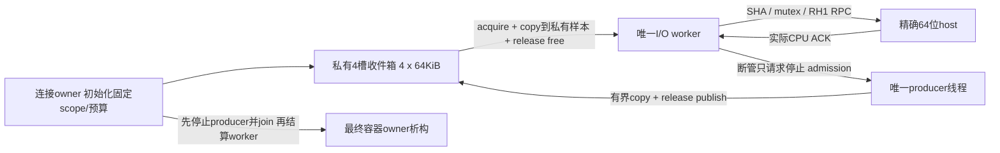

# ADR-P3：有界producer收件箱，不让lab RPC进入渲染线程

2026-09-16 04:36，实施前合同。独立CPU实验室；不接产品DLL、不读取Game、不接GPU。
P3a先验证实际SPSC核心/线程；P3b另验实际RH1慢宿主/断管。两者不能互相冒充。

## 数据链和责任

- 唯一producer和唯一consumer线程是明确前置条件，不支持MPSC/多render线程共用。现有MPMC CPU事件ring不替换。
  所有者创建/预分配后才发布给两线程；复用旧实例、在线换scope、线程交接或多producer均不属于此协议。
- producer只能调用`tryPush(frame, bytes)`，最多一次64KiB memcpy、固定数量32位原子load/store。
  不做分配、系统调用、mutex/pipe等待、SHA、格式化、磁盘、重连或child退出；不在内部spin/retry。
  使用编译期`atomic<uint32_t>::is_always_lock_free`门，两个位数都核。不是硬实时保证：缺页/调度/内存带宽仍可能耗时。
- queue构造时固定connection nonce+map/device；有效性要求全部非零。调用不接raw model/GPU指针，不接受其他scope覆写。
  frame必须非零且不回退；同一frame允许多份样本。frame只说明生产来源，不是GPU完成或RH1消息sequence。
- 四个槽各65536bytes；consumer先复制到私有65536byte Sample再释放queue槽。RPC即使阻塞也不持queue槽，
  producer满4槽立即返回Full并记数，不覆盖旧样本。总私有queue约256KiB+元数据，worker样本64KiB；
  P2共享池另256KiB和host私有64KiB，不算成“免费/zero-copy”，也不声称已经减少游戏内存。

## 顺序、丢失与计数

- 每次非终态调用分配严格递增attempt ordinal，再判输入/容量；sample携带其ordinal，缺口不能重新编号掩盖。
  有效输入即更新lastFrame，包括Full；无效输入不推进lastFrame。大小0/>65536/null/0frame/旧frame均Invalid，无copy。
- 计数只由producer修改：attempted = published + full + invalid。terminal调用不签发ordinal也不计入attempted，
  显式返回Stopped/Closed/Exhausted/Unconfigured。达到uint32最大值或更低测试limit后永久Exhausted，不回绕。
  head发布次数≤attempted，所以head/tail也不会绕回。empty不是故障，也不递增可无限溢出的等待计数。
- consumer按FIFO输出，携带完整固定scope、frame、ordinal、bytes；只暴露私有copy，不返回queue内地址。
  只有前bytes字节有效，尾部不清零也不允许序列化；不得把本地Sample结构padding或旧tail写到wire。
  出队不是host消费成功；P3b必须另记acknowledged、failedInFlight、abandonedQueued，不能把pop数当成功。
- 统计只能在producer/consumer均join后读取；不把64位非原子统计或对象布局放共享映射，也不做热路径实时遍历。
  `published = popped + queued`在join后的精确快照闭合，尾部Full/Invalid靠最终统计可见，不能只看相邻样本ordinal。

## 内存可见性

CPU普通payload写先于write-index release，consumer acquire见到该index后读payload；
consumer完成copy再read-index release，producer acquire见到空槽后才写同槽。所有payload访问受这两条边约束。
只有两个index和stop/closed是32位原子；本地样本不跨进程，RH1仍使用其冻结wire和Windows同步合同。
依据[C++ working draft atomics.order](https://eel.is/c++draft/atomics.order)的release/acquire同步关系，
及[intro.races](https://eel.is/c++draft/intro.races)的冲突访问/寿命边界；测试不能替代此访问规则。

## 停止和故障

- 任意控制/I/O线程可`requestStop()`，只禁止随后开始的admission。已通过入口检查的唯一在途push可能仍发布；
  requestStop不是producer结束/清空/可析构证明，不能因它返回就释放queue或映射。
- 唯一producer在最后一次push后`closeProducer()`发布closed，之后不允许新push；join才是其本地寿命结束证明。
  consumer在空且看到closed后必须重读write-index，避免漏掉close之前刚发布的最后样本；Finished只代表本地排空。
- 正常关闭：停止并join producer，worker排空至Finished，End/Close并结算host，join worker，然后释放queue/共享容器。
  Fault关闭：worker requestStop，停止/join producer，记录未ACK和队中剩余，精确child/OS-I/O完成后join worker，再释放。
  任意析构不能默认认为其他线程已停；不实现“析构自动阻塞render线程等RPC”的便利包装。
- 旧连接不可重用queue或覆盖scope。要恢复，先结束原owner，另建nonce/queue/host；故障后的成功路径必须测试。
  P1/P2最终内核取消drain仍可能卡住，外层lab watchdog失败收容，不因此获得产品集成权限。

## 实施/验证顺序

P3a实际核心两种位数：空/满/队满后恢复、1/小块/65536byte、精确内容/ordinal/FIFO、输入边界、frame回退、
scope非法、stop/in-flight允许边界、close后最后一条可取、计数耗尽不回绕、2线程大量正向样本/慢消费者/明确丢样。
测试暂停consumer时producer须完成自身固定次数调用，恢复consumer后仍完整消费已接受样本；不把总运行时间叫逐帧性能门。
记录真实sizeof/atomics位宽、计数/byte、源码/PE身份；不得仅静态搜词称并发正确。

P3b只有P3a闭合后实施：I/O worker操作原RH1，独立实际host延迟/断开，producer有限预算继续，
每条ACK与原样本身份/摘要对应，fault与排空/新连接恢复闭合。不得用本地sleep消费者冒充真实跨进程慢host。
GPU共享/长历史/具体几何和矩阵snapshot语义不在本阶段；需要独立payload-schema、copy成本和游戏实测。

### P3b准入前必须解决的frame语义区别

现有RH1 SlotLedger的`frame`要求每次Reserve严格+1，它目前是lab传输样本序号；收件箱的render sourceFrame可以相同，
attempt ordinal也会有明确Full/Invalid缺口。**不能直接拿sourceFrame/attempt填RH1.frame，更不能重编号后声称还是原帧。**
P3b需要独立小payload envelope，明确connection/map/device/sourceFrame/attempt/有效bytes，以及另一个连续transfer序号；
host须实际解析验证并在ACK映射中保留两种身份。既有RH1协议/ledger不为此放宽，RH0也保持冻结。
envelope占用共享槽容量，最大用户payload须按65536减header真实缩小、在producer准入前检查，不能截断或越界。
只有此附加合同先冻结后才可做真实IPC对接。P3a当前没有envelope/wire编码，不是可即插游戏的通用异步通道。

## 04:46 P3a实际CPU checkpoint

- `producer_inbox.h`已独立实现；实际Win32/Win64均queue262464bytes、Sample65584bytes、32位always-lock-free原子。
  producer私有频繁写入统计与consumer-index按64byte对齐分离；没有热路径new/mutex/pipe/hash/系统调用。
- 首轮完整`inbox-r4/receipt.json`双位通过，native检查分别131825/116117，两个编译器均无warning。
  固定暂停消费线程时，两端producer都在consumer恢复前完成2000次调用并join；4成功、1996Full，后续4份完整消费。
- 双线程各50000次尝试：Win32接受7380/Full42620/实际消费97328781bytes；Win64接受3453/Full46547/82195257bytes。
  逐样本实际内容、完整scope、ordinal/sourceFrame、FIFO与gap/尾部人口闭合。数值受线程调度影响，不是性能比较或吞吐目标。
  另有consumer线程发stop、producer拒绝新工作、已接受4份排空、close最后写可见，以及新queue正向恢复。
- 核心测试在queue调用期禁止普通/数组/对齐C++new；不冒充拦截所有malloc/OS分配，核心无这些调用由源码边界复审。
  实测不替代release/acquire访问证明；没有TSan、产品线程交接、多producer、慢跨进程host或GPU测试。
- R1为初版，R2补实际consumer stop和对齐new guard；R3因调用脚本中x64编译器路径笔误未完成，失败receipt保留。
  R4是修正命令后的当前源码双位证据，不覆盖旧记录。新增6组Python判定器，与旧25组共31通过；py_compile/diff通过。
- P3b尚未实施，下一步先冻结显式payload envelope及最大有效数据预算，再做真实慢host/断连，不能跳过身份语义差异。

04:49复审补充：旧Core再次运行使用了同一测试scope，证明新对象有效，但不足以声称已经覆盖不同connection身份恢复。
现已让第二轮使用不同nonce/map/device，并逐个实际样本比较新scope；不是只打印标签。
最新`inbox-r5/receipt.json`，双位132321/117909检查；50000尝试中Win32发布7504/Full42496/96620596bytes，
Win64发布3901/Full46099/84779890bytes。暂停consumer的4/1996固定门不变，新6组判定器通过。
R4仍是其旧源码证明，R5才是当前测试与gate的身份；核心header从R4至R5未改。尚未进行实际IPC恢复测试。
