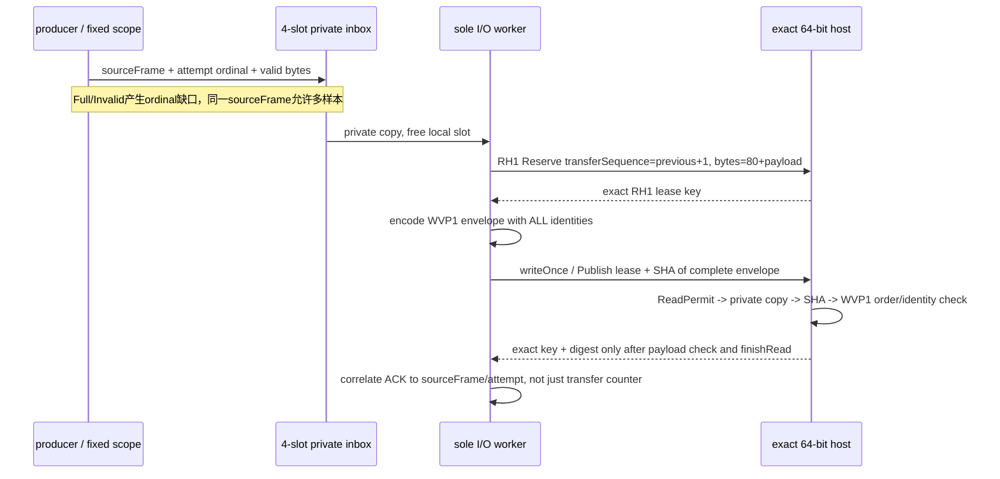

# ADR-P3b：有损producer到RH1的显式样本身份

2026-09-16 04:56，实施前合同。依赖P3a收件箱、RH1 slot/wire/进程事务合同。
先P3b1 codec/顺序验证器/真实容量准入；再P3b2实际worker/host。P3b1不冒充跨进程测试。

## 两类序号不合并

RH1.frame仍是连续transferSequence，不改既有SlotLedger。WVP1另存sourceFrame和attempt。
一次出队只允许一次传输尝试；没有ACK的在途样本记failedInFlight，不能重发或改名为正常样本。
无损要求不适用于有损诊断流，但每个丢失必须能在最终人口账本或ordinal缺口中发现。

## WVP1 header80（little-endian；共享样本总上限仍65536）

| offset | bytes | 字段与强门 |
| --- | --- | --- |
| 0 | 4 | magic WVP1 |
| 4 / 6 | 2 / 2 | major=1 / minor=0 |
| 8 / 12 | 4 / 4 | headerBytes=80 / flags=0 |
| 16 / 20 | 4 / 4 | totalBytes精确等于80+payloadBytes和当前lease.bytes / payloadBytes |
| 24 / 32 | 8 / 8 | connection nonce low/high，组合非零，精确等于lease |
| 40 / 48 | 8 / 8 | map/device非零，精确等于queue固定scope和lease |
| 56 | 8 | sourceFrame非零，不回退；允许相同 |
| 64 | 8 | attempt ordinal非零、≤UINT32_MAX，严格增加，允许有损缺口 |
| 72 | 8 | transferSequence非零，严格从1逐次+1，精确等于当前lease.frame |
| 80 | payloadBytes | 不解释为任何Game/GPU/native结构的有界字节 |

有效用户payload为1..**65456**bytes。必须在producer复制之前按构造时固定的Limits.sampleBytes检查；
不得先入队65536再由worker截断，不能把总映射槽扩到65616。通用P3a仍可配置65536，此adapter明确配置65456。
新增命名Limits（attempts/sampleBytes）代替含义容易混淆的可选整数，不新增线程或Manager。
encode拒绝source/output重叠、空指针、超容量；decode拒绝短包/尾随字节/flags/version/长度/数字不合法并清空out view。
head/tail/padding/无效tail均不序列化。

## 唯一决定与失效

- SlotLedger是共享槽lease唯一issuer；envelope验证器不签发slot，不解锁，不声称证明GPU或资源寿命。
  验证器只拥有payload顺序：固定scope、lastSourceFrame/lastAttempt/lastTransfer和terminal fault。
- 接受前要求实际已获ReadPermit的精确key，shape匹配、scope一致、bytes一致、transfer一致，decode全部通过。
  header验证失败或任何顺序矛盾永久Fault，输出为空；不能修字段、跳过该样本继续当前连接或复用旧view。
  只有先结束旧连接、另建新nonce/queue/validator/host才可恢复。core单元中构造的Key只能证明payload门，不冒充真实lease。
- 成功view只借用当前host私有copy，限同步consumer调用；禁止保存地址到异步任务。字段是值复制；bytes不可换成另一份数据。
  digest覆盖完整80+payload；它证明传输一致性，不证明几何、蒙皮、材质或内容真实性。
- 序号达到上限拒绝、不回绕；queue attempt为32位，wire留64位但此版本显式拒绝超32位attempt，不能兼容猜测。

## 后续真实worker/host阶段的准入条件

- P3 profile必须在Hello显式要求`SharedCpuSlots|EnvelopeSamples = 2|4 = 6`；旧P2 profile仍只接受/返回2。
  字节布局、RH1版本和旧golden不变，但双方精确匹配profile，P3不得降级到未验证envelope的P2 host。
  P3→P2、P2→P3两种错配都必须实际握手失败；仅检查可执行文件路径不能替代此能力边界。
- 不复制另一份RH1状态机。提取现有slot host runtime的同步payload检查接口，默认P2消费者保持原义；
  P3消费者在同一ReadPermit/private-copy区验证WVP1，验证在finishRead和回执之前。
  每次改共用host必须重跑P2实际41例，底层transport/child若改则P1也重跑。
- 延迟只在测试host的payload消费点注入，产出可对应的开始/结束QPC记录；consumer端断管在规定样本点，不能终止玩家进程。
  使用精确PID/creation/Job、CreateNew artifact与共享名，保持原23秒外层watchdog只作为失败收容。
- producer不创建child/pipe、不访问host日志、不等ACK；worker取private样本后允许阻塞。queue不持共享mutex。
  所有owner在两本地线程join及精确child结算后析构，Fault只请求停止，不假装OS取消已完成。
- 最终人口：attempted=published+full+invalid；published=acknowledged+failedInFlight+abandonedQueued，
  popped=acknowledged+failedInFlight；in-flight最多1。正常全部排空，不把pop等同ACK。
  实际host逐样本日志与producer成功样本/ACK逐一对应，Python独立重建字节/SHA/原始frame与gap。
- 慢host必须实际观察满队列，producer仍完成固定尝试；恢复消费后新的合法样本仍可发布。
  断管后故障终态与零残留，以及另起新连接的成功序列都要验证，不以全拒绝为通过。

实现顺序：P3b1双位codec/validator golden与畸形数据/顺序、P3a容量准入回归 → P3b2实际异步worker/host。
今晚07:40后不开始新长任务；证据不足就停在明确边界，不为赶进度接入游戏或GPU。

### P3b2测试适配与时钟依据（实施前补充）

实际worker先限AutoTest夹具，不预先建立可供游戏调用的通用服务Manager。共用的host loop、
不可变payload协议与SPSC是独立模块；夹具中的测试调度/故障注入不得进入生产线程。
normal/slow/disconnect只作用于实验host；新连接恢复使用新nonce、queue、host，不自动重放旧样本。
slow的协调线程读取host实验日志以放行producer批次；producer自身只接收测试barrier，绝不读取日志。
日志必须记录host delay start/end与producer批次start/end QPC、两边frequency。
采用[Microsoft QPC一手文档](https://learn.microsoft.com/en-us/windows/win32/sysinfo/acquiring-high-resolution-time-stamps)：
现代Windows同机跨进程QPC可比较，频率在启动后固定；跨线程相差±1tick的顺序不确定。
所以要求frequency相同且批次严格嵌于delay区间、两端余量>1tick；不使用UTC或猜测Sleep结束时间。
这个门证明实验调度下producer不等host，不是硬实时保证或性能benchmark。

首轮夹具R2/R3分别在冷启动依赖/能力错配后出现句柄人口增长，均保留失败receipt，不称通过。
尚未证明是C++线程依赖初始化、延后退出还是泄漏；不以等待若干毫秒或允许浮动计数消除失败。
夹具改为显式CRT线程handle所有者（不是改产品线程）：`_beginthreadex`创建，实际thread handle
signaled后才CloseHandle/读取最终计数。依据[Microsoft CRT线程合同](https://learn.microsoft.com/en-us/cpp/c-runtime-library/reference/beginthread-beginthreadex)
与[线程创建指南](https://learn.microsoft.com/en-us/windows/win32/procthread/creating-threads)。
同一进程16轮正常/断连交替，每轮要求句柄数等于已记录的依赖初始化后基线；不能只看进程退出后消失。
这不倒推旧P3a std::thread合同错误，也不把句柄增长诊断外推为游戏崩溃原因。

## 05:04 P3b1 checkpoint

- `sample_envelope.h/.cpp`已实现固定80字节codec、借用View和单一payload顺序验证器；
  原SlotLedger仍是lease唯一issuer，当前core测试中人工构造的Key不冒充真实ReadPermit。
  所有decode/accept失败清空View，accept失败永久Fault；成功才推进sourceFrame/attempt/transfer。
- 最新`envelope-r1/receipt.json`实际Win32/Win64各**56967检查**，各10000合法样本；
  包含重复sourceFrame、严格递增但有缺口的attempt、连续transfer、1/97/65456payload、畸形字段/长度/别名重叠、
  lease shape/scope/顺序、低限耗尽/故障新scope恢复和4000确定性变异后的精确roundtrip。
  81字节golden与独立Python struct编码逐字相同，两端无编译warning；没有IPC/GPU实测。
- ProducerInbox新增命名Limits，sampleBytes构造时固定；adapter值65456在copy前拒绝65457，随后合法65456仍可发布。
  P3a已重跑`inbox-r6/receipt.json`，双位131973/118645检查；两端queue仍262464bytes。
  50000尝试中发布7387/4055、Full42613/45945、96670366/75560249bytes，固定暂停门仍4/1996。
  R5只对应旧constructor/test；新Limits源码以R6为准，不能沿用旧receipt。
- P3b2的真实host重用、capability6、慢消费/断管/ACK映射尚未实施。没有把codec成功称作异步跨进程通道可用。

## 05:47 P3b2 checkpoint

共用host与测试worker已实现；最新`worker-r13`14/14、60 IPC lifetimes闭合，详见
[实际回执与失败审计](../research/2026-09-16-render-host-worker-lifetime-audit.md)。
302次written（包含15份无ACK），287 ACK；各自SHA和源身份均独立闭合，不把写共享内存当host完成。
P2共用host41例保持通过，39项Python定向门与相关py_compile通过。仍不进入产品或GPU。
