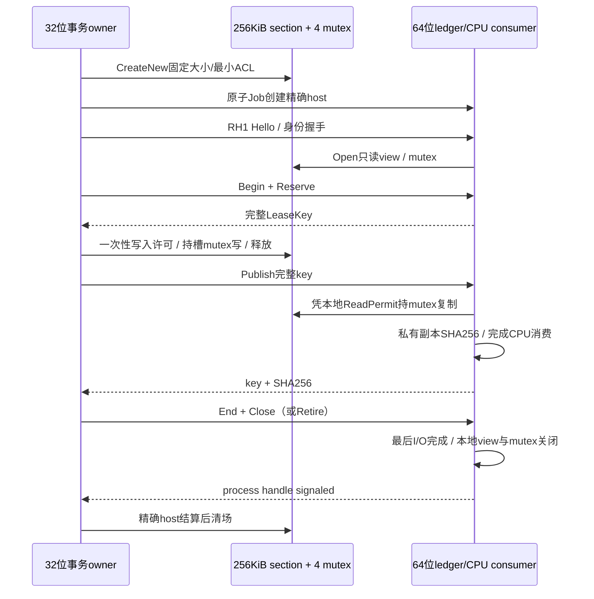

# ADR-RH1-P2b：真实共享槽实验的wire与进程事务

2026-09-16，实施前冻结。依赖[slot所有权合同](2026-09-16-render-host-slot-ownership-contract.md)；
仅CPU lab，不链接游戏/DLL，不承诺渲染迁移、zero-copy或VA/FPS收益。

## 所有者与退出顺序

逻辑槽租约的唯一owner仍是64位宿主的SlotLedger。**物理IPC容器**由32位测试客户端的
进程事务创建/拥有：固定256KiB匿名页映射和4个命名mutex，在其创建的host进程完成后才清场。
64位host只打开只读数据view，所有样本复制到其私有64KiB缓冲后处理；host不保存共享view别名。

不要求host等待其父进程退出再退出，否则父等待host会形成生命周期死锁。host只关闭自身
view/引用，系统仍保留32位owner持有的section；最终容器清场是32位事务的责任。异常路径由
原子kill-on-close Job结算host，随后容器析构。关闭自身view不是宣称其他进程已解映射，
也不是GPU释放协议。本原型没有GPU使用者。

最终child析构不能以“等待5秒已过”代替退出凭据；关闭kill-on-close Job后必须等精确process handle signaled，
异常构造同样适用。该最终drain和overlapped取消drain一样受外层测试进程看门狗约束：内核停滞会让整例失败，
不能安全回到游戏热线程；没有已退出证据不得继续共享容器清场。

## 独立协议：WVS1 header48 + payload最多128

RH0/WVK0完全冻结；RH1使用独立`warvk-rh1-<nonce>`管道名和codec，不能在RH0 Echo下解释资源指令。
底层精确读/整包截止可以复用，但必须重跑RH0传输回归；parser不得通过改magic后喂旧parser处理。

| offset | bytes | 字段 |
| --- | --- | --- |
| 0 | 4 | ASCII WVS1 |
| 4 / 6 | 2 / 2 | major=1 / minor=0 |
| 8 / 10 | 2 / 2 | headerBytes=48 / opcode1..8 |
| 12 | 4 | flags=0 request，1 response，其他拒绝 |
| 16 / 20 | 4 / 4 | payloadBytes≤128 / reserved=0 |
| 24 / 32 | 8 / 8 | 固定connection nonce low/high，不能全0 |
| 40 | 8 | seq从1严格递增、不回绕，回执echo同seq |

消息形状与状态：

| opcode | 请求 | 回执 | 语义 |
| --- | --- | --- | --- |
| 1 Hello | 24 bytes：senderBits u32 / peerBits u32 / caps u64=2 / slots u32=4 / slotBytes u32=65536 | 同24，sender/peer改实际位数 | 只接受一次，必须32→64，capability只SharedCpuSlots |
| 2 Begin | map/device各u64，共16 | 回显16 | ledger唯一epoch判断，Dormant/Ready→Active |
| 3 Reserve | frame u64 / bytes u32 / reserved u32=0，共16 | WVL1完整key64 | issuer决定slot/generation，错误不消耗frame |
| 4 Publish | WVL1 key64 + writer预期SHA256 raw32，共96 | key64 + 实际私有副本SHA256 raw32，共96 | full-key准入→ReadPermit→实际copy/hash逐字匹配→finishRead之后才回执 |
| 5 Cancel | key64 | key64 | Writing→Quarantined，不证明写入结束；不可再次复用该槽 |
| 6 End | empty | empty | 仅所有槽Free时Active→Ready |
| 7 Close | empty | empty | 已Hello且ledger Dormant/Ready、无在途槽；ACK实际写完才Closed |
| 8 Retire | empty | empty | 已Hello后显式结束整个连接；ACK写完才Retired，不能重开 |

Hello/版本/nonce/seq/长度/字段/ledger错误或OS错误均Fault，retire ledger，不隐式重连/重试。
Capacity在本版wire同样结束当前实验连接，核心的“释放后恢复”另外测试；不得悄悄扩容。
已发布合法包但回应I/O失败仍是Fault，不能算正常Close。CPU copy失败后先retire，再结束
本地已不在执行的ReadPermit，不能把有疑问的槽退回Free。任何ACK均不是GPU完成。

## 共享容器和复制边界

- section名`Local\\warvk-rh1-<nonce>-data`，mutex名同前缀`-slot0..3`。显式logon-SID DACL；
  section只read/write，mutex只synchronize/modify-state（必要query权限），不默认all-access、不提升权限。
- creator用paging-file backing、PAGE_READWRITE、固定262144bytes；发现ALREADY_EXISTS立即拒绝。
  reader用FILE_MAP_READ，writer用限定read/write视图；不保存/传递对方地址，不映射“大历史环”。
- CreateMutex/Mapping任意部分失败都只关闭本次得到的句柄/view，不修改或删除同名既有对象。
- writer每槽记录已消费generation；写入开始前永久消耗本地一次性许可，重复/旧generation不得再次写入。
  许可来自已通过对端/seq验证的Reserve回执；key还需精确匹配该请求的nonce/map/device/frame/bytes。
  该表是delegated write许可，不是第二个slot issuer；最终publish仍由64位ledger唯一裁定。
- writer/reader均需有限等待该槽mutex，同时观察所持有的精确peer进程句柄。只在持锁区复制bounded range；
  WAIT_ABANDONED得到的锁也必须释放，但样本内容直接拒绝/连接退役，不读、不hash、不继续复用。
- reader只能以本地ReadPermit取key副本；验证nonce、slot范围、bytes后复制到私有buffer，之后只hash私有副本。
  SHA256是传输一致性证据，不是对恶意同权限writer的认证，也不是几何/蒙皮/材质语义正确性。
- 不支持异步GPU读者、用户指针或任意文件路径。真实数据通道与渲染接入仍需要独立owner/预算/吞吐验收。

## 计划实测矩阵

正常1/小块/64KiB、4槽在途、跨epoch、slot复用、取消后其他槽持续工作与Retire；
旧key（nonce/epoch/frame/generation/bytes）、重复Publish、未写完/字节错配、writer重复写拒绝；
mutex timeout与实际abandoned writer thread（进程仍活）、断连/进程退出、同名section/mutex、
错误wire版本/长度/位数/capability、正常Close和Fault清场。Python独立生成预期bytes/SHA，
每个实际进程/section尺寸与结果保留；任何失败不晋升、不部署游戏。

Windows同步与mapping一手依据沿用slot ADR；新增SHA256使用Microsoft CNG，不自行设计密码算法。
参见[BCryptHash](https://learn.microsoft.com/en-us/windows/win32/api/bcrypt/nf-bcrypt-bcrypthash)、
[映射访问权](https://learn.microsoft.com/en-us/windows/win32/memory/file-mapping-security-and-access-rights)、
[CreateMutexExW](https://learn.microsoft.com/en-us/windows/win32/api/synchapi/nf-synchapi-createmutexexw)。

## 03:51 实施与验证 checkpoint

- `shared-r5/receipt.json`：27/27实际Win32→Win64 CPU场景通过。两种位数的独立wire codec各23056检查；
  72-byte golden与Python独立编码相同。R1缺string include、R2首用异常句柄基线失败、R3/R4中间成功证据均保留；R5对应最终child drain源码。
- 正常/碎片模式各36份真实共享样本、3个epoch、4槽、1/97/4096/65536字节；每份都与Python重算SHA相同。
  消费view用VirtualQuery确认为PAGE_READONLY=2，pool恒262144bytes。碎片模式实际2674次write，不靠模拟counter。
- 取消后原槽隔离，其他3槽仍成功消费18份；重复write拒绝且原数据摘要不变。所有key字段改动和重复publish在copy前拒绝。
- 写入半份+零尾与错误digest均真实copy后拒绝，不产生成功ACK；actual abandoned writer thread在进程仍存活时造成锁遗弃，
  host观测abandoned=1、copies=0；实际锁超时约5.090秒、copies=0。全部有宿主终态的Fault最后localReadersDone=true。
- 正常与失败case均在精确child结算后检查section和4个mutex名称不存在；父ExitProcess路径由原子Job终止host。
  此父退出case发生在Hello后，不外推为所有writer/GPU在途退出时序已覆盖。
- 首次C++异常路径增加2个进程句柄，经单独8次初始化+64次后续异常测量（119→121→121→121）确认为稳态不增长；
  保留初始化原始计数，不放宽每个事务结束后的句柄相等门。仍需在同一producer内多轮真实mapping事务soak。
- 共用权限工厂/低层ReadWindow变化先通过RH0 R15；进一步收紧child最终drain后再次完整16例通过，
  当前`transport-r16/receipt.json`，不能沿用R14/R15替代最新共同源码。
  9组Python判定器负例覆盖位数、只读保护、计数、实际byte SHA、ACK一致性、初始化增长和重复/非有限JSON。
- 没有产品DLL编译、部署、Game内存读取或GPU；阻塞lab transport仍受外层看门狗约束，不允许直接接入主/渲染线程。

## P2c 实施前补充：真实容器循环与非法状态顺序

不改变RH1协议/成功条件，仅补实际owner的覆盖。一个已初始化的Win32测试进程连续48次创建新的
nonce/256KiB mapping/4mutex/精确Win64 child。四类轮流：8个合法样本跨2个epoch并Close；取消一个槽后
其他槽3样本并Retire；4样本成功后同slot实际复用，再送旧完整key（必须copy前拒绝）；一次错误摘要Fault。
每轮都必须child退出、container名字消失、producer句柄回到同一基线，再开启下一轮。
故障轮不能停止整个soak而省略后续合法恢复；测试工具不得暗中重试失败轮。循环索引、nonce、pid/creation、
状态、字节/样本/回执人口逐轮保存，Python独立核对真实host日志，不用汇总数字替代逐轮证明。

另补Writing租约仍在时父ExitProcess：至少Reserve+实际写入后退出，原子Job结算host；只证明这种退出场景
不会遗留实验室进程/映射，不当作消费者正常完成或GPU安全释放。仍未覆盖任意指令点崩溃。
非法顺序包括无Hello、重复Hello、Begin重复、未Begin的Reserve/End、未结束Active的Close、Writing时End、
满4槽再Reserve、0byte Reserve、已取消key发布、同slot复用后的旧key与Publish形状错。每项必须记录精确拒绝原因和
拒绝前合法消息/copy人口，错误结束后不能继续消费本连接。下一次只有新nonce/新容器/新host才能恢复。

### 04:07 P2c 结果

最新`shared-r8/receipt.json`，**41/41**全部通过，双位wire仍各23056检查。48轮实际容器soak不是48个新producer：
同一个Win32 producer、48个新host、48套新mapping/mutex；各轮句柄精确相等、对象名消失，24个成功终结/24个故障终结后继续。
180个ACK样本、564条成功控制消息、204次writer完整写入，共4829208bytes写入；Python逐轮验证key/实际SHA和host日志，
不只看汇总。64位copy共192次，包含12份摘要错误数据，不能把这些copy计为成功样本。

有在途Writing租约的父退出已实测：Hello/Begin/Reserve3个回执、一次65536byte真实write后直接ExitProcess，
host由Job结算，section/mutex不存在；不称正常消费。新增全部非法状态及slot实际复用后旧key均在规定阶段拒绝。
R6/R7为中间证据；R8把partial-write fault fixture从“全长写入带零尾的模拟缺失输入”进一步改为
**只对真实mapping memcpy前32768bytes并释放mutex**，再发布65536bytes完整样本的预期digest，实际被拒绝。
旧R5的该例只证明缺失尾部内容被拒绝，不追认为实际半程writer中断。

新增判定器测试覆盖丢失/重排/重复cycle、逐轮错误终态、句柄增长、key重新贴标签和没有实际write的假父退出。
RH1判定器15组+RH0判定器10组=25组通过。P1实现未变，当前R16源身份仍匹配；没有新产品源改动、部署或GPU测试。
