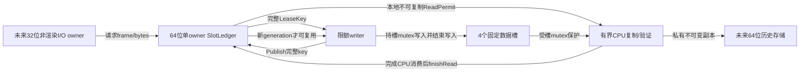
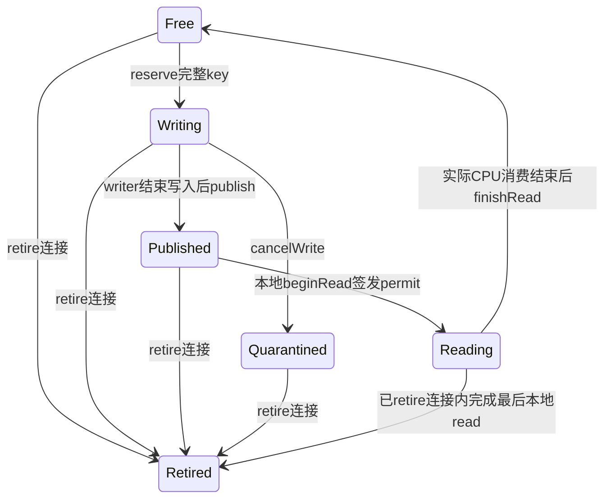

# ADR-RH1：有限数据槽与本地消费凭据（实施前合同）

2026-09-16，P2 CPU laboratory only。先定义协议/所有权，后实现；不接产品DLL或GPU。
RH0的96-byte消息、能力bit和resource=0保持冻结。本文件**不扩张RH0 wire**；先实现独立
slot ledger核心和64-byte描述符，未来真实传输需另一个明确版本的入口/能力门。

## 为什么不直接共享整个历史环

32位客户端只需要小的固定在途窗口；大历史最终应由64位宿主私有持有。把数GB映射回
32位仍占用它的VA，不能算迁移。P2固定4槽×65536 bytes，最多256KiB数据；ledger仅在
一个CPU owner中存在，不共享C++对象/锁/容器布局，不以共享指针或std::atomic ABI通信。

当前实施边界是图中的ledger、key codec和本地ReadPermit。命名映射、mutex、历史存储和
对接wire尚未实现，不能把这些框框说成已运行，更不能据此声称减少游戏内存。

## 唯一事实与凭据

- 一个ledger固定一个非零128-bit connection nonce；它不可复制/移动，不允许原地重开。
  新连接必须新随机nonce、新ledger，未来也必须新映射名称；不重用旧mapping给新连接。
- Begin只在Dormant/Ready且槽全部Free时成功；map/device都非零、逐分量不后退且至少一项前进。
  End必须Active且全Free，不替写者/读者宣布完成；代际耗尽的Free槽也不会因换地图重置generation。
- 每个slot独立generation，只在成功reserve时递增，0无效，禁止回绕。owner可以配置更小的
  generation/frame上限作保守预算/确定性边界测试，默认UINT64_MAX；0上限无效。
- 每次成功reserve占用严格下一frameId，bytes=1..65536。只覆盖每frame一份不透明CPU样本，
  多draw/多附件协议未授权。容量/参数失败不消费frame或generation；取消已发租约则保留其frame已用事实。
- LeaseKey是**不可信描述符**，必须与owner中slot存储的nonce/map/device/frame/generation/slot/bytes
  逐项相等，且状态符合操作。哈希/slot编号/地址不能代替全字段比较。错误不改变其他租约或输出凭据。
- ReadPermit只能由该ledger的合法Published条目签发，是本进程不可复制、可移动的CPU凭据。
  移动后源凭据失效，活跃目标不能被覆盖；不能从wire构造它。finishRead必须同owner/同key/Reading，
  成功后凭据失效，重复/迟到/外来完成不能释放当前新generation。
  凭据对象只能签发一次；已消费或被移出的对象不得重新装载新租约，防止旧引用指向一个被重新绑定的新请求。
- permit不含资源裸指针，不自动回调销毁owner。丢弃permit**不会自动释放**槽；只能退役连接，
  按独立资源owner合同清场。这是保守fail-closed，不是允许无限泄漏或重置后继续跑。

## 状态与取消/退出

- 不把取消请求当写入完成。cancelWrite将该槽隔离至本连接结束，**不能立即重新发给下一帧**；
  其他Free槽仍可处理合法帧。取消耗尽槽后显式背压/结束，不静默无限扩容或覆盖最老槽。
- retire是连接终态：不得新reserve、publish、begin或重开。已有Reading凭据可以完成本地消费，
  但只能进入Retired，不能回Free。`localReadersDone`仅是CPU读者计数，不是writer退出或GPU完成。
- ledger本身不拥有映射/GPU对象，因此不能授权销毁共享映射。未来资源owner必须保留映射/同步句柄，
  在本地读者结束及已保有的精确对端进程句柄结算后销毁；断管、超时、CPU ACK均不能替代该结算。
- 单条无效key不会修改ledger；wire owner应将当前异常连接fault/retire。旧nonce路由不能操作新ledger，
  也不能通过一条迟到ACK把新连接的合法scope清掉。

## 描述符：精确64 bytes，little-endian

| offset | bytes | 内容 |
| --- | --- | --- |
| 0 | 4 | ASCII WVL1 |
| 4 / 6 | 2 / 2 | version=1 / descriptorBytes=64 |
| 8 / 16 | 8 / 8 | connection nonce low/high，合起来非0 |
| 24 / 32 | 8 / 8 | map/device epoch，均非0 |
| 40 / 48 | 8 / 8 | frameId / slotGeneration，均非0 |
| 56 / 60 | 4 / 4 | slotId 0..3 / bytes 1..65536 |

长度必须精确，不接native struct overlay。数据offset由校验后的slotId×65536计算，不信任
wire提供的pointer/offset/容量。描述符解码成功只证明形状，**不证明租约当前有效**。
解码失败清空输出为无效key，防止忽略错误后沿用上次解析结果；这与不能覆盖已签发本地
ReadPermit是不同边界。ledger拒绝操作不修改已有授权/其他slot，parser不能保留陈旧候选。

## 未来Windows映射适配准入（本轮核心尚不实现）

候选选择paging-file backing、`Local\\`命名空间、nonce名称与logon-SID最小DACL；不使用需要
额外权限的Global，不给执行权限。CreateFileMapping发现ERROR_ALREADY_EXISTS即拒绝，不复用未知对象。
仅固定256KiB数据视图；metadata保留在owner，不跨进程共享std::atomic/size_t/指针。

首个正确性原型可使用每槽独立Windows mutex保护writer填充和reader复制，有限等待；
不把wait置于游戏渲染线程。WAIT_ABANDONED意味着内容可能只写了一半，必须拒绝并退役，
不是“拿到锁所以继续消费”。复制到宿主私有buffer后只验证/使用这份副本，避免重复读取可变共享数据。
同权限恶意进程无视mutex仍可修改共享数据；此协议不承诺隔离已攻陷的peer，且任何后续解释都必须
验证私有副本长度/字段。禁止把这种互斥试验称为zero-copy或性能优化接受。

## 测试与接受

1. 双位数真实ledger/core：正向4槽填充/消费、跨epoch继续、满槽不破坏已有租约、容量释放后恢复。
2. 完整key每字段突变、迟到/重复publish、重复/外来/moved permit、输出覆盖、旧connection、旧map、旧generation。
3. cancel隔离、不抢回读者、retire后在途读者结算、不重开、不回绕；小保守上限确定性耗尽与默认大整数拒绝。
4. 大量确定性混合合法/拒绝循环；必须保有正向覆盖，不以全拒绝通过。golden与Python独立编码一致。
5. 独立共享映射实测是后续门，必须包含32↔64实际bytes、abandoned mutex、坏描述符、超时、进程退出和零残留。
6. 游戏接入、内存收益、GPU最后使用、玩家视觉均未授权由本核心测试代替。

## 一手依据

- [Microsoft命名共享内存](https://learn.microsoft.com/en-us/windows/win32/memory/creating-named-shared-memory)：映射进入各进程VA；Global示例需额外权限，本原型不照搬Global/default ACL。
- [CreateFileMapping](https://learn.microsoft.com/en-us/windows/win32/api/winbase/nf-winbase-createfilemappinga)：paging backing、保护、既有命名对象语义。
- [Mutex保护跨进程资源](https://learn.microsoft.com/en-us/windows/win32/sync/using-mutex-objects)：持锁操作与abandoned状态不确定性。
- [WaitForSingleObject](https://learn.microsoft.com/en-us/windows/win32/api/synchapi/nf-synchapi-waitforsingleobject)：有限wait、WAIT_ABANDONED及等待期间不得关闭所等句柄。
