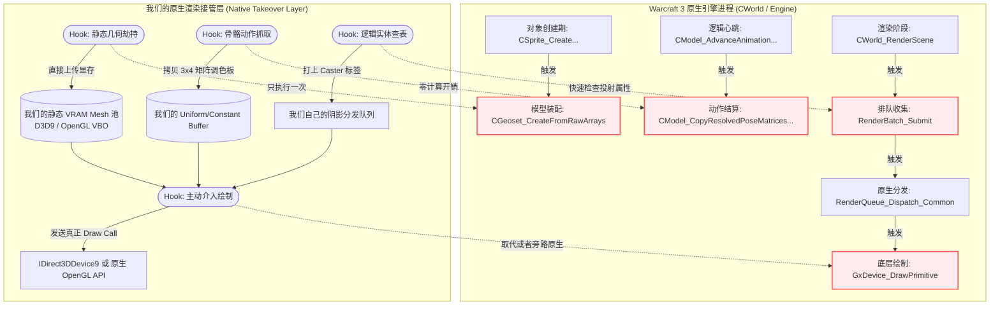

# 原生渲染接管计划 (Native Render Takeover Plan)

## 1. 背景与转向动机 (Motivation)

当前项目严重依赖 DXVK 这一外部代理（拦截底层的 `DrawIndexedPrimitive` 并魔改成 DX9EX/Vulkan 调用）。这不仅构筑了厚重的中间层开销，也迫使我们在最低级别的图形 API 中痛苦地“盲猜”高层业务逻辑（例如遍历顶点结构去逆推场景中的单位、甚至每帧比对矩阵）。

如果我们能在游戏主内存阶段直接拿到单位数据和静态模型，**我们完全可以抛弃 DXVK 这一层外壳**，转而采用“原生内部劫持（Native In-Process Hook）”的方式。即：直接在魔兽争霸3引擎内部安插钩子，顺手套取它的 D3D9/OpenGL 设备（或者废弃它的设备自己在同窗口建一个新环境），用原生 API 直接绘制这些早被我们缓存好的高质量数据与阴影。

---

## 2. 转向后的原生渲染架构图 (Architecture Overview)

---

## 3. 具体实施的关键 Hook 点地图 (Critical Hook Maps)

如果不走 DXVK 的底层拦截套路，我们需要在游戏内部分 4 个切入面布下核心的运行时 Hook：

### 阶段 I: 图形设备接管与上下文创建 (Device Context Ownership)

要使用原生的 D3D9/OpenGL 发出 Draw Call，必须拿到句柄或替换初始化流程。
*   **Hook 目标**: 魔兽争霸内的 `Direct3DCreate9` (如果是 d3d9 mode) 或内部硬件管理指针 `GxDevice`。
*   **动作**: 
    - 留存 `IDirect3DDevice9*` 设备句柄到全局单例中。
    - （进阶）甚至可以接管 `HWND`，由我们在后台用一块全新的 Vulkan 实例共享这块画布，将魔兽引擎的绘图渲染至一张全屏纹理，再在我们的上下文里结合我们重写的阴影合并输出，这也叫 **“双轨绘制法 (Dual-Track Rendering)”**。

### 阶段 II: 静态几何体截获与显存固化 (Static Geometry Caching)

*   **Hook 目标**: `CGeoset_CreateFromRawArrays` (`0x6F126250`)
*   **动作**: 这个函数在模型被初次加载并转换为只读几何体结构（`CGeosetData`）时运行。
*   **提取内容**: 在这里你可以极舒服地读取原始的 `Positions`, `Normals`, `UVs` 以及对于骨骼动画最关键的 `Vertex Group Indices`（权重视为 1.0 的蒙皮索引）。
*   **目标操作**: 截获到这些数据后立刻上传至我们自己的 `VertexBuffer (VBO)`。此后，魔兽再去进行那些又慢、又消耗 CPU 的动态顶点形变和传输，我们**完全不闻不问**！

### 阶段 III: 骨骼动作与矩阵调色板的接管 (Pose Matrices Harvesting)

*   **Hook 目标**: `CModel_CopyResolvedPoseMatricesToOutputPalette` (`0x6F12FDC0`)
*   **动作**: 没必要去拦截每一根骨头是怎么算的，直接在这一个聚集口岸把算好的最终结果拦截下来。
*   **提取内容**: 拷贝 `CModel + 0x60` 中固定偏移的 3x4 矩阵组。
*   **目标操作**: 每帧更新我们自建的、用于“硬件蒙皮（Hardware Skinning）”的 `Constant Buffer` 即可。

### 阶段 IV: 渲染对象筛选与主动绘制阶段 (Takeover & Render)

此时有了 VRAM 模型和姿态矩阵，接下来我们只要跳过它的绘制就好。
*   **Hook 目标 1 (筛选)**: `RenderBatch_Submit` (`0x6F1375C0`)。在这里拦截判定 `SceneNode` 是不是我们需要的影子发布者，打好我们自己的内部 Flag，塞入我们自己的高速列表。
*   **Hook 目标 2 (短路/绘制)**: 
    - 魔兽的 `GxDevice` 在执行原本由于 CPU 蒙皮产生的动态 `DrawPrimitive` 时，我们在深层 Hook 让它在遇到目标对象时直接无视（不浪费 Draw 性能）。
    - 然后在我们接管的底阶段（例如 `Present` 或 `EndScene` 或自定义的 `CWorld_TerrainShadow_Dispatch (0x6F76F060)`）发起**我们自己的绘制命令**。由于之前做好了 VRAM 和 Uniform 矩阵的缓存，我们的调用只需要寥寥几行原生 DirectX9 API 就可以硬件级光速输出该网格结构！

---

## 4. 结论与隐患评估 (Conclusion)

**可行性结论**: 完全可行。你们现有的 `address_book` 逆向成果 100% 支撑这个全新架构体系的构建。此模式比在 DXVK 里打滚拥有**高得多的天花板**和**极少的性能损耗**。

**关键转型阵痛点 / 注意事项**:
1. 魔兽对动态碎步（如 Ribbon 特效、动态地形）有些使用特殊的计算方式（并没有固定的骨骼矩阵），遇到这一类我们可能依然需要提供类似现在底层的“软蒙皮逃生通道（Fallback）”。
2. 改为自己管理 VBO 时，必须留意内存泄漏释放（需同步 Hook 模型的 `Destructor` 以清理显存释放 `VkBuffer` 或 `IDirect3DVertexBuffer9`）。

---

## 5. 2026-04-21 当前落地状态补充

### 5.1 已落地的最小 native backend 事实

当前 repo 内的 `src/d3d9/war3/shadow/war3_shadow_backend_native_d3d9.*` 已经不再是“只分配 handle 的空接口”。

本轮之后它已经会：

1. 接收 `ShadowRendererCore` 的 `ShadowDrawPacket`
2. 解析并缓存：
   - positions
   - indices
   - skinned blend stream
   - palette data
   - material signature
3. 使用原生 `IDirect3DDevice9` 创建并持有：
   - `IDirect3DVertexBuffer9`
   - `IDirect3DIndexBuffer9`
4. 把通过校验的 draw 记录到 native submission queue，供后续晚注入执行层消费

### 5.2 当前仍未完成的部分

这并不等于 native takeover 已完成。当前还缺：

1. 晚注入 bootstrap 获取 native `IDirect3DDevice9`
2. 把 `NativeD3D9Backend` 真正接入运行时帧循环
3. 执行层把 submission queue 绑定为真正的 native object shadow draw
4. native D3D9 实机场景验收

### 5.3 当前结论

因此现在最准确的状态不是“native takeover 已跑通”，而是：

1. native backend 已经具备真实资源缓存语义
2. DXVK / semantic core 与 native backend 的 contract 已经不再是空接缝
3. 下一阶段应直接推进：
   - late-inject device 获取
   - native backend 帧执行
   - native object shadow 最小出图闭环

### 5.4 2026-04-21 新增推进：native backend 已接上 runtime driver 与摘要面

本轮又补了一层关键胶水：

1. 新增 `NativeD3D9BackendRuntime`
   - 可以直接消费当前 `ShadowValidationRuntime` 发布的 `ShadowSubmissionFrame`
2. `ShadowRuntimeBridgeSummary` / control-plane
   - 已能直接暴露 native backend 的：
     - frame serial
     - publish revision
     - submitted draw count
     - geometry/palette/material cache count
     - has-device 状态

这意味着后续晚注入工作不再需要先补“如何把 semantic frame 喂给 native backend”这一层，下一步可以更直接地推进：

1. 获取真实 native `IDirect3DDevice9`
2. 在晚注入帧循环中调用 native runtime driver
3. 让 submission queue 变成真正的 native shadow draw

### 5.5 2026-04-21 新增推进：runtime bootstrap 已暴露 bind/drive API

当前 `war3_runtime_bootstrap.h/.cpp` 已新增：

1. `BindNativeShadowDevice(IDirect3DDevice9* device)`
2. `DriveNativeShadowBackend()`

这两个入口把 native takeover 的下一步接线点固定下来了：

1. 晚注入宿主拿到真实 native device 后，不需要再直接碰内部 singleton
2. 帧循环侧也不需要再重新发明“怎么驱动 native backend”的调用口

因此 native takeover 的剩余工作已经进一步收敛为：

1. 宿主拿设备
2. 选帧时机
3. 真正出图

### 5.6 2026-04-21 新增推进：当前宿主已完成 bind + render-thread drive

本轮不是只补 API，而是已经把它接到当前宿主里：

1. `War3Hook::InstallHooks(IDirect3DDevice9* device)`
   - 现在会直接绑定 native backend device
2. `War3TryPopulateSemanticShadowScene(...)`
   - 现在会在真实 render thread 上驱动 native backend 消费当前 semantic frame

实机结果说明这条链已经活起来了：

1. `nativeD3D9BackendHasDevice=true`
2. `nativeD3D9BackendSubmittedDrawCount > 0`
3. 并且 `nativeD3D9BackendSubmittedDrawCount` 与 `semanticCoreSubmittedDrawCount` 对齐

因此当前最准确的状态是：

1. current host 已能驱动 native submission path
2. 剩余工作主要变成：
   - 晚注入独立宿主
   - native actual draw

### 5.7 2026-04-21 新增推进：native backend 已具备 prepared-frame execute 入口

本轮把 native backend 又往前推了一步，但仍然刻意没有误报 native takeover 已完成。

新增事实：

1. `NativeD3D9Backend`
   - 现在不只是缓存 geometry/palette/material 与记录 submission
   - 已新增 `executePreparedDraws()`
2. `NativeD3D9BackendRuntime`
   - 已新增 `executePreparedFrame()`
3. `war3_runtime_bootstrap`
   - 已新增 `ExecuteNativeShadowBackendPreparedFrame()`
4. `ShadowRuntimeBridgeSummary` / control-plane
   - 已新增 execute counters：
     - `nativeD3D9BackendExecutedFrameSerial`
     - `nativeD3D9BackendExecutedDrawCount`

这意味着 native takeover 的接线面已经进一步明确：

1. `DriveNativeShadowBackend()`
   - 负责 build/prepare submission queue
2. `ExecuteNativeShadowBackendPreparedFrame()`
   - 负责在真正 native shadow-pass timing 上执行 draw

当前仍未完成的原因也更单一了：

1. current host 目前还没有在正确 shadow-pass 时机调用 execute
2. 因此 `executedDrawCount` 当前仍为 `0`
3. 下一步不该再补 backend contract，而应直接推进：
   - 晚注入宿主的 shadow-pass hook / timing
   - execute 真正落到 native object shadow 出图

### 5.8 2026-04-21 新增推进：native renderer hook 路线已补上 shadow-pass timing 接线

本轮又把 native takeover 的“最后一层空白时序”往前推了一步：

1. `war3_native_renderer.cpp`
   - 已经在 native shadow-pass window 内接上：
     - `DriveNativeShadowBackend()`
     - `ExecuteNativeShadowBackendPreparedFrame()`
2. 当前 execute 时机固定为：
   - `CWorld_ToggleGroup1ShadowPass(world, 1)` 打开后
   - `Stage12_Group1` / `Stage11_TerrainShadow12_Group0` 执行后
   - `RenderQueue_FlushAndReset()` 前

这意味着：

1. native takeover 现在已经不仅有 execute API
2. 连 native renderer hook 路线上的真实 shadow-pass timing 也已经接好了

当前还没有“native actual draw 已经完成”的原因只有一个关键点：

1. `kNativeRendererHookTakeoverEnabled` 仍默认为 `false`
2. 因此当前主线宿主不会真的走这条 native hook timing
3. 下一步已经非常明确：
   - 在晚注入/独立宿主里真正点亮这条 native hook takeover 路线
   - 验证 `executedDrawCount > 0`
   - 做第一次 native object shadow 可见性签收

### 5.9 2026-04-21 新增推进：takeover-only native execute 已在 current DXVK host 内跑通

本轮已经把上一节里的“验证 `executedDrawCount > 0`”这一步前推完成，但完成范围要表述准确：

1. 当前完成的是：
   - current DXVK host 内
   - 关闭 host execute validation 后
   - native renderer takeover 自己驱动的 execute
   - 已经稳定 `>0`
2. 本轮关键修正：
   - semantic runtime 保留 `lastRenderableFrame`
   - native prepare 不再被 `shadowModeOrStage21ListBEntryIndex != -1` 卡死
   - AutoTest hot-frame 验收改成“semantic hot frame + native execute”两段式
3. 本轮验证结论：
   - `model_runtime_probe / low_pressure_static_reuse / dynamic_shadow_pressure`
   - 三套场景下当前都能看到：
     - `nativeD3D9BackendExecutedDrawCount > 0`
     - `semanticSceneSubmitted > 0`
     - `objectFallbackDrawCount = 0`

这意味着 native_render_takeover 的剩余工作已经进一步缩小为：

1. 不再是“让 execute 先跑起来”
2. 而是：
   - 脱离 current DXVK host/proxy 壳
   - 收到真正 late-inject / native-only 独立可用

### 5.10 2026-04-22 新增修正：full-scene native takeover 已从默认路径撤下，当前可用态重新固定为 safe host-side execute

本轮不是撤销 native takeover 方向本身，而是把它从“默认运行路径”调整回“实验性 native-only 收口路径”。

新增事实：

1. 最新用户实机已确认：
   - 默认 full-scene takeover 会导致主模型白模 / 纯白贴图 / 主场景损坏
2. 因为当前 Hook 的是：
   - `CWorldFrameWar3::RenderScene`
   - 且 `Native_CWorld_RenderScene(...)` 重放的是完整 RenderScene 主链
3. 所以当前仓库默认策略已调整为：
   - `kNativeRendererHookTakeoverEnabled=false`
   - `kNativeRendererHostExecuteValidationEnabled=true`
4. 这样当前默认运行形态变成：
   - 主场景继续保持安全正确的宿主渲染
   - shadow 仍通过 semantic contract + native backend execute 跑通

这一步的意义是：

1. native takeover 的“可执行性证明”仍然保留
2. 但不会再让 experimental full-scene takeover 直接破坏当前默认可用态
3. 后续 native takeover 的剩余工作已重新收敛为：
   - 修 full-scene takeover correctness
   - 做真正 late-inject/native-only 独立宿主收口

### 5.11 2026-04-22 新增修正：safe host 路线已把 semantic 动态阴影恢复到 receiver 可见，但仍不是 native-only 完成态

本轮推进的重点不是再扩大 takeover，而是先把当前默认安全路径上的新线路动态阴影做成真正可见。

新增事实：

1. 修复前，safe host 路线虽然已有：
   - `semanticSceneSubmitted > 0`
   - `nativeD3D9BackendExecutedDrawCount > 0`
   - 但 `ShadowFactor` 仍接近发白
2. 本轮做了两件 correctness-first 修正：
   - semantic bounds center 改为真实使用 `localBoundsCenter`
   - 当前临时对 `ObjectKind::Unit` 关闭 cascade cull
3. 修复后：
   - `dynamic_shadow_pressure` 的 `ShadowFactor` 已明显变暗
   - `semanticSceneSubmitted=117`
   - `nativeD3D9BackendExecutedDrawCount=117`
   - `objectFallbackDrawCount=0`

这一步的意义是：

1. 当前默认安全路径上的“新 semantic 动态阴影”已经不再只是后台计数成立
2. 它已经在 receiver 中实质可见
3. 但这仍然不是：
   - native-only late-inject 完成
   - 或 full-scene takeover correctness 完成
4. 因此后续 native render takeover 主线仍然是：
   - 保留当前 safe host 可用态
   - 继续把 native-only / late-inject 独立宿主单独收口
