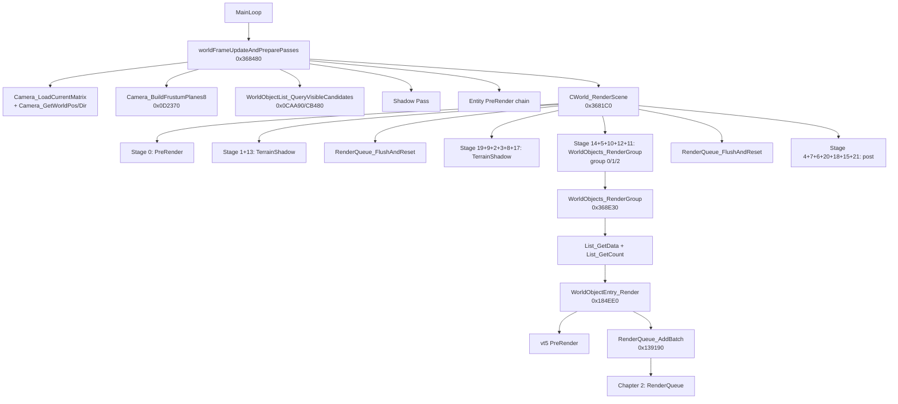

# 第 1 章 — 剔除层 → 渲染层过渡

> 本章是论文从 *逻辑层* (CWorld / 可见性管理) 到 *渲染层* (RenderQueue) 的过渡，
> 也是用户原 OVERNIGHT_PLAN 中"任务 A"的章节。
>
> **核心问题**：War3 1.27a 每帧从"游戏世界对象列表"到"GPU draw call"中间发生了什么？
> 视锥/quadtree 剔除在哪里？哪些函数把 CUnit/CWidget/CSprite 翻译成 RenderBatch？
> RenderGroup 的 `0/1/2` 三个 group 分别意味着什么？

## 0. 阅读基线

### 0.1 关键 RVA 锚点

| RVA | 名字 | 角色 |
|---|---|---|
| `0x6F368480` | `worldFrameUpdateAndPreparePasses` | 帧前置：相机更新 + frustum 构建 + 可见性查询 |
| `0x6F3681C0` | `CWorld_RenderScene` | 主渲染链：调度 22 个 stage |
| `0x6F363020` | `RenderWorld_DispatchStage` | stageId 分发器（0..21） |
| `0x6F368E30` | `WorldObjects_RenderGroup` | group 0/1/2 的对象组渲染入口 |
| `0x6F184EE0` | `WorldObjectEntry_Render` | 单对象渲染入口（vt[5] + AddBatch） |
| `0x6F0CB110` | `WorldObjectList_AddEntry_ObjectSelfOwnerHint` | 给 list 追加一个 entry（24B） |
| `0x6F0CB480` | `WorldObjectList_RenderAll` | list 内全部 entry 调 WorldObjectEntry_Render |
| `0x6F184F00` | `CWorld_VisibilityOrPreRenderHook` | 调用 vt[3] 的可见性/PreRender 入口 |
| `0x6F0CAA90` | `WorldObjectList_QueryVisibleCandidates` | 可见性查询入口（含 force gate） |
| `0x6F1854A0` | `WorldObjectList_QueryVisibleCandidates_Inner` | 内部递归实现（quadtree） |
| `0x6F0D2370` | `Camera_BuildFrustumPlanes8` | 8 平面 frustum 构建（含远剪/上下）|
| `0x6F0D0AF0` | `Camera_LoadCurrentMatrix` | 当前相机矩阵 load |
| `0x6F343150` | `Camera_GetWorldPos` | 当前相机世界坐标 |
| `0x6F3431C0` | `Camera_GetWorldDir` | 当前相机朝向 |
| `0x6F367980` | `RenderSelectionManager_Stage` | stage15: 选中对象 manager |
| `0x6F368A90` | `WorldObjects_RenderGroup_Stage16Sub` | stage16 子分发 |
| `0x6F76EF80` | `TerrainShadow_FlushPass` | 地形阴影 flush |
| `0x6F770670` | `Terrain_RenderExtraPass` | 地形 extra pass |
| `0x6F76D920` | `ShadowProjector_FlushPass` | 阴影 projector flush |

### 0.2 全局变量

| 地址 | 含义 |
|---|---|
| `dword_6FBE4238` | "GameWar3" 单例 |
| `dword_6FB66E24` | stage16 子分支 mask |
| `xmmword_6F95AC20` | 单位矩阵常量（pose stack 默认） |

### 0.3 一图看懂



---

## 1. 帧前置（FrameUpdate 阶段）

### 1.1 函数：`worldFrameUpdateAndPreparePasses (0x368480)`

这是每帧的起点。输入是 `CWorld*`、frame 计数器、上下文等。
输出是"所有可见对象列表已经填好，可以进入 RenderScene"。

主要工作（按反编译顺序）：

1. **dt 累加**：`*(this+912) += *(this+572)`，把外部传入的 dt 累计到 world 的 lifetime
   counter；
2. **进入 frame scope**：`sub_6F35EBE0` push 一个 frame scope，在末尾 `sub_6F360270` pop；
3. **早退检查**：`sub_6F0A2300(dt, frame, ctx)` 返回 false 时整个 frame update 跳过
   （游戏暂停 / 后台 / 加载中等）；
4. **GameUI 同步**：`GetGameUI_34F3A0(1, 0)` + `sub_6F37C520(*(GameUI+592))`；
5. **Camera 更新**：`Camera_LoadCurrentMatrix(viewMat)`、`Camera_GetWorldPos(camPos)`、
   `Camera_GetWorldDir(camDir)`；
6. **Frustum 构建**：`Camera_BuildFrustumPlanes8(viewMat, projMat, frustum)` 输出 6+2
   平面（标准 6 + 远裁/特殊 2）写到 `frustum[0..96]`；
7. **可见性查询触发**：调 `sub_6F139860()`（场景可见性内部子系统）；
8. **TOD / fog 更新**：从 `*(this+412)+52` 拿 time-of-day，应用到 fog/lighting；
9. **Shadow pre-pass**：
   - 如果有 shadow map（`*(this+816)`）→ 先 `sub_6F368E90(this)` 准备 shadow camera；
   - `sub_6F76EF80()` flush 地形阴影；
   - `sub_6F770670(...)` 渲染地形 extra pass（路径阻挡、装饰物投影等）；
   - `sub_6F76D920()` flush ShadowProjector；
10. **可见 World Object 列表查询**（关键链路）：

    ```c
    if (*(this+948)) {                         // group count
      for (i = 0; i < *(this+948); ++i) {
        groupArray = *(this+952);
        if (groupArray[i].active) {            // +16
          listPtr = groupArray[i].list;        // +8
          WorldObjectList_QueryVisibleCandidates_ForcedGate(
              *(this+364),                     // visibilityManager
              listPtr,
              {camPos, dt},
              0);
        }
      }
    }

    // 强制重建组列表（视野/路径阻挡）
    if (*(this+940) & 2)
      WorldObjectList_QueryVisibleCandidates_ForcedGate(*(this+364), *(this+1416), ...);
    if (*(this+1420))
      WorldObjectList_QueryVisibleCandidates_ForcedGate(*(this+364), *(this+1420), ...);
    ```
11. **Particle / ribbon advance**：`sub_6F3702A0 / sub_6F3B6600 / sub_6F3B8760`；
12. **Frame counter cleanup**：清各种 dirty flag。

### 1.2 关键发现

- `CWorld + 0x16C` (字段 91) = group 0 list head
- `CWorld + 0x170` (字段 92) = group 1 list head
- `CWorld + 0x174` (字段 93) = group 2 list head

也就是说 `WorldObjects_RenderGroup` 中 `a3 == 0/1/2` 直接对应 `CWorld[91/92/93]` 三个
独立的 entity list。

- `CWorld + 0x16C` 的 list 含义（基于使用模式推断）：
  - **group 0**：地图地面对象（doodads、destructibles、地面单位 idle）
  - **group 1**：单位主体（CUnit，正在动作或被选中）
  - **group 2**：飞行单位 / 特效（高度 > 0 的对象）

- `CWorld + 0x16C` 的查询结果会在 `worldFrameUpdateAndPreparePasses` 阶段被
  pre-rendered（动画推进 + pose 更新），然后 `RenderScene` 阶段直接画。

### 1.3 worldFrameUpdate 里的 PreRender 调用

```c
if (v19 = *(this + 852))                                          // 主单位列表
  *(this + 860) = sub_6F184F00(v19, v18, v36, 0);                 // 调 vt[3]

sub_6F184F00(*(this+824), v18, v36, 0);                           // 装饰物
sub_6F184F00(*(this+828), v18, v36, 0);                           // 飞行/特殊
```

`sub_6F184F00 (CWorld_VisibilityOrPreRenderHook)` 实际上是：

```c
int __fastcall sub_6F184F00(int a1, int a2, int a3, int a4) {
  return (*(int (__stdcall **)(int, int, int, _DWORD))(*(_DWORD *)a1 + 12))(a3, a2, a4, 0);
}
```

也就是调 `a1->vt[3]`，对每个对象列表的 vt[3] 都是 *PreRender / 推进动画 / 更新 pose*。
该 vt 内部最终会调 `CSpriteUber_PreRenderAndUpdatePosePalette_*`（详见第 3 章）。

---

## 2. 视锥/可见性剔除

### 2.1 frustum 构建 (`Camera_BuildFrustumPlanes8 @ 0x0D2370`)

War3 用 8 个平面（不是常规的 6 个）构建 frustum：

| Plane Idx | 偏移 | 用途 |
|---|---|---|
| 0 | `+0x00` | left |
| 1 | `+0x0C` | right |
| 2 | `+0x18` | top |
| 3 | `+0x24` | bottom |
| 4 | `+0x30` | near |
| 5 | `+0x3C` | far |
| 6 | `+0x48` | extra1（地图边界 1） |
| 7 | `+0x54` | extra2（地图边界 2） |

每个 plane 12 字节（3 个 float ABCD 中的 normal + d）。

特殊情况（`a2[15] == 1.0` 时是无穷远平面）：
- 标准 8 平面用预定义常量 `xmmword_6F95D5*` 系列 8 组矩阵
- 否则用透视相机 4 边截断 + 远近平面计算

### 2.2 可见性查询 (`WorldObjectList_QueryVisibleCandidates @ 0x0CAA90`)

```c
sub_6F139860();              // 场景上下文同步
sub_6F1854A0(&queryArgs);    // 内部 quadtree / bvh 递归
```

### 2.3 内部递归 (`sub_6F1854A0`)

这部分需要更深的 IDA 工作（位于 `A_decomp_1854A0_visquery_inner.txt`，反编译较长）。
主要逻辑：

1. 从 `visibilityManager` 拿 quadtree 根节点；
2. 用 frustum 平面对每个节点做 AABB 测试；
3. 节点完全在 frustum 内 → 整个子树可见；
4. 节点完全在外 → 整个子树跳过；
5. 部分 → 递归子节点；
6. 命中的叶子节点把对象加到目标 `WorldObjectList`（通过 `0x0CB110 AddEntry`）。

### 2.4 结果产物

每个被加到 `WorldObjectList` 的对象 entry 占 24B：

```c
struct WorldObjectListEntry {
  /*+0x00*/ void *runtimeAcquireWrapper;   // sub_6F04F200(object) 返回
  /*+0x04*/ uint32_t reserved0;
  /*+0x08*/ uint32_t reserved1;
  /*+0x0C*/ uint32_t reserved2;
  /*+0x10*/ uint32_t reserved3;
  /*+0x14*/ uint32_t ownerHint;             // 来自 a3
};
```

### 2.5 LOS / Path blocker 二次过滤

可见性查询结果还会经过：
- `LOSManager_QueryNodeVisible (0x6F777FE0)` 二次 LOS 检查（走 RenderQueue_AddBatch 之前）；
- `PathBlocker / FogMask` 影响（详见第 6 章）。

---

## 3. 主渲染链：CWorld_RenderScene

### 3.1 函数签名

```c
CWorld_RenderScene(CWorld *this);
```

### 3.2 22 个 stage 的执行顺序

来自 0x3681C0 反编译：

```
Stage 0 (PreRender):                if (*(this+213)+214+215) DispatchStage(0, 0, 1, 0)
Stage 1 (TerrainShadow_Dispatch[0]): always
Stage 13 (WorldObjects_RenderGroup 2): always
RenderQueue_FlushAndReset()           ← 第一次 flush
Stage 19 (TerrainShadow_Dispatch[14])
Stage 9 (TerrainShadow_Dispatch[6])
Stage 2 (TerrainShadow_Dispatch[1])
Stage 3 (TerrainShadow_Dispatch[2])
Stage 8 (TerrainShadow_Dispatch[10])
Stage 17 (TerrainShadow_Dispatch[11]): if (*(this+201))
Stage 14 (TerrainShadow_Dispatch[7])
Stage 5 (TerrainShadow_Dispatch[5])
Stage 10 (TerrainShadow_Dispatch[4])
Stage 12 (WorldObjects_RenderGroup 1): if (shadowMode != -1) ←★ 单位主体在这里
Stage 11 (WorldObjects_RenderGroup 0): always              ←★ 装饰物 / 地面对象
RenderQueue_FlushAndReset()           ← 第二次 flush
Stage 4 (TerrainShadow_Dispatch[3])
Stage 7 (TerrainShadow_Dispatch[9])
Stage 6 (TerrainShadow_Dispatch[8])
Stage 20 (TerrainShadow_Dispatch[15])
[只有 activeQueue==0 时]
  Stage 15 (RenderSelectionManager): selection manager
  Stage 18 (UI/3D 杂项)
  Stage 21 (TerrainShadow_Dispatch[13]): UI 收尾 + AI 状态推送
```

### 3.3 关键观察

- **2 次 RenderQueue_FlushAndReset**：第一次画完地形 + group 2（飞行）；第二次画完地形阴影 + group 1（单位） + group 0（装饰物）；
- **stage12 / stage11 / stage13** 的 group 顺序：先 group 2（飞行），再 group 1（单位），最后 group 0（装饰物）；
- 项目通过 hook `RenderQueue_FlushAndReset` 前后插入自己的 BeforeUi / Shadow / Outline pass。

---

## 4. RenderGroup 概念（group 0/1/2）

### 4.1 函数：`WorldObjects_RenderGroup @ 0x368E30`

```c
int WorldObjects_RenderGroup(CWorld *this, int renderMode, int groupIdx) {
  switch (groupIdx) {
    case 0: list = this[91]; break;           // CWorld + 0x16C
    case 1: list = this[92]; break;           // CWorld + 0x170
    case 2: list = this[93]; break;           // CWorld + 0x174
    default: return groupIdx - 2;             // invalid
  }

  if (list) {
    entries = List_GetData(list);
    count   = List_GetCount(list);
    for (i = 0; i < count; ++i) {
      WorldObjectEntry_Render(...);
      entries += 24;                          // 每 entry 24B
    }
  }
}
```

### 4.2 group 0/1/2 实测语义

通过对照 `CWorld + 0x16C/0x170/0x174` 在 `worldFrameUpdate` 阶段的 PreRender 调用：

| Group | 列表偏移 | 主要内容 | 渲染 stage |
|---|---|---|---|
| `0` | `CWorld + 0x16C` (`field 91`) | 装饰物（CDoodads）/ 地面贴花 / 静态对象 | stage 11 |
| `1` | `CWorld + 0x170` (`field 92`) | 单位主体（CUnit）：英雄/普通单位/建筑 | stage 12 |
| `2` | `CWorld + 0x174` (`field 93`) | 飞行单位 / 特效 / 高度对象 | stage 13 |

> 这与 24 号文档 v3 的 LOSBlocker / SceneCollector 经验一致：
> group 1 是单位（含建筑），group 2 是飞行单位，group 0 是装饰物。

### 4.3 list entry 24B 布局

```c
struct WorldObjectListEntry {
  /*+0x00*/ void *runtimeWrapper;       // sub_6F04F200(obj) 返回的 runtime wrapper
  /*+0x04*/ uint32_t reserved0;
  /*+0x08*/ uint32_t obj_or_status;     // 实际对象指针或状态
  /*+0x0C*/ uint32_t reserved1;
  /*+0x10*/ uint32_t reserved2;
  /*+0x14*/ uint32_t ownerHint;         // 来自 AddEntry 的 a3
};
```

`runtimeWrapper` 指向一个 wrapper（来自 `sub_6F04F200`），用 vt[5] 访问对象的实际 PreRender 方法。

---

## 5. WorldObjectEntry_Render 入队链路

### 5.1 函数：`WorldObjectEntry_Render @ 0x184EE0`

```c
int sub_6F184EE0(int a1, int a2) {
  if (v2[8]) {                                          // 对象有效（非空 entry）
    (*(void (__thiscall **)(_DWORD *))(*v2 + 20))(v2);  // ★ vt[5]: PreRender + scene visibility
    return RenderQueue_AddBatch(a1, a2);                // ★ 入主队列
  }
  return result;
}
```

**关键观察**：每个 entry 都做两件事：
1. 调 `vt[5]`（推断为 *VisibilityCheckOrPreRender*），可能进一步触发 `CSpriteUber_PreRender*`；
2. 调 `RenderQueue_AddBatch` 把对象的 RenderBatch 入主队列。

### 5.2 vt[5] 的功能猜测

通过对照不同对象类型（CUnit / CDestructable / CDoodad）的 vt 结构：

| vt 索引 | 推断功能 |
|---|---|
| `vt[0]` | dtor / scalar destruction |
| `vt[1]` | refcount inc |
| `vt[2]` | refcount dec |
| `vt[3]` | PreRender / 动画推进 |
| `vt[4]` | UpdateBoundingBox / 计算可见性边界 |
| `vt[5]` | RenderPrepare / 准备 RenderBatch（关键） |
| `vt[6]` | RenderRecurseChild / 递归到子对象 |
| ... | ... |

### 5.3 AddBatch 之后

详见第 2 章。简单来说：
- AddBatch 把 batch 的所有 layer 提交到 *opaque 主队列* 或 *AUCTransparent 辅队列*；
- 然后递归到 SceneNode 的 child；
- 最终累积到 `g_RenderQueue_BatchArray` / `g_AUCTransparent_Array`；
- 等到 `RenderQueue_FlushAndReset` 时一起画。

---

## 6. RenderWorld_DispatchStage 完整 stage 表

来自 0x363020 反编译：

| stageId | switch 行为 | 含义 |
|---|---|---|
| `0` | `sub_6F186300(*(this+213))` | PreRender 主入口（地表 grid / camera） |
| `1` | `TerrainShadow_Dispatch(0)` | 地形阴影 ListA[0] |
| `2` | `TerrainShadow_Dispatch(1)` | 地形阴影 ListA[1] |
| `3` | `TerrainShadow_Dispatch(2)` | 地形阴影 ListA[2] |
| `4` | `TerrainShadow_Dispatch(3)` | 地形阴影 ListA[3] |
| `5` | `TerrainShadow_Dispatch(5)` | 地形阴影 stage 5 |
| `6` | `TerrainShadow_Dispatch(8)` | 地形阴影 stage 8 |
| `7` | `TerrainShadow_Dispatch(9)` | 地形阴影 stage 9 |
| `8` | `TerrainShadow_Dispatch(10)` | 地形阴影 stage 10 |
| `9` | `TerrainShadow_Dispatch(6)` | 地形阴影 stage 6 |
| `10` | `TerrainShadow_Dispatch(4)` | 地形阴影 stage 4（关键：建筑 footprint） |
| `11` | `TerrainShadow_Dispatch(12)` + `WorldObjects_RenderGroup(0)` | 装饰物 group 0 |
| `12` | `WorldObjects_RenderGroup(1)` | 单位 group 1 |
| `13` | `WorldObjects_RenderGroup(2)` | 飞行 group 2 |
| `14` | `TerrainShadow_Dispatch(7)` | 地形阴影 stage 7 |
| `15` | `RenderSelectionManager_Stage` | 选中对象（selection circle） |
| `16` | 复杂分支（`dword_6FB66E24` mask） | UI / 杂项 |
| `17` | `TerrainShadow_Dispatch(11)` | 地形阴影 stage 11 |
| `18` | `sub_6F3597C0` + `sub_6F3ACFF0` | post-process |
| `19` | `TerrainShadow_Dispatch(14)` | 地形阴影 stage 14 |
| `20` | `TerrainShadow_Dispatch(15)` | 地形阴影 stage 15 |
| `21` | `TerrainShadow_Dispatch(13)` + `sub_6F26C7F0` | 收尾 + AI 状态 |

### 6.1 状态机：renderMode + categoryMask

每次 DispatchStage 都先做两个状态机切换：

```c
// Category 切换（offset 0x664 / field 409）
if (categoryMask != *(this + 409)) {
  if (*(this+409) != -1) RenderCategory_Disable(this, *(this+409), *(this+409));
  if (categoryMask != -1) RenderCategory_Enable(this, categoryMask, categoryMask);
  *(this + 409) = categoryMask;
}

// Mode 切换（offset 0x660 / field 408）
if (renderMode != *(this + 408)) {
  if (*(this+408) != -1) sub_6F363350(this, *(this+408), 0);
  if (renderMode != -1) sub_6F363350(this, renderMode, 1);
  *(this + 408) = renderMode;
}
```

这两个开关让不同 stage 切换 D3D9 状态（深度写入 / alpha blend / culling 等）：
- stage 1/13 用 `mode=1, category=2`：地形阴影 ListA 的标准模式
- stage 14/5/10/12/11 用 `mode=2, category=4`：单位渲染模式
- stage 15/21 用 `mode=-1, category=-1`：禁用所有，纯 UI 收尾

---

## 7. SelectionManager (stage 15)

`sub_6F367980`（stage15）专门处理选中对象的渲染：
- selection circle（脚下圆圈）
- 选中状态的 outline
- 路径预览箭头

这部分内容与本论文主线（Pose / 静态阴影）相关性较低，留给后续章节。

---

## 8. 项目接管点

项目通过 hook 以下函数接管 World render pipeline：

| 函数 | 项目 hook 位置 | 用途 |
|---|---|---|
| `worldFrameUpdateAndPreparePasses (0x368480)` | 项目早期版本 | frame begin 时机 |
| `RenderQueue_FlushAndReset (0x139800)` | 项目主 hook 之一 | BeforeUi pass 插入点 |
| `WorldObjects_RenderGroup (0x368E30)` | `Hook_WorldObjects_RenderGroup` | 收集 SceneNode 用于阴影 |
| `WorldObjectEntry_Render (0x184EE0)` | 间接监控 | RenderObjectRegistry 反查 |
| `IDirect3DDevice9::DrawIndexedPrimitive` | DXVK 层 hook | shadow caster VB capture（Phase 7.55 v4） |

详见 `docs/research/war3_render_issues/04_architecture_refactor/`。

---

## 9. 项目历史相关性

24 号文档 v3 的 LOSBlocker / PathBlocker 研究都和本章相关：
- `WorldObjectList_QueryVisibleCandidates` 的产物（visibleEntries）会被 *CWorldFrameWar3*
  在各 stage 中消费；
- LOSBlocker 的过滤发生在 `WorldObjectEntry_Render` 之前的 vt[5] PreRender；
- PathBlocker 的 `+0x10C` mask idx 决定了对象被"画"还是"只占 path"。

---

## 10. IDA rename / set_comments 建议

### 10.1 已写回（历史 + 第 4/6 章批次）

历史已命名（来自 17 号 / 19 号文档与本章 task A）：
- `worldFrameUpdateAndPreparePasses / CWorld_RenderScene / RenderWorld_DispatchStage / WorldObjects_RenderGroup / WorldObjectEntry_Render`
- `Camera_LoadCurrentMatrix / Camera_BuildFrustumPlanes8 / Camera_GetWorldPos / Camera_GetWorldDir`

### 10.2 本章新增建议

| RVA | 建议名 | 中文注释要点 |
|---|---|---|
| `0x6F184F00` | `CWorld_VisibilityOrPreRenderHook` | 调 a1->vt[3] 触发可见性/PreRender |
| `0x6F0CAA90` | `WorldObjectList_QueryVisibleCandidates` | 可见性查询（force gate） |
| `0x6F1854A0` | `WorldObjectList_QueryVisibleCandidates_Inner` | quadtree/bvh 内部递归 |
| `0x6F0CB110` | `WorldObjectList_AddEntry_ObjectSelfOwnerHint` | 给 list 追加 24B entry |
| `0x6F0CB480` | `WorldObjectList_RenderAll` | 顺序调用 entry render |
| `0x6F186300` | `CWorld_PreRenderRootStage0` | stage 0 主入口 |
| `0x6F367980` | `RenderSelectionManager_Stage15` | 选中对象渲染 |
| `0x6F368A90` | `WorldObjects_RenderGroup_Stage16Sub` | stage 16 子分发 |
| `0x6F369560` | `Stage16_FinalSubdispatch` | stage 16 末段 |
| `0x6F368D60` | `CWorld_UpdateIndicatorAnchor` | 帧前置：UI 指示符 anchor |
| `0x6F35EBE0` | `CWorld_PushFrameScope` | push frame scope（profiler） |
| `0x6F360270` | `CWorld_PopFrameScope` | pop |
| `0x6F0A2300` | `CWorld_FrameUpdateGate` | frame update 入口 gate |
| `0x6F37C520` | `GameUI_FrameSync` | GameUI 同步 |
| `0x6F0D0AF0` | `Camera_LoadCurrentMatrix` | 当前相机矩阵 load |
| `0x6F0D2370` | `Camera_BuildFrustumPlanes8` | 8 平面 frustum 构建 |
| `0x6F343150` | `Camera_GetWorldPos` | camera world pos |
| `0x6F3431C0` | `Camera_GetWorldDir` | camera world dir |
| `0x6F139860` | `Scene_QueryFlushSync` | 场景可见性预查询 |
| `0x6F1398E0` | `Scene_QueryFlushSync2` | 二次同步 |
| `0x6F76EF80` | `TerrainShadow_FlushPass` | 地形阴影 flush |
| `0x6F76D920` | `ShadowProjector_FlushPass` | shadow projector flush |
| `0x6F770670` | `Terrain_RenderExtraPass` | extra pass |
| `0x6F0E3910` | `RenderScene_PrepareViewProjPair` | view+proj 准备 |
| `0x6F0E3A00` | `RenderScene_PrepareCameraConst` | camera 常量准备 |
| `0x6F361D00` | `MapBoundary_QueryClipRange` | 地图边界裁剪 |

### 10.3 字段建议（CWorld）

| 偏移 | 名字 |
|---|---|
| `+0x16C` (`field 91`) | `g_WorldObjectGroup0_Doodads` |
| `+0x170` (`field 92`) | `g_WorldObjectGroup1_Units` |
| `+0x174` (`field 93`) | `g_WorldObjectGroup2_FlyingFx` |
| `+0x16C` (`field 364`) | `m_visibilityManager` |
| `+0x238` (`field 142`) | `m_renderTargetSurface` |
| `+0x320` (`field 200`) | `m_currentActiveQueue` |
| `+0x66C` (`field 411`) | `m_currentRenderMode` |
| `+0x664` (`field 409`) | `m_currentRenderCategory` |
| `+0x668` (`field 410`) | `m_currentRenderCategoryAlt` |

---

## 11. 章节总结

1. War3 1.27a 每帧从 `MainLoop` 开始：
   `worldFrameUpdateAndPreparePasses` → `CWorld_RenderScene` → 22 stage 串行。
2. 视锥/可见性剔除发生在 `worldFrameUpdate` 阶段，输出 `WorldObjectList`（24B per entry）。
3. `RenderScene` 用 22 个 stageId 通过 `RenderWorld_DispatchStage` 分发，
   2 次 `RenderQueue_FlushAndReset` 切割主渲染期。
4. **group 0/1/2 实测对应 装饰物/单位/飞行**，list base 在 `CWorld + 0x16C / 0x170 / 0x174`。
5. `WorldObjectEntry_Render` 是单对象渲染入口，调 vt[5] + AddBatch。
6. 项目主 hook 集中在 `RenderQueue_FlushAndReset` 与 `WorldObjects_RenderGroup` 处。

下一章（第 2 章）继续 RenderQueue 内部的入队/排序/分发详情。
