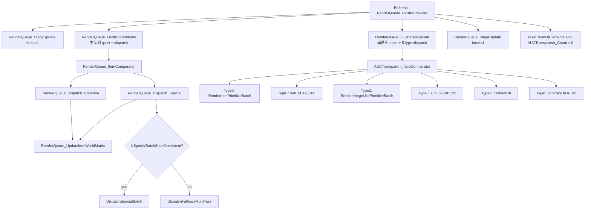

# 第 2 章 — RenderQueue 完整数据流（入队 / 排序 / 分发）

> 本章是论文从 *逻辑层 RenderablePart* 到 *D3D9 实际 draw call* 之间最长的一段。
> War3 1.27a 的 RenderQueue 不是简单的"draw call list"，它包含：
> - opaque 主队列 + transparent 辅队列；
> - 多种 batch 形态（普通 / 特殊 / 透明的 5 种 dispatch type）；
> - state-block apply 优化（避免重复 GxDevice 状态切换）；
> - special batch 的 fallback multipass 路径（兼容老硬件）。
>
> 本章基于 IDA 反编译完整还原。

## 0. 阅读基线

### 0.1 关键 RVA 锚点

| RVA | 名字 | 角色 |
|---|---|---|
| `0x6F139800` | `RenderQueue_FlushAndReset` | 顶层 flush 入口（每帧 BeforeUi 调） |
| `0x6F139190` | `RenderQueue_AddBatch` | 给 SceneNode 添加一个 RenderBatch（含递归子 SceneNode） |
| `0x6F1375C0` | `RenderBatch_Submit` | RenderBatch 的所有 layer 入主队列或 AUCTransparent |
| `0x6F137AF0` | `AUCTransparent_AddEntry` | 透明条目入辅队列（按 camera 距离排序） |
| `0x6F1378D0` | `AUCTransparent_ItemComparator` | 透明排序 comparator |
| `0x6F1380A0` | `RenderQueue_FlushSortedItems` | opaque 主队列 qsort + dispatch |
| `0x6F137D50` | `RenderQueue_ItemComparator` | opaque 排序 comparator |
| `0x6F138210` | `RenderQueue_FlushTransparent` | 透明辅队列 qsort + dispatch（5 种 type） |
| `0x6F13A5E0` | `RenderQueue_Dispatch_Common` | opaque 普通批次 dispatch |
| `0x6F13A780` | `RenderQueue_Dispatch_Special` | opaque 特殊批次 dispatch |
| `0x6F13A4A0` | `RenderQueue_DispatchSpecialBatch` | special 内部 alpha-batch 子分发 |
| `0x6F13A180` | `RenderQueue_DispatchFallbackMultiPass` | special fallback 多 pass dispatch |
| `0x6F13A510` | `RenderQueue_UpdateItemWorldMatrix` | 读 paletteSlot + identity fallback |
| `0x6F139060` | `RenderQueue_GetPaletteSlotAddress` | slot index → matrix base ptr |
| `0x6F138FF0` | `RenderQueue_AllocPaletteSlot` | 全局 palette arena 分配 |
| `0x6F139620` | `SceneNode_RenderTransparentBatchPath` | SceneNode 透明 batch 路径调度（按 type 分发到 5 个 dispatcher） |
| `0x6F13A0E0` | `RenderQueue_TransparentDispatchType0` | type=0 透明 dispatch |
| `0x6F198C00` | `RenderQueue_TransparentDispatchType1` | type=1 透明 dispatch |
| `0x6F19DFF0` | `RenderQueue_TransparentDispatchType2` | type=2 透明 dispatch |
| `0x6F19BC20` | `RenderQueue_TransparentDispatchType3` | type=3 透明 dispatch |
| `0x6F13A0B0` | `RenderQueue_TransparentDispatchType4` | type=4 透明 dispatch（callback 形式） |
| `0x6F0E34B0` | `GxDevice_ApplyStateBlock` | 把整个 state block 推到 D3D9 device |
| `0x6F0E3640` | `GxDevice_StateCleanup74` | 清理 D3D9 state subset 1 |
| `0x6F0E3670` | `GxDevice_StateCleanup78` | 清理 D3D9 state subset 2 |
| `0x6F13A9B0` | `RenderQueue_StageUpdate` | 同步所有 stage 的 D3D9 sampler/texture stage |

### 0.2 全局变量

| 地址 | 名字 | 含义 |
|---|---|---|
| `0xBC6BA0` | `g_RenderQueue_SortedCount` | 排序后的 sorted ptr 数（cap 10000） |
| `0xBC6BAC` | `g_RenderQueue_NumOfElements` | 主队列当前 element 数 |
| `0xBC6BB0` | `g_RenderQueue_BatchArray` | 主队列 batch array base（每 element 5 dword = 20B） |
| `0xBC6BB8` | `g_RenderQueue_BatchCapacity` | array capacity |
| `0xBC6BBC` | `g_AUCTransparent_Count` | 透明辅队列当前 entry 数 |
| `0xBC6BC0` | `g_AUCTransparent_Array` | 透明辅队列 array base（每 entry 6 dword = 24B） |
| `0xBC6BE8` | `g_RenderQueue_SortedPtrs` | 排序后的指针数组（指向 BatchArray entry） |
| `0xBD0828` | `g_AUCTransparent_SortedPtrs` | 透明排序后指针 |
| `0xBDA4D0` | `g_RenderQueue_StateOptEnabled` | 状态 opt 开关（FlushSortedItems 用） |
| `0xBDA4D4` | `g_RenderQueue_StateCleanupPending` | 待清理状态 flag |
| `0xBC6BD0` | `g_globalPaletteArena` | palette base（slot * 48 索引） |

### 0.3 主流程一图



---

## 1. 入队接口

### 1.1 `RenderQueue_AddBatch (0x139190)`

入口签名：`void RenderQueue_AddBatch(SceneNode *this)`，递归处理一个 SceneNode 的所有
batch + 子 SceneNode。

```c
v2 = *(this + 156);                       // SceneNode->batchListHead
RenderBatch_Submit((_DWORD *)this);       // 提交本 SceneNode 的所有 layer

// flag 0x10: "也处理透明 batch"
if (*(this + 148) & 0x10) {
  SceneNode_AddTransparentList0(this, v2);
  SceneNode_AddTransparentList2(this, v2);
  SceneNode_AddTransparentList3(this, v2);
  SceneNode_AddTransparentList4(this);

  // 递归子 SceneNode（按 LOS 分流）
  if (*(this + 196)) {                    // childCount
    childArrayBase = *(this + 200);
    for (i = 0; i < *(this + 196); ++i) {
      // LOS check: 是否被遮挡
      if (!*(this + 152) || (*(byte*)(i + *(this+212)) & 1) == 0
              ? sub_6F777FE0(*(this+152), i) ? : 0
              : *(byte*)(i + *(this+212)) & 2) {
        v7 = childArrayBase[i].head;
        while (v7 > 0) {
          RenderQueue_AddBatch(...child...);   // 递归
          v7 = ...next...;
        }
      }
    }
  }
}
```

**SceneNode 关键字段（推断）**：

| 偏移 | 含义 |
|---|---|
| `+0x94` (`+148`) | flags（bit 4 = 0x10 = "处理透明 batch"） |
| `+0x98` (`+152`) | LOSManager pointer（用 sub_6F777FE0 查询） |
| `+0x9C` (`+156`) | batchListHead（SceneNode 的 RenderBatch 链表头） |
| `+0xA8` (`+168`) | type0 transparent list count |
| `+0xAC` (`+172`) | type0 transparent list base |
| `+0xC4` (`+196`) | childCount |
| `+0xC8` (`+200`) | childArray base |
| `+0xD4` (`+212`) | LOS state byte array base |
| `+0xDC` (`+220)` | type1 transparent list count |
| `+0xE0` (`+224)` | type1 transparent list base |
| `+0xE8` (`+232)` | type2 transparent list count |
| `+0xEC` (`+236)` | type2 transparent list base |
| `+0xF4` (`+244)` | type3 transparent list count |
| `+0xF8` (`+248)` | type3 transparent list base |

### 1.2 `RenderBatch_Submit (0x1375C0)`

把一个 RenderBatch 的每个 layer 提交到 *opaque 主队列* 或 *AUCTransparent 辅队列*。

```c
for (i = 0; i < this->layerCount; ++i) {
  layerEntry = *(this->layers[i]);

  if (layerEntry->skip) continue;        // layerEntry+16 == 0
  meshData = layerEntry->meshData;       // layerEntry+12

  // Material visibility check
  if (!*(this->materialArray + 16*meshData->materialIdx + 3)) continue;

  layerEntry->parentBatch = this;        // layerEntry+20 = this

  // 透明 / opaque 分流
  if (RenderBatch_CanEnqueueToMainQueue(this, layerEntry)) {
    // === Opaque 路径 ===
    // 取 stage 的 layer state 列表
    stageStates = *(this->stageStates + 4*meshData->stageIdx);
    stageCount = stageStates[3];
    layerStatePtr = stageStates[14] + 28;   // stage->layerStatesBase

    for (j = 0; j < stageCount; ++j) {
      layerVisibility = *(byte*)(stageStates[14 + 11*j] + this->visibilityOffset);
      if (!layerVisibility) continue;

      // 主队列扩容
      if (g_NumOfElements + 1 > g_BatchCapacity)
        RenderQueue_ReserveBatchArray(...);

      // 写入 5-dword entry:
      //   [0] = batch pointer (RenderBatch*)
      //   [1] = flags (bit 0 = is special, bit 1 = follow-state)
      //   [2] = layer index
      //   [3] = stageIdx (within batch)
      //   [4] = layerState pointer (用于状态比较)
      entry = g_BatchArray + 5 * g_NumOfElements;
      ++g_NumOfElements;
      entry[0] = batch;
      entry[1] = 0;
      entry[2] = layerIdx;
      entry[3] = stageIdx++;
      entry[4] = layerState;

      // 设 special flag（meshData+260 != 0 即 special）
      if (*(meshData + 260)) entry[1] = 1;

      // 设 follow-state flag（同 stage 后续 layer 也写同一个 state）
      if (entry[3] != 0)
        entry[1] |= 2;
      else {
        // 第一个 layer：扫描后续 layer，发现"也可见"的 → 设 follow flag
        for (k = 1; k < stageCount; ++k) {
          if (next_layer_visible) { entry[1] |= 2; break; }
        }
      }
    }
  } else {
    // === Transparent 路径 ===
    AUCTransparent_AddEntry(layerEntry, meshData->transparentType, batch->worldPos, ...);
  }
}
```

### 1.3 `AUCTransparent_AddEntry (0x137AF0)`

```c
// pos = batch's world position (3 floats)
distSq = (pos.x - cam.x)^2 + (pos.y - cam.y)^2 + (pos.z - cam.z)^2;

// 扩容
if (g_AUCCount + 1 > g_AUCCapacity) AUCTransparent_ReserveArray(...);

// 写入 6-dword entry：
//   [0] = transparent type (0..5)
//   [1] = batch pointer (a4)
//   [2] = distSq (camera 距离平方，作 sort key)
//   [3] = layer / context (a1)
//   [4..5] = type=5 callback 用的 a1/a2 参数
entry = g_AUCArray + 6 * g_AUCCount;
++g_AUCCount;
entry[0] = transparentType;
entry[1] = a4;
entry[2] = distSq;
entry[3] = layerCtx;
```

---

## 2. 数据结构

### 2.1 `RenderBatch` 字段

通过 `RenderBatch_Submit` 与 `RenderQueue_AddBatch` 的访问模式推断：

| 偏移 | 字段 | 含义 |
|---|---|---|
| `+0x00` (`+0`) | refCount | refcount |
| `+0x0C` (`+3`) | layerCount | RenderLayer 数量 |
| `+0x10` (`+4`) | layerArrayPtr | RenderLayer pointer array base |
| `+0x14` (`+5`) | currentRenderQueue | RenderBatch_Submit 时被赋值 |
| `+0x20` (`+8`) | materialArray | material 数组（material idx → flag） |
| `+0x30` (`+12`) | stageStateArray | per-stage state 数组 |
| `+0x50` (`+20`) | visibilityOffset | visibility byte 在 layerState 内的偏移 |
| `+0x64` (`+25)` | worldPos[3] | 用于 transparent 距离排序的世界坐标 |
| `+0x94` (`+37)` | renderFlags | bit 2 = "force alpha=4" |
| `+0xC8` (`+50)` | drawCallCount | 调用 sub_6F0E3520 的次数 |
| `+0xCC` (`+51)` | drawCallList | 每次 draw call 的"primitive count + size"对 |
| `+0xE0` (`+56)` | drawIndexBase | sub_6F0E3520 的初始 idx |
| `+0x118` (`+71)` | materialIdx | 用于 material flag 查询 |

### 2.2 `RenderLayer` (`layerEntry`) 字段

通过 `RenderBatch_Submit` 的访问：

| 偏移 | 字段 | 含义 |
|---|---|---|
| `+0x0C` (`+3`) | meshData | `MeshData*` |
| `+0x10` (`+4`) | skipFlag | 0 = 不跳过本 layer |
| `+0x14` (`+5`) | parentBatch | RenderBatch_Submit 时被赋值 = 当前 batch |

### 2.3 `MeshData` 字段（核心数据结构）

通过 `dispatchCommon / dispatchFallback / Submit` 访问：

| 偏移 | 字段 | 含义 |
|---|---|---|
| `+0x00..+0x40` | reserved | 头部 |
| `+0x10` (`+4`) | resourceTable | 资源/纹理表 |
| `+0x40..+0x48` | reserved | |
| `+0x108` (`+66`) | stageStateIdx | 用于 RenderBatch+stageStateArray 索引 |
| `+0x118` (`+70`) | drawSubBatchCount | DispatchFallback 的循环次数 |
| `+0x11C` (`+71`) | materialIdx | 用于 RenderBatch+materialArray 索引 |
| `+0x100` (`+64`) | layerStateBase | 每 layer 的 state base（44B per layer in fallback path） |
| `+0x108` (`+66`) | meshGeoCount | render data 数量 |
| `+0x108` (`+66)` | drawCommandList | DispatchFallback 的 draw command 数组 |
| `+0x10C` (`+67)` | drawCommandStride | 每条命令 36B |
| `+0x110` (`+68)` | drawCommandBase | base ptr |
| `+0x118` (`+70)` | drawCallList | 35*drawCallStride 数组 |
| `+0x11C` (`+71)` | reserved | |
| `+0x108` (`+66`) | paletteSlotIndex | ★ ★ `RenderablePart + 0x08` 的 paletteSlot 也在这里被读 |
| `+0x108` (`+66`) | groupCount | CGeosetData->groupCount（被 AllocPaletteSlot 用） |
| `+0x60..+0xA0` | indexCounts | drawIndices/drawCount per layer |

**注意：MeshData 的字段重叠是因为不同 dispatch 路径以不同方式解释同一段内存。**
完整精确字段需要更深入逆向（留给下一轮 IDA 工作）。

### 2.4 主队列 entry 字段（`g_RenderQueue_BatchArray + 5*idx`）

| 偏移 | 字段 | 含义 |
|---|---|---|
| `+0x00` | `RenderBatch*` | 关联的 batch |
| `+0x04` | flags | bit 0 = special, bit 1 = follow-state, bit 2..7 = reserved |
| `+0x08` | layerIdx | layer 索引（在 stage stateState 内） |
| `+0x0C` | stageIdx | stage 索引 |
| `+0x10` | `LayerState*` | 层状态指针（用于排序键的次级 key） |

主队列总共 100,000 capacity，每 entry 20B → 2 MB 上限。

### 2.5 透明辅队列 entry 字段（`g_AUCTransparent_Array + 6*idx`）

| 偏移 | 字段 | 含义 |
|---|---|---|
| `+0x00` | type | 0..5 (dispatch type) |
| `+0x04` | layerCtx | 关联上下文（透明类型相关） |
| `+0x08` | distSq | float，camera 距离平方（sort key） |
| `+0x0C` | batch_or_arg1 | RenderBatch* 或 callback 参数 1 |
| `+0x10..+0x14` | type=5 callback args | a1, a2 |

---

## 3. 排序与 flush

### 3.1 主队列：`RenderQueue_FlushSortedItems (0x1380A0)`

```c
n = MIN(g_NumOfElements, 10000);    // hard cap
for (i = 0; i < n; ++i)
  g_SortedPtrs[i] = g_BatchArray + 5*i;

qsort(g_SortedPtrs, n, 4, RenderQueue_ItemComparator);

// initial state apply
GxDevice_ApplyStateBlock(g_SortedPtrs[0]->layerState);

prevMeshData = NULL; prevBatch = NULL; lastWasSpecial = 0;
for (i = 0; i < n; ++i) {
  entry = g_SortedPtrs[i];
  meshData = entry->batch->layerArrayPtr->meshData;

  // State opt: 如果 meshData / batch 都没变 → 跳过 ApplyStateBlock
  needStateUpdate = !g_StateOptEnabled
                  || meshData != prevMeshData
                  || entry->batch != prevBatch
                  || meshData->forceStateApply != 0;

  if (entry->flags & 3 == 3) {
    // Special batch
    Dispatch_Special(entry->batch, entry->layerIdx, needStateUpdate);
  } else {
    // Common batch
    // sort 后做 layer state 比较：如果与 prev layer state 前 20B 相同，applyTextureStageMode=0
    if (!lastWasSpecial && layer_state_first_20B_equal(prev_layerState, entry->layerState))
      sameLayerState = 0;
    else
      sameLayerState = 1;
    Dispatch_Common(entry->batch, entry->layerIdx, sameLayerState, needStateUpdate);
  }

  prevLayerState = entry->layerState;
  prevMeshData = meshData;
  prevBatch = entry->batch;
  lastWasSpecial = (entry->flags & 3) == 3;

  // stage update
  RenderQueue_StageUpdate();
}

// state cleanup
if (g_StateCleanupPending) {
  GxDevice_StateCleanup74();
  GxDevice_StateCleanup78();
  g_StateCleanupPending = 0;
}
```

### 3.2 主队列排序 key：`RenderQueue_ItemComparator (0x137D50)`

排序优先级（从高到低）：
1. **special vs not-special**：`(entry->flags & 3) == 3` 排前面；
2. **special-only 子排序**（仅 special 之间）：
   - `meshData ptr` 升序
   - `flags` 升序
   - `layerState ptr` 升序
   - 最后比较 layerState 前 20 字节字典序
3. **non-special 子排序**：
   - `layerState ptr` 升序
   - layerState 前 20 字节字典序
   - meshData ptr 升序

**关键观察**：
- 排序的目标是把 *相同 state 的 batch* 聚在一起，最大化 state opt 命中；
- 前 20 字节的 layerState 是状态指纹（包含纹理/blend/alpha 等关键状态）。

### 3.3 透明辅队列：`RenderQueue_FlushTransparent (0x138210)`

```c
n = MIN(g_AUCCount, 10000);
for (i = 0; i < n; ++i)
  g_AUCSortedPtrs[i] = g_AUCArray + 6*i;

qsort(g_AUCSortedPtrs, n, 4, AUCTransparent_ItemComparator);

for (i = 0; i < g_AUCSortedPtrs.count; ++i) {
  entry = g_AUCSortedPtrs[i];
  switch (entry->type) {
    case 0: TransparentDispatchType0(entry->batch->context, entry->batch); break;
    case 1: TransparentDispatchType1(entry->batch); break;
    case 2: RenderImageLikePrimitiveBatch(entry->batch); break;
    case 3: TransparentDispatchType3(entry->batch); break;
    case 4: TransparentDispatchType4(entry->batch); break;
    case 5: ((CallbackFn)(entry->batch))(entry->arg1, entry->arg2); break;
  }
  RenderQueue_StageUpdate(0);
}
```

### 3.4 透明排序 key：`AUCTransparent_ItemComparator (0x1378D0)`

```c
int compare(const void *a, const void *b) {
  typeA = *(int*)(a->batch + 4);
  typeB = *(int*)(b->batch + 4);
  if (typeA == typeB)
    return (a->distSq < b->distSq) ? -1 : 1;       // 同 type 按距离从近到远
  return (typeA > typeB) ? 1 : -1;                  // 不同 type 按 type 升序
}
```

**关键观察**：透明排序优先按 type 分桶，再在桶内按距离排序。这意味着 *同 type 的所有
batch 一起被画*，避免频繁切换 dispatch 路径。

---

## 4. Dispatch_Common 实现（普通 opaque 路径）

### 4.1 函数签名与调用流

```c
int Dispatch_Common(int a1, int a2, int sameLayerState, int needStateUpdate)
```

`a1` = `RenderBatch*`，`a2` = main queue entry，`a3` = sameLayerState flag，`a4` = needStateUpdate flag。

### 4.2 主流程（来自 0x13A5E0 反编译）

```c
v12 = *(meshData_via_layer);                         // entry->batch->layer->meshData
RenderQueue_UpdateItemWorldMatrix(v12);              // ★ 读 paletteSlot
v6 = *(v12 + 264);                                   // meshData->stageStateIdx
v7 = *(a1 + 48);                                     // batch->stageStateArrayPtr
v11 = *(v7 + 4*v6);                                  // 当前 stage state
v8 = *(v11 + 56);                                    // 子结构 ptr (sub-state group)
sub_6F137BD0(*(v8 + 16) + 44*layerIdx + 28, &v13);   // 准备 alpha=v13[0..3]
RenderQueue_BindDispatchBlock(v11, v8, layerIdx, needStateUpdate);
sub_6F0E36D0();                                      // begin batch
sub_6F0E36E0(3, *(a1 + 148) & 4);                    // 设 alpha mode
if (*(byte)(*(v8+16) + 44*layerIdx + 32) & 1) {      // alpha-multiplier mode
  sub_6F0E3710(v13);
  sub_6F0E3710(HIBYTE(v13) << 24);
} else {
  sub_6F0E3710(v13);
  sub_6F0E3710(0);
}
if (sameLayerState)                                  // 状态变了才 apply
  GxDevice_ApplyStateBlock(*(v11+16) + 4*(9*layerIdx+1));
sub_6F0E3540();                                      // execute draw
sub_6F0E36C0();                                      // end batch
if (!*(meshData + 260))                              // 非 special → flush 一次场景
  RenderSceneFlush_0E39E0(...);
```

### 4.3 优化点

- `sameLayerState` 时跳过 `GxDevice_ApplyStateBlock`（约 50% batch 走此快路径）；
- `meshData + 260 != 0` 是 "special" 标志（影响是否 flush 场景）。

---

## 5. Dispatch_Special 实现（特殊 opaque 路径）

### 5.1 主流程（来自 0x13A780 反编译）

```c
int Dispatch_Special(int a1, int a2, int needStateUpdate, int extra) {
  v4 = *(a2 + 12);                              // meshData
  RenderQueue_UpdateItemWorldMatrix(v4);
  v6 = *(*(a1+48) + 4*v4->stageStateIdx);       // current stage state

  if (RenderQueue_IsSpecialBatchStateConsistent(a1, v6)) {
    // 一致：走快路径
    DispatchSpecialBatch(v6, layerIdx, ...);
  } else {
    // 不一致：cleanup 当前状态后走 multi-pass fallback
    if (g_StateCleanupPending) {
      GxDevice_StateCleanup74();
      GxDevice_StateCleanup78();
      g_StateCleanupPending = 0;
    }
    DispatchFallbackMultiPass(v6);
  }

  if (!*(meshData + 260))
    RenderSceneFlush_0E39E0(...);
}
```

### 5.2 `IsSpecialBatchStateConsistent`

特殊批次"状态一致"的判定来自比较 batch 的 stage state 与全局当前 D3D9 state 是否一致。
若一致 → 用 `DispatchSpecialBatch` 走快路径；否则需要先 cleanup 再用 fallback multi-pass。

### 5.3 `DispatchFallbackMultiPass (0x13A180)`

这是 special batch 在 *老硬件 / 状态不一致* 时的降级路径。它会：

```c
for (subBatch = 0; subBatch < drawSubBatchCount; ++subBatch) {
  visibility = *byte(stageState[14] + drawCommand[subBatch].layerOffset + visibilityOffset);
  if (!visibility) continue;

  // 重新计算每子批次的 alpha
  alpha = (high * visibility) / 255;

  // 应用纹理与 sampler
  ApplyTextureStageMode(drawCommand[subBatch]);
  ApplyDrawStateAndSamplerPair(drawCommand[subBatch]);
  GxDevice_ApplyStateBlock(stageState[4] + subBatch);

  // 多 pass draw
  for (i = 0; i < batch->drawCallCount; ++i) {
    sub_6F0E3520(drawIndex);
    drawIndex += 2 * drawCommand[i].size;
  }

  GxDevice_StateCleanup78();
  sub_6F0E36C0();
}
```

每个子批次都重新 apply 一次状态 + 画 N 个 draw call，**远比快路径慢**。
但仍能保证渲染正确性。

---

## 6. 透明 5 种 dispatch type

5 种 type 对应不同的渲染对象：

### 6.1 Type 0 (`0x13A0E0`) — 普通透明 RenderBatch

```c
void TransparentDispatchType0(int ctx, int batch) {
  if (!batch->skip) {
    layer = batch->layer;
    if (material_visible(ctx, layer)) {
      RenderQueue_UpdateItemWorldMatrix(ctx, batch, layer);
      sub_6F13A140(layer);
      if (!layer->no_flush) RenderSceneFlush_0E39E0(...);
    }
  }
}
```

普通的 transparent batch（如水面 / 半透明效果）。

### 6.2 Type 1 (`0x198C00`) — 粒子 emitter

每 entry stride 104B（每帧 emit 多个粒子），具体逆向较深，留待后续。

### 6.3 Type 2 (`0x19DFF0`) — `RenderImageLikePrimitiveBatch`

UI 图像 / billboard / decal 类。直接传 batch 指针。

### 6.4 Type 3 (`0x19BC20`) — Ribbon emitter

每 entry stride 356B（ribbon 追踪点 + emit 数据）。

### 6.5 Type 4 (`0x13A0B0`) — Callback 形式

```c
sub_6F13A0B0(this) {
  v2 = *(this + 28);                              // resource pointer
  v3 = sub_6F04F200(v2);                          // 拿 runtime release wrapper
  ((Fn*)(this + 12))(v3, (this+25)*4, *(this+24));  // 调 callback (this+12) (this+25, this+24)
  return sub_6F04F1A0(v3);                          // release wrapper
}
```

callback 形式，给特殊渲染对象（如 lightning bolt）使用。

### 6.6 Type 5 — 任意 callback `((Fn*)entry->batch)(entry->arg1, entry->arg2)`

最灵活的形式，由 emitter 自己实现 dispatch。

---

## 7. State block apply 与 stage update

### 7.1 `GxDevice_ApplyStateBlock (0xE34B0)`

把一个 state block（包含 D3DRS_* 状态、纹理、sampler）一次性 apply 到 D3D9 device。
这是 War3 渲染层的"状态接管单点"——项目的 d3d9 device 也在这里 hook。

### 7.2 `RenderQueue_StageUpdate (0x13A9B0)`

```c
StageUpdate(force) {
  if (!StageCountInit) {
    sub_6F0E2DA0(...) → 拿当前 stage 数 + initial state
    StageCount = ...;
    StageCountInit |= 1;
  }
  for (i = 0; i < StageCount; ++i) {
    if (force || !StageInitialized[i]) {
      GxDevice_UpdateStage(i, &unk_6FB66E48);
      StageInitialized[i] = 1;
    }
  }
}
```

确保所有 D3D9 stage（最多 8 个 sampler / texture stage）已经初始化。
`force=1` 时强制重置，否则只在第一次访问时初始化。

---

## 8. 项目接管点（与 src/d3d9/war3/ 的关系）

项目通过两条路径接管 RenderQueue：

### 8.1 路径 A：reimpl

`src/d3d9/war3/reimpl/war3_render_queue.cpp` 直接重新实现 `FlushSortedItems`。
当 `kNativeQueueTakeoverEnabled = true` 时，hook `0x6F1380A0` → reimpl 接管。
reimpl 内部仍调用原生 `Dispatch_Common / Dispatch_Special`，但排序与状态合批策略
项目自己控制。

### 8.2 路径 B：scene capture

`War3TryCaptureShadowCaster` 在 `IDirect3DDevice9::DrawIndexedPrimitive` 拦截时
拿到正在画的 batch 信息（VB / IB / state），用作 shadow caster 来源（详见第 4 章
Phase 7.55 v4）。

**两条路径不冲突**：路径 A 控制"谁画 + 何时画"，路径 B 在 D3D9 层抓"已经在画的 VB"。

---

## 9. RenderQueue_FlushAndReset 顶层入口

每帧只调一次：

```c
RenderQueue_FlushAndReset() {
  RenderQueue_StageUpdate(1);            // 强制初始化 stage
  RenderQueue_FlushSortedItems(...);     // 主队列 dispatch
  RenderQueue_FlushTransparent();         // 辅队列 dispatch（5 种 type）
  RenderQueue_StageUpdate(1);            // 二次 stage update（清理）
  g_NumOfElements = 0;
  g_AUCTransparent_Count = 0;
}
```

调用位置：通常在 `BeforePresent` 之前的 BeforeUi 阶段。项目通过 hook 该函数前后插入
shadow / outline / SSAO 等自定义 pass。

---

## 10. IDA rename / set_comments 建议

### 10.1 已写回（包含历史 + 第 4 章批次）

历史已命名：
- `RenderQueue_AddBatch / RenderBatch_Submit / FlushSortedItems / Dispatch_Common / Dispatch_Special / DispatchFallbackMultiPass / DispatchSpecialBatch / DispatchSpecialAlphaBatches`
- `AUCTransparent_AddEntry / FlushTransparent / ItemComparator`
- `GxDevice_ApplyStateBlock / StateCleanup74 / StateCleanup78 / UpdateStage`
- `RenderQueue_StageUpdate / UpdateItemWorldMatrix / GetPaletteSlotAddress / AllocPaletteSlot`

第 4 章批次新增：
- `RenderQueue_AllocPaletteSlot / GetPaletteSlotAddress / UpdateItemWorldMatrix`

### 10.2 本章新增建议（待写回）

| RVA | 建议名 | 中文注释要点 |
|---|---|---|
| `0x6F139800` | `RenderQueue_FlushAndReset` | 顶层 flush 入口，每帧 BeforeUi 调一次 |
| `0x6F139620` | `SceneNode_RenderTransparentBatchPath` | SceneNode 透明 batch 的总调度（按 type 分发） |
| `0x6F1378D0` | `AUCTransparent_ItemComparator` | 透明排序 comparator（先 type 后 distance） |
| `0x6F137D50` | `RenderQueue_ItemComparator` | opaque 排序 comparator（先 special 后 layer state） |
| `0x6F13A0E0` | `RenderQueue_TransparentDispatchType0` | type=0 普通透明 batch |
| `0x6F198C00` | `RenderQueue_TransparentDispatchType1` | type=1 粒子 emitter |
| `0x6F19DFF0` | `RenderQueue_TransparentDispatchType2` | type=2 RenderImageLikePrimitiveBatch（直接 batch） |
| `0x6F19BC20` | `RenderQueue_TransparentDispatchType3` | type=3 ribbon emitter |
| `0x6F13A0B0` | `RenderQueue_TransparentDispatchType4` | type=4 callback 形式 |
| `0x6F137BD0` | `RenderQueue_PrepareLayerAlphaSnapshot` | 准备 layer 的 alpha snapshot（用于 multi-pass） |
| `0x6F137FD0` | `RenderQueue_BindDispatchBlock` | 绑定 dispatch block（含 stage state 切换） |
| `0x6F0E36D0` | `GxDevice_BeginPrimitiveBatch` | 开始一个 primitive batch |
| `0x6F0E36C0` | `GxDevice_EndPrimitiveBatch` | 结束 |
| `0x6F0E36E0` | `GxDevice_SetAlphaMode` | 设 alpha 混合模式 |
| `0x6F0E3710` | `GxDevice_PushAlphaSlotValue` | 把 alpha 值推到下游 |
| `0x6F0E3540` | `GxDevice_FlushPrimitiveBatch` | flush 当前 primitive batch |
| `0x6F0E3520` | `GxDevice_DrawIndexedRange` | 单次 indexed draw |
| `0x6F0E2DA0` | `GxDevice_QueryStageInitialState` | 查询当前 device 的 stage 初始状态 |
| `0x6F0A3D80` | `RenderScene_BuildFlushParams` | 准备 RenderSceneFlush 的参数 |
| `0x6F0E39E0` | `RenderScene_Flush` | 渲染场景 flush |
| `0x6F777FE0` | `LOSManager_QueryNodeVisible` | LOS 查询：节点是否可见 |
| `0x6F04F200` | `RuntimeWrapper_AcquireRelease` | runtime release wrapper acquire |
| `0x6F04F1A0` | `RuntimeWrapper_Release` | release |

### 10.3 全局变量重命名建议

| 地址 | 名字 |
|---|---|
| `0xBC6BA0` | `g_RenderQueue_SortedCount` |
| `0xBC6BA4` | `g_AUCTransparent_SortedCount` |
| `0xBC6BAC` | `g_RenderQueue_NumOfElements` |
| `0xBC6BB0` | `g_RenderQueue_BatchArray` |
| `0xBC6BB4` | `g_RenderQueue_BatchCapacity` |
| `0xBC6BB8` | `g_RenderQueue_BatchGrowStep` |
| `0xBC6BBC` | `g_AUCTransparent_Count` |
| `0xBC6BC0` | `g_AUCTransparent_Array` |
| `0xBC6BC4` | `g_AUCTransparent_Capacity` |
| `0xBC6BC8` | `g_AUCTransparent_GrowStep` |
| `0xBC6BE8` | `g_RenderQueue_SortedPtrs` |
| `0xBD0828` | `g_AUCTransparent_SortedPtrs` |
| `0xBDA4D0` | `g_RenderQueue_StateOptEnabled` |
| `0xBDA4D4` | `g_RenderQueue_StateCleanupPending` |
| `0xBC6BD0` | `g_globalPaletteArena` |

---

## 11. 章节总结

1. RenderQueue 由 *opaque 主队列*（最多 10000 entry × 20B）和 *AUCTransparent 辅队列*
   （最多 10000 entry × 24B）组成；
2. AddBatch → Submit → 主队列 / 辅队列 → FlushSortedItems / FlushTransparent → Dispatch_Common /
   Dispatch_Special / 5 种 transparent type → GxDevice_*
3. 主队列排序优先级：special vs not → layer state → meshData ptr；
4. 透明排序优先级：先 type 分桶，再 distSq 排序；
5. State opt 通过比较 layer state 前 20B 决定是否跳过 ApplyStateBlock；
6. Special batch 失配时走 fallback multi-pass，更慢但兼容性高；
7. 项目通过 reimpl 路径（FlushSortedItems hook）+ scene capture 路径（DIP hook）双重接管。

下一章（第 1 章）回到 RenderQueue *上游*，讲剔除层 → 渲染层的过渡。
