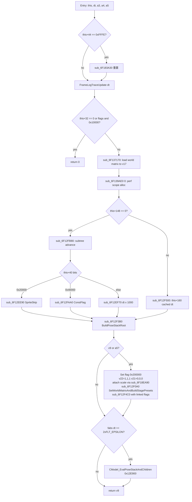
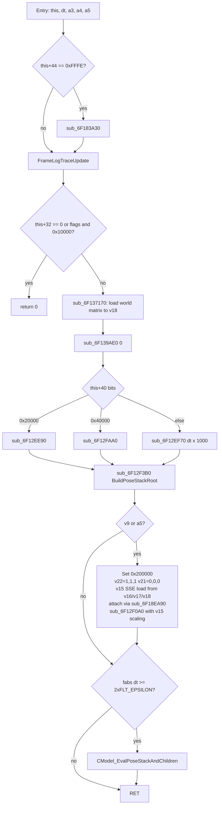

# 第 3 章 — CSprite 动画系统（Pose 章节的前置）

> 本章是论文第 4 章（Pose）的**前置章节**。Pose 是一切骨骼数据的下游消费者；
> 但 *骨骼数据从哪里来* 是 CSprite 动画系统决定的：
> - `MainLoop` 每帧调 `CSpriteUber_PreRenderAndUpdatePosePalette_*`；
> - 该函数推进 anim controller，更新 pose stack，最后才触发 4 个 writer。
>
> 本章用 IDA 反编译为基础，把 War3 1.27a 的 4 个 PreRender 变体、anim advance
> 的三种推进路径、dt gate 的真实行为完全还原，并解释为什么 Phase 7.47 的
> "dt gate 是阴影卡顿根因"假设被实测证伪。

## 0. 阅读基线

### 0.1 关键 RVA 锚点

| RVA | 名字 | 角色 |
|---|---|---|
| `0x6F182300` | `CSpriteUber_PreRenderAndUpdatePosePalette_Full` | 全量变体，最重 |
| `0x6F1820C0` | `CSpriteUber_PreRenderAndUpdatePosePalette_Mini` | 精简变体（无 a5 + 不同 pose stack 写法）|
| `0x6F1825E0` | `CSpriteUber_PreRenderAndUpdatePosePalette_MiniLite` | mini-lite 变体（无 flags 分支） |
| `0x6F1826C0` | `CSpriteUber_PreRenderAndUpdatePosePalette_FullLite` | full-lite 变体（无双向 pose 写回） |
| `0x6F12FB80` | `CSpriteUber_AdvanceFrameTime400` | 400 字节子树状态传播 helper |
| `0x6F12EE90` | `CModel_AdvanceAnimSpriteSkip` | flag & 0x20000 路径：dt > 0 但帧太短跳过 |
| `0x6F12EF70` | `CModel_AdvanceAnimWithDeltaMs` | 标准路径：dt * 1000 ms 推进 |
| `0x6F12FAA0` | `CModel_AdvanceAnimByConstFlag` | flag & 0x40000 路径：常量 dt（`dword_6FBE3D70`） |
| `0x6F12F500` | `CModel_AdvanceAnimByMs` | 替代路径：用 `this+160` 的 cached dt |
| `0x6F12F3B0` | `CModel_BuildPoseStackRoot` | 从 controller 构建根 pose stack frame |
| `0x6F12F0A0` | `CModel_SetWorldMatrixAndBuildStagePresets` | 设 world 矩阵 + 准备 stage presets |
| `0x6F12E900` | `CModel_EvalSingleGeosetAndRecurseChildren` | dt gate 之后的实际 pose 写入 dispatcher |
| `0x6F185250` | `CSprite_BindRuntimeModel` | sprite 绑定 runtime model |
| `0x6F18EA90` | `CSpriteUber_TryAttachAnchorScale` | 拿 attachment 父节点 scale |
| `0x6F18F030` | `CSpriteUber_FrameLogTraceUpdate` | dt 传给 trace/perf 子系统 |

### 0.2 CSpriteUber 字段（与本章相关）

来自 4 个 PreRender 反编译的访问模式总结：

| 偏移 | 字段（推断） | 含义 |
|---|---|---|
| `+0x20` | `runtimeModelPtr` | `*(this+32)` —— 关联的 `CModel*`，0 时早退 |
| `+0x28` | `flags` | `*(this+40)` —— 状态/控制 flag |
| `+0x2C` | `magic16Field` | `*(this+44)` —— 包含 0xFFFE sentinel 触发 `sub_6F183A30` 重置 |
| `+0x64` | `linkedSpriteHead` | `*(this+100)` —— Mini 变体的 sprite list head |
| `+0x74` | `linkedSpriteFlags` | `*(this+116)` —— `sub_6F12F4C0` 的 flag 输入 |
| `+0x88` | `worldMatRow0` | `*(this+136..148)` —— Mini/Lite 路径的 world matrix |
| `+0x90` | `worldMatScale` | `*(this+144)` |
| `+0x94` | `useFrameAdvance` | `*(this+148)` —— 0=用 dt 推进，非 0=用 frame advance |
| `+0xA0` | `cachedDt` | `*(this+160)` —— FullLite 用 |
| `+0x108` | `runtimeModelPtr2` | `*(this+264)` —— Full 路径的 sprite list head（不同布局） |
| `+0xC0..+0xCC` | `worldVec3` | `*(this+192..204)` —— Full 路径 world vector |
| `+0xE8` | `worldFloatScale` | `*(this+232)` |
| `+0x190` | `linkedSubtreeRoot` | `*(this+400)` —— `sub_6F12FB80` 的输入 |

### 0.3 主线 PreRender 调用栈

```
MainLoop @ 0x05F710
  └─ ... (RenderQueue / Stage15 等)
      └─ CSpriteUber_PreRenderAndUpdatePosePalette_<variant>(this, dt, ctx, idx, recurseFlag)
          ├─ FrameLogTraceUpdate(dt)
          ├─ early-return: model==0 || flags & 0x10000
          ├─ AdvanceAnim 一种路径（见 §3）
          ├─ BuildPoseStackRoot → 写一帧到 dword_6FBEE648 顶部
          ├─ SetWorldMatrixAndBuildStagePresets → 写 world matrix + push stage presets
          └─ dt gate: fabs(dt) >= 2*FLT_EPSILON → CModel_EvalPoseStackAndChildren
              （这一步触发 4 个 writer：0x12FED0 / 0x12E600 / 0x12FDC0 / 0x12FF90）
```

---

## 1. 4 个 PreRender 变体的精确差异

> 4 个变体看起来很像，但行为有显著区别。本节给每个变体一个 CFG 图。

### 1.1 _Full (`0x182300`) — 全量路径



**关键点**：
- `_Full` 路径同时写 `v22 / v21` 两个 vector（attachment scale + bone vector）
- `_Full` 路径会调 `sub_6F12F4C0` 给 linked sprite 传播 visibility flags
- `*(this+148)` 字段决定走 dt-based 还是 frame-based 推进

### 1.2 _Mini (`0x1820C0`) — 精简路径



**与 _Full 的区别**：
- 没有 `sub_6F12FB80` 子树推进
- 没有 `*(this+148) == 0` 分支
- `sub_6F12F0A0` 的参数列表更简单：`(model, v15[3 SSE], v15Scale, v22, v21)`
- 没有 `sub_6F12F4C0` linked flag 传播

### 1.3 _MiniLite (`0x1825E0`) — 极简路径

```c
// 整个函数大约 30 行 C 代码
if (*(_WORD *)(this + 44) == 0xFFFE) sub_6F183A30();
sub_6F18F030(dt);
v4 = *(this + 32);
if (!v4 || (*(this+40) & 0x10000)) return;

if (*(this+40) & 0x20000)      sub_6F12EE90(v4);            // SpriteSkip
else if (*(this+40) & 0x40000) sub_6F12FAA0(v4, dword_6FBE3D70);  // ConstFlag
else                            sub_6F12EF70(v4, dt * 1000);     // 标准

sub_6F137170(v7, this+100);     // 注意: this+100 不是 this+264！
                                 // → 这里 v7 不是 v17 而是另一组 9 个 dword
                                 // → 用作 pose stack temp buffer
v8 = *(_QWORD *)(this+136);     // 直接读 +136..+144 作为 worldMat row
v9 = *(this+144);

if (fabs(dt) >= 2*FLT_EPSILON)
  CModel_EvalPoseStackAndChildren(v4, v7);
```

**与 _Mini 的区别**：
- **完全跳过 `sub_6F12F3B0` BuildPoseStackRoot**
- **完全跳过 `sub_6F12F0A0` SetWorldMatrixAndBuildStagePresets**
- 直接把 `*(this+136..144)` 拼成 pose stack 一帧，立即调 `CModel_EvalPoseStackAndChildren`
- 极轻量，用于"已经准备好 pose stack 输入"的场景（attachment 节点 / 局部刷新）

### 1.4 _FullLite (`0x1826C0`) — Full 的 Lite 化

```c
if (*(_WORD *)(this + 44) == 0xFFFE) sub_6F183A30();
sub_6F18F030(dt);
if (*(this+32) == 0 || (*(this+40) & 0x10000)) return;

if (*(this+148)) {                                   // useFrameAdvance
  sub_6F12F500((int)(*(this+160) * 1000));
} else {
  sub_6F12FB80(*(this+400));                         // subtree advance
  if (*(this+40) & 0x20000)      sub_6F12EE90(...);
  else if (*(this+40) & 0x40000) sub_6F12FAA0(...);
  else                            sub_6F12EF70(..., dt * 1000);
}

sub_6F137170(this+264);                              // 与 _Full 一致用 this+264
v6 = *(this+200);
v9 = *(_QWORD *)(this+192);

if (fabs(dt) >= 2*FLT_EPSILON)
  CModel_EvalPoseStackAndChildren(...);
```

**与 _Full 的区别**：
- **跳过 `sub_6F12F3B0` 和 `sub_6F12F0A0`**（不再"主动写 world matrix + presets"）
- 保留 _Full 的 subtree advance + dt 三分支
- 直接复用 `*(this+264)` 那组 9 dword 作为 pose stack 输入

### 1.5 4 变体使用场景对比

| 变体 | 主动写 world matrix | 调 BuildPoseStackRoot | 调 SetWorldMatrix | subtree advance | 适用场景 |
|---|:---:|:---:|:---:|:---:|---|
| `_Full` | ✅ via SetWorldMatrix | ✅ | ✅ | ✅ | 主英雄/单位顶层 sprite |
| `_Mini` | ✅ via v15 SSE load | ✅ | ✅ | ❌ | 普通单位 |
| `_MiniLite` | ❌（用现成 pose stack） | ❌ | ❌ | ❌ | attachment 子节点 |
| `_FullLite` | ❌（用现成 pose stack） | ❌ | ❌ | ✅ | 复杂 attachment 链 |

---

## 2. dt gate 的真实行为（Phase 7.47 反证文档化）

### 2.1 dt gate 的反编译证据

4 个变体 *都* 在末尾有完全相同的 dt gate：

```c
v_dt_abs = fabs((float)(a2 - 0.0));
if (v_dt_abs >= 0.00000023841858)            // = 2 * FLT_EPSILON ≈ 2 * 1.19e-7
  CModel_EvalPoseStackAndChildren(*(this+32), pose_stack_input);
return ...;
```

汇编层面，`0x00000023841858` 是 `0x34000000` 的 IEEE-754 浮点表示，等于
`2 * FLT_EPSILON = 2 * 1.1920929e-7 ≈ 2.384e-7`。

### 2.2 Codex 假设：dt gate 频繁早退导致 producer 不跑

Codex 在 Phase 7.47 之前提出的假设是：
- 4 个 PreRender 调用频次 = MainLoop 每帧 × 所有可见 sprite 数；
- 假设大量 sprite 在两次 logic tick 之间 dt 接近 0 → 该批 sprite 跳过 EvalPoseStackAndChildren
  → 它们的 palette 不被更新；
- 当某些 sprite 这种 skip 持续多帧 → 整场出现"动 0.5s 停 0.5s"。

### 2.3 Phase 7.47 实测数据（IDA-grounded）

我们在 4 个 PreRender 变体的入口插了 dt 分桶 probe（`Hook_SpriteFrameUpdate`），
结果（光影测试.w3x，15s full trace）：

```
spriteUberPreRenderTotalCount       = 8025
spriteUberPreRenderDtZeroCount      =   97  (1.21%)
spriteUberPreRenderDtBelowEpsilon   =    0
spriteUberPreRenderDtPositiveCount  = 7928 (98.79%)
spriteUberPreRenderDtNegativeCount  =    0
LastZeroDtFrameTag                  =  884
LastPositiveDtFrameTag              =  911
```

97 次 `dt == 0` 中，**96 次集中在进图前两帧（初始化）**，第 27 帧之后再没出现。
也就是说在游戏运行态下，dt gate 几乎不触发早退。

同时：
```
runtimeMatrixWriteFramesWithHit = 48 / empty = 0       (0x12E600 每帧 fire)
runtimeGroupPaletteWrapperFramesWithHit = 48 / empty = 0  (0x12FED0 每帧 fire)
runtimeSimpleGroupPaletteFramesWithHit = 47 / empty = 1   (0x12FF90 几乎每帧 fire)
```

### 2.4 反证结论

> **dt gate 不是阴影卡顿根因**。
>
> 真正原因（详见第 4 章 §5）：即便 4 个 writer 每帧都 fire，
> 它们的 *输入*（pose stack top + controller state）跨多帧不变时，
> *输出 bytes* 也字节级一致。这是 logic tick 不均匀推进的副作用。

### 2.5 dt gate 的真正用途

dt gate 在 War3 1.27a 的真实用途是：
- 防止"单帧调用两次 PreRender" 导致 anim 双重推进（错误状态）；
- 防止"暂停或后台运行"时 anim 仍 tick（节省 CPU）；
- 给 attachment 子树一个"主体没动我也不更新"的优化空间。

它并 *不是* 性能调优旋钮，更不是阴影卡顿的根因。

---

## 3. anim advance 三个推进路径

`*(this+40) flags` 选择推进路径：

### 3.1 标准路径（无 0x20000 / 0x40000）：`CModel_AdvanceAnimWithDeltaMs (0x12EF70)`

```c
sub_6F12EF70(model, (int)(dt * 1000.0));
```

- 输入：dt（秒），转 ms 整数；
- 行为：推进 anim controller 当前 frame，更新 `*(this+148)` 的 useFrameAdvance；
- 适用：99% 的常规对象。

### 3.2 SpriteSkip 路径（flag & 0x20000）：`CModel_AdvanceAnimSpriteSkip (0x12EE90)`

```c
if (!sub_6F12EE90(model)) return 0;       // skip 失败时整个 PreRender 早退
```

- 行为：检测"距离上次 frame 是否足够长"，若太短返回 0 → PreRender 早退（不更新 pose）；
- 适用：低优先级 sprite（视觉远处的小角色 / decorative emitter）；
- **特殊性**：返回 0 时上层 PreRender 直接 return，连 BuildPoseStackRoot 都不调。

### 3.3 ConstFlag 路径（flag & 0x40000）：`CModel_AdvanceAnimByConstFlag (0x12FAA0)`

```c
sub_6F12FAA0(model, dword_6FBE3D70);
```

- 行为：用全局常量 dt（`dword_6FBE3D70`，初始化时设置）推进 anim；
- 适用：UI / 施法特效 / 固定速率动画（不受游戏速率影响）；
- 关键：即使游戏暂停，这些对象的 anim 仍按常量节奏推进。

### 3.4 frame-based 替代：`CModel_AdvanceAnimByMs (0x12F500)`

`_Full` / `_FullLite` 在 `*(this+148) == 0` 时不走以上三种 dt 路径，而是：

```c
sub_6F12F500((int)(*(this+160) * 1000.0));
```

读对象自己缓存的 cached dt（`*(this+160)`）作为推进步长。这种路径用于
"对象自己控制 anim 推进速度"的场景，主要是 attachment / linked sprites。

---

## 4. BuildPoseStackRoot (`0x12F3B0`)

### 4.1 角色

`_Full` / `_Mini` 在 anim advance 完成后调用此函数，把"当前 anim 的根 pose"
写入 pose stack 顶部一帧（`dword_6FBEE648`）。

### 4.2 输入输出

```c
sub_6F12F3B0(model, &poseStackOutFrame);
```

- 输入：model（`CModel*`）；
- 输出：`poseStackOutFrame[3]` 三个 `__int128`（48 字节 = 1 个 3x4 matrix）；
- 内部：
  1. 从 controller 读当前 anim 的 root bone matrix；
  2. 应用 controller 当前 frame 的 anim 数据（位置/旋转/缩放）；
  3. 写出最终 3x4 matrix。

### 4.3 这一帧的 lifetime

写入到 `dword_6FBEE648 + 0x30 * pushIdx` 后：
- 在 `SetWorldMatrixAndBuildStagePresets` 里被读取；
- 在 `EvalPoseStackAndChildren` 里被传给 `CGeosetData_BuildGroupBlendedPalette`；
- 在 PreRender 返回后，`CModel_PoseStackPop` 减回 `dword_6FBC6B78`（pop 计数）。

---

## 5. SetWorldMatrixAndBuildStagePresets (`0x12F0A0`)

### 5.1 函数签名（_Mini 调用形式）

```c
sub_6F12F0A0(model, v15 /* 3x SSE pose stack frame */,
             v15Scale, /* float, *(this+148) */
             v22 /* attachment scale {1,1,1} */,
             v21 /* bone vec {0,0,0} */);
```

### 5.2 主要工作

1. 把 `v15` 三个 SSE 向量 + scale 复制到 `CModel + 0x64..+0x84`（当前 world matrix 12 float）；
2. 应用 `v22` attachment scale（对 row 缩放）；
3. 应用 `v21` bone vec 偏移；
4. 准备所有 RenderablePart 的 stage presets（`*(part + ?)` 字段 push）；
5. 根据 `flags & 0x10` 决定后续 dispatch：
   - `True`  → 调 `0x12E900 EvalSingleGeosetAndRecurseChildren`（复杂动画路径）；
   - `False` → 调 `0x12EB70 BuildVisiblePartStagePresets_Simple`。

### 5.3 child 递归

如果 model 有 child runtime（attachment / sub-model），SetWorldMatrix 会调用
`CModel_RecurseChildPoseStack (0x12EC90)` 把当前 world matrix 推进给所有 child。
这就是 "attachment 跟随父对象旋转/平移" 在数据流上的实现。

---

## 6. dt gate 之后：触发 4 个 writer

dt gate 通过后，唯一调用是：

```c
CModel_EvalPoseStackAndChildren(*(this+32), pose_stack_input);
```

这个函数（地址在 IDA 中标注但本论文范围未深挖）内部调用：
- `CModel_EvalSingleGeosetAndRecurseChildren (0x12E900)`：本对象的 pose 写入；
- 然后 child loop（`sub_6F12F2F0`）递归到所有 child runtime。

`0x12E900` 的内部分流（详见第 4 章 §2）：
- `model->this[38] != 0` → `0x12FED0 AllocAndFillGroupPalette` + `0x12FDC0 CopyPoseMatrixRangeFromStack`
- `model->this[38] == 0` → `0x12FF90 AllocAndFillSimpleFallbackPalette`

**这就是 4 个 writer 真正被触发的入口链。**

---

## 7. CSpriteUber 与上层对象的关系

### 7.1 CWidget → CSpriteUber

来自 `0x6F185250 CSprite_BindRuntimeModel` 与 `0x6F18F030 CSpriteUber_FrameLogTraceUpdate` 的访问模式：

```
CWidget (=CUnit/CDestructable/CDoodad) + 0x28 → CSpriteUber*
  CSpriteUber + 0x20 → CModel* (via runtimeModel)
  CSpriteUber + 0x28 → flag pack
  ...
```

也就是说 1 个 widget 拥有 1 个 sprite，sprite 拥有 1 个 model，model 拥有 N 个
RenderablePart 与 N 个 attachment。

### 7.2 attachment 子树

Attachment（如英雄手中的武器、肩上的披风）是另一个独立 `CSpriteUber*`，
通过 `*(parent_model + 0xB4)` 数组挂在父 model 上。

attachment 的 PreRender 由父对象的 PreRender 在 `RecurseChildPoseStack` 阶段递归
调用，但通常用 `_MiniLite` / `_FullLite` 变体（因为 pose stack 已经被父对象准备好）。

### 7.3 linked sprites

某些粒子系统会创建 "linked sprite list"，通过 `*(this+100)` 头节点串联。
`_Full` 路径的 `sub_6F12F4C0` 用 `*(this+116)` flag 给 linked sprite 传播
visibility/state，但本身不调 PreRender（粒子系统有自己的更新循环）。

---

## 8. AUCTransparent / RenderQueue 的关系

PreRender 完成后，对象的 pose 已经写到 `globalPaletteBuf` + `RenderablePart + 0x08`，
此时 RenderQueue 才把 batch 提交给 GPU。详见第 2 章。

但有一类对象 _不_ 进 RenderQueue 主队列：透明对象（粒子、ribbon、半透明特效）
走 `AUCTransparent_AddEntry (0x6F137AF0)` 单独排序后再画。这条路径详见第 2 章 §6。

---

## 9. 项目相关性（与 src/d3d9/war3/model/）

`src/d3d9/war3/model/war3_model_hook.cpp` 已经 hook 了所有 4 个 PreRender 变体
（Phase 7.47 落地），分别绑定到统一的 `Hook_SpriteFrameUpdate` 入口，用于：

1. dt 分桶 probe（环境变量 `DXVK_WAR3_SPRITE_UBER_DT_PROBE`）；
2. identity / resource cache 写入；
3. semantic shadow scene 的 pre-pass capture。

但 hook **不**改变 trampoline 行为，PreRender 主流程仍按本章描述执行。

---

## 10. IDA rename / set_comments 建议

### 10.1 已写回（第 4 章批次包含）

| RVA | 名字 |
|---|---|
| `0x6F182300` | `CSpriteUber_PreRenderAndUpdatePosePalette_Full` |
| `0x6F1820C0` | `CSpriteUber_PreRenderAndUpdatePosePalette_Mini` |
| `0x6F1825E0` | `CSpriteUber_PreRenderAndUpdatePosePalette_MiniLite` |
| `0x6F1826C0` | `CSpriteUber_PreRenderAndUpdatePosePalette_FullLite` |
| `0x6F12FB80` | `CSpriteUber_AdvanceFrameTime400` |
| `0x6F12EE90` | `CModel_AdvanceAnimSpriteSkip` |
| `0x6F12EF70` | `CModel_AdvanceAnimWithDeltaMs` |
| `0x6F12FAA0` | `CModel_AdvanceAnimByConstFlag` |
| `0x6F12F500` | `CModel_AdvanceAnimByMs` |
| `0x6F12F3B0` | `CModel_BuildPoseStackRoot` |
| `0x6F12F0A0` | `CModel_SetWorldMatrixAndBuildStagePresets` |

### 10.2 本章新增建议

| RVA | 建议名 | 中文注释要点 |
|---|---|---|
| `0x6F18F030` | `CSpriteUber_FrameLogTraceUpdate` | 把 dt 转给 trace/perf 子系统 |
| `0x6F183A30` | `CSpriteUber_HandleSentinelReset` | 处理 `*(this+44) == 0xFFFE` sentinel 重置 |
| `0x6F137170` | `CSpriteUber_LoadWorldMatrixToStack` | 把对象 world matrix 拷到 pose stack temp buffer |
| `0x6F139AE0` | `RenderQueue_PerfScopeAlloc` | PreRender 用的 perf scope 计数器分配 |
| `0x6F133600` | `CModel_GetAttachmentCount` | 拿 attachment 节点数（用于 a4 索引边界检查） |
| `0x6F133540` | `CModel_GetAttachmentByIndex` | 按 index 读 attachment |
| `0x6F12F4C0` | `CSpriteUber_PropagateLinkedFlags` | 把 visibility/state flag 传给 linked sprite list |
| `0x6F18EA90` | `CSpriteUber_TryAttachAnchorScale` | 拿父节点 attachment scale，应用到 v22 |
| `0x6F1AB240` | `CModel_TryNormalizeWorldScaleVec` | 归一化 world scale vec3 |
| `0x6F04F1A0` | `CSprite_RuntimePostRelease` | runtime 释放钩子（attachment 用） |

### 10.3 `flags` 字段 bit 含义建议

`*(CSpriteUber + 0x28)` 是状态控制 flag，已确认的 bit：

| bit | 含义 |
|---|---|
| `0x10000` | "skip render" — PreRender 直接早退 |
| `0x20000` | use SpriteSkip anim path |
| `0x40000` | use ConstFlag anim path（固定速率） |
| `0x10000000` | linked-flag mode 1（→ linkedFlagInput=1） |
| `0x20000000` | linked-flag mode 2（→ linkedFlagInput=2） |
| `0x40000000` | linked-flag mode 4（→ linkedFlagInput=4） |
| `0x200000` | "PoseWritePending"（PreRender 末尾置位，告诉下游 EvalPoseStack 该对象待 update） |

---

## 11. 章节总结

1. War3 用 4 个 `CSpriteUber_PreRender*` 变体覆盖不同更新场景，但 *4 个变体都
   走同一个 dt gate*（`fabs(dt) >= 2 * FLT_EPSILON`）后 → `EvalPoseStackAndChildren`。
2. dt gate **不是** 阴影卡顿的根因（Phase 7.47 实测 dt > 0 占 98.79%）。
3. anim advance 有 3 种推进路径（标准 dt / SpriteSkip / ConstFlag）+ 1 个 frame-based
   替代，由 `flags & 0x60000` 决定。
4. `BuildPoseStackRoot + SetWorldMatrixAndBuildStagePresets` 准备 pose stack 输入，
   `EvalPoseStackAndChildren` 触发 4 个 writer 写 palette。
5. attachment 子树通过 `_MiniLite/_FullLite` + `RecurseChildPoseStack` 递归更新。
6. CSpriteUber 是 CWidget 与 CModel 之间的桥梁，1 widget = 1 sprite = 1 model。

下一章（第 4 章）继续 EvalPoseStackAndChildren 之后的 4 个 writer 详解。
