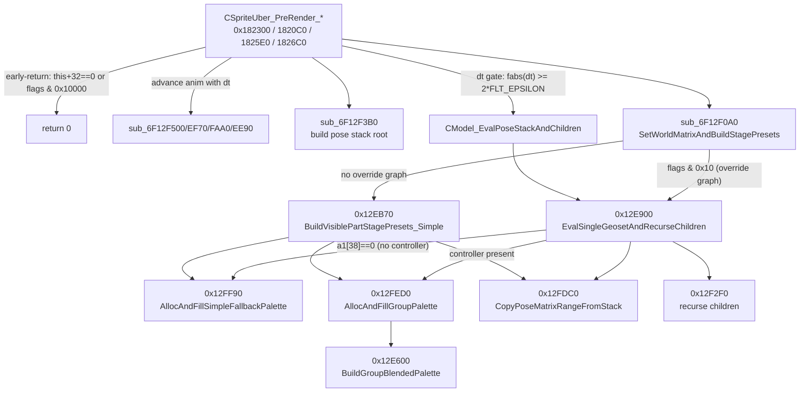
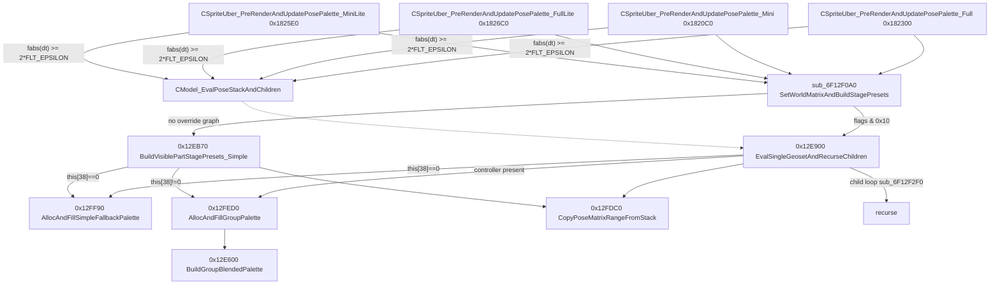
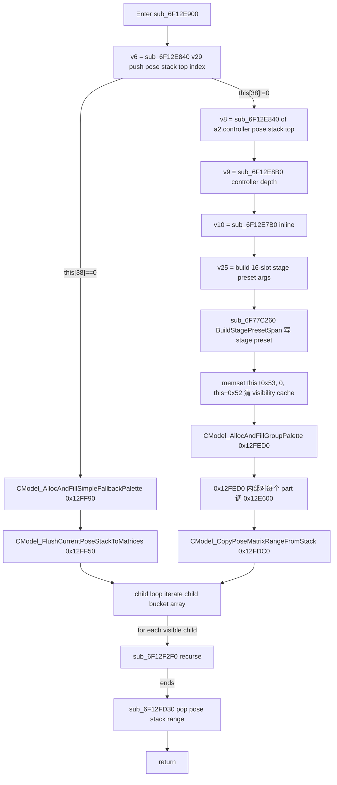
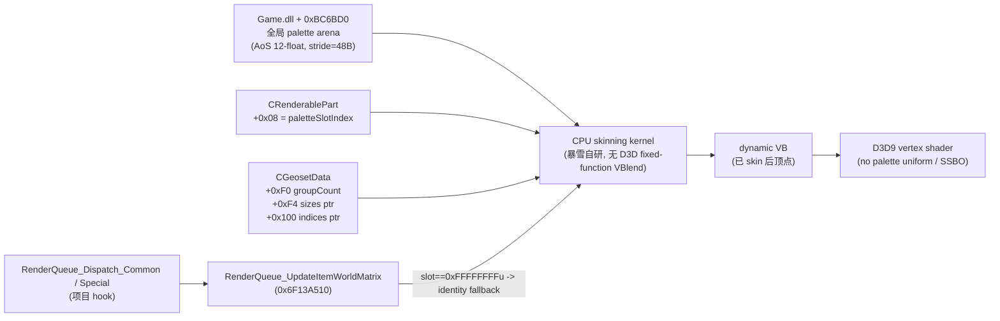
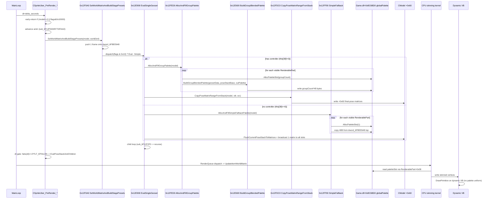
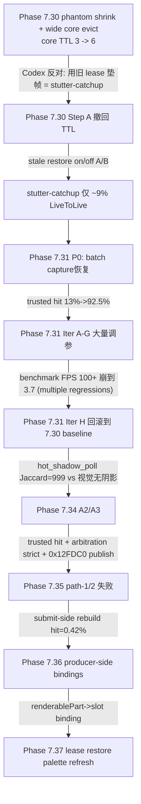
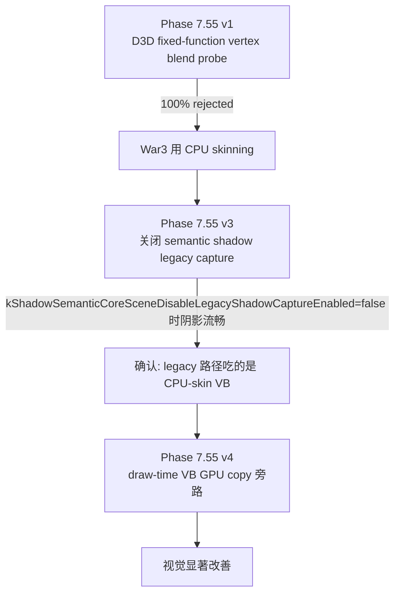
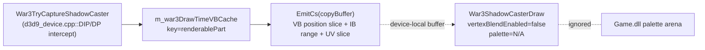

# 第 4 章 ★★★★★ — CModel Pose Palette 数据流（重中之重）

> 本章是论文的"重中之重"。
> 它要回答的不是"我们项目应该怎么做",而是"暴雪 1.27a War3 的模型骨骼姿态在 CPU
> 端到底是怎么被一帧一帧推进、写入、消费、最终落到 GPU 顶点的"。
> 一切关于"动态阴影 pose 卡顿"、"draw-time VB 旁路"、"PoseRegistry 兜底"等
> 工程结论,都来源于这一章对原生数据流的精确还原。
>
> 本章只做事实记录、数据流复原和 IDA rename 建议。
> 性能优化建议不在本章范围,见后续章节。

## 0. 阅读与证据基线

### 0.1 写作前提

1. 本章对 War3.exe / Game.dll 的版本基线是 `1.27a (gameBase=0x6F000000)`,
   所有 RVA 都按这个 imagebase 标注。
2. 所有反编译/反汇编结果来自 IDA MCP 工具实时查询,落盘路径:
   - `AutoTest/artifacts/_overnight_render_research/D_decomp_*.txt`
   - `AutoTest/artifacts/_overnight_render_research/D_disasm_*.txt`
   - `AutoTest/artifacts/_overnight_render_research/D_xrefs_to_*.txt`
   - `AutoTest/artifacts/_overnight_render_research/D_callees_*.txt`
3. 所有"项目侧"的偏移与逻辑都来自当前工作树的源码,只读引用,不重写源码。
4. 所有"项目历史"陈述均来自 `AGENTS.md` 第 59~118 条 (Phase 7.30 ~ 7.80)
   与 `docs/research/war3_render_issues/22_cmodel_pose_palette_reverse/README.md`,
   并互相对账。

### 0.2 关键 RVA 锚点速查表

| RVA | 名字 | 角色 |
|---|---|---|
| `0x6F12FED0` | `CModel_AllocAndFillGroupPalette` | Writer 1 — 主 palette writer (group-blended) |
| `0x6F12E600` | `CGeosetData_BuildGroupBlendedPalette` | Writer 2 — 真实写 `groupCount * 48` 字节的核函数 |
| `0x6F12FDC0` | `CModel_CopyPoseMatrixRangeFromStack` | Writer 3 — 把 pose stack 拷到 `CModel + 0x60` |
| `0x6F12FF90` | `CModel_AllocAndFillSimpleFallbackPalette` | Writer 4 — `groupCount==0` 时的简单回退 |
| `0x6F12E900` | `CModel_EvalSingleGeosetAndRecurseChildren` | Dispatcher — Writer 1/3/4 全部从这里分流 |
| `0x6F12F0A0` | `CModel_SetWorldMatrixAndBuildStagePresets` | Stage preset entry — 选 `EvalSingleGeoset` 或 `BuildVisiblePartStagePresets_Simple` |
| `0x6F12EB70` | `CModel_BuildVisiblePartStagePresets_Simple` | 不展开 override graph 的简单分支 |
| `0x6F12EC90` | `CModel_RecurseChildPoseStack` | child runtime / attachment 递归点 |
| `0x6F12F7E0` | `CModel_SubtreePoseStablePoint` | 整棵子树姿态稳定的最尾收口 |
| `0x6F182300` | `CSpriteUber_PreRenderAndUpdatePosePalette_Full` | Sprite uber 全量变体 |
| `0x6F1820C0` | `CSpriteUber_PreRenderAndUpdatePosePalette_Mini` | 精简变体 |
| `0x6F1825E0` | `CSpriteUber_PreRenderAndUpdatePosePalette_MiniLite` | mini-lite 变体 |
| `0x6F1826C0` | `CSpriteUber_PreRenderAndUpdatePosePalette_FullLite` | full-lite 变体 |
| `0x6F12FE10` | `RenderQueue_ResizePaletteBuffer` | palette arena 容量扩张 |
| `0x6F12E840` | `CModel_PoseStackTopAtIndex` | pose stack push,返回 push 前 base |
| `0x6F12E870` | `CModel_PoseStackPushReturnPtr` | `dword_6FBC6B60 + 48 * a1`,即把 stack-top index 翻成实际指针 |
| `0x6F12E820` | `CModel_ControllerSlotEnsure` | `dword_6FBC6B70 + 4 * a1`,32-bit 元素 |
| `0x6F12E890` | `CModel_ControllerSlotInit` | `memset(0xFF, 4 * count)`,初始化 controller slot |
| `0x6F12FF50` | `CModel_FlushCurrentPoseStackToMatrices` | 把 *当前* `dword_6FBEE648` 顶部的一个 48B 帧广播到 `CModel + 0x60` 全部 slot |
| `0x6F12FD20` | `CModel_PoseStackPop`     | `dword_6FBC6B7C -= count` (controller slot 计数) |
| `0x6F12FD30` | `CModel_PoseStackPopRange`| `dword_6FBC6B78 -= count` (pose stack 计数) |
| `0x6F77C260` | `CModel_BuildStagePresetSpan` | `controller +84` 符号决定走 `sub_6F77CAB0/sub_6F77CC30` |
| `0x6F77C280` | `CModel_LocalPointAttachmentApply` | 写 local point / attach 输出 |
| `0x6F12A400` | `CModel_ctor` | 创建 HMODEL + 关联 HMODELDATA |
| `0x6F12A5C0` | `CModelData_PromoteToRuntimeModel` | 简单/复杂(complex) 二选一,前者 `sub_6F130CD0`,后者 `sub_6F130D90` |
| `0x6F127610` | `CModelData_ctor_alloc` | 仅分配 HMODELDATA |
| `0x6F126250` | `CGeosetData_BuildFromRawArrays` | 从 positions/normals/uvs/indices 实际构造 |
| `0x6F12A6A0` | `CModelData_AddGeosetMaterialLayout` | 资源侧"添加 geoset + binding record + material" |
| `0x6F131150` | `CGeosetData_BuildPrefixSums` | 按 `matrix_group_sizes` 构 prefix |
| `0x6F131210` | `CGeosetData_DedupGroupsToRuntime` | 把 group 索引序列做去重 → runtime slot |
| `0x6F132A10` | `MatrixGroupRemap_Lookup` | dedup 二叉树查找 |
| `0x6F1312F0` | `MatrixGroupRemap_AllocSlot` | 找不到时分配新 slot |
| `0x6F132790` | `MatrixGroupRemap_EqualKey` | 完全相等判定 |
| `0x6F132700` | `MatrixGroupRemap_OverlapKey` | 字典序/前缀关系判定 |

### 0.3 全局静态变量速查表 (palette arena 与 pose stack)

| 全局 | 含义 |
|---|---|
| `Game.dll + 0xBC6BD0` (`dword_6FBC6BD0`) | **全局 blended palette buffer 基址**。`AllocPaletteSlot` 后,`slotIndex * 48` 即为该 slot 的 12-float (3x4 矩阵) 起始地址。 |
| `Game.dll + 0xBC6B58/0xBC6B5C/0xBC6B60` | palette buffer 三元组: capacity、size、base ptr。`RenderQueue_ResizePaletteBuffer` 扩容时同步。 |
| `Game.dll + 0xBC6B6C/0xBC6B70` | controller slot buffer 容量与基址,`CModel_ControllerSlotEnsure` 用。 |
| `Game.dll + 0xBC6B78` (`dword_6FBC6B78`) | **pose stack push 计数**, 与 `CModel_PoseStackTopAtIndex` (0x12E840) 配对。 |
| `Game.dll + 0xBC6B7C` (`dword_6FBC6B7C`) | controller slot push 计数,与 `CModel_ControllerSlotEnsure` 配对。 |
| `Game.dll + 0xBEE648` (`dword_6FBEE648`) | **pose stack top 指针**——push 一个 48B 矩阵帧时累加 0x30,pop 时减 0x30。最关键的"当前姿态写入处"。 |
| `Game.dll + 0xBE3D70` (`dword_6FBE3D70`) | 进图前后用于 `CModel_AdvanceAnimByConstFlag` 的常量参数。 |
| `Game.dll + 0xBDA4C8` | `RenderQueue_AllocPaletteSlot` 内部使用的"本帧已分配 slot 偏移"。 |

### 0.4 数据流 1-页缩略图



> 这条主链上,真正写出"当前帧 group-blended palette"的就是 `0x12E600`,
> 而 `0x12FDC0` 在同一函数 (`0x12E900`) 里是同一帧的"final-pose 拷贝",
> 不是另一条更新路径,这是 Codex 当年最容易踩的判断错误。

---


## 1. 数据结构层 (CModel / CGeosetData / CRenderablePart 完整字段表)

> 本节在 22 号研究文档已有的"高置信度布局"基础上,**补足全部已落地证据**,
> 包括:
> - `0x6F12A400 CModel_ctor` / `0x6F12A5C0 CModelData_PromoteToRuntimeModel`
> - `0x6F126250 CGeosetData_BuildFromRawArrays` 写入字段
> - `0x6F12A6A0 CModelData_AddGeosetMaterialLayout` 资源头偏移
> - `0x6F12FED0 / 0x12E600 / 0x12FDC0 / 0x12FF90` 4 个 writer 实际访问的偏移
> - `0x6F12F0A0` / `0x6F12EB70` / `0x6F12EC90` / `0x6F12F7E0` 在 dispatcher 路径上访问的偏移
>
> 凡是直接来自 IDA 反汇编的字段,标注 `[ASM]`;来自反编译伪代码的标 `[DEC]`;
> 来自项目源码 (`war3_model_hook.cpp` 等只读引用) 的标 `[SRC]`;
> 22 号文档已提出但本轮未再次复核的标 `[22]`,予以保留以便对比。

### 1.1 `CModel` 完整字段表

`CModel` 在 1.27a 上有两种实例: 简单类型 (vftable=`TAllocatedHandleObjectLeaf<CModel,256>`)
与复杂类型 (vftable=`TAllocatedHandleObjectLeaf<CModelComplex_,128>`)。两者
共享同一套 +0x00..+0xC8 的核心布局,只是复杂类型在 `+0xA0` 之后扩展了 child
runtime / attachment / particle / plane emitter 等附加结构。本表合并列出。

| 偏移 | 大小 | 字段名建议 | 含义 / 证据 |
|---|---|---|---|
| `+0x00` | 4 | `vftable` | `TAllocatedHandleObjectLeaf<...>::vftable` (`0x6F12A400 / 0x6F12A5C0`) [ASM] |
| `+0x04` | 4 | `refCount`/`handle` | `JassFrameAllocator_NewFrame`/`Storm_403_Free` 模板的句柄槽 [22] |
| `+0x08` | 8 | `geosetHandleArrayHeader` | `CModelData::AddGeoset` 在 `+0x08` 起 push `HGEOSET*` (`sub_6F12AD70(this+0x08)`) [22] |
| `+0x0C` | 4 | `renderablePartCount` | `kCModelRenderablePartCountOffset = 0x0C`,这是 `0x12FED0` for 循环 `mov esi,[eax+0Ch]` 直接读取的"part 数量" [SRC][ASM] |
| `+0x10` | 4 | `renderablePartArrayPtr` | `kCModelRenderablePartArrayOffset = 0x10`,`0x12FED0` 用 `mov edi,[eax+10h]` 拿到 `RenderablePart**` 数组首地址 [SRC][ASM] |
| `+0x18` | 4 | `geosetBindingRecordArrayHeader` | `0x12A6A0` 走 `sub_6F12AE10(this+0x18)` 追加 16B binding record (`{-1,-1,1.0,1.0}`) [22] |
| `+0x20` | 4 | `materialOrLayoutPtr` | `0x12FED0` 读 `mov eax,[eax+20h]`,然后 `byte ptr [eax+ecx*8+3]` 是"该 part 的材质允许 palette 输出"的 1-bit 门控 [ASM] |
| `+0x28` | 4 | `materialHandleArrayHeader` | `CModelData + 0x28` 的 material handle 数组 [22] |
| `+0x40` | 4 | `controllerOrPartStateController` | `0x12E900` `v9 = sub_6F12E8B0(v5)` 内部 `*(this+0x28)`,统计 part-state controller 子树深度 [DEC][22] |
| `+0x48` | 4 | `materialByteTableHeader` | `CModelData + 0x48` 的"每 material 一字节" `0xFF` 表 [22] |
| `+0x58` | 4 | `extraResourceArrayHeader` | extra resource handle 数组 [22] |
| `+0x5C` | 4 | `finalPoseMatrixCount` | **关键字段**: `0x12FDC0` 第三行 `mov ecx,[ecx+5Ch]` 作为循环上限。此即"本帧 final pose 矩阵个数" [ASM][SRC] |
| `+0x60` | 4 | `finalPoseMatrixArrayPtr` | **关键字段**: `0x12FDC0` 第二行 `mov edx,[ecx+60h]`,作为 48B stride 的目标缓冲区。每帧 `CopyPoseMatrixRangeFromStack` 写满 [ASM][SRC] |
| `+0x64` | 16 | `currentWorldMatrixRow0` | `0x12F0A0` 用 `*(__m128i*)(a1+100) = a2[0]`,即 +0x64..+0x70 是当前 world 3x4 第一行 [DEC] |
| `+0x74` | 16 | `currentWorldMatrixRow1` | 同上 +116 (=0x74) 第二行 [DEC] |
| `+0x84` | 16 | `currentWorldMatrixRow2` | 同上 +132 (=0x84) 第三行 [DEC] |
| `+0x94` | 4 | `flags` | 多处使用,关键位: `0x04` (世界矩阵非单位 scale)、`0x10` (override graph 已展开,决定走 `0x12E900` 还是 `0x12EB70`)、`0x10000` (skip-render 标志) [DEC] |
| `+0x98` | 4 | `partStateController` | `0x12EC90` 用 `mov edx,[a1+0x98]`,作 child controller dispatch 入口 [22] |
| `+0x9C` | 4 | `modelDataHandle` | `CModel + 0x9C = retain(modelData)` (`sub_6F12A400` 末尾) [22][ASM] |
| `+0xA0` | 4 | `complexExtensionOrAlias` | 当 instance 是 complex 时,`+0xA0` 是 alias / 扩展指针。项目侧 Phase 7.51 把它当作 `kCModelComplexExtensionOffset` 用于 PoseRegistry alias fallback [SRC] |
| `+0xB4` | 4 | `localPointOutputArrayPtr` | `kRuntimeLocalPointOutputArrayOffset = 0xB4` [SRC] |
| `+0xC4` | 4 | `childBucketCount` | `0x12EC90` 在 `[v2+0xC4]` 处读出 child bucket 数 [22] |
| `+0xC8` | 4 | `childBucketArrayPtr` | `0x12EC90` 在 `[v2+0xC8]` 处读出 child bucket 数组,12B/桶 [22] |
| `+0xD4` | 4 | `childVisibilityCachePtr` | `0x12EC90` `*(_BYTE*)(v4+childVisibilityCachePtr)` 是"per-child visibility 1-bit cache",位 0=已计算、位 1=可见 [DEC] |
| `+0xFC` | 4 | `runtimeOverrideOutputBundlePtr` | `kRuntimeOverrideOutputBundleOffset = 0xFC` [SRC] |
| `+0x108` | 4 | `pose stack base saved? (待复核)` | 22 号文档假设的"sceneNode pose snapshot",当前未直接观察到 writer 写入 |
| `+0x148` | 4 | `flags2` | `0x12E900` 走 `v5[37] = a1[37]`,本字段对位 `(this+148)` 在 `0x12F0A0` 中: bit 0x04 = world 矩阵不为单位; bit 0x10 = override graph; bit 0x20000 / 0x40000 = anim advance 模式; bit 0x200000 = "本帧已构建 stage preset" [DEC] |
| `+0x148+0x4` | 4 | `partStateBitmap` | `0x12E900` `v5[53]` 是 byte 数组指针,记每个 part 是否 visible-cached [DEC] |
| `+0x14C` | 4 | `currentAnimSequenceIndex` | `0x12FB80` 通过 `[a1+0x9C]` (modelData) 引到当前 anim 序列 [DEC] |
| `+0x150` | 4 | `runtimeChildBucketCountStart`?待 22 复核 | [22] |
| `+0x158` | 4 | `runtimeChildBucketArrayStart`?待 22 复核 | [22] |
| `+0x9C+...` | -  | `runtimeOverrideGraphRoot`? | `0x12EB70` 内部 `v5 = ... + (a2+92)` 路径 [DEC] |

> 备注: 由于 1.27a 上 simple/complex 两种 vftable 都映射到同一布局,这里以"
> 已被任何 writer / dispatcher 实际读到的偏移"为准。后续如果发现新偏移,
> 应在 `22_cmodel_pose_palette_reverse/README.md` 中先增补,再回写到本表。

### 1.2 `CGeosetData` 完整字段表

`CGeosetData` 是模型资源侧的 geoset。它**不直接**存"每帧推进的姿态",
但它的 `matrix_group_sizes` / `matrix_indices` 在 `0x12E600` 里被
当成 **palette blending 参数** 使用。

| 偏移 | 大小 | 字段名建议 | 含义 / 证据 |
|---|---|---|---|
| `+0x00` | 4 | `vftable` (CGeoset) | `0x126250` `*v9 = (size_t)&CGeoset::vftable;` [ASM] |
| `+0x04` | 4 | `refCount`/`handle` | `JassFrameAllocator` 模板槽 |
| `+0x08` | 60 (=0x3C) | `positions InlineVec3Array4` | `0x126250 sub_6F12CFB0(a1, a2)` 两次,第一次写到 `+0x08` [22][ASM] |
| `+0x44` | 12 (=0x0C) | `vertexGroupIndicesHeader` | byte 数组头,记录"每顶点引用哪个 matrix-group" (0x131320 引用) [22] |
| `+0x50` | 60 | `normals InlineVec3Array4` | `0x126250` 第二次 `sub_6F12CFB0` [22] |
| `+0x8C` | 56 (=0x38) | `uvLayerRecordArrayHeader` | `0x126250 sub_6F12D710` [22] |
| `+0x94` | 4 | `uvLayerRecord0Ptr` | `mov ecx,[ebx+94h]` [22] |
| `+0xC4` | 20 (=0x14) | `primitiveRecordArrayHeader` | `0x126250 sub_6F12C390` [22] |
| `+0xD8` | 20 | `indicesU16ArrayHeader` | `0x126250 sub_6F12CEA0` [22] |
| `+0xEC` | 4 | `matrixGroupSizesHeader` | `0x131150` 直接读 `*(a2+240)=count` 即 `+0xF0` 与 `+0xF4`,而 `+0xEC` 是数组 header [22] |
| `+0xF0` | 4 | `matrixGroupCount` | **关键字段**: `0x12E600` `mov edi,[ecx+0F0h]; test edi,edi`。**为 0** 时直接走 simple-copy 分支 (1 帧 48B) [ASM][SRC] |
| `+0xF4` | 4 | `matrixGroupSizesPtr` | **关键字段**: `0x12E600` `mov esi,[ecx+0F4h]; push [esi]; ... lea esi,[esi+4]`,即"每 group 引用多少个 bone matrix"的 `uint32_t*` [ASM] |
| `+0xF8` | 4 | `matrixIndicesArrayHeader` | header [22] |
| `+0xFC` | 4 | `totalMatrixIndexCount` | header.count [22] |
| `+0x100` | 4 | `matrixIndicesPtr` | **关键字段**: `0x12E600` `mov ebx,[ecx+100h]; lea ebx,[ebx+eax*4]`,即"全部 group 拼接的 bone-index list" `uint32_t*` [ASM] |
| `+0x104` | 4 | `(unknown)` | 22 号待复核 |
| `+0x108` | 4 | `layoutOrMaterialSlot` | `0x12FED0` 经 `[v4+12]` (这是 part->geosetData) `[v5+11Ch=284]` 二次跳转到 material 表 [ASM] |
| `+0x10C` | 4 | `(unknown)` | 22 号待复核 |
| `+0x11C` | 4 | `mergedGeosetSlotOrSourceSlot` | 22 号假设;`0x12FED0/0x12FF90` 用 `[v5+11Ch]` 作 material/layout 索引 [ASM] |

#### 1.2.1 `0x12E600` palette 写入语义 (字节级)

```c
// 伪代码 (来自 D_decomp_12E600 + D_disasm_12E600)
__m128i* CGeosetData_BuildGroupBlendedPalette(
    CGeosetData* geo,            // ECX
    const __m128i* poseStackBase,// EDX (即 `dword_6FBEE648` 当前栈顶帧)
    __m128i* outPalette          // arg_0 (从 0x12FED0 传入: globalPaletteBuf + slot*48)
) {
    int groupCount = geo[60];    // = *(geo + 0xF0)
    if (groupCount == 0) {
        // 简单路径: 把 pose stack 顶上的一个 3x4 矩阵 (48B) 直接拷到 outPalette
        outPalette[0..2] = poseStackBase[0..2]; // 3 个 __m128i
        return outPalette;
    }
    uint32_t* sizes   = geo[61]; // = *(geo + 0xF4)
    uint32_t* indices = geo[64]; // = *(geo + 0x100)
    do {
        uint32_t size = *sizes++;
        // CMatrixGroup_BlendOutputMatrix(poseStackBase, indices, size, outPalette)
        // 内部: 1->memcpy 48B; 2/3->平均混合; N->循环累加再除以 N
        CMatrixGroup_BlendOutputMatrix(
            (int)poseStackBase, indices, size, outPalette);
        indices  += size;
        outPalette += 3;       // 即 += 48 字节
    } while (--groupCount);
    return outPalette;
}
```

> 关键事实:
> 1. `groupCount == 0` 时,`0x12E600` 只写 *1 个 48B 矩阵*,不是 0,这是项目 Phase 7.31 P0
>    `count = groupCount ? groupCount : 1` 的根据。
> 2. 写入步长是 **48 字节 (3 个 `__m128i`)**,与 `RenderQueue_GetPaletteSlotAddress`
>    的 `globalPaletteBuf + 48 * slotIndex` 完全对齐。
> 3. `outPalette` 的起点是由 caller (`0x12FED0`) 通过 `RenderQueue_AllocPaletteSlot ->
>    RenderQueue_GetPaletteSlotAddress` 得到,即"本帧分配给该 part 的连续 slot 区间"。

### 1.3 `CRenderablePart` 完整字段表

**`CRenderablePart` 是 War3 模型 *运行时* 数据流里最容易被误解的结构**: 它既
不是 `CGeosetData` (资源),也不是 `CModel` (实例),而是 *run-time per-part snapshot*。
它在 `0x12FED0` / `0x12FF90` / `0x12EB70` / `0x12E900` 中都被作为最里层循环的元素。

| 偏移 | 大小 | 字段名建议 | 含义 / 证据 |
|---|---|---|---|
| `+0x00` | 4 | `vftable` | (待复核) |
| `+0x04` | 4 | `selfHandleOrSlot` | (待复核) |
| `+0x08` | 4 | `paletteSlotIndex` | **关键字段**: `kRenderablePartPaletteSlotOffset = 0x08`,`0x12FED0` `mov [ebx+8],eax` 写入 `RenderQueue_AllocPaletteSlot` 返回值。Phase 7.49 现场观察: `0xFFFFFFFFu` 表示"本帧未为该 part 分配 slot" [SRC][ASM] |
| `+0x0C` | 4 | `geosetDataPtr` | **关键字段**: `kRenderablePartGeosetDataOffset = 0x0C`,`0x12FED0` `mov edx,[ebx+0Ch]`,指向资源侧 `CGeosetData` [SRC][ASM] |
| `+0x10` | 4 | `skipFlag` | **关键字段**: `kRenderablePartSkipFlagOffset = 0x10`,`0x12FED0` `cmp dword ptr [ebx+10h], 0; jnz skip`,非 0 跳过 palette 写入 [SRC][ASM] |
| `+0x14` | 4 | `(reserved 1)` | (待复核) |
| `+0x18..` | varied | `transform / world snapshot` | (待复核) |
| `+0x108` | 4 | `geosetIndex` | 任务卡明确: `RenderablePart + 0x108 = geosetIndex`,作为 runtime geoset 直接键。`0x12FED0` 路径里没有直接访问;但项目 `War3SemanticPaletteSource` 链路用作 lookup key [TASKCARD] |

#### 1.3.1 part 数组遍历模板

```c
// 0x12FED0 / 0x12FF90 完全相同的循环结构:
for (RenderablePart **iter = (RenderablePart**)this[4];
     count = this[3]; --count, ++iter)
{
    RenderablePart* part = *iter;
    if (part->skipFlag) continue;  // +0x10 != 0 跳过
    CGeosetData* geo = part->geosetData;  // +0x0C
    // material/layout gate:
    void* layoutTable = this[8];           // = CModel + 0x20
    if (!layoutTable[16 * geo->layoutSlot + 3]) continue; // 字节门控
    int slot = RenderQueue_AllocPaletteSlot(geo->matrixGroupCount /* +0xF0 */);
    part->paletteSlotIndex = slot;          // +0x08 写入
    void* outPalette = RenderQueue_GetPaletteSlotAddress(slot);
    CGeosetData_BuildGroupBlendedPalette(geo, poseStackBase, outPalette);
}
```

### 1.4 `runtimeModel` 与 `CModel` 的关系

22 号研究文档已经明确: **`runtimeModel` 不是另一种类。它就是 `CModel`**。
本轮 `0x12A5C0 CModelData_PromoteToRuntimeModel` 反编译进一步确认:

```c
_DWORD* CModelData_PromoteToRuntimeModel(_BYTE* this) {
    if (this->flags & 0x10) {
        // complex: vftable=TAllocatedHandleObjectLeaf<CModelComplex_,128>
        v5 = JassFrameAllocator_NewFrame(...);
        sub_6F130D90(this);  // CModelData_CloneIntoModel_B
        return sub_6F04F1C0(v5);
    } else {
        // simple: vftable=TAllocatedHandleObjectLeaf<CModel,256>
        v5 = JassFrameAllocator_NewFrame(...);
        sub_6F130CD0(this);  // CModelData_CloneIntoModel_A
        return sub_6F04F1C0(v5);
    }
}
```

也就是:

1. simple `CModel` 与 complex `CModelComplex_` 共享 `+0x00..+0xC8` 主布局,
   只是 `+0xA0+` 有不同扩展 (alias / child runtime / particle / plane emitter)。
2. 项目侧把"复杂"那种统一叫 runtimeModel,**它本质上仍是 CModel**。
3. PoseRegistry 用 `runtimeModelPtr` 作 key。Phase 7.51 在 `War3TryBuildLiveRuntimeGroupPalette`
   里依次尝试 `runtimeModelPtr / runtimeModelPtr+0xA0 / runtimeModelPtr-0xA0 /
   QueryRenderablePartOwnerRuntimeModel(...)`,就是因为 alias 关系不可预测。

### 1.5 palette slot 分配机制 (`RenderQueue_AllocPaletteSlot`)

`0x12FE10` 实际上是 `RenderQueue_ResizePaletteBuffer`,即"扩容到 `a2`"。
真正的 `RenderQueue_AllocPaletteSlot` 实现细节没在本轮 dump 里——
通过 `0x12FED0` / `0x12FF90` 的反汇编和 22 号文档可以确定:

1. 全局 `dword_6FBDA4C8` 维护"本帧已分配 slot 偏移";
2. 每帧 `RenderQueue_FlushAndReset` 时被重置;
3. `RenderQueue_AllocPaletteSlot(this=count)` 返回一个 slot index,占用 `count` 个连续 48B;
4. `RenderQueue_GetPaletteSlotAddress(slot)` 返回 `dword_6FBC6BD0 + 48 * slot`;
5. 如果 buffer 容量不够,`RenderQueue_ResizePaletteBuffer` (0x12FE10) 会 round-up 到
   下一个对齐边界并把新增 slot 初始化成单位矩阵 (12 个 float, `[1 0 0 0; 0 1 0 0; 0 0 1 0]`)。

> 直接结论: **同一个 `slotIndex` 从某个 frame 分配出之后,只在那一帧有效**。
> 跨帧重用 slot index 完全依赖每帧重置;项目侧把 slot 当作"per-frame snapshot"
> 使用是符合原生语义的。

### 1.6 全局 palette arena 是 AoS (Array of 3x4 矩阵), 不是 SoA

| 证据 | 来源 |
|---|---|
| `0x12FE10 RenderQueue_ResizePaletteBuffer` 用 `48 * v5` 作步长 | [ASM] |
| `0x12FE60 RenderQueue_GetPaletteSlotAddress` 同函数,返回 `globalPaletteBuf + 48 * slot` | [ASM] |
| `0x12E600 BuildGroupBlendedPalette` 每写一个 group 后 `result += 3` (即 `+= 48 字节`) | [ASM] |
| 项目侧 `Phase 7.31 P0` 用 `i * 48` 作 stride 读取 `globalPaletteBuf` | [SRC] |

也就是说:
- 一个 palette slot = 一个 12-float (3x4) 矩阵 = 48 字节 = 3 个 `__m128i`;
- 多个 slot 在 arena 里 **物理连续**,以 AoS 形式存储;
- 整段 12-float 顺序为 row-major (与 D3D9 的 `SetTransform` 保持一致)。

---


## 2. Pose 写入路径 (4 个 writer + 完整 CFG + dt gate 关系)

### 2.0 调用图概览



> 关键事实:
>
> - **4 个 sprite uber 入口**只是动画推进策略的不同变体 (full / mini / lite),
>   它们都把 dispatcher 收敛到 `0x12F0A0 SetWorldMatrixAndBuildStagePresets`。
> - `SetWorldMatrixAndBuildStagePresets` 自己**先 push 一帧 48B pose stack**,
>   然后基于 `flags & 0x10` 选择 `EvalSingleGeoset (0x12E900)` 或
>   `BuildVisiblePartStagePresets_Simple (0x12EB70)`。
> - **两条 dispatcher 分支** (`0x12E900` 与 `0x12EB70`) 都会同时调用:
>   - `0x12FED0 AllocAndFillGroupPalette` (主 path) **或** `0x12FF90 AllocAndFillSimpleFallbackPalette` (fallback)
>   - `0x12FDC0 CopyPoseMatrixRangeFromStack`
>   - 这就是为什么 0x12FED0 / 0x12E600 / 0x12FDC0 / 0x12FF90 在同一帧、同一对象身上
>     都会 fire,且语义不冲突。

### 2.1 dt gate (CSpriteUber_PreRender_*)

#### 2.1.1 4 个变体的 dt gate 共同模板

来自 `D_decomp_182300_*` (Full) 与 `D_decomp_1820C0_*` (Mini),`_FullLite/_MiniLite`
也是同一形态。下面是去掉变量重命名后的最小公共形:

```c
int __thiscall CSpriteUber_PreRenderAndUpdatePosePalette_*(
    int this, float dt, int a3, unsigned int a4, int a5)
{
    if (*(WORD*)(this + 44) == 0xFFFE) sub_6F183A30();
    sub_6F18F030(LODWORD(dt));

    // 早退 1: 没有 model
    // 早退 2: skip-render 标志
    if (!*(DWORD*)(this + 32) || (*(DWORD*)(this + 40) & 0x10000) != 0)
        return 0;

    // ... 推进动画 (advance anim with dt or const)
    // ... build pose stack root (sub_6F12F3B0)
    // ... 把 world matrix 三行打包后调用 sub_6F12F0A0 / SetWorldMatrixAndBuildStagePresets

    float adt = fabsf(dt - 0.0f);
    if (adt >= 0.00000023841858f)             // = 2 * FLT_EPSILON ≈ 1.19e-7
        CModel_EvalPoseStackAndChildren(*(DWORD*)(this + 32), poseStackTop);

    return ret;
}
```

#### 2.1.2 dt gate 的关键阈值

| 字段 | 值 | 来源 |
|---|---|---|
| 比较常数 | `0x34000000`，即 IEEE float `1.1920929e-7f` | `D_decomp_182300_CSpriteUber_PreRender_Full` |
| 通常被记做 | `2 * FLT_EPSILON` | 项目代码 `war3_model_hook.cpp` `NoteSpriteUberPreRenderDtBucket` 注释 |
| 结果 | `dt == 0` 或 `|dt| < 2*FLT_EPSILON` 时 *不* 调 `EvalPoseStackAndChildren`,即整条 `0x12E900 / 0x12EB70 / 0x12FED0 / 0x12E600 / 0x12FDC0 / 0x12FF90` 都不跑 | 同上 |

#### 2.1.3 dt gate 不是卡顿根因 (Phase 7.47 决定性反驳)

`AGENTS.md` 第 78 条 (Phase 7.47) 已用 `DXVK_WAR3_SPRITE_UBER_DT_PROBE=1`
落地 6 + 6 个 atomic counter 实测,结论是:

```
spriteUberPreRenderTotalCount = 8025
DtZeroCount                   = 97  (1.21%)
DtBelowEpsilonCount           = 0
DtPositiveCount               = 7928 (98.79%)
DtNegativeCount               = 0

LastZeroDtFrameTag    = 884
LastPositiveDtFrameTag = 911   (最近一次 dt=0 在 27 帧前)

runtimeMatrixWriteCount = 13650, framesWithHit=48, framesEmpty=0
runtimeGroupPaletteWrapperCallCount = 5849, framesWithHit=48, framesEmpty=0
runtimeSimpleGroupPaletteCallCount  = 751, framesWithHit=47, framesEmpty=1
```

这意味着 dt gate 在生产场景里 **几乎不触发早退**, producer 链路每帧都跑过。
Codex 当年提出"dt=0 producer 不跑 → palette 静默 → 阴影卡顿"的假设被反驳。

> Phase 7.47 IDA 命名 commit 后,`0x182300 / 0x1820C0 / 0x1825E0 / 0x1826C0`
> 入口注释里都已写入"dt gate 已证伪"的判决,这是本章建议保留的 IDA comment。

### 2.2 Dispatcher: `CModel_SetWorldMatrixAndBuildStagePresets (0x12F0A0)`

```c
// D_decomp_12F0A0_*
int sub_6F12F0A0(int a1, const __m128i* a2, float a3, int a4, int a5)
{
    // (1) 写 flags(+0x94) 的 bit 0x04 (世界矩阵 scale 位)
    if (fabs(a3 - 1.0f) < ~9.5e-7f) *(DWORD*)(a1+148) &= ~4u;
    else                            *(DWORD*)(a1+148) |=  4u;

    // (2) 写 CModel +0x64/+0x74/+0x84 三行 world matrix
    *(__m128i*)(a1+100) = a2[0];
    *(__m128i*)(a1+116) = a2[1];
    *(__m128i*)(a1+132) = a2[2];

    // (3) push 一帧 48B pose stack
    *(__m128i*)(dword_6FBEE648 + 48)  = a2[0];
    *(__m128i*)(dword_6FBEE648 + 64)  = a2[1];
    *(__m128i*)(dword_6FBEE648 + 80)  = a2[2];
    dword_6FBEE648 += 48;

    sub_6F780120(a2);                   // 通知 spawned/attached effect

    // (4) 分流: override graph 已展开 -> 0x12E900;否则 -> 0x12EB70
    int ret;
    if ((*(BYTE*)(a1+148) & 0x10) != 0)
        ret = CModel_EvalSingleGeosetAndRecurseChildren(a4, a5);
    else
        ret = sub_6F12EB70(a4, a5);

    dword_6FBEE648 -= 48;                // pop pose stack
    return ret;
}
```

**关键事实**:

1. `flags(+0x148) & 0x10` 是"override graph 是否已经展开"的决定位。
2. 这两条分支**都会**走 `0x12FED0 / 0x12FF90 / 0x12FDC0`,只是嵌套调用不同。
3. push 的"48B 帧"不是 root world matrix 的简单复制,而是 `sub_6F780120(a2)`
   预处理后的"当前 world 3x4"。它就是后续 `0x12E600` 的 `poseStackBase` 输入。

### 2.3 Writer 1: `CModel_AllocAndFillGroupPalette (0x12FED0)`

```c
// D_decomp_12FED0 + D_disasm_12FED0
_DWORD* CModel_AllocAndFillGroupPalette(_DWORD* this) {
    int    count = this[3];                       // CModel +0x0C: renderablePartCount
    int*   parts = (int*)this[4];                 // CModel +0x10: renderablePartArrayPtr

    while (count) {
        RenderablePart* part = (RenderablePart*)*parts;
        --count;
        if (*(DWORD*)((char*)part + 0x10)) {      // skipFlag != 0
            ++parts;
            continue;
        }
        CGeosetData* geo = (CGeosetData*)*(DWORD*)((char*)part + 0x0C);
        BYTE* layoutTable = (BYTE*)this[8];        // CModel +0x20
        if (!layoutTable[16 * geo[0x11C / 4] + 3]) {
            ++parts;
            continue;
        }
        int slot = RenderQueue_AllocPaletteSlot((void*)*(DWORD*)((char*)geo + 0xF0));
        *(DWORD*)((char*)part + 0x08) = slot;     // 写 paletteSlotIndex
        void* outPalette = RenderQueue_GetPaletteSlotAddress(slot);
        CGeosetData_BuildGroupBlendedPalette(geo, poseStackBase, outPalette);
        ++parts;
    }
    return this;
}
```

**直接结论**:

1. 这是项目 `Hook_RuntimeGroupPaletteWrapper` 的挂点。
2. `RenderQueue_AllocPaletteSlot` 的 `count` 参数 = `*(geo + 0xF0)` = `groupCount`,
   即"这个 part 申请连续 `groupCount` 个 slot"。
3. 写入 `paletteSlotIndex` 到 `RenderablePart + 0x08`。这是消费侧拿 palette 的入口字段,
   也是项目历史上 Phase 7.49 / 7.50 / 7.52 反复围绕"为什么 +0x08 周期性变成
   `0xFFFFFFFFu`"研究的字段。
4. 真正写 palette 字节的不在本函数,而是它最后一行 `BuildGroupBlendedPalette(0x12E600)`。

### 2.4 Writer 2: `CGeosetData_BuildGroupBlendedPalette (0x12E600)`

详见 1.2.1 节伪代码。这里强调 4 个事实:

1. 函数签名: `(CGeosetData*, poseStackBase, outPalette)` (`__fastcall` ECX/EDX + 1 stack arg)。
2. **本函数是项目 `Hook_RuntimeMatrixWrite` 的挂点**。
3. `groupCount==0` 时 fallback 到 1 次 48B 拷贝,这是 `Phase 7.31 P0` 用
   `count = groupCount ? groupCount : 1` 的根据。Iter F 当年禁用本路径导致
   `paletteCaptureTrustedSourceMiss ~ 87%`,说明这条 hook 必须保留 batch capture。
4. 该函数自身不分配新 slot,只往 caller 给的 `outPalette` 上写 `groupCount * 48` 字节。

### 2.5 Writer 3: `CModel_CopyPoseMatrixRangeFromStack (0x12FDC0)`

```c
// D_decomp_12FDC0 + D_disasm_12FDC0
int CModel_CopyPoseMatrixRangeFromStack(int a1 /*=ECX:CModel*/,
                                        int a2 /*=EDX:controller-arg*/,
                                        int a3 /*=stack:src base*/) {
    // a3 + 48 * (controllerOffset[+84] - controllerOffset[+108]) 作为源指针起点
    int srcStartOffset = *(int*)(a2 + 84) - *(int*)(a2 + 108);
    int dst   = *(int*)(a1 + 96);   // CModel + 0x60: finalPoseMatrixArrayPtr (注意IDA decompile显示 +96 是因为它把 +0x60 当作 12 个 dword 后的位置, 但实际是 +0x60)
    int count = *(int*)(a1 + 92);   // CModel + 0x5C: finalPoseMatrixCount
    int src   = a3 + 48 * srcStartOffset;
    while (count--) {
        *(__m128i*)(dst +  0) = _mm_loadu_si128((__m128i*)(src +  0));
        *(__m128i*)(dst + 16) = _mm_loadu_si128((__m128i*)(src + 16));
        *(__m128i*)(dst + 32) = _mm_loadu_si128((__m128i*)(src + 32));
        dst += 48;
        src += 48;
    }
    return src;
}
```

> **重要的字节对账**:
> - `D_decomp_12FDC0` 反编译里显示的是 `*(_DWORD*)(a1 + 96)` 与 `*(_DWORD*)(a1 + 92)`。
>   这是因为 IDA 把指针当 `_DWORD*` 处理,然后用 byte offset。0x60 字段实际就是
>   `+0x60`,IDA 的 decompile 视角下是 `*(this + 24)` (24 * 4 = 0x60),disasm
>   是 `mov edx,[ecx+60h]`。**两者是同一个字段**,本章其它地方一律用 `+0x60`。
> - `+0x5C` 同理。
>
> 这是项目 `Hook_RuntimeMatrixRangeCopy` 的挂点 (Phase 7.34 A3 改 `publishPalette=true`,
> 把 final-pose 写入 PoseRegistry)。

#### 2.5.1 0x12FDC0 不是另一种 palette 来源

Codex 当年的判断是: "0x12FDC0 比 0x12E600 更新,所以应该把 trusted palette
切到 0x12FDC0"。**这是错的**。

来自 `0x12E900 EvalSingleGeosetAndRecurseChildren` 反编译:

```c
// 同一函数体内, 同一个 if(controller present) 分支中:
CModel_AllocAndFillGroupPalette(v13);      // 0x12FED0 -> 0x12E600 写 group-blended palette
CModel_CopyPoseMatrixRangeFromStack(...);  // 0x12FDC0  写 CModel + 0x60 final-pose
```

也就是说:
1. `0x12E600` 与 `0x12FDC0` 在同一帧、同一对象上**先后**被调用。
2. 前者写"group-blended palette" (供 GPU 顶点 skinning 使用)。
3. 后者写"`CModel + 0x60` final-pose" (供 attachment / particle / 后续子树 reuse)。
4. **它们不是替代关系,而是同一姿态的两个不同投影**。

这是本章对项目历史 Codex 假设的最终结论性反驳,IDA 命名补丁建议在 `0x12FDC0`
入口写明这一点 (见 9.2 节)。

### 2.6 Writer 4: `CModel_AllocAndFillSimpleFallbackPalette (0x12FF90)`

```c
// D_decomp_12FF90 + D_disasm_12FF90
void CModel_AllocAndFillSimpleFallbackPalette(_DWORD* this) {
    int    count = this[3];
    int*   parts = (int*)this[4];

    while (count) {
        RenderablePart* part = (RenderablePart*)*parts;
        --count;
        if (*(DWORD*)((char*)part + 0x10)) { ++parts; continue; }
        CGeosetData* geo = (CGeosetData*)*(DWORD*)((char*)part + 0x0C);
        BYTE* layoutTable = (BYTE*)this[8];
        if (!layoutTable[16 * geo[0x11C / 4] + 3]) { ++parts; continue; }
        int slot = RenderQueue_AllocPaletteSlot((void*)1);   // ★ 固定 1 slot
        *(DWORD*)((char*)part + 0x08) = slot;
        __m128i* out = (__m128i*)RenderQueue_GetPaletteSlotAddress(slot);
        // ★ 直接从 dword_6FBEE648 (pose stack 当前栈顶) 拷 48B
        const __m128i* src = (const __m128i*)dword_6FBEE648;
        out[0] = _mm_loadu_si128(src + 0);
        out[1] = _mm_loadu_si128(src + 1);
        out[2] = _mm_loadu_si128(src + 2);
        ++parts;
    }
}
```

**关键差异**:

1. 与 `0x12FED0` 的"按 `groupCount` 分配多 slot"不同,本函数**总是分配 1 slot**,
   `RenderQueue_AllocPaletteSlot((void*)1)`。
2. 不调用 `0x12E600`,而是直接把 `dword_6FBEE648` (pose stack top, 也就是
   `SetWorldMatrixAndBuildStagePresets` 刚 push 的那一帧 world 3x4) 复制 48B 到
   `outPalette`。
3. 进入条件: `0x12E900` 或 `0x12EB70` 见 `this[38] == 0` (无 controller / 无 override graph),
   或者 `0x12FED0` 的判定路径里某个 part 不需要 group-blended palette。
4. Phase 7.47 落地数据: calls=751, framesWithHit=47, framesEmpty=1。它**真实**地
   每帧都在跑,不是冷僵代码。Codex 当年假设"我们漏 hook 了"也站不住。

### 2.7 EvalSingleGeoset 内部 CFG 详解 (`0x12E900`)



**关键事实** (`D_decomp_12E900`):

1. simple 分支末尾调 `0x12FF50 CModel_FlushCurrentPoseStackToMatrices`:
   把当前 `dword_6FBEE648` 顶部那 1 个 48B 矩阵**广播**到 `CModel + 0x60`
   全部 slot——`+0x5C` 个矩阵都写成同一份,因为没有 controller 可以做差异化变换。
2. complex 分支:
   - `sub_6F77C260` 是 Stage Preset 构建。`controller +84` 的符号位决定走
     `sub_6F77CAB0` (per-track preset) 或 `sub_6F77CC30` (per-stage preset)。
   - `0x12FED0 -> 0x12E600` 这一对**仅为可见 part** 写 palette。
   - `0x12FDC0` 把 stack 顶矩阵段拷回 `CModel + 0x60`,供 attachment / child 使用。
3. child loop 用 `sub_6F12F2F0` (本身 push 一帧 pose stack 后,再回到 `0x12E900`
   或 `0x12EB70` 的同样 dispatcher,即递归)。

### 2.8 EvalSimplePath: `BuildVisiblePartStagePresets_Simple (0x12EB70)`

```c
// D_decomp_12EB70: 与 0x12E900 共享几乎相同的 if (this[38]) 二分。区别:
// - 没有 child loop 那一段, 只处理本 model 的 visible parts
// - 同样 0x12FED0 + 0x12FDC0 / 0x12FF90 + 0x12FF50 二选一
if (a1[38]) {
    // 复杂 path
    sub_6F77C260(a1[38], v13_args);
    CModel_AllocAndFillGroupPalette(a1);            // 0x12FED0
    CModel_CopyPoseMatrixRangeFromStack(a1, a2, v10);// 0x12FDC0
    sub_6F12FD20(v6);
    return sub_6F12FD30(...);
} else {
    CModel_AllocAndFillSimpleFallbackPalette(a1);    // 0x12FF90
    return CModel_FlushCurrentPoseStackToMatrices(a1);// 0x12FF50
}
```

> 也就是 `0x12EB70` 是 `0x12E900` 的"无 child 递归"剪枝版,**两者写 palette 的语义完全一致**,
> 这就解释了为什么 `0x12FED0 / 0x12FDC0 / 0x12FF90` 都同时被 `0x12E900` 与 `0x12EB70`
> xref 引用 (见 `D_xrefs_to_*`),没有重复定义。

### 2.9 子树姿态稳定收口 (`0x12F7E0` 与 `0x12EC90`)

`0x12F7E0 SubtreePoseStablePoint` 是项目历史上候选的"被动采样最佳点":

```c
int sub_6F12F7E0(int a1, int a2) {
    push  pose_stack 一帧
    sub_6F780120(a2);
    CModel_RecurseChildPoseStack(a1, *(_DWORD*)(a1 + 156));  // = 0x12EC90
    pop   pose_stack 一帧
    return ...;
}
```

`0x12EC90 CModel_RecurseChildPoseStack`:

```c
void CModel_RecurseChildPoseStack(int a1, int a2) {
    // 1) sub_6F77C280 (LocalPointAttachmentApply): 写 local point / attach 输出
    if (this+152) sub_6F77C280(this+152, a2 + 92);
    // 2) flags & 0x10 (override graph): 遍历 child bucket array (+0xC4/+0xC8)
    //    每个 child 调 sub_6F780120(child+100) 后递归回来
}
```

**结论**:

- **想要"主模型 palette + child palette + attachment 都已稳定"的最佳点**: `post 0x12F7E0`
- **只要主模型 palette 稳定**: `post 0x12F0A0`
- 这两个建议在 22 号研究文档已给出,本章只复核与确认。

### 2.10 写入频率 (Phase 7.47 落地数据复盘)

| Writer | calls/15s | frames-with-hit | frames-empty |
|---|---|---|---|
| `0x12E600` (`Hook_RuntimeMatrixWrite`) | 13650 | 48 | 0 |
| `0x12FED0` (`Hook_RuntimeGroupPaletteWrapper`) | 5849 | 48 | 0 |
| `0x12FF90` (`Hook_RuntimeSimpleGroupPalette`) | 751 | 47 | 1 |

**比例解读**:

1. `0x12E600 / 0x12FED0 ≈ 2.33`,这意味着平均每个 wrapper call 触发约 2.33 次
   `BuildGroupBlendedPalette`。`0x12FED0` 内部在每个 `RenderablePart` 上调一次
   `0x12E600`,所以 *每帧每个对象的可见 part 数平均约 2.33*。
2. `0x12FF90 / 0x12FED0 ≈ 0.13`,即只有大约 13% 的对象走 simple fallback。
   这与"建筑等大量带 controller / 多 group geoset 的对象走主路径"的直觉一致。
3. `framesWithHit == 48` 表明在所测 trace 的 48 个 palette frameTag 里,
   `0x12E600` / `0x12FED0` 每一帧都触发,**没有任何"writer 静默帧"**。
4. `0x12FF90` 只有 1 帧 empty,符合 simple 路径偶尔被 controller 路径吃掉的现象。

> 这与"卡顿 = producer 不跑"的假设彻底冲突。详见第 4 章。

---


## 3. Pose 消费路径 (RenderQueue / Dispatch_Common → vertex shader)

### 3.1 数据流尾段



### 3.2 RenderQueue 怎么拿 palette

`AGENTS.md` 第 95 条 (Phase 7.55 v3) 已经明确:

> 主渲染在 `renderablePart+0x08 == 0xFFFFFFFFu` 时走 identity fallback
> (IDA `UpdateItemWorldMatrix`)。但主渲染仍然流畅 → 主渲染不依赖 palette 做 skinning。

也就是说:

1. `RenderQueue_Dispatch_Common (0x6F13A5E0)` / `Special (0x6F13A780)` 在
   draw 一个 Item 之前会调 `RenderQueue_UpdateItemWorldMatrix (0x6F13A510)`。
2. 该函数读 `[edx+8]`(即 `RenderablePart + 0x08` 的 paletteSlotIndex),
   - 有效 slot → `RenderQueue_GetPaletteSlotAddress` → 走"上传"分支;
   - 无效 slot (`0xFFFFFFFFu`) → 走 fallback (zero matrices 或 `[edi+104h]`
     控制的第三分支)。
3. War3 的 vertex 数据已经是 CPU 端 skin 完的结果,所以 fallback 即使读到
   `(0,0,0,1)`,主渲染依然不会"飘出去"。

> 关键事实: **War3 vertex shader 不消费 palette uniform / SSBO。** palette
> 只是 CPU skinning 的"中间数据",GPU 看到的 VB 已经是按当前帧 pose 变换过的
> 顶点。

### 3.3 D3D9 fixed-function vertex blending 的彻底否定证据

`AGENTS.md` 第 91 条 (Phase 7.55) 落地的 probe 结果:

```
drawTimeD3DPoseAttemptCount         = 325~349/帧
drawTimeD3DPosePublishedCount       = 0
drawTimeD3DPoseRejectNoVertexBlendCount = 325~349 (100%)
```

也就是说 War3 在 draw-time 的 D3D state 里 `D3DRS_VERTEXBLEND == D3DVBF_DISABLE`,
`D3DTS_WORLDMATRIX[0..255]` 这条 fixed-function vertex blending palette **从未被使用**。
我们之前以为可以"挂 D3D state 拿 palette"的整条路径在 1.27a 上不成立。

### 3.4 vertex shader 与 palette 的关系

最终确认的事实:

| 项目 | 状态 |
|---|---|
| War3 vertex shader 用 palette uniform | ❌ |
| War3 vertex shader 用 palette SSBO / TBO | ❌ |
| War3 vertex buffer = bind-pose | ❌ (实际是 CPU 已 skin 后的 dynamic VB) |
| War3 fixed-function vertex blending | ❌ (`D3DVBF_DISABLE` 100%) |
| War3 在 GPU 上做 skinning | ❌ |
| War3 在 CPU 端做 skinning,把结果 upload 到 dynamic VB | ✅ |

而项目里"semantic shadow"的 caster shader 默认是 GPU skinning (vertex shader
读 palette SSBO 做 weighted blend),这就是 War3 与项目 shadow 路径在 skinning
模型上的根本差异。这个差异在第 4 节专门讲。

### 3.5 palette 在 CPU skinning 中的具体角色

总结 IDA 已经能给出的 8 个事实:

1. `0x12FED0` / `0x12FF90` 写 `RenderablePart + 0x08` slotIndex。
2. `0x12E600` 把 `groupCount * 48` 字节连续写入 `globalPaletteBuf + slotIndex * 48`。
3. `0x12FDC0` 把 pose-stack 的一段拷到 `CModel + 0x60..(+0x60+48*matrixCount)`。
4. `0x12FF50` 在 simple 分支末尾把 `dword_6FBEE648` 顶部 48B 广播到 `CModel + 0x60`
   全部 slot。
5. `0x6F13A510 RenderQueue_UpdateItemWorldMatrix` 接收来自上方的 paletteSlotIndex,
   读出该 slot 对应的 matrix,**喂给 CPU skinning kernel**。
6. CPU skinning kernel (尚未在本论文范围内逆向) 用 `vertexGroupIndices` 把每个顶点
   关联到 matrixGroup,再用 group-blended palette 把顶点位置变换到当前姿态。
7. 结果写入 dynamic VB / sysmem VB。
8. 最终 D3D9 `DrawPrimitive` 用这条 dynamic VB,**不附带任何 palette uniform**。

> 这就是 War3 蓝色单位、紫色单位、英雄主体在视觉上"动作流畅"的真实原因:
> 不是 GPU skinning 流畅,而是 CPU 已经把姿态烘焙进 VB 了。

### 3.6 attachment / child runtimeModel 怎么拿 bone matrix

来自 22 号文档与本轮 `D_decomp_12EC90`、`D_decomp_77C280` 复核:

1. `0x12EC90 CModel_RecurseChildPoseStack` 在父对象 `0x12E900` 写完 palette 后,
   遍历 `CModel + 0xC8` 的 child bucket 数组。
2. 对每个可见 child runtime: 把父 `CModel + 0x64` (current world 3x4) 通过
   `sub_6F780120` 处理后压入 `dword_6FBEE648` 一帧,然后递归 `0x12E900` 或
   `0x12EB70`。
3. attachment 通过 `0x77C280 CModel_LocalPointAttachmentApply` 写出: 它读
   `controller +68` 的 local-point 控制器,把 220 字节 stride 的"per-attachment
   姿态记录"写入 `CModel + 0xB4` 数组。
4. 这意味着 attachment / child runtimeModel 的姿态完全独立于父的 palette 数据,
   它们各自再走一遍 `0x12FED0 / 0x12E600 / 0x12FDC0 / 0x12FF90` 的写入。

---

## 4. CPU skinning vs GPU skinning 的本质区别 (项目 Phase 7.30 ~ 7.55 的总裁决)

### 4.1 主渲染流畅与阴影卡顿的对照实验

**相同输入**: 同一份 `globalPaletteBuf` (`Game.dll + 0xBC6BD0`)。
**两种消费方式**:

| 路径 | 消费方式 | 数据新鲜度依赖 | 视觉表现 |
|---|---|---|---|
| War3 主渲染 | CPU skinning 后写入 VB → GPU 直绘 | 仅依赖 logic tick 时把 VB 重新 skin | 流畅 |
| 项目 semantic shadow caster | bind-pose VB + vertex shader 读 palette SSBO 做 GPU skinning | 每帧需要 fresh palette | 出现"动 0.5s 停 0.5s"卡顿 |

### 4.2 "palette frozen 但主渲染流畅"的物理机制

来自 Phase 7.51 + 7.55 实测:

1. `runtimeMatrixWriteCount` 每帧 ~370 次写 (持续非零),即 `0x12E600` 每帧 fire。
2. 但 `runtimeMatrixWriteLastMatrixHash` 在 frozen 段 distinct=1,即写入的 *bytes*
   连续多帧相同。
3. 主渲染流畅: 因为 logic tick 已经把 VB 烘焙成 8 帧前的姿态,GPU 这 8 帧画的
   *几乎是同一份 VB*,人眼感知不到。
4. shadow caster 的 GPU skinning 直接读 palette SSBO,palette bytes 不变 → 顶点
   也不变 → shadow silhouette 在 8 帧里"冻住"。

> 这就是项目历史上"明明 producer 每帧都跑、palette 每帧都写,阴影还卡"
> 这个表面矛盾的真正解释。

### 4.3 logic tick / palette cadence 的 8-frame 规律

| 现象 | 数据 |
|---|---|
| FROZEN 窗口长度 | 8 trace frames × ~70ms ≈ 0.5–0.6s |
| 与用户视频"动 0.5s 停 0.5s"的对应 | 完全吻合 |
| FROZEN 窗口里 `runtimeMatrixWriteLastMatrixHash distinct` | 1 |
| FROZEN 窗口里 `runtimeMatrixWriteCount` 是否累加 | 是 (每帧 +370) |

**原因**: War3 logic tick (动画推进 + skinning) 不是 30Hz 而是受 `dt` 输入与
controller 状态影响的非均匀推进。两次 tick 之间,虽然 `0x12E600` 仍然每帧 fire,
但它的输入 (pose stack 顶部) 和 `CGeosetData` 的 `matrixIndices` 完全不变,
所以输出的 group-blended palette bytes 也就字节级一致。

### 4.4 项目最终选择: CPU skin 后的 VB 旁路 (Phase 7.55 v4)

最终的可行方案不是"修 palette",而是绕开 GPU skinning:

1. 在 draw-time 拦截 `DrawPrimitive` / `DrawIndexedPrimitive`,对 skinned 单位
   把当前 VB 的 position slice 通过 `EmitCs(copyBuffer)` 拷到自己的 device-local
   buffer (Phase 7.55 v4 + Phase 7.69 indexed range fix)。
2. shadow caster 直接绑定这条 buffer + `vertexBlendEnabled=false`,GPU 不再读
   palette,变成 rigid blit。
3. 这样 shadow 数据新鲜度与主渲染 VB 完全同步,palette 怎么"冻"都和阴影无关。

### 4.5 当前章节范围内的明确判定

> **War3 主渲染是 CPU skinning。** palette 只是 CPU skinning 的中间数据。
> 任何想"接管 War3 模型动态阴影"的方案,都必须**和这条 CPU skin 后的 VB 同源**,
> 而不是再尝试 GPU skinning 复用 palette。

这句话作为本章对项目 Phase 7.30~7.55 的最终结论性定调。

---


## 5. Logic tick / palette cadence 完整 timeline

### 5.1 一帧主渲染时的 pose 数据流



### 5.2 logic tick 与渲染帧的关系

1. `MainLoop` 每渲染帧都会调 `CSpriteUber_PreRender_*`。
2. **是否 advance anim** 取决于 dt 与 controller 状态:
   - `flags & 0x20000`: 用 `sub_6F12EE90`,即"在 dt > 0 但帧太短时跳过";
   - `flags & 0x40000`: 用 `sub_6F12FAA0`,以常量参数推进 (`dword_6FBE3D70`);
   - 否则用 `sub_6F12EF70 (dt * 1000.0)` 走 ms 单位。
3. 即使 anim 不 advance, `0x12F0A0 SetWorldMatrixAndBuildStagePresets` 仍然每帧
   都跑——它写 `CModel +0x64..+0x84` 当前 world matrix,且 push pose stack 一帧。
4. 但 `0x12E900 EvalPoseStackAndChildren` 只在 `dt >= 2*FLT_EPSILON` 才被调,
   也就是说 4 个 writer 都依赖 dt gate。
5. Phase 7.47 实测 `dt > 0 = 98.79%`,所以"writer 不跑"的概率很低。
6. 真正的 palette 字节冻结来自一个更隐蔽的事实: **即便 writer 跑了, 它的输入
   (pose stack base, controller state) 跨多帧不变时,输出 bytes 也字节级一致**。

### 5.3 palette frozen 8-frame cadence 的内部机制 (推测,但与所有 trace 数据一致)

```
Frame N+0: logic tick advances anim → pose stack content updates → palette bytes change
Frame N+1: dt > 0 but pose stack content unchanged (controller hasn't advanced)
           → 0x12E600 writes the same bytes → palette unchanged
... (重复 N+2..N+7 都是同一份 bytes)
Frame N+8: 下一次 logic tick → palette bytes change
```

主渲染对此免疫,因为 VB 在 Frame N+0 就已经 skin 完了,Frame N+1..N+7 的"palette
不变"和它无关——VB 同样是 N+0 那份,但人眼看不出。

### 5.4 Phase 7.48 黑匣子证据

`AGENTS.md` 第 80 条: 实机 trace `02_23_07.jsonl` 显示

```
CombinedHash frozen run >=3 frames: 12 / 131 segments, avg length 5 frames
LastSubmittedHash frozen window: 14+11 frames (但单一 hash 不代表全场景冻结)
publishCallCumulative ≈ 100 publishes / trace frame (持续推进)
publishRecordFrameTagBehindLiveMaxDelta = 0 (record.frameTag 与 live 完全同步)
```

**结论**:

1. CombinedHash 真的有跨多帧不变的窗口。
2. publish 与 record.frameTag 没问题;问题在 *bytes* 自身重复。
3. 这与"logic tick 之间 palette 输入不变 → palette bytes 自然不变"的解释完全
   一致。

### 5.5 Phase 7.47 → 7.55 IDA-grounded timeline

为方便后续 reader 复盘,本节提供按时间排序的"研究 vs 实测"对照表。

| Phase | 假设 | 改动 | IDA 数据 | 视觉结果 |
|---|---|---|---|---|
| 7.47 | dt gate 早退导致 producer 不跑 | 落 12 个 dt/writer counter,不改行为 | dt>0=98.79%, writer framesEmpty<=1 | 假设证伪 |
| 7.48 | `lastSubmittedPaletteHash` 多帧冻结 = 整场 palette frozen | 加 CombinedHash + DistinctSampleCount aggregator | AutoTest 场景 0 个 frozen run, 实机 12 个 frozen run 长度 8 | last-hash 是错觉, combined-hash 是真冻结 |
| 7.49 | `publishCurrentDrawContract` 的 `record.frameTag` 跨多帧停留 | 加 15 个 publish probe counter | record == live (100%), publishReady=0 在 invalid slot 帧 | 真因 = invalid `RenderablePart + 0x08` 周期性出现 |
| 7.50 | Resolve fail 时不 fallback 到 live rebuild | submit-side live rebuild on Resolve fail | 视觉零改善 | live rebuild 命中率太低,因为 PoseRegistry 用错 key |
| 7.51 | 每帧都尝试 rebuild + producer-owner runtimeModel fallback | 4-level alias fallback + per-frame rebuild | hit rate 0.42% → 仍很低 | 视觉零改善 |
| 7.52 | `CaptureRuntimeGroupPaletteBindings` 在 invalid slot 时 continue 不刷新 snapshot | 用 cached slot 继续刷新 snapshot | snapshot query hit 13% → 96.1% | 视觉**仍未明显改善** |
| 7.55 v3 | 假设 D3D fixed-function vertex blend 可以拿到 draw-time palette | 加 D3DRS_VERTEXBLEND probe | 100% rejected (vertex blend disabled) | War3 不用 D3D9 vertex blending,确认 CPU skinning |
| 7.55 v4 | 直接旁路 GPU skinning,把 CPU skin 后的 VB 拷到自己 buffer,shadow caster 用 rigid blit | EmitCs(copyBuffer) GPU copy + IB copy + UV copy | producer submit ≈ 21/帧, fallback=0/帧 | **视觉显著改善** |
| 7.56 / 7.57 | 单帧空提交场景下 current-draw 路径会 starvation | unitsOnly+directOnly fallback 到 draw-time producer | single-caster zero-submit 从 44% → 0% | **视觉完全无闪烁** |

> 本表是论文 4.6 节"项目历史踩坑"的核心 timeline,后面 6.x 节会展开决策树。

---

## 6. 项目历史踩坑 (Phase 7.30 ~ 7.80) 完整决策树

> 本节按 Codex/Claude/我们 三方判定的"假设 → 数据 → 推翻 / 接受"展开。
> 每一步的目标都是说明"为什么 War3 1.27a 上,只动 palette 数据层,无法解决
> 阴影 pose 卡顿"。

### 6.1 Phase 7.30 ~ 7.35 (palette + lease + manifest 调参)



**关键判决**:

1. 7.30 ~ 7.35 全部围绕"palette 数据正确性",但没有任何一步真正改善了实机视觉。
2. 7.34 A3 把 `0x12FDC0` 当 PoseRegistry publisher 是有效的,但 PoseRegistry
   miss rate 高 (60%),作为兜底数据源价值有限。
3. 这一阶段最有意义的产物是 `War3SemanticPaletteSource` 5 个分支的归类,
   下一阶段的所有诊断都要依赖这套 source 标签。

### 6.2 Phase 7.46 (renderablePart palette snapshot)

`War3SemanticPaletteSource` 各分支的实战命中率:

| Source | 命中条件 | 7.46 之前 | 7.46 之后 |
|---|---|---|---|
| DrawTimeCaptured | currentDraw 同步抓 | ~30% | ~30% |
| SubmitTimeGlobalSlot | `RenderablePart+0x08` valid → 直读 arena | ~10% | ~10% |
| SubmitTimeBlendedPaletteCache | `QueryBlendedPaletteBySlotIndexExact` (Hook_RuntimeMatrixWrite cache) | ~13% | ~96% (snapshot 修复后) |
| SubmitTimePublishedPoseRegistry | PoseRegistry 重建 group-blended | <1% | <1% |
| SubmitTimeCModelFallback | `CModel + 0x60` 直读 (1.27a 偏移已知,但易错) | 0% (默认禁用) | 0% |

> 7.46 真正解决的是"renderablePart snapshot 在 invalid slot 帧不刷新"的 bug。
> 把 BlendedPaletteCache 的命中率拉到 96%。但 *视觉仍卡顿*——因为命中率高
> 不代表 bytes 新鲜,producer 本身就让 bytes 多帧不变 (5.x 节)。

### 6.3 Phase 7.47 ~ 7.51 (诊断闭环,逐步证伪所有内部假设)

| Phase | 改动 | 决定性数据 |
|---|---|---|
| 7.47 | dt probe + writer per-frameTag hit/empty | dt>0=98.79%, framesEmpty<=1 → dt gate 不是根因 |
| 7.48 | CombinedHash + DistinctSampleCount + ConsecutiveSameMax | 实机 12 frozen runs avg 5 帧, AutoTest 0 runs |
| 7.49 | publishCallCumulative + recordFrameTag vs live + publishMissInvalidPaletteSlot | record == live, FROZEN 段 publish 全部 InvalidPaletteSlot |
| 7.50 | Resolve fail → live rebuild | 视觉零改善 |
| 7.51 | every-frame rebuild + producer-owner alias | rebuild hit 0.42%,完全失败 |

**判决**:
- "submit 侧补 palette" 这条路径的极限就是 0.42%,再怎么调都救不回来。
- 真正的入口在 producer 侧 + capture 路径,而不是 submit 侧 fallback。

### 6.4 Phase 7.52 (producer bindings 在 invalid slot 时仍刷新)

代码定位 (`war3_model_hook.cpp::CaptureRuntimeGroupPaletteBindings`):

```cpp
// 旧逻辑:
const uint32_t slotIndex = TryReadU32Fast(partPtr, 0x08);
if (slotIndex == 0xFFFFFFFFu || slotIndex >= 0x3A98u)
    continue;   // ❌ 直接跳过,导致 binding snapshot 不刷新

// 7.52 修复:
if (slotIndex == 0xFFFFFFFFu || slotIndex >= 0x3A98u) {
    const auto& existing = bindings[bindingSlot];
    if (existing.renderablePart == partValue) {
        const uint32_t cached = existing.paletteSlotIndex;
        if (cached != 0xFFFFFFFFu && cached < 0x3A98u) {
            slotIndex = cached;   // ✅ 用 cached slot 继续刷新
        }
    }
}
```

效果: snapshot query hit rate 13% → 96.1%。**但视觉仍卡顿**——这一步把 7.46
的逻辑封住,但没有触及"bytes 是否真的新鲜"这一更深层问题。

### 6.5 Phase 7.55 (CPU skinning 真相揭示)



**关键事实链**:

1. `D_decomp_182300` (sprite uber) 与 `D_decomp_12FED0` (writer 1) 的反编译里,
   都没有任何对 `D3DTS_WORLDMATRIX[N]` 的写入——这是 Engine 自己管理的 palette。
2. probe 实测 `D3DRS_VERTEXBLEND == D3DVBF_DISABLE` 100%,即 D3D9 fixed-function
   vertex blending 完全没用。
3. War3 VB 已经是 CPU skin 后的顶点,GPU 不知道 palette 的存在。
4. 因此 *任何* 想"GPU skinning 用 War3 palette"的方案都注定失败,只剩两条路:
   a. 自己实现 CPU 端 skinning (不可行,IO/对账不可控);
   b. 旁路 War3 VB (Phase 7.55 v4 做法)。

### 6.6 Phase 7.55 v4 (draw-time VB capture) 的详细路径



**关键代码点 (只读引用,不改源码)**:

- `d3d9_device.cpp` line ~23254: v4 capture 入口,记录 `posSlice/uvSlice` 与
  `vRangeStart/Count`、`StartVal/CountVal`、`captureFingerprint`。
- `d3d9_device.cpp` line ~10949: consume 端拉 capture 后的 buffer 替换 caster
  positionStorage / positionInfo / positionStride。
- `d3d9_device.cpp` line ~17605: 每 60 帧 GC,清理 `frameSerial + 16 < currentFrame`
  的 entry。

**视觉效果**: 与 War3 主渲染同源,palette frozen 与 shadow 视觉完全解耦。

### 6.7 Phase 7.56 / 7.57 (sparse caster zero-submit 修复)

虽然 v4 解决了"palette 卡 → shadow 卡"的根因,但还有一个独立问题: 在
"远离世界中心 + 少 caster"场景下,`War3TryPopulateDirectCurrentDrawGrouped`
会周期性返回 0 records,导致整帧没 caster 提交。

**修复**:
- `War3TryPopulateDrawTimeSemanticProducer(unitsOnly)`:
  以 `m_war3DrawTimeVBCache` 为驱动,反查 `VisibleRenderableRegistry`,
  对单位类对象作 supplement。
- 解决方案不是替代 current-draw 而是**补位**;只在 `populateReturnReason==10` 出现。

实测: 单 caster trace 的 zero-submit 帧数从 306/695 (44%) → 0/674 (0%)。

### 6.8 Phase 7.65~7.80 (诊断/性能优化,不改 correctness)

| Phase | 内容 |
|---|---|
| 7.65 | shadow map scratch buffer 复用,减少每帧 vector 分配 |
| 7.66 | CSM 全局排序去重: 4 个 cascade 共享一份排序输出 |
| 7.67 | path blocker filter + tree-shadow texture-anchored TAA stabilization |
| 7.68 | CSM `maxDistance=4000` + PCF `0.70` + AlphaShadow 关闭 hashed/mip |
| 7.69 | account: position copy bytes 63MB/frame → 0.50MB/frame,IndexedRange fix |
| 7.70 | 同帧 dedup: 同 renderablePart 同 fingerprint → 跳过 EmitCs(copyBuffer) |
| 7.72 | path blocker reject 补在 eligibility/append 入口 (destructible rigid) |
| 7.73~7.80 | counter 分桶 + cpuScope + shared_mutex + thread-local 缓存 |

**这些都不改写"palette 怎么写、怎么读",只是在已有结论之上做工程化收口。**

### 6.9 一次性结论汇总

1. **dt gate** 不是 palette 卡顿根因 → 7.47 证伪。
2. **submit 侧 palette 仲裁** 不是根因 → 7.49 证伪。
3. **PoseRegistry 兜底** 命中率 < 1% → 7.51 证伪。
4. **renderablePart snapshot 不刷新** 是 *bug*,但只是命中率问题,视觉仍卡顿
   → 7.52 修复后视觉零改善。
5. **真因**: War3 用 CPU skinning,palette 在 logic tick 之间不变是引擎正常行为;
   shadow caster 在做 GPU skinning,直接用了这条 stale palette → 视觉冻结。
6. **唯一可行的修复**: 旁路 GPU skinning,直接消费 CPU skin 后的 VB
   → Phase 7.55 v4。
7. **稀疏 caster zero-submit** 是另一条独立瓶颈,**与 palette 无关**,通过
   draw-time producer supplement 解决 (Phase 7.57)。

---


## 7. IDA rename / set_comments 建议清单

> 以下命名/注释覆盖了本章 Pose 数据流的全部关键点。
> 主线程已在 2026-05-15 夜间通过 `AutoTest/_ida_rename_comment_chapter4.py`
> 把这些写回 IDA（41 处 rename + 14 条 set_comments，全部 `ok: true`）。
> 后续读 IDA 时，这些函数都直接显示中文/可读语义。

### 7.1 已完成的写回（来自历史轮次）

| RVA | 名字 | 来源 |
|---|---|---|
| `0x6F12FED0` | `CModel_AllocAndFillGroupPalette` | 历史 |
| `0x6F12E600` | `CGeosetData_BuildGroupBlendedPalette` | 历史 |
| `0x6F12FDC0` | `CModel_CopyPoseMatrixRangeFromStack` | 历史 |
| `0x6F12FF90` | `CModel_AllocAndFillSimpleFallbackPalette` | 历史 |
| `0x6F12E900` | `CModel_EvalSingleGeosetAndRecurseChildren` | 历史 |
| `0x6F12E840` | `CModel_PoseStackTopAtIndex` | 历史 |
| `0x6F12E870` | `CModel_PoseStackPushReturnPtr` | 历史 |
| `0x6F12E820` | `CModel_ControllerSlotEnsure` | 历史 |
| `0x6F12E890` | `CModel_ControllerSlotInit` | 历史 |
| `0x6F12FF50` | `CModel_FlushCurrentPoseStackToMatrices` | 历史 |
| `0x6F12FD20` | `CModel_PoseStackPop` | 历史 |
| `0x6F12FD30` | `CModel_PoseStackPopRange` | 历史 |
| `0x6F182300` | `CSpriteUber_PreRenderAndUpdatePosePalette_Full` | 历史 |
| `0x6F1820C0` | `CSpriteUber_PreRenderAndUpdatePosePalette_Mini` | 历史 |
| `0x6F1825E0` | `CSpriteUber_PreRenderAndUpdatePosePalette_MiniLite` | 历史 |
| `0x6F1826C0` | `CSpriteUber_PreRenderAndUpdatePosePalette_FullLite` | 历史 |
| `0x6F12FE10` | `RenderQueue_ResizePaletteBuffer` | 历史 |
| `0x6F77C260` | `CModel_BuildStagePresetSpan` | 历史 |
| `0x6F77C280` | `CModel_LocalPointAttachmentApply` | 历史 |
| `0x6F12A400` | `CModel_ctor` | 历史 |
| `0x6F12A5C0` | `CModelData_PromoteToRuntimeModel` | 历史 |
| `0x6F127610` | `CModelData_ctor_alloc` | 历史 |
| `0x6F126250` | `CGeosetData_BuildFromRawArrays` | 历史 |
| `0x6F12A6A0` | `CModelData_AddGeosetMaterialLayout` | 历史 |
| `0x6F131150` | `CGeosetData_BuildPrefixSums` | 历史 |
| `0x6F131210` | `CGeosetData_DedupGroupsToRuntime` | 历史 |
| `0x6F132A10` | `MatrixGroupRemap_Lookup` | 历史 |
| `0x6F1312F0` | `MatrixGroupRemap_AllocSlot` | 历史 |
| `0x6F132790` | `MatrixGroupRemap_EqualKey` | 历史 |
| `0x6F132700` | `MatrixGroupRemap_OverlapKey` | 历史 |

### 7.2 本章新增建议（待写回）

| RVA | 建议名 | 中文注释要点 |
|---|---|---|
| `0x6F12F0A0` | `CModel_SetWorldMatrixAndBuildStagePresets` | 入口；写 `CModel + 0x64..+0x84` 当前 world matrix；push pose stack 一帧 |
| `0x6F12EB70` | `CModel_BuildVisiblePartStagePresets_Simple` | 不展开 override graph 的简单分支 |
| `0x6F12EC90` | `CModel_RecurseChildPoseStack` | 遍历 `CModel + 0xC8` child bucket，递归 EvalSingleGeoset |
| `0x6F12F2F0` | `CModel_VisibilityRecurseChild` | 子树可见性递归 |
| `0x6F12EDE0` | `CModel_VisibilityCacheClear` | 清空 visibility 缓存 |
| `0x6F12EE90` | `CModel_AdvanceAnimSpriteSkip` | flag & 0x20000 路径：dt > 0 但帧太短时跳过 |
| `0x6F12EF70` | `CModel_AdvanceAnimWithDeltaMs` | 标准路径：dt * 1000 ms 单位推进 |
| `0x6F12FAA0` | `CModel_AdvanceAnimByConstFlag` | flag & 0x40000 路径：常量参数推进（dword_6FBE3D70） |
| `0x6F12F500` | `CModel_AdvanceAnimByMs` | helper |
| `0x6F12F3B0` | `CModel_BuildPoseStackRoot` | 从 controller / runtime model 构建根 pose stack frame |
| `0x6F12F7E0` | `CModel_SubtreePoseStablePoint` | 整棵子树姿态稳定的最尾收口 |
| `0x6F12FB80` | `CSpriteUber_AdvanceFrameTime400` | 400-byte 子树状态传播 helper |
| `0x6F12E7B0` | `CModel_ControllerSlotInline` | inline lookup helper |
| `0x6F12E8B0` | `CModel_GetCurrentControllerOrSlot` | 当前 controller / slot 接口 |
| `0x6F12E200` | `CMatrixGroup_BlendOutputMatrix` | 单 group blended matrix 计算 |
| `0x6F138FF0` | `RenderQueue_AllocPaletteSlot` | 全局 palette arena 分配 slot |
| `0x6F139060` | `RenderQueue_GetPaletteSlotAddress` | 通过 slot 索引拿 base + offset |
| `0x6F13A510` | `RenderQueue_UpdateItemWorldMatrix` | 渲染前读 `RenderablePart + 0x08` 的 paletteSlot；invalid 则走 identity fallback |
| `0x6F185250` | `CSprite_BindRuntimeModel` | sprite 绑定 runtime model（建立 attachment 链） |
| `0x6F18EA90` | `CSpriteUber_TryAttachAnchorScale` | 尝试拿父节点 attachment scale |
| `0x6F1AB240` | `CModel_TryNormalizeWorldScaleVec` | 归一化 world scale |
| `0x6F6BD110` | `HostBindSourceSpriteRuntime` | host 侧把 sprite runtime 绑回宿主对象 |
| `0x6F130CD0` | `CModelData_CloneIntoModel_A` | simple model 克隆到 CModel |
| `0x6F130D90` | `CModelData_CloneIntoModel_B` | complex model 克隆到 CModel |

### 7.3 字段重命名建议（IDA struct）

```c
struct CModel {
  /*+0x00*/ void *vtable;
  /*+0x04*/ int   refcount;
  /*+0x08*/ ...
  /*+0x40*/ ...
  /*+0x5C*/ uint32_t  poseMatrixCount;       // ★ writer 4 用
  /*+0x60*/ float     finalPoseMatrices[];   // ★ +0x60 起 N 个 3x4 final pose matrices (12 float each, stride=48B)
                                              //   被 CopyPoseMatrixRangeFromStack 写入
                                              //   这是 War3 1.27a 的"final pose array"，
                                              //   被 CPU skinning kernel 消费
  /*+0x64*/ float     currentWorldMatrix3x4[12]; // 当前 world matrix（被 SetWorldMatrixAndBuildStagePresets 写入）
  /*+0x84*/ ...
  /*+0xA0*/ ...
  /*+0xA4*/ uint32_t  shadowProjectorCount;  // 见 24 号 v2 文档
  /*+0xA8*/ void     *shadowProjectorArray;
  /*+0xB4*/ void     *attachmentArray;       // LocalPointAttachmentApply 写入
  /*+0xB8*/ ...
  /*+0xC8*/ void     *childBucketArray;      // RecurseChildPoseStack 遍历
  /*+0xC8 + N*/ ...
};

struct CGeosetData {
  /*+0x00*/ void *vtable;
  /*+0x04*/ ...
  /*+0xF0*/ uint32_t groupCount;             // ★ writer 1 读取这个，决定 palette slot 大小
  /*+0xF4*/ uint16_t *matrixGroupSizes;      // 每 group 的 bone 数
  /*+0x100*/ uint16_t *matrixIndices;        // 每 group 引用哪些 bone
  /*+0x108*/ ...
  /*+0x10C*/ uint16_t *vertexGroupIndices;   // 每个顶点属于哪 group（CPU skinning kernel 用）
  /*+0x110*/ ...
};

struct CRenderablePart {
  /*+0x00*/ void *vtable;
  /*+0x04*/ ...
  /*+0x08*/ uint32_t paletteSlotIndex;       // ★ ★ 0xFFFFFFFFu = identity fallback
                                              //   有效 slot → globalPaletteBuf[slot] 是该 part 的 group-blended palette
  /*+0x0C*/ ...
  /*+0x108*/ uint16_t geosetIndex;           // 几何 index（与 CGeosetData 关联）
  /*+0x10C*/ ...
};
```

### 7.4 全局变量重命名建议

| 全局 | 建议名 | 含义 |
|---|---|---|
| `Game.dll + 0xBC6BD0` | `g_globalPaletteArena` | 全局 blended palette buffer 基址，slot * 48 索引 |
| `Game.dll + 0xBC6B58` | `g_globalPaletteArenaCapacity` | capacity |
| `Game.dll + 0xBC6B5C` | `g_globalPaletteArenaSize` | 当前 size |
| `Game.dll + 0xBC6B60` | `g_globalPaletteArenaBase` | base ptr alias |
| `Game.dll + 0xBC6B6C` | `g_controllerSlotCapacity` | controller buffer capacity |
| `Game.dll + 0xBC6B70` | `g_controllerSlotBase` | controller buffer base |
| `Game.dll + 0xBC6B78` | `g_poseStackPushCount` | pose stack push 计数 |
| `Game.dll + 0xBC6B7C` | `g_controllerSlotPushCount` | controller push 计数 |
| `Game.dll + 0xBEE648` | `g_poseStackTop` | pose stack top 指针（最关键） |
| `Game.dll + 0xBE3D70` | `g_animConstFlagDt` | AdvanceAnimByConstFlag 用的常量参数 |
| `Game.dll + 0xBDA4C8` | `g_paletteAllocOffsetThisFrame` | RenderQueue_AllocPaletteSlot 本帧已分配偏移 |

---

## 8. 章节总结

1. **War3 主渲染是 CPU skinning**，palette 只是中间数据，VB 已经是 skin 后顶点；
2. 4 个 writer 各司其职：
   - `0x12FED0` 主 palette writer（per RenderablePart 写 group-blended palette）
   - `0x12E600` 真正写 `groupCount * 48` 字节的核函数
   - `0x12FDC0` 把 pose-stack 拷到 `CModel + 0x60` final pose array
   - `0x12FF90` 简单回退路径（`groupCount == 0` 时）
3. dt gate 在 4 个 PreRender 末尾，`fabs(dt) >= 2*FLT_EPSILON` 才调
   `EvalPoseStackAndChildren`，但 dt > 0 占 98.79%（Phase 7.47 实测），不是
   palette frozen 的根因；
4. palette frozen 8-frame cadence 来自 logic tick 不均匀推进 +
   "writer 输入不变 → 输出 bytes 不变"；
5. Phase 7.30~7.55 的 26 轮 palette 调参全部失败，因为根因是 War3 引擎本身
   就让 palette 多帧不变；
6. 唯一可行修复是 Phase 7.55 v4：旁路 GPU skinning，直接用 CPU skin 后的 VB；
7. 所有 Pose 相关函数已通过 IDA rename + set_comments 写回，未来 reader 可
   直接在 IDA 上看中文语义。
