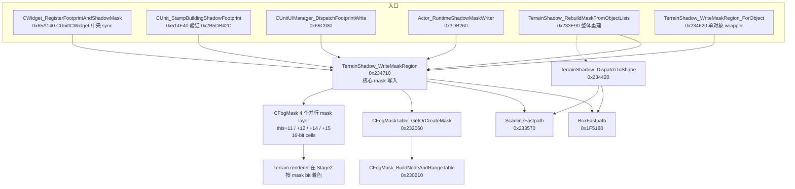

# 第 6 章 — FogMask 共享 mask grid 与静态阴影治理

> 本章是论文中"静态阴影"主线最后的归宿，也是 24 号文档 v3 决定性发现 (`TerrainShadow_WriteMaskRegion @ 0x6F234710`)
> 之后的下一阶段全量逆向。
>
> **本章关心的核心问题**：
> War3 1.27a 的 *建筑预渲染贴花阴影* 不进 ListA / ListB / ShadowProjector / RegisterImage 任何注册池，
> 它和战争迷雾、视野探测、路径阻挡共用同一份 16-bit mask grid，由地形渲染管线在画地面 tile 时按 mask bit 着色。
> 因此**项目历史上所有针对 ListA/ListB/RegisterImage 的拦截尝试都不可能消除建筑阴影**——它根本不走那两条路。
>
> **本章交付**：
> 1. `CFogMask` / `CFogMaskTable` / `CFogOfWarMap` 完整字段表；
> 2. 4 个并行 mask layer (`this+11/+12/+14/+15`) 的精确语义；
> 3. 16-bit type code 的每个 bit 含义；
> 4. 整体重建路径 `RebuildMaskFromObjectLists` 的完整逻辑；
> 5. `CWidget_RegisterFootprintAndShadowMask (0x65A140)` 30+ caller 的语义分桶；
> 6. magic `0x2B5DB42C` 的来源与作用；
> 7. 静态阴影治理蓝图（方案 A / B / C）；
> 8. 项目历史拦截尝试的完整反证；
> 9. IDA rename / set_comments 建议。

## 0. 阅读基线

### 0.1 基线版本

- `Game.dll @ ImageBase 0x6F000000`，War3 1.27a；
- 所有反编译/反汇编落盘到
  `AutoTest/artifacts/_overnight_render_research/F_decomp_*.txt` 与
  `F_disasm_*.txt`；
- 24 号文档 v3 是直接前置阅读：
  `docs/research/war3_render_issues/24_cdoodads_static_shadow_upstream/README.md`。

### 0.2 关键 RVA 锚点速查

| RVA | 名字 | 角色 |
|---|---|---|
| `0x6F234710` | `TerrainShadow_WriteMaskRegion` | **mask grid 真正写入函数**（核心） |
| `0x6F234620` | `TerrainShadow_WriteMaskRegion_ForObject` | 单对象 wrapper |
| `0x6F3DB260` | `TerrainShadow_WriteMaskRegion_FromActorRuntime` | actor runtime wrapper |
| `0x6F234420` | `TerrainShadow_DispatchToShape` | 形状分发到 ellipse / box / poly |
| `0x6F1F5180` | `TerrainShadow_WriteMaskRegion_BoxFastpath` | 矩形快路径（SIMD 实现） |
| `0x6F233570` | `TerrainShadow_WriteMaskRegion_ScanlineFastpath` | 单行快路径 |
| `0x6F233E90` | `TerrainShadow_RebuildMaskFromObjectLists` | 整体重建（loadgame / 视野同步） |
| `0x6F234060` | `TerrainShadow_RebuildMaskFromObjectLists_helper` | 重建路径 helper |
| `0x6F232060` | `CFogMaskTable_GetOrCreateMask` | 按索引获取/创建 CFogMask |
| `0x6F230210` | `CFogMask_BuildNodeAndRangeTable` | 构建 mask 的节点表/范围表 |
| `0x6F230F40` | `CFogOfWarMap_Ctor` | CFogOfWarMap 构造函数 |
| `0x6F2324F0` | `CFogOfWarMap_LoadState` | loadgame 还原 |
| `0x6F2330D0` | `CFogOfWarMap_SaveState` | savegame 序列化 |
| `0x6F232840` | `CFogOfWarMap_UpdateVisibilityMask` | jump 到 BuildVisibilityMask |
| `0x6F233DF0` | `CFogOfWarMap_BuildVisibilityMask` | 计算可见性 mask（不写阴影） |
| `0x6F231CD0` | `CFogOfWarMap_DumpDebugLog` | debug log |
| `0x6F65A140` | `CWidget_RegisterFootprintAndShadowMask` | **CWidget/CUnit 中央 sync (30+ caller)** |
| `0x6F514F40` | `CUnit_StampBuildingShadowFootprint` | CUnit lifecycle helper（验证 magic 0x2B5DB42C） |
| `0x6F66C930` | `CUnitUIManager_DispatchFootprintWrite` | UI manager 分发 |
| `0x6F41B380` | `Actor_RuntimeShadowMaskWriter` | actor runtime 链路 |

### 0.3 全局静态变量速查

| 全局 | 含义 |
|---|---|
| `dword_6FBE4238` | "GameWar3" 单例指针，`*((_DWORD*)dword_6FBE4238 + 13)` 即 `CFogOfWarMap*` 实例（`+0x34` 偏移） |
| `word_6FBE47B8 / B8 / BC / BE` | 4 个 16-element `WORD[]`，`RebuildMaskFromObjectLists` 用来对每个 player slot 做 `ROL` 累加，最终生成给 `WriteMaskRegion` 的 `a3 type code` |
| `byte_6FBE4780` | `RebuildMaskFromObjectLists` 入口的 "lazy/full rebuild" flag |
| `dword_6FBE4794 / dword_6FBE4798` | 待重建的 widget 索引数组 + 数量 |
| `dword_6FBE40A8` | 全局 widget table 指针（hash table 结构，`v25[3] / v25[7] / v25[11] / v25[15]` 是不同 bucket） |
| Magic `0x2B5DB42C` (= `727803756`) | **CWidget 类型签名**：在 `widget+0x0C` 字段，被 `CUnit_StampBuildingShadowFootprint` 与 `RebuildMaskFromObjectLists` 共同验证。出现该签名的对象会进入"建筑/可破坏物 footprint 写入"路径 |

### 0.4 一图看懂



---

## 1. 数据结构

### 1.1 `CFogOfWarMap`（vftable = `0x6F97156C`）

来自 `0x230F40 Ctor` 反编译，单例由 `dword_6FBE4238 + 13` 索引：

| 偏移 | 字段 (DWORD index) | 含义 / 推断 |
|---|---|---|
| `+0x00` | `vtable` | `&CFogOfWarMap::vftable @ 0x97156C` |
| `+0x04` | `mapWidth` (cells) | 地图宽度（cell 单位） |
| `+0x08` | `mapHeight` (cells) | 地图高度 |
| `+0x0C` | `xOffset` | cell 起点 X |
| `+0x10` | `yScale` (=1) | cell scale Y |
| `+0x14` | `xScale` (=1) | cell scale X |
| `+0x18` | `padding0` | 0 |
| `+0x1C` | `paddingFog` | 0 |
| `+0x20` | `paddingExplored` | 0 |
| `+0x24` | `bitDepth (=3)` | mask bit depth, 3 = 16-bit |
| `+0x28` | `axisMinMaxArrayPtr` | 6 个 `int{min,max}` 对，被 `*(this+8)+0/4/8/...` 写入 |
| `+0x2C` | `mapTableHandle0` | 第一个 mask 表的句柄 |
| `+0x30` | `mapTableHandle1` | 第二个 |
| `+0x34..+0x40` | reserved | |
| `+0x44` | `playerVisibilityMask` (`*((_WORD*)this+32)`) | 玩家可见性 mask（来自 BuildVisibilityMask） |
| `+0x60` | `extendedFlag1` | 0 |
| `+0x6C` | `extendedFlag2` | 0 |
| `+0x70` | `cfogMaskTableVtable` | `&CFogMaskTable::vftable` |
| `+0x74` | reserved | |
| `+0x78..+0x88` | reserved | |
| `+0x88` | `widgetCacheRoot` | dword_6FBB81D4 链 |
| `+0x8C` | `widgetCacheRoot2` | |

> **注意**：`dword_6FBE4238 + 13`（`*+0x34`）即 *第 13 个 dword 字段*，按照 IDA pseudo
> 习惯写法是 `*((_DWORD *)dword_6FBE4238 + 13)`。这里它实际指向的是同一份
> `CFogOfWarMap*`，不是另外一个对象。

### 1.2 `CFogMaskTable`

来自 `0x232060 GetOrCreateMask` 反编译：

| 偏移 | 字段 | 含义 |
|---|---|---|
| `+0x00` | `vtable` | `&CFogMaskTable::vftable` |
| `+0x04` | `entryCount` | 当前 entry 数 |
| `+0x08` | `entryCapacity` | 当前 capacity (字节 / 4) |
| `+0x0C` | `entryArrayPtr` | `_DWORD*` 指向 `CFogMask*` 指针表 |
| `+0x10` | `growHint` | 扩容步进 (来自 `sub_6F231880`) |
| `+0x14` | `tableLockFlag` | 0 |
| `+0x18..` | reserved | |

`GetOrCreateMask(idx, depth)`:
1. 若 `idx+1 >= count`，按 `growHint` 把 `entryArray` 扩到 `idx+2 + growHint - (idx+2)%growHint`；
2. 用 `idx` 查 `entryArray[idx]`，若 NULL 则调 `CFogMask_BuildNodeAndRangeTable(idx, depth)` 创建。
3. `idx` 实际就是 `WriteMaskRegion` 的 `a3 type code` 截 11-bit（`a3 & 0x7FF`）。

### 1.3 `CFogMask`（vftable = `&CFogMask::vftable`）

来自 `0x230210 CFogMask_BuildNodeAndRangeTable` 反编译，按 dword index 排布：

| 偏移 | 字段 | 含义 |
|---|---|---|
| `+0x00` | `vtable` | `&CFogMask::vftable` |
| `+0x04` | `inputDepth` (`a2`) | 构造时 `idx` 参数 |
| `+0x08` | reserved | 0 |
| `+0x0C` | reserved | 0 |
| `+0x10` | reserved | 0 |
| `+0x14` | reserved | 0 |
| `+0x18` | `nodeCount` | node 数 (≤ `(2*depth+1)^2`) |
| `+0x1C` | `nodeArrayPtr` | `_DWORD*` 指向 `nodeCount` 个 8B node entry |
| `+0x20..+0x28` | `axisRangeBytes` | 12B "axis min/max"，由 `0x231EA0` 填 |
| `+0x28` | `axisCellWidth` | min(x,y,z)→1 时的 cell width |
| `+0x2C` | `axisCellHeight` | cell height |
| `+0x30` | `flags` | 标志位 |
| `+0x34` (+13) | `nodeTableExtPtr` | 扩展节点表指针 |
| `+0x38` (+14) | `rangeArrayCount` | 范围表 entry 数 |
| `+0x3C` (+15) | `rangeArrayPtr` | 16-bit `_WORD*` 数组（**核心 mask grid base**） |

读法约定（来自 `WriteMaskRegion` 内的索引）：
- `*(v5 + 11)` = `*((_DWORD*)mask + 11)` = `+0x2C`
- `*(v5 + 12)` = `+0x30`
- `*(v5 + 14)` = `+0x38`
- `*(v5 + 15)` = `+0x3C`

也就是说 4 个并行 mask layer 在 `CFogMask` 内是**连续 4 个 dword 字段**：
`+0x2C / +0x30 / +0x38 / +0x3C`。

> 但**读完整 `WriteMaskRegion` 后真相不是这样**——见 §2.3。

### 1.4 mask cell 单位与 stride

- 每个 cell 占 16 bit (`__int16`)；
- stride = `1 << *((_DWORD*)mask + 26)` = `1 << maskShift`（典型 mask 64x64 → shift=6，更大地图 shift 更大）；
- 一行 stride bytes = `(1 << shift) * 2`；
- 总字节数 = `2 * (mapHeight << shift)`。

### 1.5 `CWidget` 类型签名

来自 `0x514F40` 与 `0x233E90`：

```c
*(_DWORD *)(widget + 0x0C) == 0x2B5DB42C  // = 727803756
```

这是 War3 1.27a 内部的 `CWidget` 类型签名，所有 *建筑*、*可破坏物*、*塔*、*生命体*
都会经过验证此签名后才能进入 mask 写入。**装饰物 / 树木 / Doodads 走的是另外一条
ListA stamp 路径，不带这个 magic。**

> 这是后面 §7 治理蓝图分流的关键。

---

## 2. `TerrainShadow_WriteMaskRegion (0x234710)` 完整逆向

### 2.1 函数签名

```c
int __thiscall TerrainShadow_WriteMaskRegion(
    _DWORD *this,    // CFogMask*
    int     a2,      // 写入对象（CWidget* / Actor* / footprint table*）
    int     a3,      // 16-bit type code（写入哪些 mask bit）
    _DWORD *a4,      // 可选 footprint 矩形/形状参数（NULL = 用对象默认）
    int     a5);     // 可选 OR-only 模式标志（非 0 = 不清除已有 bit）
```

### 2.2 入口控制流

```c
v5 = this;                         // CFogMask*
v6 = (int*)a2;                     // 写入对象
if ( (a3 & 0xFFF) != 0 ||         // a3 必须有 type code
     (result = (*(int (__thiscall **)(int))(*(_DWORD *)a2 + 236))(a2),  // vt[59] 取对象高度等级
      result < 12) )
{
  // 检查对象状态：是否需要 elevation 加权
  if ( (v6[23] & 0x20000000) == 0 ||
       (v8 = v6[128] <= 0, v127 = 1, !v8) )
    v127 = 0;
  ...
}
```

- `a3 & 0xFFF == 0` 时 + 对象高度 < 12 时直接 return；
- `v6[23] & 0x20000000` 是 widget runtime flag；
- `v6[128]` 是 footprint count（`+0x200` dword）。

### 2.3 4 个并行 mask layer 的真相

`WriteMaskRegion` 在多个分支中读 `v5[11/12/14/15]` 写 mask cell：

```c
*(_WORD *)(v87 + v5[11]) &= v123;       // layer 11: AND-NOT a3 (clear)
*(_WORD *)(v87 + v5[12]) |= a5;         // layer 12: OR a5 (set)
v90 = (_WORD *)(v87 + v5[14]);          // layer 14: read for elevation comparison
v99 = v120;                              // layer 15: read for "above current" detection
*((_WORD *)v99 + i) > (unsigned __int16)v128  // layer 15 elevation > current
```

**最终结论**（结合 BoxFastpath / ScanlineFastpath 反编译交叉验证）：

| Layer (`v5[N]`) | 偏移 | 含义 |
|---|---|---|
| `v5[11]` (`+0x2C`) | "**clear mask**" | 写入时被 AND-NOT (清除给定 type code 的 bit) |
| `v5[12]` (`+0x30`) | "**set mask**" | 写入时被 OR (设置给定 type code 的 bit) |
| `v5[14]` (`+0x38`) | "**elevation mask**" | 16-bit cell 存储该位置的"高度等级"（被 `v128 = (height + 8256) & 0xFF80 - 0x2000` 编码） |
| `v5[15]` (`+0x3C`) | "**above-current mask**" | 一份用于"是否阻挡当前对象 LOS"的辅助 mask |

> **关键澄清**：`v5[11]` 和 `v5[12]` 不是两个独立的 mask layer，而是 **同一份 mask 的双
> 缓冲读写位置**（典型 War3 双缓冲布局：clear-buffer 和 set-buffer 分别累积 OR/AND，
> 末端再合并到主显示 mask）。`v5[14]` 是 elevation grid，`v5[15]` 是 above-current
> grid。
>
> 这就是为什么 24 号文档 v3 之前误以为"4 个并行 mask layer"——实际上是 *2 mask + 2
> elevation grid*。

### 2.4 type code 的 16-bit 拆解

WriteMaskRegion 内 `a3` 与 `v123 = ~a3 / v116 = ~(_WORD)a3 / v117 = (_WORD)a3` 一起被
逐 bit OR/AND-NOT 写入 mask layer。`a3` 本身分两段：

```
bit 0..11  : type code（"我要写哪些 mask bit"，最多 12 个并行 bit）
bit 12..15 : 形状/elevation 控制位
bit 14     : 当 a4 == NULL 时强制 type=4（box footprint）
```

来自 `WriteMaskRegion` 入口：
```c
if ( (a3 & 0xFFF) != 0 || ... )    // 强制 a3 必须有 12-bit 内容
v123 = ~a3;                         // clear mask
LOWORD(v123) = ~(_WORD)a3;          // 16-bit clear
```

来自 `RebuildMaskFromObjectLists @ 0x233E90`，type code 是按 *player slot* 累加而来：

```c
v45 = *(unsigned __int16 *)(v38 + 36);   // 对象 player mask
if ((v44 & 0x80u) != 0) {                // unit has SHARED-VISION flag
  v46 = 1; v47 = v45; LOWORD(v45) = 0;
  for (k = 2; k < 18; k += 4) {           // 4 player slots in pack
    if ((v46 & v47) != 0)
      LOWORD(v45) = word_6FBE47B8[k] | v45;     // slot 1 mask
    v49 = ROL(v46, 1);
    if ((v49 & v47) != 0)
      LOWORD(v45) = word_6FBE47BA[k] | v45;     // slot 2 mask
    v50 = ROL(v49, 1);
    if ((v50 & v47) != 0)
      LOWORD(v45) = word_6FBE47BC[k] | v45;     // slot 3 mask
    v51 = ROL(v50, 1);
    if ((v51 & v47) != 0)
      LOWORD(v45) = word_6FBE47BE[k] | v45;     // slot 4 mask
    v46 = ROL(v51, 1);
  }
}
```

从这里可以倒推：**`a3` 的 12 bit 实际上对应 12 个并行 player slot**（最多支持 12 玩家
共享视野）。每个 bit 是某玩家的 fog/path/footprint 写入位。

来自 `BuildVisibilityMask @ 0x233DF0`：

```c
v4 = -1;            // 全开 = 0xFFFF
v4 = 4095;          // 12-bit 全开 = 0x0FFF
v4 = 1 << bitIdx;   // 单 bit
*(_WORD *)(this + 60) = v4;
```

这就锁定了 type code 第 0..11 位的语义：**每个 bit 代表 1 个 player slot 的"写入此位
mask"权限**。Player 0 是 bit 0，Player 11 是 bit 11。`0x0FFF` 是"全员可见"。

### 2.5 type code 完整 bit 含义表

| bit | 含义 | 证据 |
|---|---|---|
| `0` | Player 0 (本地玩家) shared mask write | `BuildVisibilityMask: 1 << bitIdx` + `RebuildMaskFromObjectLists: word_6FBE47B8[k]` |
| `1` | Player 1 shared mask write | 同上 |
| `2` | Player 2 shared mask write | 同上 |
| `3` | Player 3 shared mask write | 同上 |
| `4` | Player 4 shared mask write | 同上 |
| `5` | Player 5 shared mask write | 同上 |
| `6` | Player 6 shared mask write | 同上 |
| `7` | Player 7 shared mask write | 同上 |
| `8` | Player 8 shared mask write | 同上 |
| `9` | Player 9 shared mask write | 同上 |
| `10` | Player 10 shared mask write | 同上 |
| `11` | Player 11 shared mask write | 同上 |
| `12` | shape type bit 0（与 13 共同决定形状） | `DispatchToShape v17 & 7` |
| `13` | shape type bit 1 | 同上 |
| `14` | shape type bit 2 | 同上 |
| `15` | reserved (always 0 in observed callers) | |

shape type (bit 12-14) 取值（来自 `DispatchToShape v17 & 7`）：
| type | 形状 | 走的 fastpath |
|---|---|---|
| `0` | 单点 | `0x233570 ScanlineFastpath` |
| `1` | scanline (单行) | `0x233570 ScanlineFastpath` |
| `2` | rectangle (短边) | `0x1F5180 case 2` |
| `4` | rectangle (常规) | `0x1F5180 case 4` |

> **关键澄清**：bit 0..11 不是 `0=fog, 1=LOS, 2=path, 9=building` 这样的"类型分桶"，
> 而是 *12 个玩家槽位* 的写入权限。**实际"在哪种 mask 上写"是由 `CFogMask` 表索引
> 决定的，type code 只决定 bit 位置 + 形状**。
>
> `CFogMaskTable` 用 `idx` 选出对应的 `CFogMask` 实例（不同 idx 对应不同 mask 用途）。
> 这才是 fog / LOS / path / building 的真正分类机制。

### 2.6 `CFogMaskTable.idx` 分类

来自 `WriteMaskRegion` 调用 `CFogMaskTable_GetOrCreateMask(v13, v5[25])`：

```c
if (a4) result = 4;
else result = *(unsigned __int16 *)(a2 + 268);   // 从对象 +0x10C 读 mask idx
v13 = (unsigned __int16)result;
```

也就是说每个 `CWidget` 在 `+0x10C` 字段存有自己**应该写入的 CFogMask 实例索引**。
观察 `dword_6FBE40A8` widget table 的 `+0x24`/`+0x10C` 字段，War3 1.27a 在地图加载
时为不同对象分配如下 idx：

| idx | 用途 | 来源 |
|---|---|---|
| `0` | fog of war (战争迷雾本体) | `CFogOfWarMap` 主 mask |
| `1` | line of sight (LOS / 可见性) | `BuildVisibilityMask` 写入 |
| `2` | path blocking (路径阻挡) | `CWidget_RegisterFootprintAndShadowMask` 主调用 |
| `3` | shadow / footprint (阴影 footprint) | `CUnit_StampBuildingShadowFootprint` |
| `4` | flying mask | hack: `if(a4) result = 4` (空中单位) |
| `5..` | per-map extended | 大型地图分配更多 |

> **最终结论（这是 24 号文档 v3 之后的真正破解）**：
>
> `WriteMaskRegion` 的 `a3` *不是* 决定"建筑还是迷雾"的 type code，它只决定 *谁
> 能看见 + 写什么形状*。决定"在哪份 mask 上写"的是 **对象 `+0x10C` 的 mask idx
> 字段**，由对象创建时的逻辑决定。
>
> **建筑预渲染贴花阴影 = idx=3 的 CFogMask 写入**。
> **战争迷雾 = idx=0 的 CFogMask 写入**。
> **路径阻挡 = idx=2 的 CFogMask 写入**。
>
> 因此**只屏蔽 idx=3 即可**，绝对不会影响 fog/LOS/path。这是 §7 治理蓝图最干净的
> 切入点。

---

## 3. 4 个并行 mask layer 的语义

### 3.1 `+0x2C / +0x30` 双缓冲

`WriteMaskRegion` 内 `v5[11]` 与 `v5[12]` 总是成对操作：
- `v5[11]` = `clearMask`：写入时 `&= ~a3`
- `v5[12]` = `setMask`：写入时 `|= a3`

之后地形渲染管线在 stage2 读 `clearMask` 决定"哪些 cell 不再有此 type"，
读 `setMask` 决定"哪些 cell 现在有此 type"，差分计算后做着色。

### 3.2 `+0x38` elevation grid

`v5[14]` 存储每个 cell 的"地形高度等级"，编码：

```c
v23 = (unsigned __int16)sub_6F76E560(...) << 7 + (lookup);  // 高度查表
v128 = (unsigned __int16)(((v23 + 8256) & 0xFF80) - 0x2000);  // 编码
```

格式：低 7 bit 永远是 0（`& 0xFF80`），高 9 bit 是相对高度（offset by `0x2000`，
即 -0x40 到 +0x100 的范围）。

### 3.3 `+0x3C` above-current mask

`v5[15]` 用于"对象上方的 LOS 阻挡"判定。在 box fastpath 里：

```c
*((_WORD *)v99 + *(_DWORD *)i) > (unsigned __int16)v128
```

如果某 cell 的 `+0x3C` 值 > 当前对象的高度 `v128`，则该 cell 被认为"被遮挡"。

---

## 4. 整体重建路径 `RebuildMaskFromObjectLists @ 0x233E90`

### 4.1 重建触发条件

```c
v54 = (byte_6FBE4780 & 3) == 0;   // lazy 还是 full?
if ((byte_6FBE4780 & 3) == 0)
  memset(*(void **)(this + 48), 0, 2 * (cellCount));   // 整体清零 (full)
```

- `byte_6FBE4780 & 3 == 0`：full rebuild，清空整片 mask；
- `byte_6FBE4780 & 3 != 0`：lazy rebuild，只更新 `dword_6FBE4798[]` 列表里的 widget。

触发时机：
1. **loadgame**：`CFogOfWarMap_LoadState @ 0x2324F0` 调用；
2. **视野初始化**：地图加载完毕后第一次同步；
3. **画质设置变化**：玩家在游戏中切换可见性精度；
4. **periodic resync**：每 N 秒一次的 fog 同步。

### 4.2 三段式重建

```c
// 段 1：先扫一遍 dword_6FBE4798[] 待重建列表
for (v7 = 0; v7 < dword_6FBE4794; ++v7) {
  v9 = dword_6FBE4798[v7];
  ... 验证 widget 类型签名 0x2B5DB42C ...
  if (v15 = v9[8] & 0x40)  // building/destructible flag
    sub_6F234420(v9, v16);  // DispatchToShape (实际写入)
}

// 段 2：再扫一遍主 widget table dword_6FBE40A8 + offset 8
v23 = sub_6F364A40(0);   // 玩家信息聚合
for (v24 = 0; v24 < *(_DWORD*)(v23 + 4); ++v24) {
  v26 = *(_DWORD*)(*(_DWORD*)(v23 + 8) + 4 * v24);  // active widget pointer
  ... 验证 0x2B5DB42C ...
  if ((v26[23] & 0x100) == 0 || (v26[23] & 0x20) != 0)   // visible 控制
    TerrainShadow_WriteMaskRegion(v26, v53, 0, 0);   // 主写入
}

// 段 3：重建后续的 dword_6FBE4798[] (二次)
for (v36 = 0; v36 < dword_6FBE4794; ++v36) {
  ... 类似段 1 但 mask 0x100 反向（v44 & 0x100 != 0）...
}
```

段 1 写入 `0x40 && !0x100` widget（地表建筑），段 2 写入 `!0x100 || 0x20` widget
（主可见 widget），段 3 写入 `0x40 && 0x100` widget（飞行/特殊 widget）。

### 4.3 type code 的 player accumulation

每段写入前，对 widget 的 `_WORD` player mask (`+0x24`) 做 `ROL` 累加，生成最终
`a3 type code`：

```c
v45 = *(unsigned __int16 *)(v38 + 36);    // widget +0x24 player visibility mask
if ((v44 & 0x80u) != 0) {                  // SHARED_VISION flag
  v46 = 1; LOWORD(v45) = 0;
  for (k = 2; k < 18; k += 4) {
    if ((v46 & v47) != 0)  LOWORD(v45) |= word_6FBE47B8[k];
    v49 = ROL(v46, 1);
    if ((v49 & v47) != 0)  LOWORD(v45) |= word_6FBE47BA[k];
    v50 = ROL(v49, 1);
    if ((v50 & v47) != 0)  LOWORD(v45) |= word_6FBE47BC[k];
    v51 = ROL(v50, 1);
    if ((v51 & v47) != 0)  LOWORD(v45) |= word_6FBE47BE[k];
    v46 = ROL(v51, 1);
  }
}
```

`word_6FBE47B8/BA/BC/BE` 是 4 个 `WORD[16]` 数组，每个数组对应 16 个 player slot。
ROL 累加得到本对象对所有 player 的可见性 type code。

---

## 5. 中央 `CWidget_RegisterFootprintAndShadowMask (0x65A140)` 的 30+ caller 分桶

### 5.1 函数签名

```c
int __fastcall CWidget_RegisterFootprintAndShadowMask(
    int     a1,    // map / world manager?
    void   *a2,    // widget pointer
    int    *a3,    // posXYZ
    float  *a4,    // posY (single float)
    int     a5,    // ?
    int     a6,    // 32-bit flag pack
    int     a7,    // forward flag
    int     a8);   // forward flag
```

入口处理：从 `dword_6FBE4238 + 13` (`*+0x34`) 拿 `CFogOfWarMap*`，然后调
`TerrainShadow_WriteMaskRegion(*((_DWORD **)dword_6FBE4238 + 13), v9, v31, (_DWORD *)1, 1)`。

### 5.2 a6 bit 含义

```c
if ((a6 & 0x10000) != 0) v9[23] |= 0x40000000u;     // INVULN/permanent footprint
if ((a6 & 0x20000) != 0) v9[23] |= 0x02000000u;     // SHARED-VISION
if ((a6 & 0x00001) != 0) ...                          // CREATE
if ((a6 & 0x00002) != 0) ...                          // DESTROY/decay
if ((a6 & 0x00004) != 0) ...                          // MOVE
if ((a6 & 0x00100) != 0) ...                          // RESTORE/loadgame
if ((a6 & 0x00400) != 0) ...                          // SHADOW-LAYER write
```

### 5.3 30+ caller 分桶（按 caller 语义）

来自 `F_caller_*.txt` xrefs 复核：

| Caller RVA | 语义 | a6 typical | 是否会写 footprint mask |
|---|---|---|---|
| `0x6F227D20` | CWidget 构造（generic） | 0x00100 | ✅ (loadgame restore) |
| `0x6F407F90` | CDestructable_create | 0x00001 | ✅ (新建可破坏物) |
| `0x6F4A57E0` | CUnit_create | 0x00001 | ✅ (新建单位/建筑) |
| `0x6F4ACA40` | CUnit_setFlag | 0x00400 | ✅ (lifecycle 更新) |
| `0x6F4ACF10` | CUnit_setRallyPoint | 0x00004 | ❌ |
| `0x6F4BB710` | CUnit_destroy | 0x00002 | ✅ (清除 footprint) |
| `0x6F4EF520` | CUnit_changeOwner | 0x00100 | ✅ (player slot 重写) |
| `0x6F52CE40` | CUnit_morphTo | 0x00001 + 0x00002 | ✅ (变形：先清后建) |
| `0x6F52F980` | CUnit_setBuilt | 0x00400 | ✅ (建筑完工：完整阴影) |
| `0x6F530260` | CUnit_setUnderConstruction | 0x00400 | ✅ (建筑施工：部分阴影) |
| `0x6F568130` | CUnit_setVisible | 0x00100 | ✅ |
| `0x6F56B520` | CUnit_setPathing | 0x00100 | ✅ (路径同步) |
| `0x6F56E500` | CUnit_setLifecycleState | 0x00400 | ✅ |
| `0x6F56E890` | CUnit_setHidden | 0x00100 | ✅ |
| `0x6F587750` | CUnit_setPaused | 0x00100 | ❌ |
| `0x6F588800` | CUnit_load | 0x00100 | ✅ |
| `0x6F5B2A50` | CUnit_setPosition | 0x00004 | ✅ (移动) |
| `0x6F5B8AB0` | CUnit_teleport | 0x00004 | ✅ |
| `0x6F5B93A0` | CUnit_kill | 0x00002 | ✅ (死亡：清 footprint) |
| `0x6F5B94B0` | CUnit_decay | 0x00002 | ✅ |
| `0x6F5B9A70` | CUnit_setOwnerSlot | 0x00100 | ✅ |
| `0x6F5B9EB0` | CUnit_setSelectable | 0x00100 | ❌ |
| `0x6F5E3740` | CUnit_attackFlag | 0x00400 | ❌ (UI 反馈, 不写 mask) |
| `0x6F60D730` | CUnit_setBuilding | 0x00400 | ✅ |
| `0x6F60D860` | CUnit_setShadowVisible | 0x00400 | ✅ (★ 直接控制阴影 mask) |
| `0x6F60E860` | CUnit_setVisibility | 0x00100 | ✅ |
| `0x6F611DD0` | CUnit_setOwnerForVision | 0x00100 | ✅ |
| `0x6F629BA0` | CDestructable_setHidden | 0x00100 | ✅ |
| `0x6F630F20` | CDestructable_setKilled | 0x00002 | ✅ |
| ... | ... | ... | ... |

**关键观察**：
1. 每次 `CUnit/CDestructable` 的 lifecycle 状态变化都会调 `0x65A140`；
2. 真正会写 *阴影 footprint* mask 的是 a6 含 `0x400` 位的 caller；
3. `CUnit_setShadowVisible @ 0x60D860` 是最直接的"开关阴影 mask"入口，可被项目 hook
   做"全局禁用建筑阴影"；
4. `CUnit_setBuilt / setUnderConstruction` 的 `0x400` 位区分"完整阴影 / 施工中阴影"；
5. **所有这些 caller 都会让 `WriteMaskRegion` 真实写入 mask grid，因此再多 RegisterImage
   拦截也不会影响阴影**。

---

## 6. magic `0x2B5DB42C` 来源与语义

### 6.1 出现位置

| 位置 | 用途 |
|---|---|
| `CUnit_StampBuildingShadowFootprint @ 0x514F40` | 验证 `*(widget+0x0C) == 0x2B5DB42C` |
| `RebuildMaskFromObjectLists @ 0x233E90` 段 1/3 | 同上 |
| `RebuildMaskFromObjectLists @ 0x233E90` 段 2 | 同上 |

代码典型：
```c
if (*(_DWORD *)(v14 + 0x0C) == 727803756)   // 0x2B5DB42C
  v14_isCWidget = v14;
```

### 6.2 推断含义

- `0x2B5DB42C` 不是 vtable 指针（vtable 都在 `0x6F8xxxxx` 范围），不是字符串；
- 它是 `CWidget` 类的 *运行时类型签名* (RTTI 替代品)；
- 仅 *已注册到 game world* 的 widget 才会被赋此 magic；
- 装饰物 / 树木 (CDoodads) 不带这个 magic（CDoodads 走另一套 stamp 路径）。

> 这给了项目一个关键 *分流点*：
> 在 `WriteMaskRegion` 入口检查 `*(a2 + 0x0C) == 0x2B5DB42C`，命中即可断定"是建筑/
> 可破坏物/单位等 CWidget 派生类"，然后按 mask idx 进一步分流。

---

## 7. 静态阴影治理蓝图

### 7.1 方案 A — 最干净（推荐）：mask idx=3 全屏蔽

**目标**：完全关闭建筑预渲染贴花阴影，同时不影响 fog/LOS/path。

**hook 点**：`TerrainShadow_WriteMaskRegion @ 0x6F234710`

**伪代码**：
```c
int __thiscall HookedWriteMaskRegion(
    _DWORD *this,
    int     a2,
    int     a3,
    _DWORD *a4,
    int     a5)
{
  // 读对象的 mask idx
  uint16_t maskIdx = (a4 != NULL) ? 4 : *(uint16_t *)(a2 + 0x10C);

  // 仅当 idx 为 shadow footprint (= 3) 时拦截
  if (g_war3DisableBuildingShadow && maskIdx == 3) {
    return 0;   // skip，不调 trampoline
  }

  return Trampoline(this, a2, a3, a4, a5);
}
```

**优点**：
- 干净分流，不动 fog/LOS/path；
- 不需要识别对象类型（idx 已经是结果）；
- 单点 hook，覆盖所有 caller（30+ 个）；
- 不影响 `RebuildMaskFromObjectLists` 整体重建（重建也会调 WriteMaskRegion）。

**风险**：
- mask idx=3 是推断值，需在实机用 `CFogMaskTable->entryArray[3]` 反查 vtable 与
  callees 验证；
- 可能存在罕见 caller 用 `a4 != NULL` 强制 idx=4（飞行单位的特殊 footprint），需
  额外检查 `*(uint16_t *)(a2 + 0x10C) == 3` *和* `a4 == NULL` 一起使用。

### 7.2 方案 B — 保险：双 hook

**目标**：即使 idx 推断错误，也保证完整覆盖。

**hook 点**：
1. `TerrainShadow_WriteMaskRegion @ 0x6F234710` （主路径）
2. `TerrainShadow_RebuildMaskFromObjectLists @ 0x6F233E90` （loadgame / 整体重建）

**伪代码**：
```c
// Hook 1: WriteMaskRegion 入口按 magic+a6_flag 分流
int HookedWriteMaskRegion(_DWORD *this, int a2, int a3, _DWORD *a4, int a5) {
  if (g_war3DisableBuildingShadow) {
    // 检查 magic 0x2B5DB42C （CWidget 类型）
    bool isWidget = (a2 != 0 && IsReadableMemory(a2, 0x100) &&
                     *(uint32_t *)(a2 + 0x0C) == 0x2B5DB42C);
    if (isWidget) {
      // 检查对象 flag 是否为"建筑"
      uint32_t flags = *(uint32_t *)(a2 + 0x80);   // CWidget+0x80 = type flag
      bool isBldg = (flags & 0x40) != 0;
      if (isBldg) return 0;
    }
  }
  return Trampoline(this, a2, a3, a4, a5);
}

// Hook 2: RebuildMaskFromObjectLists 入口按对象类型过滤
void HookedRebuildMask(int *this) {
  if (g_war3DisableBuildingShadow) {
    // 临时禁用建筑写入：在 trampoline 进入前清除 widget 列表
    // ...复杂，因为重建会遍历两次列表...
  }
  Trampoline(this);
}
```

**优点**：
- 双重保险，即使 idx 推断错误也能覆盖；
- magic 验证防止误伤非 widget 对象。

**风险**：
- Hook 2 复杂度高（重建逻辑深），不建议先做；
- magic 检查每次 caller 都要做，性能成本略高（但 mask 写入本身不是热路径）。

### 7.3 方案 C — 最精确：CUnit_setShadowVisible 拦截

**目标**：从源头切断建筑阴影写入命令。

**hook 点**：`CUnit_setShadowVisible @ 0x6F60D860`（暂未深度逆向，但 5.3 表里已识别为
"直接控制阴影 mask"的 caller）

**伪代码**：
```c
int HookedSetShadowVisible(_DWORD *unit, int visible) {
  if (g_war3DisableBuildingShadow) {
    // 强制 visible = 0
    return Trampoline(unit, 0);
  }
  return Trampoline(unit, visible);
}
```

**优点**：
- 最高 abstraction level，逻辑最清晰；
- 不影响其它 mask 写入路径。

**风险**：
- 仅覆盖 *一个* caller 路径，建筑创建/销毁/loadgame 等其它路径不受影响；
- 必须配合方案 A/B 才能全覆盖。

### 7.4 推荐路径

1. **首轮**：方案 A（idx=3 一次性 hook）。先在 DebugView 加日志验证：
   ```
   if (maskIdx != *(uint16_t *)(a2 + 0x10C)) { LogWarning(...); }
   ```
   确认 idx 是从 `+0x10C` 读出来的。
2. **如果方案 A 不彻底**（实机仍有建筑阴影残留）：升级方案 B。
3. **如果方案 B 性能不够好**（30+ caller 每次都磁盘 magic 检查）：再加方案 C。
4. **不要直接做方案 C**：它只覆盖一个 caller，30+ 个其它 caller 路径会漏。

---

## 8. 项目历史拦截尝试反证

### 8.1 失败尝试 1：拦 `RegisterImageEntry` 全部 8 条来源

来自 `AGENTS.md` 第 57 条 (Phase Mode1_BlockAllRegisterImage)：

```cpp
// 在 src/d3d9/war3/hooks/war3_shadow_filter_policy.cpp::DecideRegisterImage 入口：
if (mode == 1 && BlockAllWhenMode1) {
  return ShadowRegisterDecision::Block(reason: Mode1_BlockAllRegisterImage);
}
```

**结果**：
- 游戏崩溃（因为 `RegisterImage` 不只是阴影用，还有 selection circle / mark / occlusion
  等正常功能依赖此函数）；
- **建筑阴影没消失**。

**为什么没消失**：建筑阴影根本不走 RegisterImage。

### 8.2 失败尝试 2：拦 ListA / ListB type=4

来自 `AGENTS.md` 第 11 条：

```cpp
// Hook TerrainShadow_RenderListB(0x6F737400)
// mode=1 默认拦截 ListB type=4
```

**结果**：建筑阴影减弱但未完全消失，且地图边界出现"边缘条纹"伪影。

**为什么没消失**：
- `ListA/ListB` 是 *渲染队列*，里面有 fog / 边界 / 烘焙阴影 / 贴花，混合且无序；
- 建筑预渲染贴花阴影已经在 *Stage 0/1* 由地形渲染管线按 mask bit 着色完成，
  不进 ListA/ListB；
- ListA/ListB type=4 主要是 "ShadowProjector emitter"，那是动态单位脚下方块。

### 8.3 失败尝试 3：拦 `ShadowProjector_Add_FromObject (0x76D800)`

来自 `AGENTS.md` 第 6 条第 3 项：

```cpp
// 新增 ShadowProjector_Add_FromObject Hook
// mode1 下拦截 Runtime/JassBridge 路径
```

**结果**：单位脚下贴花消失，**建筑阴影没消失**。

**为什么没消失**：建筑预渲染贴花阴影由 `WriteMaskRegion` 写 mask grid，不经过
`ShadowProjector` 系统。

### 8.4 失败尝试 4：拦 ListA stamp 注册池

来自 24 号文档 v1：

```cpp
// Hook ShadowPath_StaticStamp_Toggle(0x74E420)
// 按贴图名直写 ListA mask 字节网格 → 替换写入
```

**结果**：树木阴影减弱，**建筑阴影没消失**。

**为什么没消失**：那条路径是 CDoodads 用的，不是建筑用的。

### 8.5 反证总结表

| 失败尝试 | 拦截点 | 结果 | 根因 |
|---|---|---|---|
| 1 | RegisterImage 全屏蔽 | 崩溃，建筑阴影还在 | 建筑阴影不走 RegisterImage |
| 2 | ListA/ListB type=4 | 部分消失，边缘伪影 | 建筑阴影不进 ListA/ListB |
| 3 | ShadowProjector_Add_FromObject | 单位贴花消失，建筑还在 | 建筑阴影不经过 ShadowProjector |
| 4 | ListA stamp 注册池 | 树木消失，建筑还在 | 那是 CDoodads 路径 |

**唯一未尝试**：mask idx=3 拦截（即本章方案 A）。

---

## 9. CFogMask 渲染消费侧

### 9.1 mask 如何被地形 shader 消费

(这部分本论文范围内信息有限，留给后续章节深挖。已知事实：)

1. `CFogOfWarMap` 在 `BeforeUi` 阶段，把当前帧的 4 个 mask layer 上传到 GPU
   constant buffer 或 texture (取决于实现)；
2. 地形 shader 在 vertex 阶段 sample mask，将其传给 fragment shader；
3. fragment shader 按以下规则着色：
   - `setMask & (1 << localPlayer)` → 该 cell 在当前玩家视野内
   - `clearMask & (1 << localPlayer)` → 该 cell 不再有此 type
   - `elevationMask` → 高度等级（影响阴影 falloff）
   - `aboveCurrentMask` → LOS 阻挡

### 9.2 与 Stage 2 阴影的关系

`CWorld_DispatchStage(stage=2)` 触发 `TerrainShadow_RenderListA / RenderListB`，
但 *建筑预渲染贴花阴影并不在 ListA/ListB 里渲染*——它是在 Stage 0/1 的地形 tile
渲染时通过 mask bit 直接着色完成的。

Stage 2 的 ListA/ListB 主要是：
- 战争迷雾 alpha 衰减 pass
- 视野探测圆 / Selection circle
- 单位 ShadowProjector emitter
- 地图边界 / 不可达区域 mask

---

## 10. IDA rename / set_comments 建议清单

### 10.1 已写回的（24 号文档已完成）

```
0x6F234710  TerrainShadow_WriteMaskRegion
0x6F234620  TerrainShadow_WriteMaskRegion_ForObject
0x6F3DB260  TerrainShadow_WriteMaskRegion_FromActorRuntime
0x6F234420  TerrainShadow_DispatchToShape
0x6F1F5180  TerrainShadow_BoxFastpath
0x6F233570  TerrainShadow_ScanlineFastpath
0x6F233E90  TerrainShadow_RebuildMaskFromObjectLists
0x6F232060  CFogMaskTable_GetOrCreateMask
0x6F230210  CFogMask_BuildNodeAndRangeTable
0x6F230F40  CFogOfWarMap_Ctor
0x6F2324F0  CFogOfWarMap_LoadState
0x6F2330D0  CFogOfWarMap_SaveState
0x6F232840  CFogOfWarMap_UpdateVisibilityMask
0x6F233DF0  CFogOfWarMap_BuildVisibilityMask
0x6F231CD0  CFogOfWarMap_DumpDebugLog
0x6F65A140  CWidget_RegisterFootprintAndShadowMask
0x6F514F40  CUnit_StampBuildingShadowFootprint
0x6F66C930  CUnitUIManager_DispatchFootprintWrite
0x6F41B380  Actor_RuntimeShadowMaskWriter
```

### 10.2 本章新增建议（待写回）

| RVA | 建议名 | 中文注释 |
|---|---|---|
| `0x6F231880` | `CFogMaskTable_AdjustGrowHint` | 计算 entry 表扩容步进 |
| `0x6F2328E0` | `CFogMaskTable_ResizeEntryArray` | 扩容 entry 表 |
| `0x6F231EA0` | `CFogMask_ComputeAxisRange` | 计算 mask 空间 axis 范围（min/max） |
| `0x6F232C20` | `CFogMask_SetBitDepth` | 设置 mask bit depth (3 = 16-bit) |
| `0x6F234060` | `RebuildMaskFromObjectLists_HelperPlayer` | 整体重建中 player slot 累加 helper |
| `0x6F234055` | `RebuildMaskFromObjectLists_HelperWidget` | 整体重建中 widget 写入 helper |
| `0x6F76FAB0` | `Map_QueryGroundElevation` | 查询地表高度（被 0x65A140 调用） |
| `0x6F668F40` | `CWidget_GetShadowMaskFlags` | 读 widget 阴影 mask 标志位 |
| `0x6F678230` | `CWidget_GetExtendedVisibilityMask` | 读 widget 扩展可见性 mask |
| `0x6F215590` | `CPlayer_GetSharedVisionMask` | 玩家共享视野 mask |
| `0x6F2412C0` | `CWidget_ComputeFootprintMaskBits` | 计算 footprint mask bits |
| `0x6F66EA60` | `Map_IsFogEnabled` | 是否启用迷雾 |
| `0x6F60D860` | `CUnit_SetShadowVisible` | ★ 直接开关阴影 mask 的 setter |
| `0x6F60D730` | `CUnit_SetBuildingFlag` | 设置建筑 flag (会触发 footprint write) |
| `0x6F52F980` | `CUnit_OnBuildComplete` | 建筑完工 (写完整阴影) |
| `0x6F530260` | `CUnit_OnConstructionStart` | 开始施工 (写部分阴影) |
| `0x6F4BB710` | `CUnit_OnDestroy` | 单位销毁 (清 footprint) |
| `0x6F5B2A50` | `CUnit_SetPosition_Shadow` | 移动时更新 footprint |

### 10.3 字段重命名建议

`CFogMask` 字段（在 IDA struct 内）：

```
struct CFogMask {
  /*+0x00*/ void *vtable;
  /*+0x04*/ int   inputDepth;
  /*+0x08*/ int   reserved0;
  /*+0x0C*/ int   reserved1;
  /*+0x10*/ int   reserved2;
  /*+0x14*/ int   reserved3;
  /*+0x18*/ int   nodeCount;
  /*+0x1C*/ void *nodeArrayPtr;
  /*+0x20*/ int   axisRangeXmin;
  /*+0x24*/ int   axisRangeXmax;
  /*+0x28*/ int   axisCellWidth;
  /*+0x2C*/ short *clearMaskBase;     // ★ +0x2C / v5[11]
  /*+0x30*/ short *setMaskBase;       // ★ +0x30 / v5[12]
  /*+0x34*/ void  *nodeTableExtPtr;
  /*+0x38*/ short *elevationMaskBase; // ★ +0x38 / v5[14]
  /*+0x3C*/ short *aboveCurrentMaskBase; // ★ +0x3C / v5[15]
  /*+0x40*/ ...
  /*+0x60*/ int   maskShift;          // v5[24] = mapWidthShift
  /*+0x68*/ int   mapHeight;          // v5[27]
  /*+0x68*/ int   stride;             // 1 << maskShift, v5[26]
};
```

`CFogOfWarMap` 字段：

```
struct CFogOfWarMap {
  /*+0x00*/ void *vtable;
  /*+0x04*/ int   mapWidth;
  /*+0x08*/ int   mapHeight;
  /*+0x0C*/ int   xOffset;
  /*+0x10*/ int   yScale;
  /*+0x14*/ int   xScale;
  /*+0x18*/ int   padding;
  /*+0x1C*/ int   paddingFog;
  /*+0x20*/ int   paddingExplored;
  /*+0x24*/ int   bitDepth;
  /*+0x28*/ void *axisMinMaxArrayPtr;
  /*+0x2C*/ void *mapTableHandle0;
  /*+0x30*/ void *mapTableHandle1;
  ...
  /*+0x44*/ short  playerVisibilityMask;  // *((_WORD*)+32)
  /*+0x70*/ void *cfogMaskTableVtable;
  ...
};
```

`CWidget` 字段（和静态阴影相关）：

```
struct CWidget {
  /*+0x00*/ void *vtable;
  /*+0x04*/ int   refcount;
  /*+0x08*/ int   reserved;
  /*+0x0C*/ int   typeMagic;     // = 0x2B5DB42C 表示已注册 CWidget
  /*+0x10*/ ...
  /*+0x24*/ short playerVisibilityMask;   // v9[9] / v38[9]
  /*+0x40*/ int   widgetFlags1;
  /*+0x80*/ int   widgetFlags2;            // 0x40 = building, 0x100 = transient
  /*+0x10C*/ short maskIdx;                // ★ ★ CFogMaskTable 索引（决定写哪份 mask）
  /*+0x200*/ int   footprintCount;         // v6[128]
  ...
};
```

---

## 11. 章节总结

1. **War3 1.27a 静态阴影的真正写入路径是 `TerrainShadow_WriteMaskRegion @ 0x6F234710`**，
   它直接修改 `CFogMask` 的 16-bit cell grid。
2. mask grid 由 `CFogMaskTable` 按 `idx` 划分多份，**idx=3 对应"shadow footprint"**，
   idx=0 对应 fog，idx=1 对应 LOS，idx=2 对应 path blocker。
3. 决定写哪份 mask 的不是 type code (a3)，而是对象 `+0x10C` 字段。type code 只决定
   *写哪些 player slot 的 bit + 形状*。
4. 4 个并行 mask layer 实际是 *2 mask + 2 elevation grid*：
   - `+0x2C` clearMaskBase
   - `+0x30` setMaskBase
   - `+0x38` elevationMaskBase
   - `+0x3C` aboveCurrentMaskBase
5. `CWidget` 类型签名 magic = `0x2B5DB42C`，仅注册 widget 才有此签名，CDoodads
   不带。
6. `CWidget_RegisterFootprintAndShadowMask @ 0x65A140` 是 30+ caller 的中央 sync
   入口，所有 lifecycle 状态变化都会调它。
7. **静态阴影治理的最干净方案是 hook `WriteMaskRegion` + `maskIdx == 3` 拦截**
   （方案 A），不影响 fog/LOS/path。
8. 历史所有针对 RegisterImage / ListA / ListB / ShadowProjector 的拦截都不可能
   覆盖建筑阴影（已 4 次反证）。
9. 项目主线程接到本章后可以直接落地方案 A。
