# RB 运行时高层拦截与渲染接管计划 (RB High-Level Interception Plan)

> 目标：摆脱末端 VB/IB 拦截与对 DX9EX 的强依赖，在 JASS ReturnBug 注入后，利用原生 Quadtree 剔除阶段作为 Hook 锚点，实现高层语义数据的拦截与双端（逻辑层-渲染层）标记相认策略。

## 1. 核心挑战与重构背景
目前项目在渲染层末端截获 D3D Draw Call，利用快照/回溯的黑盒方式猜测渲染对象。其缺陷在于：
1. **强依赖后端图形 API (DX9Ex)**，导致无法纯净地融入原版渲染闭环。
2. 缺乏对象高级语义，处理动态/特效穿插极为棘手。
3. **RB 注入机制** 虽然使我们能够在 JASS VM 准备完毕后运行自定义装载逻辑，但若强用末端拦截策略，DX9EX 无法在 RB 极晚执行的安全边界内存活。

**解决方向：“高层阶段拦截” + “双向标记相认”**

## 2. 完整时序：MainLoop 到 CWorld_RenderScene

原版渲染的主力驱动线如下。在执行真正的 Draw Call 前，War3 原本就需要经历完整的可见性计算。

```mermaid
sequenceDiagram
  autonumber
  participant ML as War3_MainLoop (0x6F05F710)
  participant ED as EventDispatch (0x6F05A310)
  participant UI as CGameUI / Engine Tick
  participant WF as CWorldFrameWar3
  participant QT as QuadTree / Culling (视锥剔除)
  participant WL as WorldObjectGroup<br/>(+0x16C/0x170/0x174)
  participant RS as CWorld_RenderScene<br/>(0x6F3681C0)
  participant RQ as RenderQueue_AddBatch<br/>(0x6F139190)
  
  ML->>ED: Storm_EventGate 处理事件 (MainLoop_MessagePump)
  ED->>UI: Dispatch 触发引擎帧逻辑 / 渲染更新
  UI->>WF: vtable[11] CWorldFrameWar3_Update... (0x6F368480)
  
  rect rgb(40, 40, 60)
  Note over WF, WL: 【拦截阶段 1】：在此处实施 RB Hook
  WF->>QT: 遍历四叉树 / Screen Grid 解析可见实体
  QT->>QT: 视锥剔除 (AABB Frustum Culling)
  QT->>WL: 将可见对象追加到 WorldObject List 0/1/2 
  Note right of QT: [高层 Hook 点]：记录落选表的对象身份，<br/>在自定义缓冲中追加 UUID 标记或 Tag。
  end

  WF-->>UI: 帧更新与收集就绪
  
  rect rgb(60, 40, 40)
  Note over UI, RQ: 【拦截阶段 2】：渲染层标记回收与定向加速 
  UI->>WF: vtable[12] CWorld_RenderScene (0x6F3681C0)
  WF->>RS: 引发 Stage 11 / 12 / 13 调度
  RS->>WL: 遍历 List 0/1/2 内部实体
  WL->>RQ: 提交 RenderBatch_Submit (0x6F1375C0)
  Note right of RQ: [渲染 Hook 点]：检测到带我方标记的指针，<br/>直接调取高层提取的语义缓冲（矩阵/姿态），<br/>略过原生昂贵提交，使用硬件快速绘制。
  end
```

## 3. 详细 Hook 策略与实施方案

### 3.1 第一目标：定位并 Hook List_AddTail
在 `CWorldFrameWar3_UpdateWorldFrameAndPreparePasses (0x6F368480)` 调用的子图内，所有由 Quadtree/Frustum 过滤的实体最终会附加到 `CWorldFrameWar3` 偏移 `0x16C`, `0x170`, `0x174` 的链表中。

**操作计划：**
- 逆向确认在 UpdateWorldFrame 流程中调用 `List_AddTail` 填入 `WorldObjectGroup` 的地方。
- **Hook 逻辑：**
  当 War3 向这三个可见列表写入对象指针时，我们也同步捕获该对象的 `CModelInstance` 或 `CSprite` 指针。
  - 为它们生成本次渲染的 Session ID。
  - **打标记（Tagging）：** 我们可以在对象的 padding 留空处，或者利用一个高效的并行 Hashmap 记录 `Pointer -> ObjectMetaData` 的映射。

### 3.2 第二目标：Render Scene 消费侧跳跃
由于不需要猜数据了，我们不需要拦截 `VB/IB`。我们转而从收集端发力：

**操作计划：**
- Hook `CWorld_WorldObjects_RenderGroup (0x6F368E30)` 或 `RenderBatch_Submit (0x6F1375C0)`。
- **Hook 逻辑：**
  1. 当引擎尝试提交某个 Node 时，我们在并行 Hashmap 里反查这个指针。
  2. 如果映射被找到（意味着我们在第一步已知它是啥），我们可以 **阻止** 其下落并解析至 War3 软骨骼矩阵分配里。
  3. 转而向我们的新渲染管线提交一个硬件 Instancing / Compute Shader Command，使用我们在 Quadtree 时期收集好的骨骼和坐标。
  4. 对不需要替换渲染的背景或地形，原样放行，保留其 DX9 原始提交。

## 4. “双向标记相认”的闭环效果
1. **告别 EX 依赖：** 既然不需要读取硬件层的帧快照数据，也就完全不在乎 DX9 还是 DX9EX。我们在内存操作指针地址，一切顺理成章，ReturnBug 注射器可以直接加载并激活该管道。
2. **零黑盒猜测：** 在四叉树剔除结束之后，我们要渲染的东西 100% 都是逻辑层刚刚塞入链表的，可以直接抽取出正确的 Mesh、Scale 和 Animation Track。渲染时只相当于取回预存指令，不再有 Z-Order / Mask 黑盒计算造成的闪烁和错误。
3. **消除 CPU 瓶颈：** `RenderQueue_FlushAndReset` 大量的 CPU 操作因为被我们从 `AddBatch` 提前 Bypass 掉，War3 自身的 Draw 派发循环被空置，这会产生极为惊人的帧数提升。

## 5. 行动阶段
- [ ] **Phase 1: IDA 静态确认：** 定位 `sub_6F368480` 内部的 Quadtree Culling 和 向 `0x16C` (List0), `0x170` (List1), `0x174` (List2) 写入的精确位置。
- [ ] **Phase 2: 并行记录表实现：** 实现一个高吞吐的 HashTable 或并查集，在 RB 晚期注入后监听 List Append 事件。
- [ ] **Phase 3: Dispatch Bypass 测试：** 拦截 `RenderBatch_Submit`，遇到查表命中的实体直接 Return，并在画面上确认该实体成功“消失”（表明被截流）。
- [ ] **Phase 4: 硬件渲染转发：** 真正将截获的实体抛到我们独立的 Command Buffer 进行实例化绘制。
