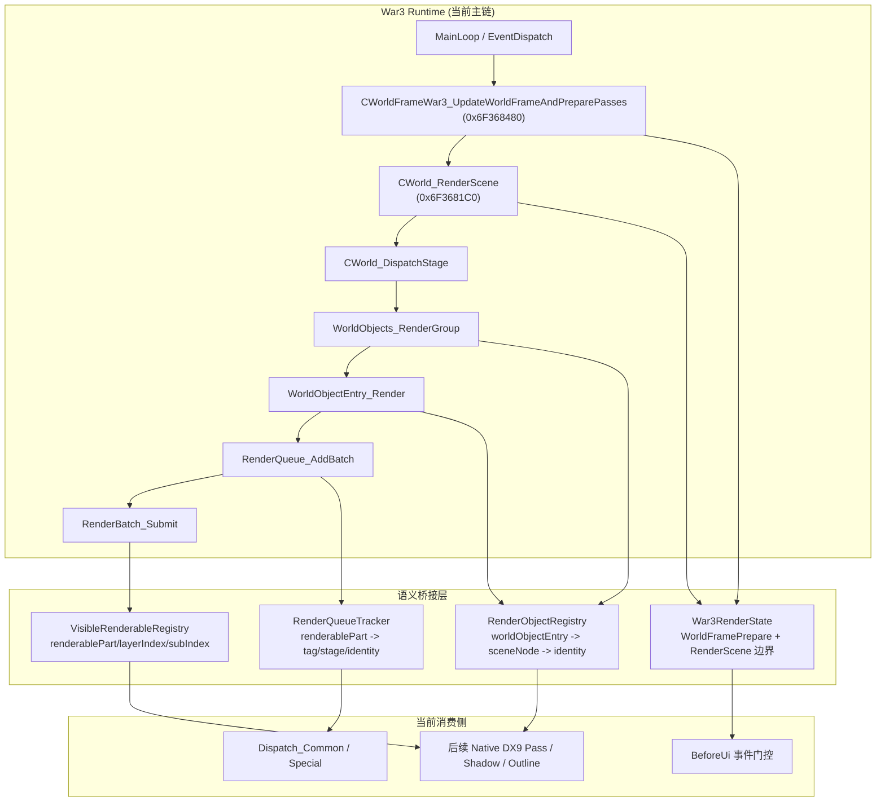
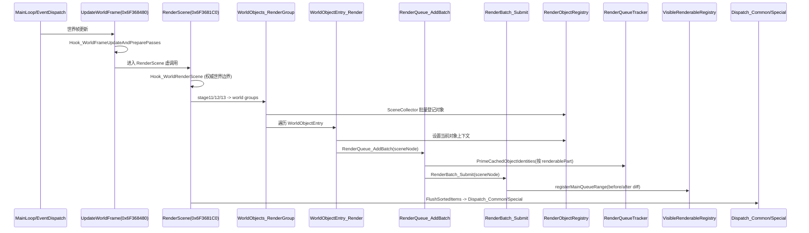
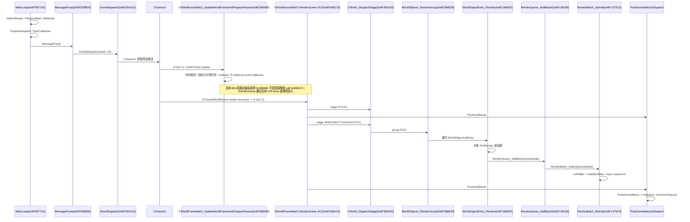

# RB 运行时 Hook 迁移计划（修订版，War3 1.27a）

## 目标调整
- 第一目标不再是“直接接 RB”。
- 第一目标改为：先把项目改造成`完全不依赖 DX9Ex`、`完全不依赖 VB/IB 捕捉`、`完全依赖 Game.dll 上层语义数据`也能跑通的形态。
- 只有当这条“纯原生 DX9 逻辑链”在当前项目内跑通后，才进入 RB 晚注入阶段。

这次调整的原因很明确：
- 之前的逆向结论虽然大方向正确，但仍有不少点只到“高置信”而非“生产级确认”。
- 如果现在直接按旧结论推进 RB，很容易把“地址没漂”误当成“语义已经足够稳定”。
- 我们真正要验证的，不是“DXVK 下能不能继续工程奇迹”，而是“脱离 DX9Ex 和 VB/IB 捕捉后，单靠上层语义是否已经足够支撑渲染接管”。

## IDA 复核结论

### 一、已经确认可作为主链锚点的函数
| 地址 | 函数 | IDA 结论 | 用途判断 |
|---|---|---|---|
| `0x6F3681C0` | `CWorld_RenderScene` | 两次 `RenderQueue_FlushAndReset` 都在这里，stage 顺序已直接反编译确认 | 它是权威世界帧边界，不再用 `BeforeUi` 猜 |
| `0x6F363020` | `CWorld_DispatchStage` | `stage11 -> group0`，`stage12 -> group1`，`stage13 -> group2` 已确认 | 它负责世界对象组的正式分发 |
| `0x6F368E30` | `CWorld_WorldObjects_RenderGroup` | 读取 `this[91/92/93]` 三个 list，逐项调用 `WorldObjectEntry_Render` | 它是“已进入本帧组渲染”的对象入口 |
| `0x6F184EE0` | `WorldObjectEntry_Render` | `entry[8]` 有效时先调对象虚函数，再进 `RenderQueue_AddBatch` | 它适合挂 TLS 当前对象上下文 |
| `0x6F139190` | `RenderQueue_AddBatch` | 先直接调 `RenderBatch_Submit(sceneNode)`，再按 `sceneNode flags & 0x10` 递归 child transparent list | 它是 sceneNode 扩展点，不是最终边界 |
| `0x6F1375C0` | `RenderBatch_Submit` | 会遍历 part 列表、跳过 `part+0x10`、写回 `part+0x14 = sceneNode`，按可见性与透明性入队 | 它是“最终可见 renderable”最关键的提交点 |

### 二、已经确认的对象/姿态/资源链结论
| 地址 | 当前命名 | IDA 复核结果 | 生产使用建议 |
|---|---|---|---|
| `0x6F185250` | `CreateSpriteRuntime` | 确实创建 sprite runtime，并与上游对象资源关联 | 保留为现有稳定绑定点 |
| `0x6F12F0A0` | `RuntimePoseUpdate` | 写入 `CModel + 0x64` 世界矩阵，处理缩放 flag，再走姿态求值分支 | 可作性能档 pose 点，但不是最终稳定点 |
| `0x6F12F7E0` | `post CModel_Propagate...` | 由 `0x6F182300 / 0x6F1826C0 / 0x6F1820C0` 在 pose/time 处理后调用 | 目前最像首版姿态权威点 |
| `0x6F126250` | `CGeoset_CreateFromRawArrays` | 确实创建 `CGeoset + CGeosetData`，参数里带 raw arrays / matrix group / indices | 可以作为静态模型资源抽取点 |
| `0x6F127610` | `CModelData_CreateOwnedHandle` | 给目标对象写入 `HMODELDATA` handle | 可作为资源生命周期辅助点 |
| `0x6F12A400` | `CModel_CreateWithOwnedModelData` | 创建 `HMODEL`，同时分配 owned model data handle | 可作为 runtime model 创建点 |
| `0x6F131F60` | `CModelComplex_BuildChildRuntimeModelLinks` | 依据 model data child/link 记录重建 runtime child links | attachment/child tree 很关键，但首版不必强上 |
| `0x6F6BD110` | `SpriteHost_CreateSpriteAndBindSourceObject` | 高置信度是“对象 -> sprite runtime”绑定点，内部直接调 `0x6F185250` | 语义方向对，但命名仍建议继续 live 验证 |

### 三、对我们路线最重要的确认
1. `CWorld_RenderScene` 才是权威世界渲染收口点。
2. `WorldObjects_RenderGroup` 只能说明“对象进入了组渲染链”，还不是最终可见 renderable。
3. `RenderBatch_Submit` 才真正把 `RenderablePart / MeshData / layerIndex / flags / sceneNode` 变成队列元素。
4. `RenderQueue_AddBatch` 会递归 transparent child list，这解释了为什么只看上层对象还不够，最终还是要到 `RenderBatch_Submit` 收口一次。
5. 姿态链上，`0x6F12F7E0` 比 `0x6F12F0A0` 更适合作为首版“稳定姿态”权威点。

## 本轮已落地的代码底座（2026-04-15）

1. 地址簿已补入：
   - `0x6F368480` `worldFrameUpdateAndPreparePasses`
   - `0x6F3681C0` `worldRenderScene`
2. Render 域已新增运行时 Hook：
   - `Hook_WorldFrameUpdateAndPreparePasses`
   - `Hook_WorldRenderScene`
3. `War3RenderState` 已新增权威边界状态：
   - `HasWorldFramePrepareThisFrame`
   - `HasCompletedWorldFramePrepareThisFrame`
   - `HasWorldRenderSceneThisFrame`
   - `HasCompletedWorldRenderSceneThisFrame`
   - `IsWorldRenderSceneActive`
4. `BeforeUi` 侧的 `WORLD_RENDER_BEGIN / WORLD_RENDER_END / POST_PROCESS_BEGIN` 已改成：
   - 只有本帧确实命中过 `post CWorld_RenderScene`，才继续分发；
   - 先把“事件权威来源”改成 `RenderScene`，但暂时不改真正的 pass 执行点。
5. 这轮还没有直接动：
   - `VB/IB snapshot` 的移除
   - `DX9Ex` 依赖拆除
   - `RenderBatch_Submit` 可见 renderable 注册
   - `LateInject backfill`

所以这轮完成的是“边界权威接入”，还不是“纯语义数据驱动渲染”本体。

## 新增：本轮已落地的可见 renderable 注册（2026-04-16）

1. 新增 `VisibleRenderableRegistry`，专门记录 `RenderBatch_Submit` 真正写入主队列的可见 renderable。
2. 这一轮记录的是：
   - `renderablePart`
   - `sceneNode`
   - `meshData`
   - `flags`
   - `layerIndex`
   - `subIndex`
   - 关联的对象身份快照 `RenderObjectIdentitySnapshot`
3. 这一轮还**没有**记录：
   - `AUCTransparent_AddEntry` 分流出去的透明项
   - 粒子/ribbon/plane emitter 的透明提交
4. 也就是说，当前数据面已经从“知道这个对象是谁”推进到“知道这个对象有哪些 opaque/main-queue renderable 真正进了队列”。

### 当前运行时结构图（2026-04-16）

### 当前主时序图（2026-04-16）

### 这一轮对改造顺序的意义

1. 现在我们已经有三层稳定数据：
   - `RenderObjectRegistry`：对象身份
   - `RenderQueueTracker`：热路径 `tag/stage/identity`
   - `VisibleRenderableRegistry`：最终 main-queue 可见 renderable
2. 下一步最自然的方向已经变成：
   - 补 `AUCTransparent_AddEntry`，拿透明提交
   - 或做 `LateInject backfill`
3. 对“去 VB/IB snapshot”这件事来说，这一轮是关键分水岭，因为我们第一次拿到了“由原版最终决定并真正入队的 renderable 列表”，而不是只拿到 sceneNode 或 world object。

## 新增：MainLoop 到 CWorld_RenderScene 的时序调查（2026-04-15）

### 一、目前已经可以确认的主链分层
1. `War3_MainLoop(0x6F05F710)` 是调度壳，不是世界对象剔除器。
2. `sub_6F368480` 更像 `CWorldFrameWar3_UpdateWorldFrameAndPreparePasses`，负责世界帧更新、环境/指示器/延迟回调/若干 world-state 准备。
3. `CWorld_RenderScene(0x6F3681C0)` 才是权威世界渲染阶段入口。
4. `WorldObjects_RenderGroup -> WorldObjectEntry_Render -> RenderQueue_AddBatch -> RenderBatch_Submit` 才是“对象身份进入渲染提交”的主链。
5. `RenderBatch_Submit` 内部仍有一层 part/layer 级可见性门控，因此它不是“普通提交器”，而是最终可见 renderable 的收口点。

### 二、IDA 直接确认到的关键事实
1. `War3_MainLoop(0x6F05F710)` 的直接职责是：
   - `SelectWorker -> PrepareWait -> WaitGate/SleepGate`
   - timeout 后 `PrepareDispatch -> RunCallbacks -> MessagePump -> EventDispatch -> FinalizeDispatch -> QueueFlush -> TickUpdate -> Reschedule`
2. `sub_6F368480` 的 IDA 反编译里没有直接静态 call `0x6F3681C0`，它更像“世界帧准备阶段”，不是“直接 render scene 的单函数壳”。
3. `CGameUI` 持有 `CWorldFrameWar3` 于 `+0x3BC`；`CWorld_RenderScene(0x6F3681C0)` 是 `CWorldFrameWar3` 主虚表槽位 `12`。
4. 因为 `0x6F3681C0 / 0x6F368480` 只有 vtable data xref，没有普通 code xref，所以 `RenderScene` 的实际触发是虚调用链，而不是直接静态 call。
5. `CWorld_DispatchStage(0x6F363020)` 已直接确认：
   - `stage11 -> TerrainShadow(12) + group0`
   - `stage12 -> group1`
   - `stage13 -> group2`
6. `WorldObjectEntry_Render(0x6F184EE0)` 已直接确认：
   - 若 `entry[8]` 有效，先调对象虚函数 `vtable+0x14`
   - 然后进入 `RenderQueue_AddBatch`
7. `RenderBatch_Submit(0x6F1375C0)` 已直接确认：
   - 读取 `SceneNode + 0x20` 的 `cullTable`
   - 读取 `SceneNode + 0x50` 的 `visibilityTable`
   - 使用 `MeshData + 0x11C = cullIndex`
   - 使用 `LayerDispatchRecord + 0x1C = visibility_offset`

### 三、MainLoop 到 RenderScene 的完整时序图

### 四、关于“是否应该先找 MainLoop 前面的视锥剔除/四叉树函数”的结论
1. 应该继续逆向，但不应该把它当成首版工程接入的前置阻塞。
2. 目前没有证据表明 `War3_MainLoop` 自己承担了 world renderable 的空间剔除；它更像节拍/分发根。
3. 当前已经能确认的可见性门控至少分三层：
   - 世界帧/组级：`CWorldFrameWar3 + 0x16C/+0x170/+0x174` 三组对象列表
   - 对象级：`WorldObjectEntry_Render` 前的对象虚函数 pre-render
   - part/layer 级：`RenderBatch_Submit` 的 `cullTable + visibilityTable`
4. 也就是说，就算未来找到了“更早的视锥/四叉树函数”，`RenderBatch_Submit` 这层最终可见性门控仍然不能绕开。
5. 从工程价值看，最值得先用的是“已经过暴雪主链处理后的稳定结果”，而不是现在就赌一个尚未完全钉死的更早空间结构入口。

### 五、对改造顺序的直接影响
1. `MainLoop` Hook 继续只承担：
   - 晚注入 bootstrap 时机
   - 进图态/帧边界/重置识别
   - 不承担“拿最终渲染对象”的职责
2. `sub_6F368480` 首版可承担：
   - world frame start / update-ready 标记
   - 延迟 backfill、安全接入时机
   - 不承担“最终可见对象列表”职责
3. `CWorld_RenderScene` 首版承担：
   - 权威世界空间 pass 边界
4. `WorldObjectEntry_Render + RenderQueue_AddBatch + RenderBatch_Submit` 首版承担：
   - 逻辑对象身份 -> sceneNode -> 最终 visible renderable 的桥接
5. “更早的视锥/四叉树函数”单独作为研究支线继续推进：
   - 如果后续确认到了稳定入口，再把它加入资源预热/streaming/更早标签化
   - 但不阻塞当前“去 DX9Ex / 去 VBIB / 纯语义 native DX9”主计划

## 新的总体策略

### 阶段 A：先验证“纯上层语义链”是否足够
这一步的目标不是 RB，而是证明下面这条链能独立成立：

`CWorld_RenderScene`
-> `CWorld_DispatchStage`
-> `WorldObjects_RenderGroup`
-> `WorldObjectEntry_Render`
-> `RenderQueue_AddBatch`
-> `RenderBatch_Submit`

如果这条链能稳定给我们：
- 对象身份
- `sceneNode`
- 最终可见 `renderablePart / meshData / layerIndex / flags`
- 姿态 palette / world matrix
- 静态模型资源

那我们就有资格继续谈 RB。否则现在接 RB 只会把问题从 DXVK 搬到注入层。

## 调整后的实施顺序

### P0：IDA 复核收口
目标：
- 把“可生产启用”和“仍需 live 验证”的地址分开。
- 把“节拍层 / 世界帧准备层 / 最终可见提交层”职责边界分开。

本阶段结论：
- 直接进入首版生产链的点：
  - `0x6F3681C0`
  - `0x6F363020`
  - `0x6F368E30`
  - `0x6F184EE0`
  - `0x6F139190`
  - `0x6F1375C0`
  - `0x6F185250`
  - `0x6F12F0A0`
  - `0x6F12F7E0`
- 暂列二期、不能直接硬启的点：
  - `0x6F6BD110`
  - `0x6F126250`
  - `0x6F127610`
  - `0x6F12A400`
  - `0x6F131F60`

原因：
- 它们的方向已经被 IDA 支持，但还缺 live probe、调用点样本和崩溃面评估。

### P1：先把项目改造成“不需要 DX9Ex”
目标：
- 项目功能主路径不再依赖 DX9Ex。
- 项目功能主路径不再依赖 `DrawIndexedPrimitive` 层的 VB/IB 截获。

必须处理的旧依赖：
- [src/d3d9/d3d9_device.cpp](/E:/Mycode/Source/Repos/War3MapReforge/Core/Base/Graphics/dxvk/src/d3d9/d3d9_device.cpp)
  这里仍然存在：
  - `War3MaybeInsertBeforeUi`
  - `DrawIndexedPrimitive`
  - 动态 VB/IB freeze / snapshot
  - 依赖 BeforeUi 的世界边界推断
- [src/d3d9/d3d9_war3_shadow.cpp](/E:/Mycode/Source/Repos/War3MapReforge/Core/Base/Graphics/dxvk/src/d3d9/d3d9_war3_shadow.cpp)
  这里仍有 shadow capture 对 snapshot 的消费

这一步的原则：
- 不是“把旧路径保留为 fallback”。
- 而是先整理出一个可以单独运行的 `native_d3d9_semantic_only` 路线。
- `MainLoop` 与 `sub_6F368480` 只负责时机和边界，不负责替代 `RenderBatch_Submit` 提供最终可见结果。

交付要求：
- 关闭 `VB/IB snapshot`
- 关闭 `DrawIndexedPrimitive` 语义恢复
- 关闭 `War3MaybeInsertBeforeUi` 作为主边界依据
- 关闭对 `IDirect3DDevice9Ex` 的必需依赖
- 保留 DXVK 仅作为当前构建中的渲染实现，不再把 DXVK 的 Ex 能力视作功能前提

### P2：建立“上层语义独占”采集链
目标：
- 所有后续渲染功能只消费 Game.dll 语义层数据。

首版只启用这批 Hook：
- `War3_MainLoop`
- `sub_6F368480`
- `CWorld_RenderScene`
- `CWorld_DispatchStage`
- `WorldObjects_RenderGroup`
- `WorldObjectEntry_Render`
- `RenderQueue_AddBatch`
- `RenderBatch_Submit`
- `CreateSpriteRuntime`
- `RuntimePoseUpdate`
- `post 0x6F12F7E0`

首版不启用这批高风险资源链：
- `0x6F6BD110`
- `0x6F126250`
- `0x6F127610`
- `0x6F12A400`
- `0x6F131F60`

原因：
- 首版先证明“仅靠稳定入口就足够拿到对象与姿态”，不要一开始就把资源构建链全部挂满。
- 同时把 `MainLoop -> world update -> RenderScene -> visible renderable` 的职责分层钉实，避免又回到 `BeforeUi` 式猜边界。

### P3：建立“纯语义驱动”的 native DX9 debug pass
目标：
- 在当前项目内跑通一个完全不依赖 VB/IB 捕捉的 debug pass。

输入只允许来自：
- `RbSceneObjectRecord`
- `RbVisibleRenderable`
- `RbPoseRecord`
- `RbModelResourceRecord`

这一步的验证重点：
- 世界空间 pass 的边界来自 `post CWorld_RenderScene`
- 屏幕空间/帧尾清理来自 `Present`
- 不再使用 `BeforeUi` 猜边界

通过标准：
- 能画出一个语义驱动的 debug draw 或简化 shadow pass
- 过程中不读取 snapshot VB/IB
- 过程中不要求 DX9Ex

### P4：补资源链，而不是反过来依赖资源链
目标：
- 在 P3 已经跑通后，再补足“模型静态资源缓存”。

顺序：
1. 继续 live 验证 `0x6F6BD110`
2. 再验证 `0x6F126250 / 0x6F127610 / 0x6F12A400`
3. 最后再评估 `0x6F131F60` 对 attachment/child runtime 的首版必要性

这里的原则：
- 资源链是增强项，不是首版存在性前提。
- 如果 `CreateSpriteRuntime + ModelRegistry + PoseRegistry + backfill` 已经足够先跑通，我们就不要被“资源链必须一次做满”绑住。

### P5：最后才接 RB 晚注入
目标：
- 把已经在项目内跑通的“纯语义 native DX9 路线”迁到 RB。

RB 阶段只新增：
- 晚注入 bootstrap
- 进图后 backfill
- 原生 `IDirect3DDevice9` 生命周期 Hook

RB 阶段不应再新增新的语义来源。

换句话说：
- RB 不是新的渲染逻辑研发阶段。
- RB 只是把已经验证通过的逻辑搬运到“晚注入、原生 D3D9、无 d3d9.dll 替换”的运行方式。

## 计划中的公开契约
- `RbSceneObjectRecord`
- `RbVisibleRenderable`
- `RbModelResourceRecord`
- `RbPoseRecord`
- `RbFrameStage`
- `RbNativeRenderSubmission`

这些契约的定位：
- 先在当前项目内服务“native DX9 semantic only”路线
- 再无缝搬到 RB

## 现阶段明确不做的事
- 不再继续扩大 `DrawIndexedPrimitive` / VB / IB 层的推理能力
- 不再把 DX9Ex 当成功能前提
- 不再把 `BeforeUi` 当权威世界帧边界
- 不在未做 live 复核前，把 `0x6F6BD110 / 0x6F126250 / 0x6F127610 / 0x6F12A400 / 0x6F131F60` 直接并入首版生产链

## 验收标准（修订后）

### 首阶段验收
- 项目存在一条`不依赖 DX9Ex`的功能路径
- 项目存在一条`不依赖 VB/IB snapshot`的功能路径
- 项目存在一条`不依赖 BeforeUi 猜边界`的功能路径

### 第二阶段验收
- 仅依赖上层语义链，能稳定拿到：
  - 对象身份
  - `sceneNode`
  - 最终可见 `renderablePart`
  - 姿态 / palette

### 第三阶段验收
- 能跑通一个“纯语义驱动”的 native DX9 debug pass

### 最终 RB 验收
- 晚注入下，仍可用完全相同的语义契约驱动渲染
- 不需要 DX9Ex
- 不需要 VB/IB 捕捉

## 结论
现在最正确的路线不是“马上做 RB”。

现在最正确的路线是：
1. 继续用 IDA 把关键链路做成生产级结论。
2. 先让项目在当前环境里摆脱 DX9Ex、VB/IB snapshot、BeforeUi 猜边界。
3. 用纯上层语义链跑通一个 native DX9 pass。
4. 只有这件事成功后，RB 才值得接。

这会比直接扑向 RB 慢一点，但方向会明显更稳，而且一旦跑通，后面的 RB 迁移就会从“重新发明一套逻辑”变成“搬运已经成立的逻辑”。
