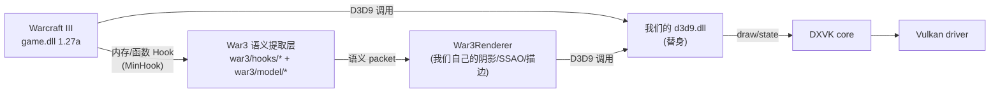

# 01. 项目整体是一个什么东西

## 1.1 一句话定位

这是一个 **挂在 Warcraft III 1.27a 旁边的 D3D9 替身 DLL**，通过 `d3d9.dll` 替换 + 函数 Hook 做三件事：

1. **替换图形后端**：把 War3 原本发给系统 d3d9.dll 的调用拦截，走 DXVK 转译到 Vulkan。
2. **观察 War3 引擎**：Hook War3 内部的若干关键函数（Render/Jass/Lifecycle/UI/Shadow）把 *语义信息* 抽出来。
3. **自建渲染效果**：在 DXVK 里用抽出的语义信息，做自己的阴影、SSAO、描边、AA、后处理，这些效果远超 War3 原生。

简图：



关键结论：**这不是一个单纯的图形后端，是一个 *引擎观察者 + 图形后端* 的混合体**。阴影问题的源头永远在“引擎观察”这一段，不在 DXVK 那一段。

## 1.2 目录分层

```
src/d3d9/
├── d3d9_*.cpp/h           ← DXVK 原生 D3D9 实现（基本不动）
├── d3d9_war3_*.cpp/h      ← 我们自建的渲染效果（shadow/SSAO/CSM 等）
└── war3/
    ├── platform/          ← 启动链、运行时生命周期
    ├── hooks/             ← MinHook 域入口（render/jass/lifecycle/ui/shadow）
    ├── model/             ← runtime model/matrix/pose 捕获 ★ 本次核心问题区
    ├── render/            ← 语义渲染前端（collector/scene/contract/manifest/bridge）★ 本次核心问题区
    ├── shadow/            ← 阴影后端（backend_dxvk/renderer_core）
    ├── shader/            ← ShaderPack
    ├── core/              ← 运行时配置（内部 flags）
    ├── reimpl/            ← 重实现 RenderQueue 等
    └── tools/             ← PerfMonitor / DiagnosticsHub
```

本次阴影问题只涉及 `war3/model/` + `war3/render/` + `war3/shadow/` + `d3d9_device.cpp`。

## 1.3 d3d9.dll 的运行时命运

1. Warcraft III 启动，加载同目录下的 `d3d9.dll`（我们的替身）。
2. `d3d9_main.cpp` 触发，注册自己为真正的 D3D9 实现。
3. War3 安装完所有图形资源后进入 `MainLoop`，我们在这里挂上 `ActivateWar3Runtime`。
4. `ActivateWar3Runtime` 依次：
   - 装 `War3Hook::InstallGameHooks`（render/jass/lifecycle/ui/shadow 五个域的 MinHook）
   - 装 `war3_model_hook.cpp` 里的 runtime matrix / pose / sprite hooks
   - 初始化 `War3Renderer`（自建阴影管线）
   - 启动 PerfMonitor / DiagnosticsHub
5. 正常游戏循环里：
   - Game.dll 自己走它的逻辑和渲染，发出 D3D9 draw
   - 我们的 hook 在旁边偷偷记录 *语义* 信息
   - 帧末我们做自己的阴影 pass、SSAO、描边，走同一个 DXVK 管线
   - Present

## 1.4 为什么要做这么复杂

War3 原生：
- 阴影是纹理贴花 + 少量顶点投影，精度极差（大建筑是一块静态贴图、单位是一条固定朝向的小椭圆）
- 光照是固定管线，没有 PBR / CSM / SSAO
- 抗锯齿只有 MSAA

我们的 mod 目标是把它升级到“现代 RTS 画质”：
- Cascaded Shadow Maps（CSM）+ PCF 软阴影，所有 caster 都真实投影
- SSAO / SSR / bloom / AA / tonemapping
- 支持玩家 ShaderPack（Iris 那种）

要做这些，我们必须在引擎内部拿到：
- **caster 的模型 + 动画姿态 pose**（skinned palette）
- **caster 的世界变换**（root transform）
- **caster 的几何**（vertex decl / index buffer）
- **caster 的身份**（是 unit / destructible / 装饰物 / 投射物？哪个对象？哪一 part？）

这就解释了为什么我们的代码里有那么多 `renderablePart`、`runtimeModel`、`sceneNode`、`jHandle`、`payloadWord*` 之类的字段——它们都是 War3 引擎内部 C++ 结构的偏移，我们通过逆向 IDA 找到这些偏移，在 hook 里读出来，组装成我们自己的 **`CurrentDrawContractRecord`** + **`VisibleRenderable`** + **`ShadowPacket`**。

## 1.5 本次阴影问题的位置

以 caster 侧数据流看：

```
War3 内部状态 (真相)
   │
   ▼
我们的 Hook 捕获  ← ★ 粒度错误、覆盖率错误、时机错误 都在这里发生
   │
   ▼
Contract / Manifest / Lease  ← ★ 我们之前三轮一直在这里改
   │
   ▼
Submit 到 DXVK 阴影 pass
   │
   ▼
CSM shader（receiver）
   │
   ▼
屏幕像素
```

**本次问题全部在“Hook 捕获”这一层**。后面 Manifest / Lease 只是把错的数据稳定地搬下去。

下一篇进入完整数据流。
