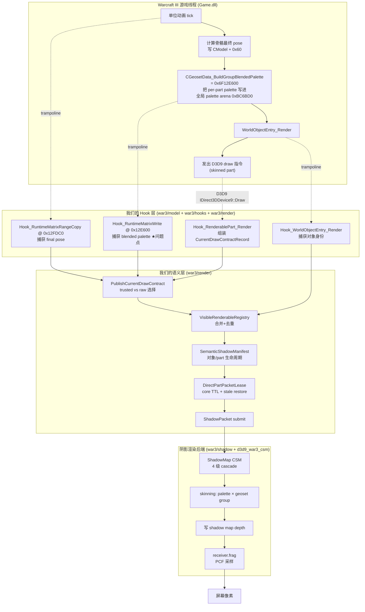

# 02. 阴影 caster 侧的完整数据流

这一篇把**一个 skinned 单位（比如一个英雄）从 War3 引擎里被动画更新，到它的阴影最终画到屏幕上**的每一步都串起来。

## 2.1 上帝视角



## 2.2 关键对象速查表

| 名字 | 出处 | 作用 |
|---|---|---|
| `CModel` | War3 引擎 | 一个 3D 模型实例，里面有骨骼、材质、贴图 |
| `CModel + 0x5C` | IDA | matrixCount：骨骼矩阵数 |
| `CModel + 0x60` | IDA | FinalPoseMatrixArray 基址（pose authority） |
| `CGeosetData` | War3 引擎 | 一个 geoset 的元数据 |
| `CGeosetData + 0xF0` | IDA | groupCount：本 geoset 的 palette group 数量 |
| `renderablePart` | War3 引擎 | “一个模型里要单独画的一组 triangle” |
| `renderablePart + 0x08` | IDA | paletteSlotIndex：在全局 palette arena 里的起始 slot |
| `Game.dll + 0xBC6BD0` | IDA | 全局 palette arena 基址 |
| `Game.dll + 0xBDA4CC` | IDA | `frameTag`，War3 自己的帧计数器 |
| `0x6F12E600` | IDA | `CGeosetData_BuildGroupBlendedPalette`，把 groupCount 个 48 字节连续写入 `arena[slotIndex..slotIndex+groupCount-1]` |
| `0x6F12FED0` | IDA | `CModel_AllocAndFillGroupPalette`，分配 slot + 调用 0x12E600 |
| `0x6F12FDC0` | IDA | `RuntimeMatrixRangeCopy`，把 pose stack 的一段 copy 到 `CModel + 0x60` |
| `0x6F12FF90` | IDA | simple fallback，单矩阵直写 arena |

## 2.3 Skinned palette 的物理内存布局

```
Game.dll + 0xBC6BD0  → pointer → 全局 palette arena
arena:
  [slot 0]       48 bytes (= Matrix4x3 row-major)
  [slot 1]       48 bytes
  [slot 2]       48 bytes
  ...
  [slot 65535]   48 bytes

某个 renderablePart (比如英雄的盾牌 part)：
  renderablePart + 0x08 = slotIndex = 例如 1234
  CGeosetData + 0xF0  = groupCount = 例如 12

→ 这个 part 的 palette 是 arena[1234 .. 1245] 共 12 × 48 字节
→ 每个 48 字节是一个 row-major 3×4 矩阵（一个 bone 或一组 bone 的 blended 结果）
→ skinning shader 用 blend indices 索引这 12 个矩阵
```

关键：**slot 数和 groupCount 是 per-part 的**。不同 part（比如大剑 part vs 披风 part）可能 groupCount 不同。

## 2.4 引擎是怎么写这些字节的

每帧 War3 做 skinned 渲染时：

```c
// 引擎内部伪代码，对应 0x6F12FED0 和 0x6F12E600 的调用链
for each renderablePart:
    slotIndex = renderablePart->AllocSlot();     // 0x12FED0
    renderablePart + 0x08 = slotIndex;
    groupCount = geosetData + 0xF0;
    for i in 0 .. groupCount - 1:
        blendedMatrix = BlendBonesForGroup(i, CModel + 0x60);
        arena[slotIndex + i] = blendedMatrix;    // 在 0x12E600 里发生
    Submit D3D9 draw with palette = arena + slotIndex * 48;
```

所以 **每一次 0x12E600 被调用，引擎都写了 groupCount 个 48 字节矩阵到连续的 slot**。

## 2.5 我们的 Hook 当前行为（问题来源）

`war3_model_hook.cpp` 的 `Hook_RuntimeMatrixWrite`：

1. trampoline 调原函数（让引擎正常写完 palette）
2. 反算出起始 `slotIndex = (destMatrixPtr - globalPaletteBuf) / 48`
3. 读 `CGeosetData + 0xF0` 得到 `groupCount`
4. **批量** copy `groupCount * 48` 字节到 `s_slotBlendedPaletteCache[slotIndex .. slotIndex + groupCount - 1]`

这一段代码 **在 Phase 7.31 P0 已经改对了**（见 [war3_model_hook.cpp](../../../src/d3d9/war3/model/war3_model_hook.cpp) 第 6984–7068 行）。

但有两个“但是”：

### 但是 1：Iter F 曾经禁用过它

Phase 7.31 Iteration F 因为 benchmark 场景下 FPS 崩了，把 batch capture **整体禁用**过一阵子。期间 `paletteCaptureTrustedSourceHit/Miss` 掉到约 12% / 87%。

### 但是 2：即使开着，真正被消费的只有极少数情况

看 `PublishCurrentDrawContract`（[war3_current_draw_contract.cpp](../../../src/d3d9/war3/render/war3_current_draw_contract.cpp) 第 1189–1229 行）：

```cpp
if (PaletteAttributionSnapshotEnabled() &&
    QueryBlendedPaletteBySlotIndexExact(slotIndex, capturedPaletteCount,
                                         frameTag, &trustedPalette) &&
    trustedPalette.size() >= capturedPaletteCount) {
  // ★ trusted 命中：用 Hook_RuntimeMatrixWrite 缓存的数据
  paletteSource = trustedPaletteBytes.data();
  g_paletteCaptureTrustedSourceHitCount++;
} else {
  g_paletteCaptureTrustedSourceMissCount++;
}
if (paletteSource == nullptr) {
  // ★ miss 时 fallback：直接 memcpy record.paletteAddress（raw arena）
  paletteSource = (const uint8_t*)record.paletteAddress;
}
```

`QueryBlendedPaletteBySlotIndexExact` 要求 **`[slotIndex, slotIndex + expectedCount)` 每个 slot 都必须命中，而且 frameTag 对得上**。只要有一个 slot 在 hook 捕获时被别的 writer 抢先覆盖、或者 frameTag 不对，整段 query miss，回退 raw arena。

## 2.6 什么叫 "raw arena fallback"

Raw arena fallback = 直接从 `Game.dll + 0xBC6BD0` pointer 解引用，按 `slotIndex * 48` 偏移抓字节。看起来合理，为什么说不可信？

**因为 `BuildGroupBlendedPalette` 是引擎每帧对 *所有* 需要画的 part 反复写进同一个 arena 的**。arena 的 slot 分配会被引擎复用：
- 这一帧英雄 A 的 slot 1234 放披风矩阵
- 下一帧英雄 A 没在视野里，这个 slot 可能被别的对象占了
- 再下一帧我们抓 current draw 时，渲染顺序变了，arena 的某些 slot 还残留着上一批对象的数据（hook trigger 和 query 之间有窗口）

所以 raw arena 里的字节在“我们 query 的那一刻”并不总代表“这个 renderablePart 这一帧真实使用的数据”。

具体失配方式：
- 如果残留的是 **上一帧同一个 part 的** → pose 延迟 1 帧（看起来 10FPS 感）
- 如果残留的是 **别的对象的** → skinning 把顶点算到完全错的位置（T-pose、炸开、完全跑出视野）
- 如果残留的是 **乱码/归零** → silhouette 坍缩成一个点，shadow map 上没有像素 → 屏幕上阴影消失

这就是为什么 “AutoTest `submittedObjectJaccardMean=999.12`（对象身份 99% 稳定）+ 视觉上英雄阴影几乎不可见”可以同时成立。

## 2.7 阴影 consumer 端简略流程

`d3d9_device.cpp` 的 `War3TryBuildLiveRuntimeGroupPalette` 是 submit 时选择 palette 源的地方，共五种：

```cpp
enum class War3SemanticPaletteSource : uint32_t {
  None = 0,                            // 没 live palette，用 packet 自带的
  DrawTimeCaptured = 1,                // ★ current-draw 同步捕获（现在的主路径）
  SubmitTimeGlobalSlot = 2,            // 重新读 arena[slotIndex]
  SubmitTimeBlendedPaletteCache = 3,   // 重新查 QueryBlendedPaletteBySlotIndex
  SubmitTimePublishedPoseRegistry = 4, // 用 0x12FDC0 发布的 pose registry 重建
  SubmitTimeCModelFallback = 5,        // 用 CModel + 0x60 重建（1.27a 不可信）
};
```

目前 `DrawTimeCaptured` 是主路径，但里面的字节可能来自 trusted writer（好）也可能来自 raw arena（坏）。**`War3SemanticPaletteSource` 目前无法区分这两种情况**，也就是 Codex 说的“palette 缺 provenance”。

## 2.8 阴影渲染真正发生的那一步

走到这一步的 `ShadowPacket` 已经定稿：runtimeModelPtr + renderablePart + palette + groupSlots + world transform 一起被扔进 `war3_shadow_backend_dxvk.cpp`。后端：

1. 新建 skinning vertex shader constant buffer，填入 palette（最多 256 个矩阵）
2. 绑定 geoset 对应的 VB/IB（这里**不需要**自己抓 VB/IB，War3 的 VB/IB 就是正确的，我们只是借用它）
3. draw 到 shadow map 的 cascade texture
4. receiver pass 里用 `war3_shadow_receiver.frag` / `war3_shadow_visibility.frag` 做 PCF 采样

**这里才是 CSM + PCF 的位置**，Iter D 调整 `CSM maxDistance=4000`、`PCF radius=0.70` 都是在这一层。

关键：**如果 step 1 的 palette 是错的，step 2–4 再完美也没用**。

## 2.9 三类视觉症状在数据流里的精确位置

| 症状 | 根源位置 |
|---|---|
| 英雄/火凤凰/紫色单位阴影几乎看不见 | step 1 palette = raw arena 残留 → skinning 把 silhouette 算到视野外或压扁 |
| 大门闪烁特别严重 | destructible 切换 variant（closed/opening/opened）时 `payloadWord11C` 变，但 ShadowManifestPartKey 不含 11C → 旧 lease 还活着，新 variant 的 palette 又抢不到 trusted → 两帧之间整个 part 身份漂 |
| pose 更新看起来只有 10FPS | trusted hit 只有 12%，87% 走 raw arena → 要么 1 帧延迟要么更久；加上 stale restore 开启，lease 可以复用 3–6 帧前的 packet |
| 阴影边缘糊 | receiver.frag 的 PCF + CSM distance 参数，Iter D 已经把 CSM 8000→4000、PCF 0.95→0.70，部分改善但因为 silhouette 本身错，糊是次要问题 |

下一篇深入讲 palette 的五个源，以及 Codex 要求加 provenance 到底是要加什么。
