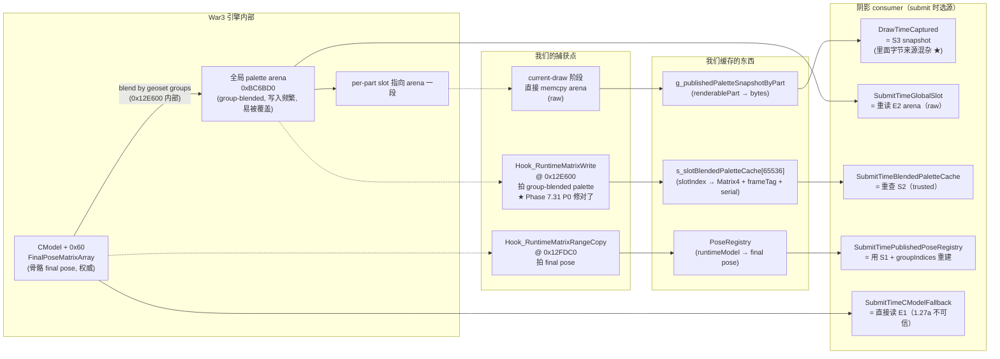

# 03. Palette 五大来源深潜

上一篇提了 `War3SemanticPaletteSource` 有五个分支，但关键问题是 **`DrawTimeCaptured` 这个分支本身是个大杂烩**。本篇拆开它、对比五个真正的来源层级，并解释为什么 Codex 要加 provenance。

## 3.1 五大 palette 物理来源



## 3.2 五个来源的稳定性对比

| 来源 | 稳定性 | 时效 | 说明 |
|---|---|---|---|
| **S2 trusted cache (0x12E600)** | ★★★★★ | 当帧 | 引擎**刚写完**的 exact bytes，只要 frameTag 对得上就是真源 |
| **S1 PoseRegistry (0x12FDC0)** + 重建 | ★★★★ | 当帧 | final pose 权威，但需要我们自己按 geoset groups 重建 blended palette，等同于自己实现一次 `0x12E600` |
| DrawTime 的 trusted path（S3 拿到 S2 字节） | ★★★★ | 当帧 | 和 S2 等价，就是把 S2 bytes 复制到 snapshot 里 |
| DrawTime 的 raw path（S3 拿到 arena 字节） | ★ | 不定 | 可能是当帧 / 上帧 / 别对象的，无法区分 |
| SubmitTime raw arena | ★ | 不定 | 同上 |
| CModel fallback | 0 | 错 | 1.27a 的 `CModel+0x60` 在我们当前 resolve 路径下长期拿到错的对象 |

## 3.3 现状：`paletteCaptureTrustedSourceHit / Miss`

这两个计数器记录 **PublishCurrentDrawContract 选到 S2 trusted 的比例 vs 回退 raw arena 的比例**。

最新基线数据（见 [phase720_phase730_phantom_plus_wide_core_evict_hot_shadow_poll_20260509.json](../../../AutoTest/artifacts/phase720_phase730_phantom_plus_wide_core_evict_hot_shadow_poll_20260509.json)）：

```
paletteCaptureTrustedSourceHit  = 12436
paletteCaptureTrustedSourceMiss = 86411
→ trusted 命中率 ≈ 12.6%
```

也就是每 100 个 skinned draw，只有 13 个吃到真源，其他 87 个吃的是 arena 残留。

## 3.4 为什么 87% miss

这是本项目目前最关键的谜题。Codex 的解读 + 我的复核结论：

### 原因 A：Phase 7.31 P0 现在其实是开着的
看 `war3_model_hook.cpp` 7015–7020：
```cpp
static inline bool RuntimeMatrixBatchCaptureEnabled() {
  static const bool enabled =
      GetEnvBoolCached("DXVK_WAR3_RUNTIME_MATRIX_BATCH_CAPTURE", true);
  return enabled;
}
```
默认 `true`。`AGENTS.md` 里 Claude 的陈述“Iter F 撤回了 batch capture”已经被当前代码否定——实际代码里 batch capture 是开的。

### 原因 B：frameTag mismatch
`QueryBlendedPaletteBySlotIndexExact` 要求 frameTag 对得上。但有三种情况会对不上：
1. `Hook_RuntimeMatrixWrite` 被触发时读的 frameTag 是 `t`，然后到 `PublishCurrentDrawContract` 时 frameTag 变成了 `t+1`
2. 某些 part 的 palette 是 **上一帧就写好没变过**（静态角色 idle 没动），这时 cache 里的 frameTag 是旧的但 bytes 对的，frameTag 对比直接 fail
3. `frameTag` 本身读取路径（`Game.dll + 0xBDA4CC`）在某些时刻不稳定

### 原因 C：groupCount 不匹配 expectedCount
`PublishCurrentDrawContract` 用的 `record.capturedPaletteCount` 是 current-draw hook 里读到的数字（一般来自 `CModel + 0x5C` 或 `renderablePart` 相关字段）。
`Hook_RuntimeMatrixWrite` 写入用的是 `CGeosetData + 0xF0`。
**这两个数字在同一个 renderablePart 上大概率是同一个，但实现路径独立，某些对象上有偏差**。偏差一旦发生，query 的 `[slotIndex..slotIndex+expectedCount)` 里有某个 slot 没被当帧填过 → miss。

### 原因 D：简单路径 0x12FF90 根本没被 hook
Codex 在他自己研究里点名：`0x6F12FF90` 是 no-controller simple path 的单矩阵直写 arena，不走 `0x12E600`。如果某些 part 走这条，那 `s_slotBlendedPaletteCache` 根本没有它的记录。
**目前我们确实没有 hook 0x12FF90**。

## 3.5 Codex 要求的 provenance 是什么

Codex 的意思：**S3 snapshot（`g_publishedPaletteSnapshotByPart`）里的字节，到底是从哪里来的，当前代码写完就丢了，查不出来**。需要在 `CurrentDrawAuthoritativeSample` 里加一个枚举字段：

```cpp
enum class PaletteProvenance : uint32_t {
  Unknown = 0,
  TrustedBlendedWriter = 1,     // 来自 S2（0x12E600 hook）★ 可信
  RawGlobalArena = 2,           // 直接 memcpy arena ★ 不可信
  ProducerPartPacket = 3,       // 将来 Phase 2 引入的新源
  RangeCopyPoseRebuild = 4,     // 将来基于 S1 重建
  CModelFallback = 5,
};
```

然后在 `PublishCurrentDrawContract` 1189–1229 的 trusted/raw 分支里分别打标记，把它贯通到 submit 端的 stats counter。

这样 AutoTest 指标里就能看到：
```
submittedSkinnedPaletteSourceTrustedBlendedWriter = ?
submittedSkinnedPaletteSourceRawGlobalArena = ?
submittedSkinnedPaletteSourceProducerPartPacket = ?
```

**目前我们只知道 87% 没命中 trusted，但 submit 端并不知道这 87% 最终是不是真的被提交到阴影 pass——因为 DrawTime path 在 submit 时已经混在一起了**。加 provenance 等于把这条线路拉直。

## 3.6 一个关键误区

Claude 之前说过“是不是要切 trusted source 从 `0x12E600` 换成 `0x12FDC0`”。Codex 明确否决了这个说法：

- `0x12E600` = **slot 上最终 group-blended palette 的直接 writer**，是 renderablePart 能真正消费的 bytes
- `0x12FDC0` = final pose authority，但它写的是 `CModel + 0x60`，**不是** slot palette。要用它做 slot palette 必须自己按 `CGeosetData` 的 group indices 重新 blend 一遍

所以两者不是替代关系，是**校验关系**：

```
0x12E600 捕获的 slot palette  <=>  0x12FDC0 + geoset group rebuild 的 slot palette
                        ↓
                应该逐矩阵等价（hash 相同）
```

如果两者一致，说明我们的 pose 理解是对的。如果不一致，可能是：
- geoset group indices 我们读错了
- blend 算法我们写错了
- 某条 writer 路径我们还没 hook

## 3.7 下一步要做的事（Codex 裁决 + 我的复核）

1. 加 palette provenance 枚举和 counter（见第 06 篇）
2. 让 batch capture 跑一次 A/B（开/关），观察 trusted hit rate
3. 补 `0x12FF90` 的 hook（simple fallback writer）
4. 实现 `0x12FDC0 pose + CGeosetData groups → 重建 group palette`，和 trusted cache 做 hash 对账
5. 把 raw arena 在 production skinned path 上标记为 deprecated（保留 debug）

下一篇讲 manifest / lease 的生命周期，以及 phantom shrink / core TTL 到底在修什么。
