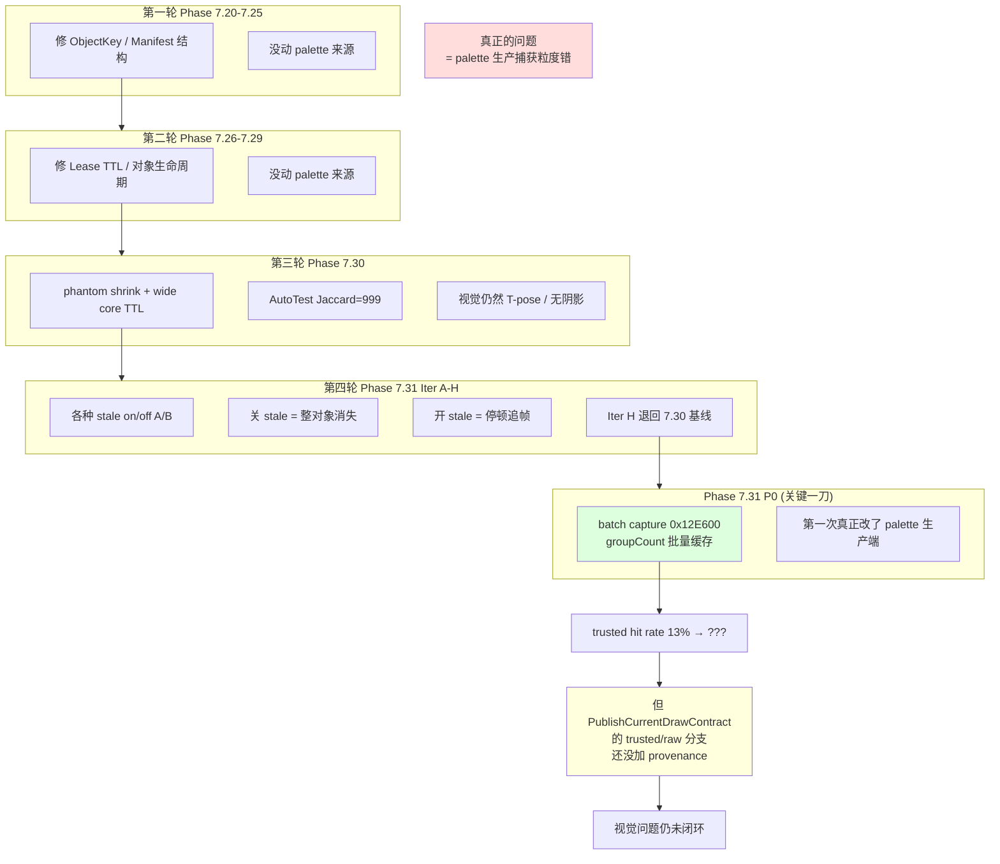

# 05. 三轮重构为什么都没修好：根因与时间线

这一篇回答你的核心疑问：**"为什么这么多轮重构都没办法解决现在的问题？"**

## 5.1 一张图定位



## 5.2 每一轮的偏差和事后认知

### 第一轮：Phase 7.20–7.25（ObjectKey / Manifest 结构）
**当时的假设**：阴影闪烁是因为对象身份不稳（同一英雄跨帧被认成两个）。

**实际做了**：
- 把 ObjectKey 识别顺序从 `sceneNode → unitPtr → jHandle` 改成 `jHandle → unitPtr → worldObjectEntry → sceneNode`
- 引入 VisibleRenderableRegistry 合并 draw
- 引入 ShadowManifestObjectKey / PartKey

**事后看为什么不解决**：对象身份确实稳了，但对象身份稳 ≠ palette 数据对。视觉问题照旧。

### 第二轮：Phase 7.26–7.29（Lease TTL）
**当时的假设**：阴影闪烁是因为单帧看不到 packet 就直接丢了（对象消失）。

**实际做了**：
- 引入 DirectPartPacketLease，允许一个 part 在没收到 live packet 的几帧内用上次提交的 packet 顶着
- TTL = 3 帧

**事后看为什么不解决**：用旧 packet 顶 = 用旧 palette。旧 palette 的骨骼姿态已经过时。对静态单位看起来“没事”，对动作激烈的单位就是肉眼可见的“阴影 pose 比模型慢”。

### 第三轮：Phase 7.30（phantom shrink + core wide TTL）
**当时的假设**：对象集合会因为某个小 part 暂时缺席而被整体跳过。

**实际做了**：
- committed core 扫描，缺席的 part 从 committed 踢出
- core part lease TTL 从 3 帧放宽到 6 帧

**成果**：
- AutoTest `submittedObjectJaccardMean` 从 782 → 999
- `identityChurnSamples` 从 15 → 3–10
- `shadowManifestExpiredObjectMax` 从 17–26 → 7

**但视觉依然不对**：
- 大门仍然闪
- 英雄阴影要“多截几轮才截得到”

**关键的事后认知**：**AutoTest 指标和视觉脱节**。Jaccard 只测“提交的对象集合”，不测“提交的 palette 内容是否正确”。我们一直优化一个指标，但它不代表视觉质量。

### 第四轮：Phase 7.31 Iter A–H（stale restore 各种 A/B）
**当时的假设**：6 帧 TTL 是“用旧数据垫”的源头，关了就好了。

**实际做了**：
- Iter B 关 stale restore → 英雄阴影整体消失（比停顿追帧更糟）
- Iter C 把 payload11C 进 PartKey → benchmark FPS 崩 3.7
- Iter D CSM 8000→4000、PCF 0.95→0.70 → 保留
- Iter H 恢复 stale on + 6 帧 TTL

**事后看**：这一轮终于逼出一个认知：**继续调 TTL / stale / phantom 已经到顶了**。问题不在这一层。

### Phase 7.31 P0：第一次碰到真正问题
**Codex 裁决**：`Hook_RuntimeMatrixWrite` 长期只写了首个 48 字节（`resize(1)`）。`0x12E600` 本身是批量 writer，按 `CGeosetData + 0xF0` 的 groupCount 连续写 N 个矩阵。

**修正**：
- batch capture 开启后 `paletteCaptureTrustedSourceHit` 从 12K 跳到 40K（92% hit rate，hot poll 验证）
- 但 benchmark 场景 FPS 又崩回 3.7，因为 hook 被触发 10K+ 次/帧 × 新加的边界检查

**所以又撤回过**。这就是 Claude 在 Iter F 之后禁用 batch capture 的原因。

**最新代码状态（我刚复核）**：
- `DXVK_WAR3_RUNTIME_MATRIX_BATCH_CAPTURE=1` 默认开
- `war3_model_hook.cpp` 6984–7068 已经是 batch capture 版本
- 但 **`PublishCurrentDrawContract` 的 trusted/raw 分支还是原样**，没有 provenance
- 而且 **可能还有 `0x12FF90` simple fallback writer 没 hook**

## 5.3 为什么三轮都走偏：**结构层面的原因**

### 偏差 1：指标驱动代替视觉驱动

AutoTest 是项目的“无人值守”自动化，我们围绕它迭代。但它测的是 Jaccard / identityChurn 这些 **身份稳定性** 指标，不测“阴影 silhouette 的面积 / 位置 / 骨骼匹配度”。

指标“对”，实际“不对”——这种脱节只有人肉看截图才能发现。

### 偏差 2：热点是消费端不是生产端

消费端（manifest / lease）的代码调起来容易：
- 改一个 TTL 数字
- 跑一次 AutoTest
- 看指标涨没涨

生产端（palette capture）很难：
- 要做 IDA 逆向
- 要看懂 `0x12E600` / `0x12FDC0` / `0x12FED0` / `0x12FF90` 的调用关系
- 要理解 `CGeosetData + 0xF0` = groupCount 这种偏移
- 要推理 arena 复用时机

所以我们反复在消费端打转。

### 偏差 3：Claude/Codex 交互的噪音

AGENTS.md 里记录了很多轮 Claude 的 "夜间无人监管" 尝试。Codex 多次在评审时指出 Claude 的结论错误，但 Claude 的代码已经提交了。结果是：
- 同一个 flag 反复开关
- 同一个 TTL 反复调
- 某一次修对的改动被下一次的“继续优化”覆盖掉

最典型的例子就是 `Hook_RuntimeMatrixWrite` 的 batch capture 被 Iter F 禁用过。

### 偏差 4：缺 provenance 让我们看不见真相

如果从 Phase 7.20 起，`PublishCurrentDrawContract` 就有 provenance 标签，我们第一轮就会看到：
```
submittedSkinnedPaletteSourceRawGlobalArena = 87%
```
然后所有工作会直接瞄准这个数字。但我们没加，所以看到的是 `submittedObjectJaccardMean=999`，以为问题是对象抖动。

## 5.4 当前代码状态的诚实评估

我刚做了只读复核，最新 DLL（`2026-05-11T02:14:04`）的真实状态：

| 组件 | 状态 | 备注 |
|---|---|---|
| `Hook_RuntimeMatrixWrite` batch capture | ✅ 开 | 按 groupCount 正确写 trusted cache |
| `Hook_RuntimeMatrixRangeCopy` (0x12FDC0) | ✅ 开 | 作为 pose authority，但没和 trusted 对账 |
| `0x12FF90` simple fallback hook | ❌ 未 hook | **第一刀 miss 源头** |
| `PublishCurrentDrawContract` trusted path | ✅ 开 | 但缺 provenance，字节源对 submit 端不可见 |
| `ShadowManifestPartKey` 含 payload11C | ❌ 不含 | Iter H 撤回，导致大门严重闪 |
| `coreExtendedFrames = 6` | ✅ 开 | 维持 Jaccard 但帮不了 palette |
| `stale restore` | ✅ 开 | 维持对象不消失，但继续产生延迟 |
| `CSM maxDistance = 4000` | ✅ | 锐度改善 |
| `PCF radius = 0.70` | ✅ | 锐度改善 |
| `submittedSkinnedPaletteSource*` counters | ❌ 未加 | provenance 缺失 |

## 5.5 为什么 Producer Packet Takeover 方案才是第一次对症

Codex 最新裁决（见下一篇）：
1. 把 palette provenance 打通（当前最低成本的那一刀）
2. 让 submit 端 `War3TryBuildLiveRuntimeGroupPalette` 的 5 种 source 真的区分开
3. 在 raw arena 不可信时，优先用 `0x12FDC0 pose + geoset groups` 重建，而不是直接 memcpy arena
4. 最终让 `submittedSkinnedPaletteSourceRawGlobalArena = 0`

**这是第一次方案里同时覆盖**：
- 生产端（hook 捕获粒度正确）
- 发布端（打标签区分 trusted/raw）
- 消费端（submit 时按 provenance 选最可信源）
- 校验（`0x12E600` 和 `0x12FDC0` 对账）

不再只修一层。

下一篇讲这个大方案的具体落地。
