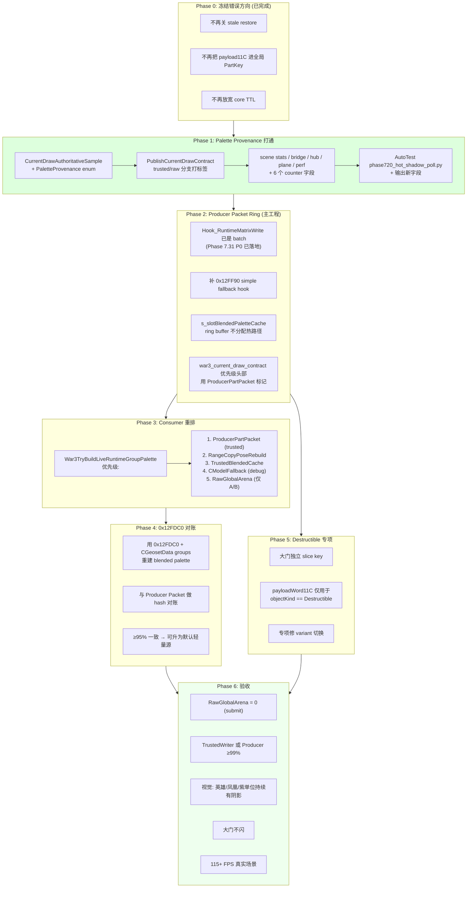

# 06. Producer Packet Takeover：真正的解

这一篇讲 Codex 最新裁决的大方案、每一步要动哪些文件、以及明确的验收指标。

## 6.1 方案总图



## 6.2 为什么这个方案是"把握最高、工作量巨大、但一定能解决"

Codex 的原话：**"把 shadow skinned 输入上移到引擎 palette 生产点，做 per-frame immutable producer packet，然后用 `0x12FDC0` 做 pose authority 对账和最终替换。"**

### 把握高的原因
1. 我们现在已经在 `Hook_RuntimeMatrixWrite` 里**同帧同 slot** 捕获了引擎刚写完的 exact bytes
2. `0x12FDC0` 的 pose authority 也在 hook 里捕获了
3. 这两份数据都是**引擎刚刚用来画单位的原始数据**，不再依赖 arena 残留
4. 只要 submit 端优先消费这两个，raw arena 可以被标记为 deprecated

### 工作量巨大的原因
1. `CurrentDrawAuthoritativeSample` 结构要加 provenance 字段 → 贯通 6 个 TU
2. scene stats / bridge / hub / control plane / perf monitor / AutoTest 都要加对应 counter
3. 0x12FDC0 pose rebuild 需要把 CGeosetData 的 matrixIndices / matrixGroupSizes 读出来自己 blend
4. destructible 专项要改 `War3ResolveSemanticPacketObjectKindFast` 的慢路径
5. 性能要求：hot hook 里的新字段写入**不能**分配、**不能**哈希查表、**不能**加锁

### 不会倒回 VB/IB snapshot 路线的原因
我们只捕获**语义层**：
- runtimeModelPtr、renderablePart、geosetData、paletteSlotIndex
- 48 × groupCount 字节的 palette
- frameTag、payload 字段、object identity

**不捕获**：
- VB（vertex buffer）
- IB（index buffer）
- D3D9 stream source
- draw call state
- shader constants

这和 VB/IB snapshot 是两个完全不同的东西。Producer packet 反而**有助于**未来脱离 DX9Ex（因为我们完全不依赖 D3D draw stream 格式了）。

## 6.3 Phase 1 详细落地（最小代价收益最高）

### 1. 定义枚举
文件：`src/d3d9/war3/render/war3_current_draw_contract.h`
位置：`CurrentDrawAuthoritativeSample` 结构定义之前

```cpp
// Phase 1: palette bytes 的来源 provenance。
// 目的是让 submit 端区分“真源”和“arena 残留”。
enum class PaletteProvenance : uint32_t {
  Unknown = 0,
  TrustedBlendedWriter = 1,     // 0x12E600 hook 同帧捕获
  RawGlobalArena = 2,           // record.paletteAddress 直接 memcpy（可能残留）
  ProducerPartPacket = 3,       // 预留：Phase 2 producer ring
  RangeCopyPoseRebuild = 4,     // 预留：Phase 4 基于 0x12FDC0 重建
  CModelFallback = 5,
};
```

同时在 `CurrentDrawAuthoritativeSample` 里加：
```cpp
PaletteProvenance paletteProvenance = PaletteProvenance::Unknown;
```

在 `CurrentDrawContractDiagnosticsSummary` 里加：
```cpp
uint64_t paletteProvenanceTrustedBlendedWriterCount = 0u;
uint64_t paletteProvenanceRawGlobalArenaCount = 0u;
uint64_t paletteProvenanceProducerPartPacketCount = 0u;
uint64_t paletteProvenanceRangeCopyPoseRebuildCount = 0u;
uint64_t paletteProvenanceCModelFallbackCount = 0u;
uint64_t paletteProvenanceUnknownCount = 0u;
```

### 2. 在 Publish 时打标签
文件：`src/d3d9/war3/render/war3_current_draw_contract.cpp`
位置：1189–1229（trusted vs raw 分支）

```cpp
PaletteProvenance provenance = PaletteProvenance::Unknown;
if (PaletteAttributionSnapshotEnabled() &&
    QueryBlendedPaletteBySlotIndexExact(...)) {
  // ... 原有 trusted 路径
  provenance = PaletteProvenance::TrustedBlendedWriter;
  g_paletteCaptureTrustedSourceHitCount.fetch_add(1u, ...);
} else if (PaletteAttributionSnapshotEnabled()) {
  g_paletteCaptureTrustedSourceMissCount.fetch_add(1u, ...);
}
if (paletteSource == nullptr) {
  paletteSource = (const uint8_t*)record.paletteAddress;
  provenance = PaletteProvenance::RawGlobalArena;
}
// 新增：把 provenance 存到 snapshot
snapshot.paletteProvenance = provenance;
// ... 同步写到 globalSnapshot / attrSnapshot
```

### 3. Submit 端读 provenance
文件：`src/d3d9/d3d9_device.cpp`
位置：9287–9352（`War3SemanticPaletteSource` 选择）

当前 `DrawTimeCaptured` 分支不区分 trusted / raw，需要：
```cpp
if (drawTimeCapturedPaletteReady) {
  // ...
  PaletteProvenance p = capturedSample.paletteProvenance;
  switch (p) {
    case PaletteProvenance::TrustedBlendedWriter:
      ++semanticSceneSubmittedSkinnedPaletteSourceTrustedBlendedWriterCount;
      break;
    case PaletteProvenance::RawGlobalArena:
      ++semanticSceneSubmittedSkinnedPaletteSourceRawGlobalArenaCount;
      break;
    // ...
  }
}
```

### 4. Scene stats 字段
文件：`src/d3d9/d3d9_war3_scene.h`
位置：`semanticSceneSubmittedSkinnedPaletteSource*Count` 块之后（约 503–508）

加 6 个字段：
```cpp
uint64_t semanticSceneSubmittedSkinnedPaletteSourceTrustedBlendedWriterCount = 0u;
uint64_t semanticSceneSubmittedSkinnedPaletteSourceRawGlobalArenaCount = 0u;
uint64_t semanticSceneSubmittedSkinnedPaletteSourceProducerPartPacketCount = 0u;
uint64_t semanticSceneSubmittedSkinnedPaletteSourceRangeCopyPoseRebuildCount = 0u;
uint64_t semanticSceneSubmittedSkinnedPaletteSourceCModelFallbackCount = 0u;
uint64_t semanticSceneSubmittedSkinnedPaletteSourceUnknownCount = 0u;
```

### 5. 贯通 5 个 TU
按先后：
1. `src/d3d9/war3/render/war3_shadow_runtime_bridge.{h,cpp}` 的 summary 结构（约 2066–2084）
2. `src/d3d9/war3/tools/war3_diagnostics_hub.{h,cpp}` 的 summary 聚合（约 785–857）
3. `src/d3d9/war3/hooks/war3_control_plane.cpp` 的 JSON emit（约 1510–1548）
4. `src/d3d9/war3/tools/war3_perf_monitor.{h,cpp}` 的 aggregate + 两个 emitter（约 625–665）
5. `AutoTest/phase720_hot_shadow_poll.py` 的 sample 行 244–267 + aggregate 行 608–640

### 6. 验收
跑一次 AutoTest，应该看到：
```
paletteProvenanceTrustedBlendedWriterCount = ?
paletteProvenanceRawGlobalArenaCount = ?
submittedSkinnedPaletteSourceTrustedBlendedWriterCount = ?
submittedSkinnedPaletteSourceRawGlobalArenaCount = ?
```

这一组数字会**第一次明确告诉我们**：
- 有多少 palette 来自真源
- 有多少实际被提交到阴影 pass 是残留

这是 **Phase 2 改 consumer 优先级的必需前置**。没有这个数据，我们不知道改完之后是真的好了还是假的好了。

## 6.4 Phase 2 producer ring（主工程）

Phase 1 跑完有数据后，才动这一步。核心改动：

### 补 0x12FF90 hook
文件：`src/d3d9/war3/model/war3_model_hook.cpp` + `war3_hook_address_book.{h,cpp}`
加一个新 hook：
```cpp
static decltype(&Hook_RuntimeMatrixWriteSimple) g_trampolineRuntimeMatrixWriteSimple = nullptr;
void __fastcall Hook_RuntimeMatrixWriteSimple(int a1, int destMatrixPtr) {
  // simple fallback: 写 1 个 48 字节到 arena[slot]
  // 逻辑和 Hook_RuntimeMatrixWrite 的 count=1 分支几乎一样
}
```

### ring buffer 优化
当前 `s_slotBlendedPaletteCache` 已经是固定数组（65536 × 73 ≈ 4.6 MB），够用。如果 benchmark 压力大，可以引入 per-frame clear 而不是全表保留（减少 cache miss）。

### ProducerPartPacket 打标
把 trusted 命中分出一类单独计数，方便未来扩展为“完整 part packet”（含 groupCount、geoset metadata 等）。

## 6.5 Phase 4 0x12FDC0 重建（最复杂）

这是最工程化的一步。需要：
1. Hook_RuntimeMatrixRangeCopy 已经存了 pose（S1 PoseRegistry）
2. 新增：读 `CGeosetData + 0xF4 / 0xF8` 得到 matrixGroupSizes / matrixIndices 指针
3. 对每一个 group `i`:
   - group 内有 `matrixGroupSizes[i]` 个 bone
   - bone indices 从 `matrixIndices[prefixSum .. prefixSum + size)`
   - 读 final pose 的这些 bone 矩阵，平均得到 blended matrix
4. 把 `groupCount` 个 blended matrix 和 trusted cache 里的 hash 对比
5. 一致率 ≥95% → 升为默认；失败样本单独记录

## 6.6 Phase 5 destructible 专项

大门闪的根因不是 palette（大门的 palette 相对简单），是 **variant 切换时 manifest 误以为是同一 part**。

改动：
1. `War3ResolveSemanticPacketObjectKindFast` 在 destructible 对象上返回 `ObjectKind::Destructible`
2. `ShadowManifestPartKey` 增加 destructible-only 分支：
```cpp
if (objectKind == ObjectKind::Destructible) {
  hash = fnv1a_iter(hash, record.payloadWord11C);
}
```
3. Phantom shrink 对 destructible transition 做延迟确认（不立刻剔除，等 2–3 帧确认真消失）

## 6.7 验收指标（必须全部达成）

| 指标 | 目标 |
|---|---|
| `submittedSkinnedPaletteSourceRawGlobalArena` | = 0 |
| `submittedSkinnedPaletteSourceTrustedBlendedWriter` + `ProducerPartPacket` | ≥ 99% |
| 0x12FDC0 rebuild vs producer exact hash 一致率 | ≥ 95% |
| 用户截图：英雄 + 火凤凰 + 紫色单位 | 持续可见阴影 |
| 大门（destructible） | 所有 variant 切换不闪 |
| 真实场景 FPS | ≥ 115 |
| benchmark 场景 FPS | ≥ 60（容忍退化，因 provenance 有少量开销） |

## 6.8 禁区（绝对不碰）

| 禁区 | 原因 |
|---|---|
| VB/IB capture | 会让项目永久绑死 DX9Ex |
| Shadow TAA | 消费端手段，不解决 palette 数据错 |
| Receiver hold | 同上，只是把闪烁延迟到下几帧 |
| 关 stale restore | Codex 裁决，关了反而对象消失 |
| payload11C 进全局 PartKey | 性能灾难 |
| 继续调 core TTL | 已到顶 |
| 提高 direct record cap 伪装修复 | 假修 |
| 开 alpha/cutout/transparent caster | 把不该投影的对象强制投影 |

下一篇讲多 Agent 协作规则。
