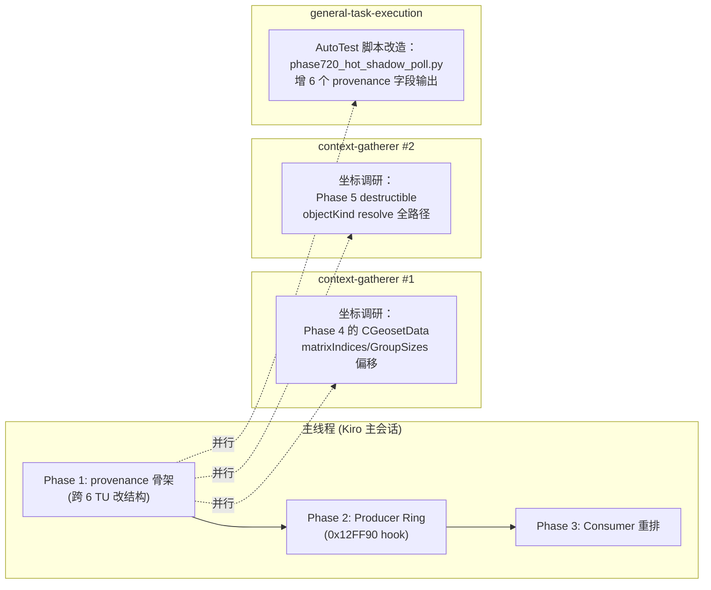

# 07. 多 Agent 协作与 Kiro 能力

## 7.1 Kiro 是否自带多 Agent

**有**。Kiro 提供 `invoke_sub_agent` 工具，主 Agent 可以在**自己的会话里**直接派子 Agent 去做任务，不需要用户手动开多个 session。子 Agent 运行结束后把结果返回给主 Agent。

可用的子 Agent：
- **`context-gatherer`** — 专门做代码地图、交叉引用、定位坐标的调研 Agent。速度快、上下文独立，适合“找一组文件 + 行号”的任务。
- **`general-task-execution`** — 全工具通用 Agent，适合“做一件完整事情”（改代码 + 跑测试 + 提交）。
- **`custom-agent-creator`** — 要创建新的定制 Agent 类型时用。
- **`requirement-detailer`** — 把一个需求细化成多条可验证条件。

子 Agent 只在 Autopilot 模式可用。本项目一直在 Autopilot 跑，符合条件。

## 7.2 本项目推荐的任务切分

结合 Phase 1 → Phase 6 的大方案，以下是**主线程 + 并行子 Agent** 的切分规则。



### 切分原则

**主线程只做“结构性变更 + 核心逻辑”**：
- 改 C++ 结构定义（会导致跨 TU 级联编译）
- 改 submit 端选源优先级（视觉正确性直接相关）
- 运行编译 + AutoTest + 视觉复核

**子 Agent 做“独立调研 + 边缘工作”**：
- IDA 数据结构调研（`CGeosetData + 0xF4 / 0xF8` 是什么）
- 代码地图（destructible resolve 慢路径有哪些 call site）
- AutoTest 脚本字段增补
- 文档更新

**并行的硬约束**：
- 子 Agent 之间**不能改同一个文件**
- 子 Agent 都必须返回**只读结果或独立目录的新文件**
- 主线程负责“合并冲突”——但因为我们规定了切分，实际不应该有

## 7.3 子 Agent 调用示例

我在下面展示几个可以立即 dispatch 的子 Agent 任务，**本轮不实际 dispatch**（你要求本轮只做讲解，不编程），但你看完可以直接作为下轮的启动脚本。

### 示例 A：Phase 4 逆向调研（context-gatherer）
```
任务：用 IDA MCP 工具读 CGeosetData_BuildGroupBlendedPalette (0x6F12E600) 的反编译，
     确认：
     1. matrixGroupSizes 数组的基址偏移 (可能是 0xF4)
     2. matrixIndices 数组的基址偏移 (可能是 0xF8)
     3. 每个 group 的 blend 算法（是 average？ weighted？ 还是直接取第一个？）
     4. groupCount == 0 时的 simple path 细节
     输出：markdown 报告，含地址偏移表 + 反编译片段 + 推荐的 C++ 读取代码
```

### 示例 B：Phase 5 destructible 代码地图（context-gatherer）
```
任务：列出所有 destructible 对象在本项目里被识别的 call site。覆盖：
     - War3ResolveSemanticPacketObjectKindFast
     - War3ResolveSemanticPacketObjectKind (slow path)
     - RenderObjectRegistry 里 destructible 相关字段
     - ShadowObjectRegistry 里 destructible 相关字段
     - payloadWord11C 的 writer 列表
     - 现有代码里对 destructible 做了什么特殊处理（如果有）
     输出：markdown 报告，含文件:行号，以及一个“哪些地方需要改”的建议列表
```

### 示例 C：AutoTest 扩展（general-task-execution）
```
任务：在 AutoTest/phase720_hot_shadow_poll.py 的 sample 采集（244-267 行）
     和 aggregate（608-640 行）里增加 6 个 palette provenance 字段：
     - paletteProvenanceTrustedBlendedWriterCount
     - paletteProvenanceRawGlobalArenaCount
     - paletteProvenanceProducerPartPacketCount
     - paletteProvenanceRangeCopyPoseRebuildCount
     - paletteProvenanceCModelFallbackCount
     - paletteProvenanceUnknownCount
     字段从 control_plane 返回的 JSON 里取，字段名约定同 Phase 1 方案。
     输出：patched script 文件内容，以及一个 dry-run 验证说明。
```

## 7.4 用户手动开多主线程的情况

如果某天需要 **跨多机** 或 **跨多用户**，Kiro 当前不支持原生“跨机 Agent”。这时候可以：
- 用户手动在另一台机器 / 另一个 Kiro 窗口开第二个会话
- 主会话输出“任务上下文包”（就像你发给我那种长 prompt）
- 第二个会话独立执行，结果回发
- 主会话负责合并

本项目暂时**不需要**这样做。`invoke_sub_agent` 已经够用，因为：
- 主线程修改是**顺序依赖**的（Phase 1 → 2 → 3）
- 可以并行的只有**调研和脚本**，这些子 Agent 就够

## 7.5 协作规则（供下一轮执行）

1. **主线程在每个 Phase 开始前声明**：
   - 本 Phase 目标
   - 将修改哪些文件（以锁的形式声明）
   - 将 dispatch 哪些子 Agent（以独立任务的形式声明）

2. **子 Agent 任务必须满足**：
   - 只读 或 只写 `docs/plan/.../` 下新文件
   - 不允许写 `src/` 或 `AutoTest/`（除非主线程明确授权）
   - 返回 markdown 报告，不要直接 commit

3. **Phase 切换 checkpoint**：
   - 编译通过（`ninja -C build32`）
   - AutoTest 通过（`py -3 AutoTest\phase720_hot_shadow_poll.py` 或 run_quick_autotest）
   - 视觉复核（用户或 AutoTest 截图）
   - AGENTS.md 落盘（按本项目强制规矩）

4. **失败快速回滚**：
   - 每个 Phase 内代码改动在同一个 git 工作目录里
   - Phase 跑坏 → 撤销，跑下一个 Phase 变体
   - AGENTS.md 记录本次 attempt 和撤回原因

## 7.6 对接 Codex

本项目过去一直用「Claude 落代码 + Codex 裁决」的流程。在 Kiro 内：
- 主线程（我）落代码
- 子 Agent 做调研
- **Codex 继续做最终裁决**（通过 GPT 深度研究端，用户转达）

这样三方分工清楚：
- Kiro 主线程：实现 + 编译 + AutoTest + 视觉复核
- Kiro 子 Agent：调研 + 脚本
- Codex（外部）：裁决 + 架构审查 + 逆向验证

不会再出现 Phase 7.31 Iter F 那种“Claude 落的代码被下一轮 Claude 自己撤回但没跑 A/B”的情况。

## 7.7 本轮结束后的建议启动顺序

用户（你）把这份讲解看一遍后，下一次启动建议按这个顺序：

1. **和 Codex 确认 Phase 1 方案**（你把这份讲解发给 Codex 是很合适的输入）
2. **用户确认本轮目标**（Phase 1 only? Phase 1 + Phase 2 producer ring?）
3. **主线程启动**：
   - Dispatch 子 Agent A（Phase 4 逆向）和 Agent C（AutoTest 扩展）并行
   - 主线程 Phase 1：改 `CurrentDrawAuthoritativeSample` + `PublishCurrentDrawContract` + 贯通 5 TU
   - 编译、AutoTest、AGENTS.md 落盘
4. **视觉复核**：用户看截图，确认英雄/凤凰/紫单位是否仍然没阴影（Phase 1 只加数据，不解决视觉，但**让我们第一次看到 RawArena 占比**）
5. **视觉数据反推 Phase 2/3 具体工作量**

这样每一步都有实证，不再像前三轮那样盲调。

---

## 附：讲解目录索引（回 README）

- [00_README](./README.md)
- [01_project_overview](./01_project_overview.md)
- [02_shadow_pipeline_data_flow](./02_shadow_pipeline_data_flow.md)
- [03_palette_sources_deep_dive](./03_palette_sources_deep_dive.md)
- [04_manifest_lease_lifecycle](./04_manifest_lease_lifecycle.md)
- [05_root_cause_why_three_rounds_failed](./05_root_cause_why_three_rounds_failed.md)
- [06_producer_packet_plan](./06_producer_packet_plan.md)
- [07_multi_agent_coordination](./07_multi_agent_coordination.md) ← 当前
