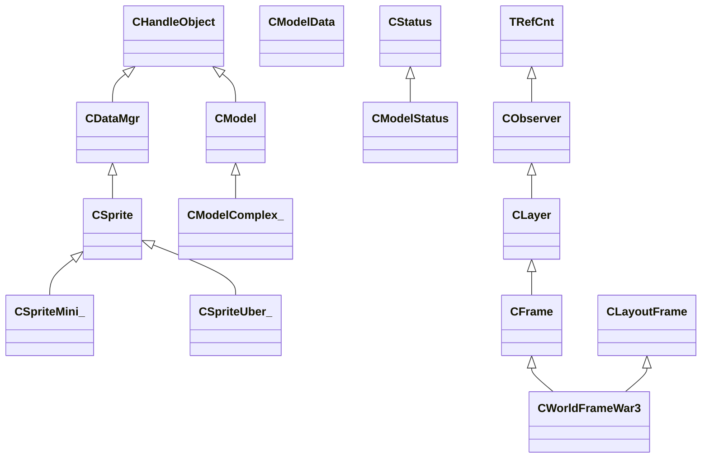

# War3 Runtime RTTI Ground Truth（2026-04-16）

> 目的：
> 把当前 `runtime shadow bridge v1 -> dynamic pose takeover` 所需的核心逆向事实统一沉淀到 `docs/plan`，后续实现优先引用本页，避免继续在“旧命名 + 半推断语义”上反复返工。

## 1. 使用规则

1. 本页优先使用 **RTTI 真实名字**，不再先起项目内别名。
2. 如果 RTTI 不存在，才允许使用“语义别名”；语义别名必须明确标注“不是暴雪原始类名”。
3. 旧文档里常写的：
   - `CSpriteUber`
   - `CSpriteMini`
   - `CModelComplex`
   这三个名字在本页一律改回 RTTI 真名：
   - `CSpriteUber_`
   - `CSpriteMini_`
   - `CModelComplex_`
4. 本页结论按可靠度分级：
   - `A`：RTTI / vtable / ctor / 直接汇编证据
   - `B`：反编译 + 多处 xref 可交叉验证
   - `C`：当前功能语义推断，尚未拿到更强名字证据

## 2. RTTI 先行：当前链路的真实类名

### 2.1 直接从 RTTI 读到的类名

| 类 | RTTI Type Descriptor | vftable | 可靠度 |
|---|---|---|---|
| `CSprite` | `0x6FB81928` | `0x6F96467C` | A |
| `CSpriteMini_` | `0x6FB817AC` | `0x6F9646F4` | A |
| `CSpriteUber_` | `0x6FB81790` | `0x6F9647BC` | A |
| `CModelData` | `0x6FB7FEF0` | `0x6F96172C` | A |
| `CModel` | `0x6FB7FE88` | `0x6F96173C` | A |
| `CModelComplex_` | `0x6FB7FF48` | `0x6F96174C` | A |
| `CModelStatus` | `0x6FB819C8` | `0x6F964840` | A |
| `CWorldFrameWar3` | `0x6FB8DA98` | `0x6F98DCD0` | A |

### 2.2 RTTI 直接确认的继承关系



### 2.3 RTTI 关键结论

1. `CSpriteUber_` 和 `CSpriteMini_` 都是 `CSprite` 的派生类，不是项目内临时起名。
2. `CModelComplex_` 确实是 `CModel` 的派生类，因此“complex runtime model”不是我们自己脑补出来的层。
3. `CWorldFrameWar3` 是多继承对象：
   - 主链：`CFrame -> CLayer -> CObserver -> TRefCnt`
   - 次链：`CLayoutFrame`
4. `CLayoutFrame` 的 RTTI base descriptor 偏移是 `180` 十进制，即 `0xB4`。
   - 这说明 `CWorldFrameWar3` 不是单 vptr 的简单类，后续如果做更深的 UI/world frame 混合 Hook，要警惕 secondary vtable。

### 2.4 原始 RTTI Base Class Array 摘要

| 类 | RTTI base array 摘要 | 可靠度 |
|---|---|---|
| `CSprite` | `CSprite -> CDataMgr -> CHandleObject` | A |
| `CSpriteMini_` | `CSpriteMini_ -> CSprite -> CDataMgr -> CHandleObject` | A |
| `CSpriteUber_` | `CSpriteUber_ -> CSprite -> CDataMgr -> CHandleObject` | A |
| `CModel` | `CModel -> CHandleObject` | A |
| `CModelComplex_` | `CModelComplex_ -> CModel -> CHandleObject` | A |
| `CModelData` | `CModelData -> TAllocatedHandleObject<CModelData,128> -> CHandleObject` | A |
| `CModelStatus` | `CModelStatus -> CStatus` | A |
| `CWorldFrameWar3` | `CWorldFrameWar3 -> CFrame -> CLayer -> CObserver -> TRefCnt`，另有 `CLayoutFrame` 分支，base offset=`0xB4` | A |

## 3. 这轮必须修正的旧误判

### 3.1 `CSpriteUber_::vftable` 某槽位不是 “set model”

`CSpriteUber_::vftable` 上 `0x6F183570` 的函数体只有：

```cpp
double __thiscall sub_6F183570(float *this)
{
  return *(this + 100);
}
```

对应汇编与上游更新链交叉后，可以确认：

1. 这不是 `set_model`。
2. 它更接近“读取 `CSpriteUber_ + 0xE8` 的 float 值”。
3. 结合 `0x6F182300` / `0x6F1826C0` 的汇编，这个 `+0xE8` 实际就是当前 sprite 的 **uniform scale**。

结论：

- 旧路线里“从 `CSpriteUber_` 某 vtable slot 直接挂 `SpriteSetModel`”这一假设已经失效。
- 以后如果需要 `sprite -> model resource` 的稳定绑定，不允许再用这个旧槽位。

### 3.2 `CSpriteUber_ + 0xE8` 不是 runtime model 指针

`0x6F182300` 汇编关键片段：

```asm
movss   xmm0, dword ptr [edi+0E8h]
...
mov     ecx, [edi+20h]
lea     edx, [ebp+var_88]
call    sub_6F12F0A0
```

可直接确认：

1. `CSpriteUber_ + 0x20` 才是传给 `sub_6F12F0A0` 的 runtime model。
2. `CSpriteUber_ + 0xE8` 是 float，并被复制成 `{scale, scale, scale}` 后参与姿态/变换链。

这也解释了为什么旧文档里 `+0x20` 与 `+0xE8` 曾经出现混用：那是反编译器在 fastcall + xmm 传参下给出的伪影，不是实际结构矛盾。

## 4. 资源 -> runtime model -> sprite 的真实创建链

### 4.1 `CModelData`：资源层

#### `0x6F127610`

语义建议名：

`CModelData_CreateOwnedHandleForHost`

关键事实：

1. 分配 `HMODELDATA`。
2. 运行 `CModelData::ctor`（`0x6F121B00`）。
3. 把 retain 后的 `HMODELDATA` 写到宿主对象 `+0x9C`（即十进制 `156`）。

可靠度：A

#### `0x6F121B00`

RTTI 直接指向 `CModelData::vftable`。

关键事实：

1. 构造出的确是 `CModelData`。
2. 当前已确认的资源数组区仍然成立：
   - `+0x08` geoset array
   - `+0x18` geoset binding records
   - `+0x28` material array
   - `+0x38` / `+0x48` 额外 binding / byte table
   - `+0x58` extra resource array
   - `+0x94` flags
   - `+0x9C` retained self/model-data handle

可靠度：A / B

### 4.2 `CModel`：runtime model 基类

#### `0x6F12A400`

语义建议名：

`CModel_CreateWithOwnedModelData`

关键事实：

1. 分配 `HMODEL`。
2. 运行 `CModel::ctor`（`0x6F121880`）。
3. 再分配一个新的 `HMODELDATA`。
4. 写 `CModelData + 0x54 = 1`。
5. 把 retain 后的 `CModelData` handle 写到 `CModel + 0x9C`。

可靠度：A

#### `0x6F121880`

RTTI 直接指向 `CModel::vftable`。

当前已钉住的字段：

| 偏移 | 含义 | 证据 | 可靠度 |
|---|---|---|---|
| `+0x08` | runtime geoset array header | ctor + `0x130CD0` | B |
| `+0x18` | runtime geoset binding record array | ctor + `0x130CD0` | B |
| `+0x28` | runtime material handle array | ctor + `0x130CD0` | B |
| `+0x48` | extra resource array | ctor + `0x130CD0` | B |
| `+0x5C` | final pose matrix count | `0x6F12FDC0` | A |
| `+0x60` | final pose matrix array | `0x6F12FDC0` | A |
| `+0x64` | current world 3x4 | `0x6F12F0A0` | A |
| `+0x94` | flags | `0x6F12F0A0 / 0x6F12EC90` | A |
| `+0x98` | override / part-state controller ptr | `0x6F12F3B0` | B |
| `+0x9C` | retained `CModelData` handle | `0x6F12A400 / 0x6F130CD0` | A |
| `+0xC4` | child bucket count | `0x6F131F60 / 0x6F12EC90` | B |
| `+0xC8` | child bucket array | `0x6F131F60 / 0x6F12EC90` | B |
| `+0xD4` | child visibility cache | `0x6F12E900 / 0x6F12EC90` | B |
| `+0xFC` | pose / override scratch root | `0x6F12F3B0` | B |

### 4.3 `CModelComplex_`：带 child link 的 runtime model

#### `0x6F12A5C0`

语义建议名：

`CModelData_PromoteToRuntimeModel`

关键事实：

1. 输入是现有的 `CModelData`。
2. 若 `modelData + 0x94` 的 `0x10` 位置位，则走 `CModelComplex_` 路径。
3. 否则走普通 `CModel` 路径。
4. 这是当前最可信的 `resource -> runtime model` 转换入口。

可靠度：A

#### `0x6F1219C0`

语义建议名：

`CModelComplex_::ctor`

关键事实：

1. 先调用 `CModel::ctor(this, 16)`。
2. 再改写 vptr 为 `CModelComplex_::vftable`。
3. 从 `+0xA0` 开始补充 complex 专属字段。

可靠度：A

#### `0x6F130D90`

语义建议名：

`CModelComplex__CopyFromModelData`

关键事实：

1. 先调用 `0x6F130CD0` 复制 `CModel` 共有资源区。
2. 再调用：
   - `0x6F131F60`
   - `0x6F1320D0`
   - `0x6F1322B0`
   - `0x6F132190`
3. 这说明 `CModelComplex_` 不只是“多几个 flag”，而是多出了一整组 child / attachment / extra records 的运行时数组。

可靠度：A / B

#### `0x6F131F60`

语义建议名：

`CModelComplex__BuildChildRuntimeModelLinks`

关键事实：

1. 遍历源资源里的 child/link records。
2. 为每个 child 分配 16B link node。
3. 对 `child->modelData` 递归调用 `0x6F12A5C0`。
4. 结果写入 `linkNode + 0x08 = child runtimeModel`，`+0x0C = source meta`。

结论：

- `CModelComplex_` 不是“普通模型 + 一点附加状态”，而是真正的 **runtime model tree 根**。
- 动态阴影如果要稳定覆盖挂点、子模型、附属发射器，就不能只盯 root `CModel`。

可靠度：A

### 4.4 `CSprite*`：实例层

#### `0x6F185250`

语义建议名：

`SpriteHost_CreateSpriteAndBindRuntimeModel`

关键事实：

1. 根据宿主 flags 分配 `HSPRITEUBER` 或 `HSPRITEMINI`。
2. 分别调用：
   - `CSpriteUber_::ctor`（`0x6F180800`）
   - `CSpriteMini_::ctor`（`0x6F180770`）
3. 然后再把对象头改写为：
   - `TAllocatedHandleObjectLeaf<CSpriteUber_,128>::vftable`
   - `TAllocatedHandleObjectLeaf<CSpriteMini_,256>::vftable`
4. 如果宿主对象 `+0x20` 有 model resource，则：
   - `sprite + 0x20 = 0x6F12A5C0(source->modelData)`
   - 立即跟进 `0x6F12F500 / 0x6F132E90 / 0x6F12FA50`

重要结论：

1. `TAllocatedHandleObjectLeaf<...>` 是 handle wrapper，不是我们应该拿来命名 runtime 语义的“真实类名”。
2. 真正该写进实现和文档里的仍然是：
   - `CSprite`
   - `CSpriteMini_`
   - `CSpriteUber_`

可靠度：A

## 5. `CSprite` / `CSpriteMini_` / `CSpriteUber_` 的当前高置信字段

### 5.1 `CSprite` 基类

| 偏移 | 含义 | 证据 | 可靠度 |
|---|---|---|---|
| `+0x20` | runtime model handle / `CModel*` | `0x6F185250`, `0x6F1820C0`, `0x6F182300` | A |
| `+0x28` | sprite flags | update path 分支 | A |
| `+0x2C` | sequence / state word，`0xFFFE` 为特殊态 | `0x6F1820C0`, `0x6F182300` | B |

### 5.2 `CSpriteMini_`

| 偏移 | 含义 | 证据 | 可靠度 |
|---|---|---|---|
| `+0x64` | 3x3 / 3x4 source transform block | `0x6F1820C0` 前置 `sub_6F137170` | B |
| `+0x88/+0x8C/+0x90` | world position xyz | `0x6F1820C0` 汇编 | A |
| `+0x94` | uniform scale | `0x6F1820C0` 汇编，传给 `0x6F12F0A0` | A |

### 5.3 `CSpriteUber_`

| 偏移 | 含义 | 证据 | 可靠度 |
|---|---|---|---|
| `+0x94` | animation override / alternate time-path gate | `0x6F182300`, `0x6F1826C0` | B |
| `+0xA0` | override sequence time（秒） | `0x6F1826C0` 汇编 -> `0x6F12F500` | A |
| `+0xC0/+0xC4/+0xC8` | world position xyz | `0x6F182300` 汇编 | A |
| `+0xE8` | uniform scale | `0x6F182300` 汇编 | A |
| `+0x108` | rotation / transform source block | `0x6F182300` 前置 `sub_6F137170(this+0x108)` | B |
| `+0x168` | model-status related block | `0x6F182300` -> `0x6F12F4C0(this+0x168, mode)` | B |
| `+0x190` | `CModelStatus` managed object起点附近 | ctor / vtable 周围 | C |

## 6. `CSpriteUber_` vtable 里最关键的两个方法

### 6.1 `vf[3] @ 0x6F182300`

RTTI 真实宿主类：

`CSpriteUber_`

当前语义别名：

`CSpriteUber__PreRenderAndUpdatePosePalette`

为什么可以这么叫：

1. 它先推进动画时间：
   - `0x6F12EE90`
   - `0x6F12FAA0`
   - `0x6F12EF70`
   - 或 override 分支 `0x6F12F500`
2. 然后调用 `0x6F12F3B0` 构造/刷新 pose scratch。
3. 再把：
   - `sprite + 0x108` 的旋转/朝向
   - `sprite + 0xC0` 的世界位置
   - `sprite + 0xE8` 的 uniform scale
   一并送入 `0x6F12F0A0`。
4. `dt != 0` 时，尾部必然跟进 `0x6F12F7E0` 刷 child/attachment runtime tree。

可靠度：A / B

### 6.2 `vf[4] @ 0x6F1826C0`

RTTI 真实宿主类：

`CSpriteUber_`

当前语义别名：

`CSpriteUber__LightUpdateAndPropagatePose`

为什么这样定义：

1. 同样推进动画时间，但逻辑更轻。
2. 仍然在尾部进入 `0x6F12F7E0`。
3. 这是 `CSpriteUber_` 的第二条稳定 pose 刷新路径，不应忽略。

可靠度：B

### 6.3 当前对 Hook 时机的直接影响

1. 如果要做 **生产级 pose capture**，优先在：
   - `post vf[3]`
   - `post vf[4]`
   或者更底层的：
   - `post 0x6F12F7E0`
   去取最终结果。
2. 如果只挂 `post 0x6F12F0A0`，拿到的是 **root world matrix + root pose pass**，不是 child-stable 最终态。

## 7. `CModel` pose 链：当前最可靠的对象化解释

### 7.1 `0x6F12F3B0`

当前语义别名：

`CModel_BuildPartStateAndScratchPoseTree`

直接事实：

1. 只在：
   - `CModel + 0x98 != 0`
   - `CModel + 0x94` 的 `0x10` 位置位
   时工作。
2. 它会：
   - 把当前 matrix stack 再 push 一层到全局 scratch arena
   - `sub_6F780120(arg)`
   - `sub_6F77C1D0(controller, &CModel+0xFC)`

结论：

1. `CModel + 0x98` 是 part-state / override graph controller 一类对象。
2. `CModel + 0xFC` 是这个 controller 的输出根。
3. 这里不是 draw-time skin output，更像“本帧 pose/override graph 的 scratch 根节点”。

可靠度：A / B

### 7.2 `0x6F12F0A0`

当前语义别名：

`CModel_SetWorldMatrixAndEvaluateRootPose`

直接事实：

1. 把 3x4 world matrix 写入 `CModel + 0x64`。
2. 根据 scale 是否约等于 `1.0f`，改写 `CModel + 0x94` 的 `0x4` bit。
3. 将 matrix stack push 到临时 arena。
4. 根据 `CModel + 0x94` 的 `0x10` bit 分流到：
   - `0x6F12E900`
   - `0x6F12EB70`

结论：

1. 它是 **root pose 入口**，不是最终稳定出口。
2. 它适合：
   - 统计 pose 活跃帧
   - 取 root transform
   - 做轻量 runtime model hit 采样
3. 它不适合直接当“动态单位最终姿态权威点”。

可靠度：A

### 7.3 `0x6F12E900` / `0x6F12EB70`

当前语义别名：

- `CModelComplex__EvaluatePoseAndVisibleParts`
- `CModel__EvaluatePoseSimple`

原因：

1. 两条链都在尾部走：
   - `0x6F12FED0`
   - `0x6F12FDC0`
2. `0x6F12E900` 额外处理：
   - override graph
   - visible part / child visibility cache
   - per-child part dispatch
3. `0x6F12EB70` 是更短的 simple path。

可靠度：B

### 7.4 `0x6F12FDC0`

当前语义别名：

`CModel_CopyResolvedPoseMatricesToOutputPalette`

直接事实：

1. 循环次数来自 `CModel + 0x5C`。
2. 目标指针来自 `CModel + 0x60`。
3. stride 固定 `48B`，即 `3x4 matrix`。

这条结论已经足够作为未来 GPU palette upload 的锚点。

可靠度：A

### 7.5 `0x6F12F7E0` + `0x6F12EC90`

当前语义别名：

- `CModel_PropagatePoseToChildRuntimeTree`
- `CModelComplex__RecurseChildRuntimeTree`

直接事实：

1. `0x6F12F7E0` 会把当前 matrix stack 再 push 一层。
2. 然后调用 `0x6F12EC90(a1, *(a1 + 0x9C))` 一路递归。
3. `0x6F12EC90` 内部：
   - 对当前 controller 做 `sub_6F77C280(...)`
   - 遍历 `CModelComplex_` 的 child link arrays
   - 对每个 child runtime model 再次递归

结论：

1. `post 0x6F12F7E0` 才是“root + child + attachment runtime tree 都已经刷新过”的第一稳定时机。
2. 这和当前项目把生产级接入点收敛到 `CSpriteUber_` prerender 返回点的方向是一致的。

可靠度：A / B

## 8. `CWorldFrameWar3`：与当前渲染接入相关的 RTTI 事实

### 8.1 vtable 关键槽位

| 槽位 | 地址 | 当前语义 | 可靠度 |
|---|---|---|---|
| `vf[11]` | `0x6F368480` | `CWorldFrameWar3_UpdateWorldFrameAndPreparePasses` | A |
| `vf[12]` | `0x6F3681C0` | `CWorld_RenderScene` | A |

### 8.2 这一页对现有 plan 的约束

1. `CWorldFrameWar3` 的 RTTI 已经足够说明它是当前世界帧边界的正式宿主类。
2. 但对动态 pose takeover 来说，`CWorldFrameWar3` 仍然只是帧边界和 RenderScene 锚点。
3. 真正的动态模型姿态权威数据仍然在：
   - `CSpriteUber_`
   - `CModel`
   - `CModelComplex_`
   这条链里。

## 9. 对后续实现的直接指导

### 9.1 当前可直接作为生产级锚点的点位

1. `0x6F185250`
   - `sprite <- runtimeModel` 创建/绑定入口
2. `0x6F12A5C0`
   - `modelData -> runtimeModel` 提升入口
3. `post 0x6F182300`
   - `CSpriteUber_` 重路径 prerender 返回
4. `post 0x6F1826C0`
   - `CSpriteUber_` 轻路径 pose 返回
5. `post 0x6F12F7E0`
   - child-stable 最终 pose runtime tree
6. `0x6F12FDC0`
   - 最终 3x4 palette 拷出点

### 9.2 当前不应再继续当主路径的旧点位

1. `CSpriteUber_` 旧 `set_model` vtable 假设
2. 仅靠 `post 0x6F12F0A0` 就认定 pose 已稳定
3. 在 `Dispatch_Common / Special` 深热路径里继续找动态姿态主入口

### 9.3 当前最合理的工程顺序

1. 继续保留 `0x6F185250 / 0x6F12A5C0` 的 resource/runtime 绑定记账。
2. 把动态 pose 采样主入口收敛到：
   - `post CSpriteUber_::vf[3]`
   - `post CSpriteUber_::vf[4]`
   - 或统一落到 `post 0x6F12F7E0`
3. 读取 `CModel + 0x5C/+0x60` 做 palette snapshot。
4. 在 bridge 层优先消费：
   - `static model resource`
   - `runtime model identity`
   - `per-frame 3x4 pose palette`
5. 在这一整条链完全稳定前，不要重新启用“动态单位 persistent cache”。

## 10. 仍未命名完成、但语义边界已足够清楚的点

| 地址 | 当前建议名 | 说明 | 可靠度 |
|---|---|---|---|
| `0x6F12F3B0` | `CModel_BuildPartStateAndScratchPoseTree` | 名字仍是语义别名，RTTI 尚未给出 controller 真类名 | B |
| `0x6F12E900` | `CModelComplex__EvaluatePoseAndVisibleParts` | complex path 的上层 driver | B |
| `0x6F12EB70` | `CModel__EvaluatePoseSimple` | simple path 的上层 driver | B |
| `0x6F12EC90` | `CModelComplex__RecurseChildRuntimeTree` | child runtime tree 递归器 | B |
| `CModel + 0x98` 指向对象 | `part-state / override controller` | 真 RTTI 名字还没钉住 | C |

## 11. 本页与旧文档的关系

1. 本页不推翻 `docs/research/war3_render_issues/18_* / 22_* / war3_model_runtime` 的主方向。
2. 本页主要负责做三件事：
   - 把名字拉回 RTTI 真名
   - 把 wrapper 与真实类分开
   - 把 pose 主入口从“可能”收紧到“当前最可信”
3. 以后如果继续写新逆向页，建议默认引用本页里的真实类名和偏移，不再重复使用无下划线旧名。

## 12. 一页结论

1. `CSpriteUber_`、`CSpriteMini_`、`CModelComplex_` 都已经被 RTTI 坐实，后续不要再用去下划线的项目内简称当“正式类名”。
2. 动态单位姿态主链已经足够清楚：
   - `CModelData`
   - `CModel / CModelComplex_`
   - `CSpriteUber_::vf[3]/vf[4]`
   - `0x6F12F3B0`
   - `0x6F12F0A0`
   - `0x6F12E900 / 0x6F12EB70`
   - `0x6F12FDC0`
   - `0x6F12F7E0`
3. 生产级接入点应优先收敛到：
   - `post CSpriteUber_ prerender return`
   - 或 `post 0x6F12F7E0`
4. `CModel + 0x5C/+0x60` 的 3x4 palette 仍然是未来动态阴影主路径最稳的输出格式。
5. 这页可以作为当前阶段后续实现、修文档、补 IDA 注释时的统一基线。
