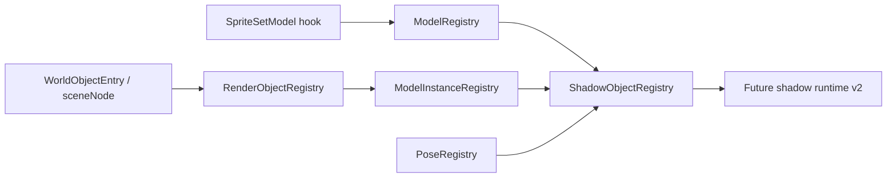

# War3 Model Runtime v2

This note sketches the long-term bridge from draw-time shadow freeze toward a
model-resource + pose-driven shadow runtime.

## Current scaffold

- `ModelRegistry`: records `SpriteSetModel` path selection and resolves model
  resources by sprite/path.
- `ModelInstanceRegistry`: records object identity at the
  `RenderObjectInfo` / `sceneNode` layer.
- `PoseRegistry`: placeholder for future animation and pose updates.
- `ShadowObjectRegistry`: joins model/resource/instance/pose identity for the
  future shadow runtime.

## Data flow

## Boundary

This scaffold is intentionally read-only. It does not change current shadow
selection, caching, or replay behavior. It only records and exposes the data
shapes we will need for model caching and animation-driven shadow updates.

## First reverse-engineering findings (2026-04-03)

The first useful resource chain is now confirmed in IDA:

- `sub_6F127610`
  - allocates `HMODELDATA`
  - constructs `CModelData`
  - stores the handle into `CModelComplex_ + 156`
- `sub_6F12A400`
  - allocates `HMODEL`
  - constructs `CModel`
  - allocates `HMODELDATA`
  - marks `CModelData + 84 = 1`
  - stores the retained model-data handle into `CModel + 39`
- `sub_6F12A5C0`
  - converts existing model-data into either `HMODEL` or `HMODELCOMPLEX`
  - complex path is gated by `modelData + 148` bit `0x10`
- `sub_6F130CD0`
  - copies arrays and retained handles from `CModelData` into `CModel`
  - this looks like the current “resource -> runtime model” handoff
- `sub_6F66BA00`
  - builds `%s.mdx` and `%s_portrait.mdx`
  - feeds the resolved paths into `sub_6F3356B0` / `sub_6F3357E0`
  - this is a real object-data driven model/portrait preload path

Current working hypothesis:

- `CModelData/HMODELDATA` is the resource/cache layer
- `CModel/HMODEL` is the runtime model layer consumed by sprites/instances
- `SpriteSetModel` is still the right high-level hook conceptually, but the
  current vtable-slot assumption in our project needs to be re-verified against
  IDA before we build further on it

Still unresolved:

- where sequence time and node/bone transforms are updated for world units
- whether unit animation ultimately reaches a reusable bone palette or only a
  CPU-deformed vertex stream before draw submission

## Animation-chain findings (main thread, 2026-04-03)

The first strong per-frame animation entry is now visible on the sprite side.

- `sub_6F185250`
  - constructs `HSPRITEUBER` or `HSPRITEMINI`
  - if the source object has a model at `this + 8`, it calls
    `sub_6F12A5C0(this[8])`
  - then immediately runs `sub_6F12F500(...)` and `sub_6F132E90()`
  - this is a concrete `sprite -> runtime model` creation path
- `sub_6F182300(float dt, ...)`
  - looks like the main animated update path for `CSpriteUber`
  - advances animation state through:
    - `sub_6F12EE90`
    - `sub_6F12FAA0`
    - `sub_6F12EF70`
  - then rebuilds transform state through:
    - `sub_6F12F3B0`
    - `sub_6F12F0A0`
    - `sub_6F12F7E0`
- `sub_6F1826C0(float dt)`
  - a lighter variant of the same idea
  - also advances animation and refreshes a transform block
- `sub_6F12F3B0`
  - does **not** touch vertices
  - pushes a 3x4 matrix stack into the temporary transform arena and then
    calls `sub_6F77C1D0(..., this + 0xFC)`
  - this strongly suggests a per-instance pose/bone output block
- `sub_6F12F0A0`
  - copies a 3x4 transform into `a1 + 100`
  - then dispatches either `sub_6F12E900` or `sub_6F12EB70`
  - those two paths recurse over animation links and transformation state
- `sub_6F1AAAF0` / `sub_6F1AB240`
  - are ordinary transform helpers (point transform / scale accumulation)
  - they reinforce that this chain is still operating on pose matrices, not
    final triangle data

### Current interpretation

The evidence now leans toward:

- War3 maintains a real runtime model object per sprite/instance
- animation time is advanced on that runtime object each frame
- node/bone-like transform state is rebuilt into internal blocks
- only **after** that stage does the engine proceed toward actual draw-time
  geometry submission

That means the long-term route is still viable:

- cache static model/geoset resources once
- re-use per-instance animation/pose state each frame
- avoid pretending that dynamic units are static persistent geometry

## Additional main-thread findings (2026-04-03, second pass)

The animation chain is now more concrete than the first note above and it
points even more strongly at a runtime pose system, not a "final CPU vertex
cache" model.

- `sub_6F1820C0` / `sub_6F182300`
  - are full `CSpriteUber` animation/update paths
  - they both:
    - advance animation state via `sub_6F12EE90 / sub_6F12FAA0 / sub_6F12EF70`
    - rebuild pose/transform state via `sub_6F12F3B0 / sub_6F12F0A0`
    - finalize via `sub_6F12F7E0`
- `sub_6F12F0A0`
  - writes a 3x4 transform block into `a1 + 100`
  - then recurses through `sub_6F12E900` or `sub_6F12EB70`
  - this looks like node/bone transform propagation, not vertex baking
- `sub_6F12F7E0 -> sub_6F12EC90`
  - recursively walks child model links
  - repeatedly pushes the temporary transform stack and calls into
    `sub_6F77C280(v3, a2 + 92)`
  - this is consistent with "apply/update pose blocks on a runtime model tree"
- `sub_6F77A370`
  - writes through `a1[2] + 16 * a2`
  - then calls `sub_6F77BA30(*(_DWORD *)(a1[17] + 24) + 140 * a2, ...)`
  - this is another strong hint that the underlying library keeps
    fixed-stride per-bone/per-node runtime state rather than only a final
    skinned vertex stream

### Stronger interpretation

The current best reading is:

- `CModelData/HMODELDATA` is still the resource side
- `CModel/HMODEL` is the runtime instance/model side
- `CSpriteUber` updates animation time and rebuilds a runtime pose tree every
  frame
- the pose tree is represented as matrix/transform blocks that are propagated
  recursively across linked model nodes
- actual draw submission happens after this pose stage, not inside it

This keeps the long-term direction intact:

- static model/geoset data should be cached once
- dynamic unit shadows should consume per-instance pose state each frame
- the future mainline should target either:
  - `static geometry + palette/pose upload`, if we can locate a stable bone
    palette extraction point
  - or `static model resource + per-instance skinned-output update`, if the
    engine only exposes post-skin output

### Important correction: current `SpriteSetModel` slot is almost certainly wrong

The project's current `war3_model_hook.cpp` assumes the `CSpriteUber`
`set_model` vtable slot lives at offset `0xE8`.

Main-thread IDA inspection of the `CSpriteUber` vtable at `0x6F9647BC` shows
that slot `0xE8` points to `sub_6F183570`, which simply returns
`*(this + 100)`. It is **not** a model-binding function.

That means:

- the current high-level idea of recording `sprite -> model` at bind time is
  still good
- but the exact production hook point must be re-verified before we build the
  long-term `ModelRegistry` contract on top of it

For now, the most trustworthy model-binding evidence comes from concrete
callers of `sub_6F12A5C0`, especially `sub_6F185250` and `sub_6F131F60`.

### Important warning

The project's current `SpriteSetModel` vtable-slot assumption is still not
fully trusted. The resource/model conclusions above come from callers of
`sub_6F12A5C0` and the sprite-construction path, not from proving the current
hook offset is exact. Before building a production `sprite -> model resource`
contract, that hook point still needs to be re-verified.

## Dynamic pose deepening (2026-04-04)

The next reverse pass has now answered the most important dynamic-shadow
question.

- `CGeosetData + 0xF0/+0xF4/+0x100`
  - stores `matrix_group_count / matrix_group_sizes / matrix_indices`
- `sub_6F131150 -> sub_6F131210 -> sub_6F132A10`
  - builds the `source group -> remapped runtime slot` rule
- `sub_6F12FDC0`
  - copies the resolved 48-byte 3x4 matrices into:
    - `CModel + 0x5C = final pose matrix count`
    - `CModel + 0x60 = final pose matrix array`
- preferred hook points:
  - root runtime model palette only: `post sub_6F12F0A0`
  - full child-runtime / attachment-stable state: `post sub_6F12F7E0`

Current best conclusion:

- dynamic units should preferentially use the `static model resource + per-frame
  3x4 pose palette` route
- there is still no stronger evidence for a more authoritative or more stable
  post-skin CPU vertex cache

Detailed write-up:

- `docs/research/war3_render_issues/22_cmodel_pose_palette_reverse/README.md`

## Third-pass findings: runtime model / animation chain (2026-04-03)

The main-thread reverse work now ties the runtime-model chain together more
concretely.

### Resource -> runtime model creation

- `sub_6F185250`
  - constructs `HSPRITEUBER` / `HSPRITEMINI`
  - if the source object has a model at `this + 8`, it calls
    `sub_6F12A5C0(this[8])`
  - immediately follows with `sub_6F12F500(...)`, `sub_6F132E90()`, and
    `sub_6F12FA50(v3)`
  - this is now the most trustworthy `sprite -> runtime model` creation path
- `sub_6F12A5C0`
  - converts existing `CModelData/HMODELDATA` into runtime `CModel/HMODEL`
  - complex path calls `sub_6F130D90`, normal path calls `sub_6F130CD0`
- `sub_6F130D90`
  - extends `sub_6F130CD0`
  - additionally calls `sub_6F131F60`, `sub_6F1320D0`, `sub_6F1322B0`,
    `sub_6F132190`
  - this strongly suggests "complex runtime model" population rather than a
    single flat resource copy
- `sub_6F131F60`
  - allocates/link-builds child runtime model nodes
  - repeatedly calls `sub_6F12A5C0(*(_BYTE **)(v7 + 8))`
  - this makes it clear that the runtime side is a linked model tree, not just
    one monolithic final vertex buffer

### Per-frame animation / pose update

- `sub_6F1820C0` / `sub_6F182300`
  - appear to be the main `CSpriteUber` animation/update paths
  - both do:
    - animation advance: `sub_6F12EE90 / sub_6F12FAA0 / sub_6F12EF70`
    - pose propagation: `sub_6F12F3B0 / sub_6F12F0A0`
    - final recursive update: `sub_6F12F7E0`
- `sub_6F1825E0` / `sub_6F1826C0`
  - lighter variants that still advance animation and invoke `sub_6F12F7E0`
- `sub_6F12F0A0`
  - writes a 3x4 transform block into `a1 + 100`
  - then recurses into `sub_6F12E900` or `sub_6F12EB70`
- `sub_6F12F3B0`
  - pushes the temporary 3x4 stack and calls `sub_6F77C1D0(..., a1 + 252)`
- `sub_6F12F7E0 -> sub_6F12EC90`
  - recursively walks child runtime model links
  - repeatedly pushes the transform stack and calls `sub_6F77C280(v3, a2+92)`

### What this means

The current evidence is now strong enough to treat War3 as maintaining a real
runtime pose/model tree per sprite instance:

- resource side: `CModelData/HMODELDATA`
- runtime instance/model side: `CModel/HMODEL`
- per-frame sprite update:
  - advance animation state
  - rebuild pose / node / bone transforms
  - recurse over child runtime model links
- draw submission happens after the pose stage, not inside these functions

This keeps the long-term direction intact:

- cache static model/geoset resources once
- track runtime model / sprite identity separately from draw-time buffers
- consume per-instance pose state each frame for shadows

### Practical design consequence

For dynamic unit shadows, the preferred future path is no longer
"cache final vertices and hope they stay valid". The evidence now points toward
one of these two correct contracts:

1. `static geometry + per-frame pose/palette upload`
2. `static model resource + per-instance skinned-output update`

The decisive remaining question is whether the runtime model exposes a stable
bone/palette block before draw submission, or whether War3 only exposes the
post-skin CPU output.

## Fourth-pass findings: per-node / per-bone runtime state (2026-04-03)

The low-level animation helpers now show a stronger fixed-stride runtime-state
pattern than the earlier passes.

- `sub_6F12F500`
  - calls `sub_6F77A370(a2)` when `this + 152` is present
  - then recurses across linked child runtime models
- `sub_6F77A370`
  - writes through `a1[2] + 16 * a2`
  - sets a dirty flag on `a1[21]`
  - then calls `sub_6F77BA30(*(_DWORD *)(a1[17] + 24) + 140 * a2, ...)`
- `sub_6F77A1E0`
  - computes a delta time / playback advance
  - updates `a1 + 76/80`
  - then calls `sub_6F77BA30(...)` for a specific indexed slot
  - afterwards propagates the frame delta into several fixed-stride arrays
- `sub_6F77BA30`
  - consumes:
    - a per-track descriptor block at stride `140`
    - a per-track runtime slot at stride `16`
    - a frame/index advance
  - returns success/failure depending on track update validity

### Stronger interpretation

This now looks much closer to a real indexed animation-track system than to an
opaque "final vertices only" pipeline:

- `140`-byte descriptors look like track metadata / keyframe streams
- `16`-byte slots look like compact per-track runtime values
- the caller graph shows that sprite updates advance these track values first,
  then rebuild the higher-level pose tree

### Consequence for the roadmap

This does **not** yet prove that War3 exposes a ready-to-upload GPU bone
palette. But it does prove that the runtime has structured animation-track
state before draw submission.

That shifts the preferred long-term research order to:

1. locate the stable per-track / per-bone runtime arrays
2. determine whether they can be converted directly into a palette upload
3. only if that fails, fall back to a "per-instance skinned-output update"
   design

### Confirmed correction: current SpriteSetModel hook slot is wrong

Main-thread inspection of the `CSpriteUber` vtable at `0x6F9647BC` shows:

- offset `0xE8` points to `sub_6F183570`
- `sub_6F183570` simply returns `*(this + 100)`

So the current project's `war3_model_hook.cpp` assumption that slot `0xE8`
represents a real model-binding function is incorrect. The model-runtime work
must therefore move to a better hook point, likely on the concrete
`sub_6F185250` / `sub_6F12A5C0` creation path or another verified model bind
entry.

## See also

- [war3_shadow_semantic_cost](../war3_shadow_semantic_cost/README.md)
- [war3_shadow_runtime_v2](../war3_shadow_runtime_v2/README.md)
