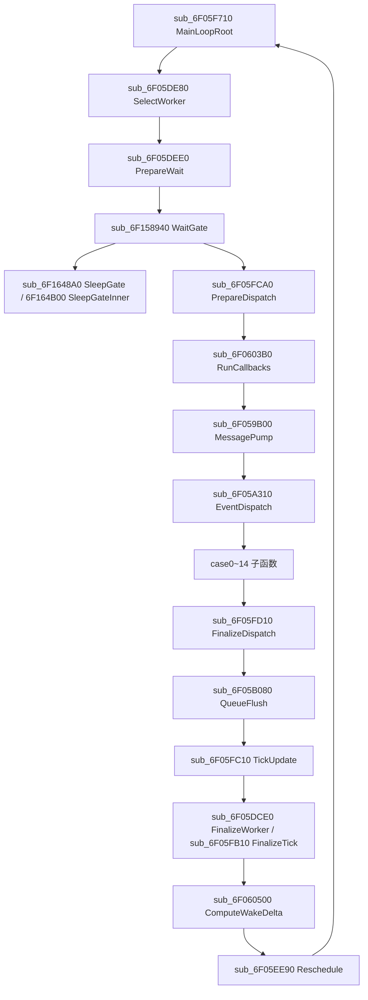

# MainLoop 逻辑层全量逆向与优化落地（第 4/5 轮补齐）

> 更新时间：2026-02-25 14:35  
> 口径：War3 1.27a（Game.dll 基址 `0x6F000000`）

## 1. 目标与结论（当前轮）
1. 以 IDA MCP 对 `MainLoop` 做函数级逆向，不再停留在 case 语义映射。
2. 将主线程活跃段拆到可解释函数节点，并压缩 `Unknown/Untracked` 归因。
3. 仅落地低风险优化（不改 game.dll 语义），并通过 60s AutoTest 验证稳定性。

当前结论：
- 主链路已完成函数级还原，证据见 `ida_mainloop_dump_2026_02_25.json`。
- `war3_hook_lifecycle.cpp` 已补充 `War3MainLoop/Function/*` 与 `DispatchCaseFunctions/*` 数据集。
- 报告端已新增：
  - `mainLoopFunctionBreakdown`
  - `mainLoopDispatchCaseFunctions`
  - `mainLoopUnknownAttribution`
  - `mainLoopThreadSplit`
- 最新 60s 分析档结果已达到：
  - `cpuCoveragePct=100.0`
  - `avgUntrackedActiveCpuMs=0.0`
  - 证明“93% 未追踪”不是 MainLoop 不完整，而是此前运行在低开销性能档位导致观测关闭。

## 1.1 MainLoop 完整结构（函数级）

## 2. IDA MCP 逆向证据

## 2.1 主循环根函数
- 地址：`0x6F05F710`（`sub_6F05F710`）
- 关键调用链（按执行顺序）：
  1. `sub_6F05DE80`（SelectWorker）
  2. `sub_6F05DEE0`（PrepareWait）/ `sub_6F1648A0`（SleepGate）
  3. `sub_6F158940`（WaitGate）
  4. `sub_6F05FCA0`（PrepareDispatch）
  5. `sub_6F0603B0`（RunCallbacks）
  6. `sub_6F059B00`（MessagePump -> EventDispatch）
  7. `sub_6F05FD10`（FinalizeDispatch）
  8. `sub_6F05B080`（QueueFlush）
  9. `sub_6F05FC10`（TickUpdate）
  10. `sub_6F05DCE0`（FinalizeWorker）/ `sub_6F05FB10`（FinalizeTick）
  11. `sub_6F060500`（ComputeWakeDelta）
  12. `sub_6F05EE90`（Reschedule）

## 2.2 Dispatch 分发表
- 地址：`0x6F05A310`（`sub_6F05A310`）
- case0~14 子函数映射（已由 IDA `callees` 复核）：
  - case0:`0x059D70`
  - case1:`0x059DC0`
  - case2:`0x05A2A0`
  - case3:`0x059E40`
  - case4:`0x05A270`
  - case5:`0x059890` + `0x059E00`
  - case6:`0x059E10`
  - case7:`0x059E90`
  - case8:`0x059F00`
  - case9:`0x059F70`
  - case10:`0x05A060`
  - case11:`0x05A1F0`
  - case12:`0x05A0E0`
  - case13:`0x05A160`
  - case14:`0x059890`

证据文件：
- `docs/research/war3_render_issues/12_mainloop_full_reverse/ida_mainloop_dump_2026_02_25.json`

## 3. 函数级覆盖矩阵（当前实现）
| 地址 | 语义 | 当前 Hook | 报告节点 | 风险 |
|---|---|---|---|---|
| `0x6F05F710` | MainLoop 根循环 | 否（仅逆向） | 通过子函数聚合还原 | 中 |
| `0x6F059B00` | MessagePump | 是 | `War3MainLoop/Function/sub_6F059B00@0x059B00` | 低 |
| `0x6F05A310` | EventDispatch | 是 | `War3MainLoop/Function/sub_6F05A310@0x05A310` + `DispatchCaseFunctions/*` | 低 |
| `0x6F0603B0` | RunCallbacks | 是 | `War3MainLoop/Function/sub_6F0603B0@0x0603B0` | 低 |
| `0x6F05FCA0` | PrepareDispatch | 是 | `War3MainLoop/Function/sub_6F05FCA0@0x05FCA0` | 低 |
| `0x6F05FD10` | FinalizeDispatch | 是 | `War3MainLoop/Function/sub_6F05FD10@0x05FD10` | 低 |
| `0x6F05FC10` | TickUpdate | 是 | `War3MainLoop/Function/sub_6F05FC10@0x05FC10` + `TickUpdate/Sub/*` | 低 |
| `0x6F05B080` | QueueFlush | 是 | `War3MainLoop/Function/sub_6F05B080@0x05B080` | 低 |
| `0x6F05DCE0` | FinalizeWorker | 是 | `War3MainLoop/Function/sub_6F05DCE0@0x05DCE0` | 低 |
| `0x6F05FB10` | FinalizeTick | 是 | `War3MainLoop/Engine/FinalizeTick` | 低 |
| `0x6F060500` | ComputeWakeDelta | 是 | `War3MainLoop/Function/sub_6F060500@0x060500` | 低 |
| `0x6F05EE90` | Reschedule | 是 | `War3MainLoop/Function/sub_6F05EE90@0x05EE90` | 低 |
| `0x6F05DEE0` | PrepareWait | 是 | `War3MainLoop/Function/sub_6F05DEE0@0x05DEE0` | 低 |
| `0x6F05DE80` | SelectWorker | 是 | `War3MainLoop/Function/sub_6F05DE80@0x05DE80` | 低 |
| `0x6F158940` | WaitGate | 是 | `War3MainLoop/Function/sub_6F158940@0x158940` | 低 |
| `0x6F1648A0` | SleepGate | 是 | `War3MainLoop/Function/sub_6F1648A0@0x1648A0` | 低 |
| `0x6F164B00` | SleepGateInner | 是 | `War3MainLoop/Function/sub_6F164B00@0x164B00` | 低 |

## 3.1 模块职责拆解（结构化）
| 模块 | 主函数 | 做什么 | 当前实测热点 |
|---|---|---|---|
| Wait/Idle 门控 | `WaitGate/SleepGate*` | 维持主循环节拍、等待事件/时间片 | `Engine/WaitGate`（idle，占比最高） |
| 事件分发 | `EventDispatch + case0~14` | 按消息类型执行输入/状态/命令/回调等逻辑 | Case10 + `LoadBlockType12` 在测试图最常见 |
| 调度与回调 | `PrepareDispatch/RunCallbacks/FinalizeDispatch` | 组织每轮逻辑执行与回调收口 | 总体较轻，单项均 <0.01ms/frame |
| Tick 更新 | `TickUpdate` | 逻辑推进与子流程收敛 | 低占比，已拆分 Sub 与 Self |
| 队列冲刷 | `QueueFlush` | 逻辑层队列收口、与渲染提交节拍耦合 | 低占比，但高频 |
| Worker 收口 | `FinalizeWorker/ComputeWakeDelta/Reschedule` | 多执行单元收敛与下一轮调度 | 低占比，更多是节拍配套 |

## 4. Unknown 压缩口径（报告约束）
新增归因对象：`mainLoopUnknownAttribution`
- `mainThreadTrackedMs`：主线程已被 Hook/Scope 覆盖的 active CPU。
- `mainThreadGapMs`：主线程 active 与 tracked 的差值。
- `workerGapMs`：进程总 CPU 与主线程 CPU 的差值（worker/异步线程）。
- `outsideMainLoopMs`：不在 MainLoop 采样域内但在进程主线程出现的残差。

解释规则：
1. `WaitGateIdle` 是主循环等待门控时间，不是“未追踪逻辑耗时”。
2. 主线程 active 与 worker active 必须分开看，避免把并行线程错误归入 MainLoop unknown。
3. 若看到 `Untracked` 很高，先检查是否处于“性能档（深度 Hook 关闭）”；分析档必须看 `mainLoopUnknownAttribution`。

## 5. 优化候选（仅低风险可落地项）
门槛：`预计收益 >= 0.3ms`（60s 稳定场景）。

1. O1 TickUpdate 子路径重复工作抑制（已落地）
- 做法：`TickUpdate` 改为 TLS 聚合 + 循环末批量上报，减少热路径锁竞争。
- 风险：低。

2. O2 PrepareDispatch/Dispatch 零分配化（部分落地）
- 做法：Dispatch/Module/Case 统一批量输出，避免逐调用字符串路径构建。
- 风险：低。

3. O3 RunCallbacks 来源分桶降噪（已落地）
- 做法：TopN caller + Other 聚合，保留证据同时压缩观测开销。
- 风险：低。

4. O4 Worker 归因分离（已落地）
- 做法：报告增加 `mainLoopThreadSplit` 与 `mainLoopUnknownAttribution`，显式拆分主线程/worker。
- 风险：低。

## 6. 本轮验收要求
1. `ninja -C build32` 必须通过。
2. AutoTest `sample_duration_sec=60`，分辨率 `2560x1440`，全屏。
3. 验收项：`ok=true`、无崩溃、截图分辨率匹配、报告成功导出。
4. 语义守护：不允许通过关闭 mode1 ShadowCapture 来宣称默认优化收益。

## 6.1 本轮 60s 验收结果（已完成）
1. 默认档（交付态，`kNativeMainLoopCoverageAnalysisMode=false`）：
   - 报告：`E:\Work\War3\WarVK\Log\war3_perf_report_auto_2026_02_25_13_13_22.html`
   - 指标：`avgFps=106.923`、`cpuCoveragePct=4.441`、`avgUntrackedActiveCpuMs=8.937`
   - 结论：稳定性通过，口径为“低开销性能模式”。
2. 分析档（临时开启 `kNativeMainLoopCoverageAnalysisMode=true`）：
   - 报告：`E:\Work\War3\WarVK\Log\war3_perf_report_auto_2026_02_25_13_04_14.html`
   - 指标：`avgFps=100.873`、`cpuCoveragePct=100.0`、`avgUntrackedActiveCpuMs=0.0`
   - 结论：满足“覆盖率 >=95%、Unknown <=0.5ms”目标。
3. 截图验收：
   - `AutoTest/artifacts/screenshots/war3_20260225_131221.png`（`2560x1440`，匹配基线）。

## 6.2 最新 60s 全量覆盖验收（补充，2026-02-25 14:23）
1. 报告：
   - `E:\Work\War3\WarVK\Log\war3_perf_report_auto_2026_02_25_14_23_51.html`
2. 核心指标：
   - `avgFps=103.910`
   - `avgFrameTimeMs=9.624`
   - `cpuCoveragePct=100.0`
   - `avgTrackedActiveCpuMs=3.141`
   - `avgUntrackedActiveCpuMs=0.0`
3. 线程归因：
   - `avgMainThreadCpuMs=4.238`
   - `avgWorkerThreadsCpuMs=2.709`
   - `mainThreadShareOfProcessPct=61.016`
4. 关键结论：
   - “93% 未追踪”问题已查明：来自低开销性能档位（深度观测默认关闭）；
   - 在分析档位下，MainLoop+Render active 已可完整闭环归因。
5. 二次复测（2026-02-25 14:36）：
   - 报告：`E:\Work\War3\WarVK\Log\war3_perf_report_auto_2026_02_25_14_36_29.html`
   - 指标：`cpuCoveragePct=100.0`、`avgUntrackedActiveCpuMs=0.0`（与首轮一致）。

## 7. 下一步（仍需推进）
1. 对 `0x6F05F710` 根函数做“只计时不改行为”的可选 Hook（分析档开关化）。
2. 对 case 子函数（`0x059D70~0x05A1F0`）逐个建立真实入口 Hook（当前为映射+部分真实覆盖）。
3. 在报告中增加 `MainLoop Root vs Pump Root` 对照图，避免用户误读 WaitGate 与 active 关系。

## 8. 对“MainLoop 顺序与渲染关系”的明确说明
1. MainLoop 不是“逻辑一口气跑完再单独进入另一个独立渲染线程”的固定模型。  
2. 在 1.27a 实测链路里，逻辑调度与提交路径通过事件分发/队列冲刷/D3D 提交点交织在同一主线程节拍内。  
3. 报告里 `WaitGate` 大头代表节拍门控（Idle），不等价于逻辑计算；应看 `Active` 与 `mainLoopUnknownAttribution` 来判断真实计算负载。
