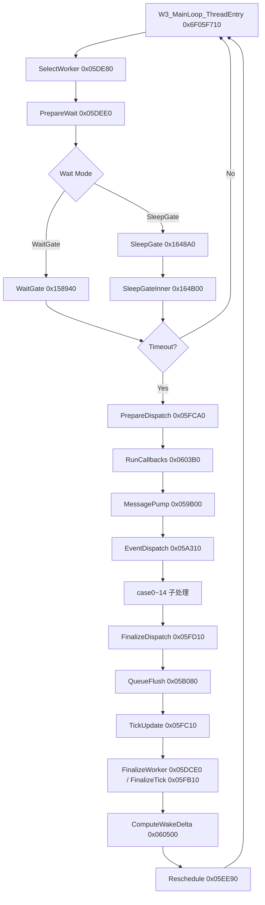
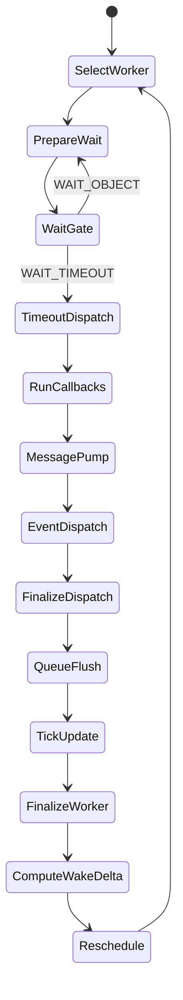
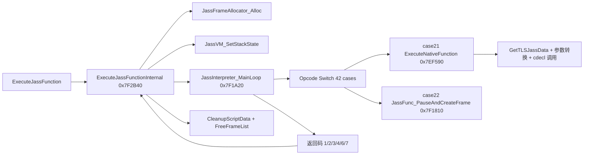
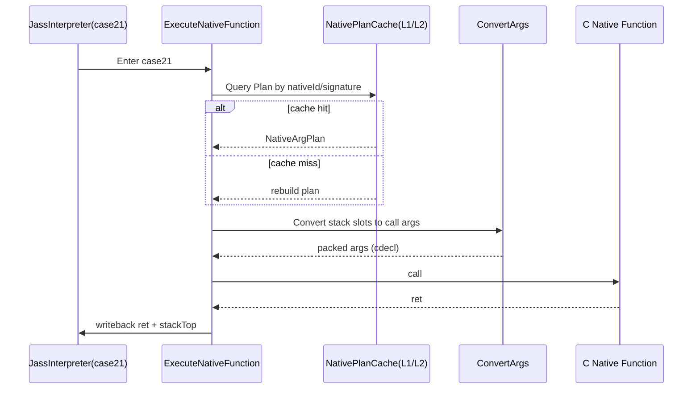
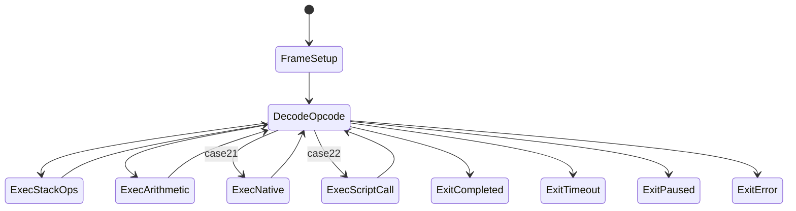
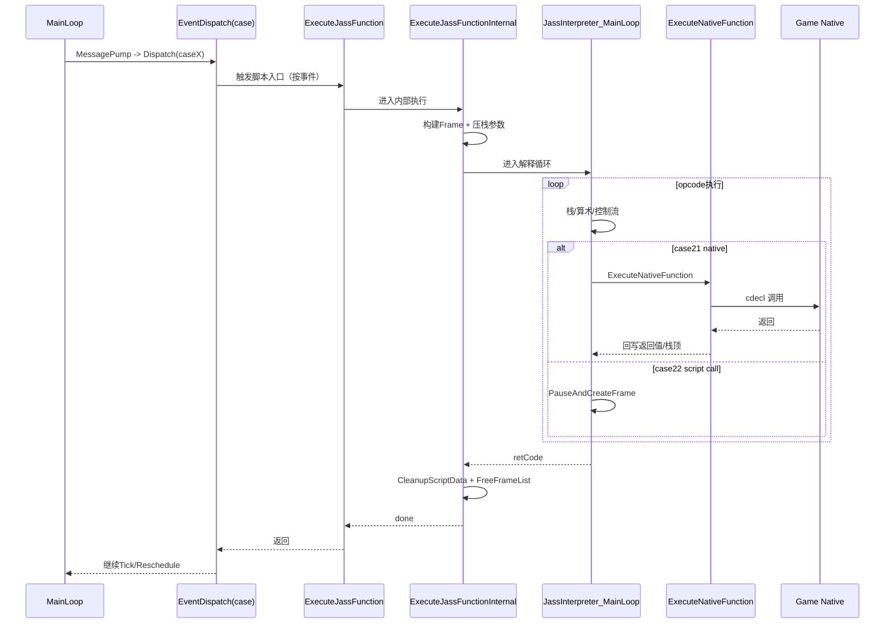
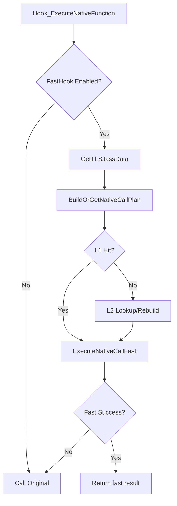

# 15 - 魔兽争霸3 MainLoop 与 Jass 语言/JassVM 全景研究（论文级）

> 更新时间：2026-02-26  
> 目标版本：War3 1.27a（`Game.dll` 基址 `0x6F000000`）  
> 研究定位：在项目既有 MainLoop/JASS 专项基础上，给出一份可工程落地、可逆向复核、可性能归因的“统一定义文档”。

---

## 摘要

本文面向 War3 1.27a，系统性回答三个核心问题：

1. **MainLoop 到底如何组织？**
2. **Jass 语言在引擎中的运行模型是什么？**
3. **JassVM 与 MainLoop 如何耦合，并且为何会成为性能与稳定性的关键路径？**

本文不是“概念说明书”，而是“逆向证据 + 工程落地”双驱动文档。证据来自：

- 地址簿统一定义（`war3_hook_address_book.*`）
- IDA MCP 反编译/反汇编（`W3_MainLoop_ThreadEntry`, `JassInterpreter_MainLoop`, `ExecuteNativeFunction` 等）
- 运行时 Hook 与 Perf 统计（`war3_hook_lifecycle.cpp`, `war3_hook_jass.cpp`, `war3_perf_monitor.cpp`）

结论上，War3 1.27a 的 MainLoop 可被视为“**事件驱动 + 时间门控 + 回调管线 + Tick 收口**”的循环系统；JassVM 则是“**字节码解释器 + 栈帧分配器 + Native 桥接器**”构成的执行子系统。两者通过 `ExecuteJassFunctionInternal -> JassInterpreter_MainLoop` 与主循环中的分发/回调路径形成硬耦合，任何性能或稳定性优化都必须同时理解这两条链路。

---

## 1. 研究范围、方法与证据

## 1.1 研究范围

本文覆盖以下范围：

1. MainLoop 主链路（调度、等待、分发、收口）
2. EventDispatch case0~14 分发表语义
3. Jass 语言运行时定义（类型、调用、Native 绑定）
4. JassVM 栈帧/解释循环/Native 调用路径
5. DXVK-War3 项目中可观测与优化切入点

不覆盖内容：

1. 非 1.27a 版本差异（如 1.26、重制版分支）
2. 全量 opcode 语义逐条数学化证明（本文做工程可用级定义）
3. 具体地图脚本业务逻辑

## 1.2 方法

- **静态逆向**：IDA 反编译 + 反汇编 + 调用图
- **动态观测**：Hook 埋点 + Perf Monitor 统计
- **工程对照**：地址簿、Hook 安装器、配置开关联合验证

## 1.3 核心证据点（可复核）

1. `W3_MainLoop_ThreadEntry @ 0x6F05F710`
2. `W3_MainLoop_DispatchEventCase @ 0x6F05A310`
3. `JassInterpreter_MainLoop @ 0x6F7F1A20`
4. `ExecuteJassFunctionInternal @ 0x6F7F2B40`
5. `ExecuteNativeFunction @ 0x6F7EF590`
6. `JassFunc_PauseAndCreateFrame @ 0x6F7F1810`

地址定义可在 `src/d3d9/war3/hooks/war3_hook_address_book.cpp` 直接查到，且与 IDA 命名结果一致。

## 1.4 可复现实验流程（复核协议）

为避免“结论依赖个人工作区”问题，本文给出最小可复核协议。以下流程在当前仓库即可执行：

1. **地址契约复核**  
   读取 `war3_hook_address_book.cpp`，确认 `mainLoopRoot/eventDispatch/executeJassFunctionInternal/jassInterpreterMainLoop/executeNativeFunction` 五元组地址。
2. **IDA 静态复核**  
   使用 IDA MCP 执行：
   - `lookup_funcs(0x6F05F710,0x6F05A310,0x6F7F2B40,0x6F7F1A20,0x6F7EF590)`
   - `decompile(0x6F05F710,0x6F05A310,0x6F7F2B40,0x6F7EF590)`
   - `disasm(0x6F7F1A20)`
3. **运行时观测复核**  
   编译并运行同场景 AutoTest，观察：
   - `War3MainLoop/Engine/*` 路径
   - `JassVM/ExecuteJassFunction`、`JassVM/MainLoop`
   - `JassNative` plan cache 命中率与 fallback 比例
4. **一致性判定**  
   若“地址契约、IDA 结构、运行时观测”三者同时一致，则视为结论有效。

### 1.4.1 复核判据（硬约束）

1. 任何“函数语义”都必须能落到具体 RVA。  
2. 任何“性能结论”都必须能落到同场景报告。  
3. 任何“优化建议”都必须给出回退路径与失败模式。  
4. 无法被上述三条验证的描述，视为假说，不进入结论层。

---

## 2. MainLoop 的完整定义

## 2.1 MainLoop 的工程定义

在 War3 1.27a 中，MainLoop 不是“单个函数干完所有事”，而是一个由多个函数协同的循环系统：

- 入口函数：`W3_MainLoop_ThreadEntry(0x6F05F710)`
- 关键职责：
  1. 选择 worker/lane
  2. 计算等待窗口
  3. 执行等待门控（WaitGate/SleepGate）
  4. 超时后进入调度与回调
  5. Pump 消息并分发事件
  6. 收口本轮并计算下一次唤醒

### 2.1.1 MainLoop 架构图



## 2.2 MainLoop 单轮时序

### 2.2.1 时序图（单轮）

```mermaid
sequenceDiagram
  participant Loop as MainLoopRoot(0x6F05F710)
  participant W as WaitGate/SleepGate
  participant D as Dispatch Pipeline
  participant P as Pump/DispatchEvent
  participant T as Tick/Reschedule

  Loop->>Loop: SelectWorker + PrepareWait
  Loop->>W: WaitGate(timeout)
  W-->>Loop: WAIT_TIMEOUT / WAIT_OBJECT
  alt timeout
    Loop->>D: PrepareDispatch
    D->>D: RunCallbacks
    D->>P: MessagePump
    P->>P: EventDispatch(case0~14)
    P-->>D: dispatch done
    D->>D: FinalizeDispatch + QueueFlush
    D->>T: TickUpdate
    T->>T: FinalizeWorker / FinalizeTick
    T->>T: ComputeWakeDelta
    T->>T: Reschedule(nextWake)
  else not timeout
    Loop->>Loop: return to wait
  end
```

## 2.3 EventDispatch（case0~14）定义

`W3_MainLoop_DispatchEventCase(0x6F05A310)` 是 MainLoop 里最关键的“业务路由点”。其语义是：

1. 根据 `msgType(case)` 进入固定分支
2. 执行对应子函数
3. 在特定 case（如 case5/case14）触发门控逻辑（例如 callback gate）

工程地址映射（RVA）如下：

| Case | 函数 RVA | 说明 |
|---|---:|---|
| 0 | `0x059D70` | 状态收口类 |
| 1 | `0x059DC0` | 单条加载分支 |
| 2 | `0x05A2A0` | 批量加载分支 |
| 3 | `0x059E40` | 参数化处理 |
| 4 | `0x05A270` | 状态切换类 |
| 5 | `0x059890 + 0x059E00` | Gate + Commit |
| 6 | `0x059E10` | Reset/同步类 |
| 7 | `0x059E90` | 输入设置 |
| 8 | `0x059F00` | 输入清理 |
| 9 | `0x059F70` | 输入组合 |
| 10 | `0x05A060` | BlockType12 |
| 11 | `0x05A1F0` | BlockType16 |
| 12 | `0x05A0E0` | BlockType13 |
| 13 | `0x05A160` | BlockType14 |
| 14 | `0x059890` | GateAlt |

这说明 MainLoop 的“业务执行”并非集中在 `0x6F05F710`，而是通过 Pump -> Dispatch -> Case 子函数进行模块化分流。

## 2.4 WaitGate 的真实语义

从工程与逆向双证据看，`WaitGate` 是“节拍门控”，不等价于“无意义空转”。它承担三种功能：

1. 线程休眠/等待（控制 CPU 占用）
2. 时间片对齐（保持逻辑节拍）
3. 唤醒事件响应（消息/回调驱动）

因此在性能报告中看到 Wait 占比高，并不自动意味着逻辑效率低；必须联合看：

- Active 段总时长
- Dispatch/Tick 细分
- 主线程与 worker 线程分摊

## 2.5 MainLoop 状态机定义（形式化）

从 `W3_MainLoop_ThreadEntry` 伪代码可以抽象出一个可工程化的状态机。该状态机比“流程图”更适合做异常与性能归因。

### 2.5.1 状态机图



### 2.5.2 伪代码定义（可映射到 Hook）

```cpp
while (running) {
  worker = SelectWorker();
  timeout = PrepareWait(worker);
  waitResult = WaitGate(timeout);

  if (waitResult == WAIT_TIMEOUT) {
    PrepareDispatch(worker);
    RunCallbacks(worker);
    MessagePump(worker);      // 内部触发 EventDispatch(case0~14)
    FinalizeDispatch(worker);
    QueueFlush();
    TickUpdate(worker);
    FinalizeWorker(worker);
    nextWake = ComputeWakeDelta(worker);
    Reschedule(nextWake);
  }
}
```

### 2.5.3 状态机上的观测映射

1. `PrepareWait/WaitGate/SleepGate` 对应“节拍控制域”。  
2. `PrepareDispatch/RunCallbacks/MessagePump` 对应“事件执行域”。  
3. `FinalizeDispatch/QueueFlush/TickUpdate` 对应“收口推进域”。  
4. `FinalizeWorker/ComputeWakeDelta/Reschedule` 对应“下一轮调度域”。

该映射直接对应 `war3_hook_lifecycle.cpp` 的 `War3MainLoop/Engine/*` 指标路径，可用于图上定位性能瓶颈。

---

## 3. Jass 语言的运行时定义

## 3.1 Jass 的工程定位

Jass 不是单独进程，也不是解释器外置系统，而是嵌入在 Game.dll 中的脚本子系统，核心作用：

1. 触发器脚本执行
2. Native API 调用（游戏对象、UI、音效、计时器等）
3. 游戏逻辑定制（地图作者语义）

## 3.2 Jass 语言最小形式化定义

### 3.2.1 类型系统（工程可用定义）

1. 标量：`integer`, `real`, `boolean`, `string`
2. 句柄：`handle` 及其派生（`unit`, `player`, `timer`, `effect` 等）
3. 代码指针：`code`（函数地址/回调）
4. 数组：一维定长语义（由 VM 内部数组结构支持）

### 3.2.2 语句系统

1. 赋值、算术、比较
2. 条件与循环（if/loop/exitwhen）
3. 函数调用（脚本函数 / native 函数）
4. 触发器事件回调

### 3.2.3 语义约束

1. 句柄是“索引 + 表项”模型，不等于原生 C++ 指针
2. `code` 类型调用需要 VM 做符号/地址映射
3. `real` 与 `handle/string` 参数在 Native 边界常有转换成本

## 3.3 Jass 生命周期定义（引擎侧）

在本项目中，Jass 生命周期可分为：

1. **Phase-1（首次 JASS 入口）**：`executeJassFunction` 首次触发，完成 Hook 与预初始化
2. **Phase-2（GameReady）**：Native 与运行时子系统完成可调用态
3. **Phase-3（运行期）**：触发器/JassVM 按 MainLoop 节拍执行
4. **Phase-4（离图）**：清理状态，避免跨图污染

该模型对应 `docs/WAR3_LIFECYCLE.md` 与 `war3_hook_jass.cpp` 的实际代码路径。

## 3.4 Jass 语义到 VM 值槽的映射（工程视角）

本节是“语言层到执行层”的桥接定义，目的是解释：为什么同一个 Jass 语句会在 VM 中表现为不同开销。

### 3.4.1 值槽结构（推断说明）

基于 `ExecuteNativeFunction` 与 `war3_jass_native_plan_cache.cpp` 的读取逻辑，VM 参数来源可抽象为：

1. 栈槽指针数组（按 `stackTop` 逆序取参）。  
2. 每个槽含 `valueType + valueData`。  
3. `valueType==3` 在 native 桥接路径下被特殊处理（代码/句柄语义分支）。  

说明：这里的“值槽字段名”是工程化命名，用于解释桥接过程。字段偏移来自本项目代码，属于可复核实现定义。

### 3.4.2 语义映射表（桥接层）

| Jass 语义类型 | VM 取值动作 | Native 前转换 | 风险 |
|---|---|---|---|
| `integer/boolean` | 直接取 `valueData` | 通常直传 | 低 |
| `real` | 取 `valueData` | 可能转为临时 by-ref 指针 | 中 |
| `code` | 取函数地址或句柄值 | `RegFuncAddr2Handle` | 中 |
| `handle` | 取 handle id | `ComputeHandleMemoryAddr`（按签名） | 高 |
| `string` | 依赖 VM 内部字符串对象 | 按签名规则传递 | 中 |

### 3.4.3 工程结论

1. Jass 类型系统在 VM 边界并非“零成本映射”。  
2. `code/handle/real` 是桥接重成本类型。  
3. Native 快路径优化优先级应按“类型混合复杂度”排序，而非仅按调用次数排序。

---

## 4. JassVM 的完整定义（1.27a）

## 4.1 入口链路

JassVM 的主链路可抽象为：

1. `ExecuteJassFunction`（外层入口）
2. `ExecuteJassFunctionInternal(0x6F7F2B40)`（帧构造、参数压栈、解释器调用）
3. `JassInterpreter_MainLoop(0x6F7F1A20)`（opcode 解释循环）

### 4.1.1 执行架构图



## 4.2 VM 栈帧与状态

从 `ExecuteJassFunctionInternal` 与相关 callees 可定义 VM 的关键机制：

1. `JassFrameAllocator_Alloc` 分配新帧
2. `JassVM_SetStackState` 维护栈顶与类型槽
3. `sub_6F7F3020` 等函数参与 frame 切换/恢复
4. 返回后执行 `CleanupScriptData + FreeFrameList`

这意味着 JassVM 不是“只靠一个栈指针”工作，而是“帧链表 + 栈槽 + 脚本数据表”联合驱动。

## 4.3 解释器核心：`JassInterpreter_MainLoop`

IDA 显示该函数有 `switch 42 cases` 的 opcode 解释循环。工程上可按语义分组理解：

1. 栈/局部变量操作（读写、复制、恢复）
2. 算术/比较操作（int/real 分支）
3. 句柄与字符串相关操作
4. 函数调用操作（脚本/Native）
5. 控制流操作（跳转、frame 处理）

## 4.4 关键 opcode 语义（高价值）

### 4.4.1 case21：Native 调用

`case21 -> ExecuteNativeFunction(0x6F7EF590)`，并在调用后写回栈状态。该路径固定包含：

1. `GetTLSJassData`
2. 参数签名扫描
3. 参数类型转换（`code`/`handle`/`real` 等）
4. `alloca + memcpy` 打包参数
5. 调用 native 函数指针
6. 回退/恢复 `stackTop`

这也是为何 native 热调用会形成稳定 CPU 成本。

### 4.4.2 case22：脚本函数调用

`case22 -> JassFunc_PauseAndCreateFrame(0x6F7F1810)`，其核心是：

1. 根据函数符号定位目标
2. 分配/挂接新 frame
3. 切换执行上下文

因此脚本深调用会显著增加 frame 分配与栈管理成本。

## 4.5 `ExecuteNativeFunction` 的参数桥接定义

根据反编译与本项目 `war3_jass_native_plan_cache.*`，可将 native 参数桥接定义为：

1. 输入来源：VM 栈槽
2. 转换规则：
   - `C`：函数地址转 handle（`RegFuncAddr2Handle`）
   - `S`：handle 转内存地址（`ComputeHandleMemoryAddr`）
   - `R`：real 以 by-ref 临时槽传递
   - `H`：句柄签名扫描到 `;`（复合句柄签名）
3. 调用约定：cdecl 打包调用
4. 调用后：回写栈顶，消费参数

这一路径是 JassVM 与 C++ Native 世界的“语义边界”。

### 4.5.1 Native 调用微时序（Hot Path）



该图用于说明一个关键事实：`plan cache` 只降低“解析成本”，不会消除“参数转换与 native 本体执行”的成本。

## 4.6 返回码语义定义

项目中已对 Jass 主循环返回码建立工程语义：

| 返回码 | 语义 |
|---:|---|
| 1 | completed |
| 2 | timeout |
| 3 | native_error |
| 4 | paused |
| 6 | invalid_stack |
| 7 | arith_error |
| 其他 | other |

这套定义直接用于 `war3_hook_jass.cpp` 的统计与预算调度。

## 4.7 Opcode 分层目录（42-case 工程语义表）

`JassInterpreter_MainLoop` 的 `switch 42 cases` 并不适合直接逐 case 维护。工程上更可行的是“按语义域分层”。  

下表为分层定义（其中 case 归类属于**基于反汇编的工程推断**，用于调试与优化，不作为语言规范）：

| 语义域 | 代表 case | 行为定义 | 典型成本 |
|---|---|---|---|
| 栈/局部变量域 | 2, 11, 13, 20, 41, 42 | 栈槽读写、局部恢复、值复制 | 低-中 |
| 函数符号解析域 | 5, 6, 7, 8, 14, 15, 16, 17, 18 | 从字节码符号表定位函数并构造调用上下文 | 中 |
| Native 调用域 | 21 | 进入 `ExecuteNativeFunction`，进行签名转换并执行 cdecl 调用 | 高 |
| 脚本调用域 | 22 | `PauseAndCreateFrame`，创建/切换脚本帧 | 高 |
| 算术比较域 | 23, 24~38 | int/real 计算、比较、布尔化 | 低-中 |
| 异常/返回域 | 39, 返回码分支 | 清理、错误退出、暂停/超时返回 | 中 |

### 4.7.1 为什么要做分层而不是逐 case

1. 同类 case 的优化手段高度一致。  
2. 分层指标更稳定，不受单 case 触发概率波动影响。  
3. 更适合和业务场景关联（例如“Native 密集地图” vs “算术密集地图”）。

## 4.8 JassVM 状态机（执行语义）

### 4.8.1 状态机图



### 4.8.2 状态机上的性能意义

1. `ExecNative` 与 `ExecScriptCall` 是两大高成本状态。  
2. `DecodeOpcode -> ExecNative` 转移概率升高时，优先检查 plan cache 命中率。  
3. `DecodeOpcode -> ExitTimeout` 转移概率升高时，优先检查 opBudget 与热点 native 链路。

---

## 5. MainLoop 与 JassVM 的耦合机制

## 5.1 端到端调用时序



## 5.2 耦合结论

1. MainLoop 不理解 Jass 语义细节，但通过分发与回调触发 Jass 入口。
2. JassVM 不决定主循环节拍，但其执行时长直接吞噬 MainLoop active budget。
3. Native 调用桥接是耦合最紧点：既影响脚本语义，又影响 CPU 热路径。

## 5.3 耦合故障模式（Failure Modes）

为避免“性能问题被误判为渲染问题”，本节给出 MainLoop×JassVM 常见故障模式。

| 故障模式 | 触发条件 | 观测症状 | 首要排查点 |
|---|---|---|---|
| 地址中段误 Hook | 深层 Hook 指向非函数入口 | 启动即崩溃/早退 | AddressBook + 函数序言校验 |
| Native 桥接退化 | plan cache 低命中 + fallback 高 | `JassVM/MainLoop` 长尾上升 | `JassNative` 统计与签名稳定性 |
| 脚本帧爆炸 | 深层脚本调用频繁 | `paused/timeout` 比率上升 | case22 路径与 frame 回收 |
| Wait 误读 | 只看 Wait 占比不看 active | “看似卡顿”但逻辑不重 | MainLoop active/idle 拆分 |
| 栈一致性破坏 | 错误回写 stackTop | 后续随机脚本异常 | `ExecuteNativeFunction` 回写路径 |

### 5.3.1 故障隔离顺序（推荐）

1. 先确认地址与 Hook 安全（入口、可执行、序言）。  
2. 再确认 MainLoop 观测口径（是否开启分析模式）。  
3. 然后看 Jass 返回码与 native fallback。  
4. 最后才进入脚本逻辑级排查（地图触发器本身）。  

---

## 6. 面向项目的工程化定义与实践

## 6.1 地址契约化

`War3HookAddressBook` 已将 MainLoop/Jass 关键地址收敛成统一契约，避免散落硬编码。典型项：

- `mainLoopRoot = 0x05F710`
- `eventDispatch = 0x05A310`
- `executeJassFunctionInternal = 0x7F2B40`
- `jassInterpreterMainLoop = 0x7F1A20`
- `executeNativeFunction = 0x7EF590`

这是一切 Hook、观测、优化实验的前提。

## 6.2 可观测定义（Perf 层）

MainLoop 侧：

1. `War3MainLoop/Engine/*` 深度阶段
2. `DispatchCaseFunctions/*` 与模块分桶
3. Wait 系列 API 拆分

Jass 侧：

1. `JassVM/ExecuteJassFunction`
2. `JassVM/ExecuteFunctionInternal`
3. `JassVM/MainLoop`
4. 返回码统计与预算调节窗口

## 6.3 Native 快路径（Task-4）

项目已实现 native 调用计划缓存与快速调用链路：

1. L1（线程本地）+ L2（全局）计划缓存
2. 参数计划预编译（`NativeArgPlan`）
3. fast invoke 与 fallback 双路径

### 6.3.1 Native 快路径结构图



该机制实质是把 `ExecuteNativeFunction` 的重复签名解析成本搬到缓存层，实现“同 native 重复调用”降本。

## 6.4 观测模式矩阵（性能档 vs 分析档）

项目存在两类运行模式：
1. **性能档**：低开销，适合长期运行。  
2. **分析档**：高覆盖，适合定位 unknown 与脚本热点。  

| 模式 | 关键开关 | 优势 | 代价 | 使用时机 |
|---|---|---|---|---|
| 性能档 | `kNativeMainLoopCoverageAnalysisMode=false` | 帧率稳定、观测开销低 | 细节指标较少 | 日常联机/回归 |
| 分析档 | `kNativeMainLoopCoverageAnalysisMode=true` | MainLoop/Jass 路径高覆盖 | 额外 CPU 开销 | 问题定位/论文取证 |

### 6.4.1 切换原则

1. 先在性能档复现问题，确认问题真实存在。  
2. 再切分析档做归因，避免“观测影响行为”误判。  
3. 结论输出必须回到性能档复测，确认改动在交付态成立。  

## 6.5 联合调优流程（MainLoop × JassVM）

为了避免“只看单域指标导致误改”，建议固定使用以下闭环流程：

1. **性能档建基线**：采同地图、同窗口、同采样时长报告。  
2. **分析档做归因**：采 MainLoop 深层阶段 + JassVM 返回码 + Native plan 命中。  
3. **建立瓶颈归属**：将耗时归类为 `Wait/Dispatch/Tick/Jass/RenderSubmit`。  
4. **选择单域改动**：一次只改一类策略（例如只改 native plan 或只改 dispatch gate）。  
5. **回交性能档复测**：若收益只在分析档成立，则改动不通过。  

### 6.5.1 归因到动作映射表

| 观测症状 | 优先动作 | 不应先做 |
|---|---|---|
| `JassVM/MainLoop` 长尾抬升且 fallback 高 | 优先查签名稳定性与 plan cache miss 原因 | 直接调低全局 opBudget |
| `DispatchCase` 峰值高但 Jass 平稳 | 先查 case 热点与 callback 分布 | 先改 Jass Hook 策略 |
| Wait 占比升高但 active 平稳 | 确认是否是节拍门控正常抬升 | 误判为“CPU 卡顿”后强行压缩 Wait |
| 分析档收益明显、性能档无收益 | 检查观测开销污染结论 | 直接提交优化 |

---

## 7. 性能、稳定性与风险模型

## 7.1 性能模型

MainLoop 总帧时可近似写为：

`FrameCPU = WaitBudget + DispatchBudget + TickBudget + JassBudget + RenderSubmitBudget + Other`

其中 JassBudget 主要由以下项决定：

1. opcode 执行总量
2. case21 native 调用次数与参数复杂度
3. case22 frame 创建频率
4. timeout/pause 触发比率

## 7.2 稳定性风险

1. **地址漂移风险**：深层 JASS Hook 若命中函数中段会崩溃
2. **调用约定风险**：fastcall/cdecl 混用必须严格匹配
3. **栈一致性风险**：错误 stackTop 回写会造成后续解释错误
4. **版本兼容风险**：同名函数在小版本可能结构变化

## 7.3 工程防护（已落地）

1. Hook 前做可执行可读校验
2. 深层入口做 x86 函数序言校验
3. 关键路径保留 trampoline/original 双兜底
4. 预算策略可回滚（override/adaptive 开关化）

## 7.4 风险优先级矩阵（RPN）

为统一优化顺序，定义简化 RPN（Risk Priority Number）：
`RPN = Impact(1~5) * Probability(1~5) * DetectDifficulty(1~5)`
值越高，越优先治理。

| 风险项 | Impact | Probability | DetectDifficulty | RPN | 优先级 |
|---|---:|---:|---:|---:|---|
| 深层 Hook 地址漂移 | 5 | 3 | 2 | 30 | P0 |
| Native 桥接 fallback 退化 | 4 | 4 | 3 | 48 | P0 |
| 脚本帧泄漏/回收不完整 | 5 | 2 | 4 | 40 | P0 |
| Wait 误读导致错误优化 | 3 | 4 | 3 | 36 | P1 |
| 预算策略过调（卡顿） | 4 | 3 | 3 | 36 | P1 |

### 7.4.1 决策阈值

1. `RPN >= 40`：必须先做防护与回退机制，再做性能优化。  
2. `30 <= RPN < 40`：允许并行推进，但必须先补观测。  
3. `RPN < 30`：进入常规优化队列。  

## 7.5 量化验收门槛（工程门禁）

为确保“论文结论可交付”，建议固定以下门禁：

| 维度 | 门槛 | 说明 |
|---|---|---|
| 构建 | `ninja -C build32` 通过 | 无新增阻塞错误 |
| 稳定性 | AutoTest `ok=true` 且无崩溃 | 不接受“性能好但偶发退图” |
| 帧率 | 相对基线 `avgFps` 回退不超过 `3%` | 与既有项目门限一致 |
| 主线程 CPU | `avgMainThreadCpuMs` 上升不超过 `0.2ms` | 控制逻辑层侵入成本 |
| Jass 返回码健康 | `native_error + invalid_stack + arith_error` 占比维持低位 | 防止“性能换语义错误” |
| 证据闭环 | 地址、IDA、运行时统计三证合一 | 无三证不结项 |

---

## 8. 统一定义（结论版）

为避免后续文档歧义，本文给出统一定义：

1. **MainLoop**：以 `0x6F05F710` 为根的“节拍驱动循环系统”，包含等待门控、事件分发、回调执行、Tick 收口与重调度。  
2. **Jass 运行时**：以脚本字节码与 Native 绑定为核心的游戏逻辑表达层，不直接管理线程节拍。  
3. **JassVM**：以 `ExecuteJassFunctionInternal -> JassInterpreter_MainLoop` 为主链，负责 frame 管理、opcode 解释、Native 桥接与错误/暂停返回。  
4. **MainLoop-Jass 耦合点**：EventDispatch 回调触发脚本执行；Jass 执行耗时反向影响 MainLoop active budget。  
5. **优化优先级**：先观测、再归因、最后改热路径；优先改“重复桥接/重复解析”，谨慎改“执行语义”。

---

## 9. 未决问题与下一步研究

1. `JassInterpreter_MainLoop` 的 42 个 case 仍需逐个生成 opcode 语义表（建议单独做 `opcode_catalog` 子项目）。
2. `Dispatch case` 与地图脚本行为之间还可建立“场景-事件-耗时”映射数据库。
3. Native 快路径可继续引入“签名稳定性哈希”，降低 plan 失效重建。
4. 可考虑加入“MainLoop 周期级 flamegraph 导出”，减少文字报告理解成本。

---

## 10. 参考与证据索引

### 10.1 代码与配置

1. `src/d3d9/war3/hooks/war3_hook_address_book.h`
2. `src/d3d9/war3/hooks/war3_hook_address_book.cpp`
3. `src/d3d9/war3/hooks/war3_hook_lifecycle.cpp`
4. `src/d3d9/war3/hooks/war3_hook_jass.cpp`
5. `src/d3d9/war3/hooks/war3_jass_native_plan_cache.h`
6. `src/d3d9/war3/hooks/war3_jass_native_plan_cache.cpp`
7. `src/d3d9/war3/core/war3_internal_test_config.h`

### 10.2 历史研究文档

1. `docs/research/war3_render_issues/07_mainloop_full_breakdown/README.md`
2. `docs/research/war3_render_issues/11_mainloop_round4_unknown_resolution/README.md`
3. `docs/research/war3_render_issues/12_mainloop_full_reverse/README.md`
4. `docs/research/war3_render_issues/05_jass_vm_and_partial_batch_submit/README.md`
5. `docs/WAR3_LIFECYCLE.md`

### 10.3 IDA 逆向证据

1. `docs/research/war3_render_issues/12_mainloop_full_reverse/ida_mainloop_dump_2026_02_25.json`
2. `W3_MainLoop_ThreadEntry @ 0x6F05F710` 反编译
3. `W3_MainLoop_DispatchEventCase @ 0x6F05A310` 反编译
4. `ExecuteJassFunctionInternal @ 0x6F7F2B40` 反编译
5. `JassInterpreter_MainLoop @ 0x6F7F1A20` 反汇编（42-case switch）
6. `ExecuteNativeFunction @ 0x6F7EF590` 反编译

---

## 附录 A：面向工程团队的快速使用指南

1. 若目标是“定位 MainLoop 未追踪”，优先看 `Lifecycle` 与 `WaitHook` 统计链路。  
2. 若目标是“定位脚本导致卡顿”，优先看 `JassVM/MainLoop` 返回码与 `timeout ratio`。  
3. 若目标是“压 Native 调用成本”，优先看 `JassNative plan cache` 命中率与 fallback 统计。  
4. 若要做深层 Hook 实验，必须先验证地址入口与函数序言，不能直接用中段地址。  
5. 任何优化结论都必须以同场景 AutoTest 报告闭环，不接受单帧主观观测。

## 附录 B：术语表

| 术语 | 定义 |
|---|---|
| MainLoopRoot | `0x6F05F710` 对应的主循环线程入口函数。 |
| WaitGate | 主循环等待门控函数族（含 SleepGate 分支）。 |
| DispatchCase | `EventDispatch` 的 case0~14 业务分发分支。 |
| JassVM | 执行 Jass 字节码的解释器与栈帧系统。 |
| Native Bridge | Jass 到 C++ Native 的参数转换与调用边界。 |
| Plan Cache | Native 调用签名计划缓存（L1/L2）机制。 |
| Coverage Analysis Mode | 主循环与 Jass 深度观测模式（高覆盖/高开销）。 |
| Timeout Ratio | Jass 主循环返回码中 timeout 占比，用于预算调参。 |

## 附录 C：研究检查清单（可直接执行）

1. 地址契约检查：AddressBook 与 IDA 是否一致。  
2. 主循环检查：`0x6F05F710` 关键调用顺序是否稳定。  
3. 分发检查：`0x6F05A310` case 映射是否一致。  
4. Jass 链路检查：`ExecuteJassFunctionInternal -> JassInterpreter_MainLoop` 是否闭合。  
5. Native 检查：`ExecuteNativeFunction` 参数转换路径是否可复核。  
6. 观测检查：性能档与分析档结论是否一致。  
7. 风险检查：高 RPN 项是否具备回退方案。  
8. 回归检查：同场景 AutoTest 报告是否通过。  

## 附录 D：版本漂移差分模板（1.27a -> 新版本）

当迁移到其它 War3 版本时，按以下模板做差分，避免“旧地址假阳性”：

1. 地址差分：先重建 `AddressBook`，再做 Hook 安装。  
2. 入口校验：关键函数必须满足“可执行 + 序言模式 + xref 合理”。  
3. 语义校验：`MainLoopRoot/EventDispatch/ExecuteNativeFunction` 三条链必须闭合。  
4. 指标校验：至少复测 `性能档 + 分析档` 各一轮。  
5. 回退策略：若深层 Hook 任一点不稳定，优先回退到浅层观测链。  
