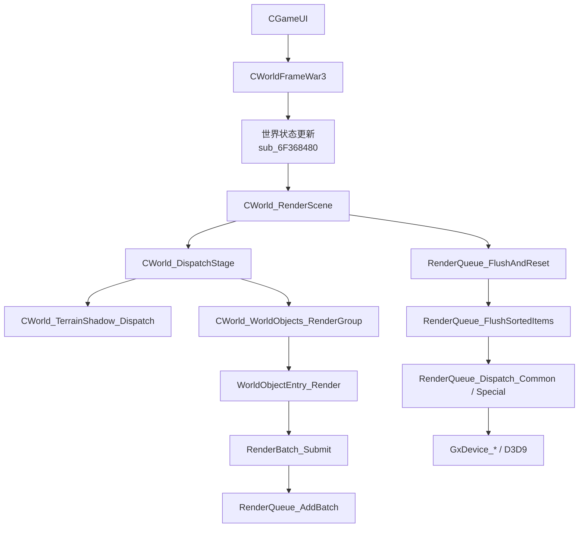
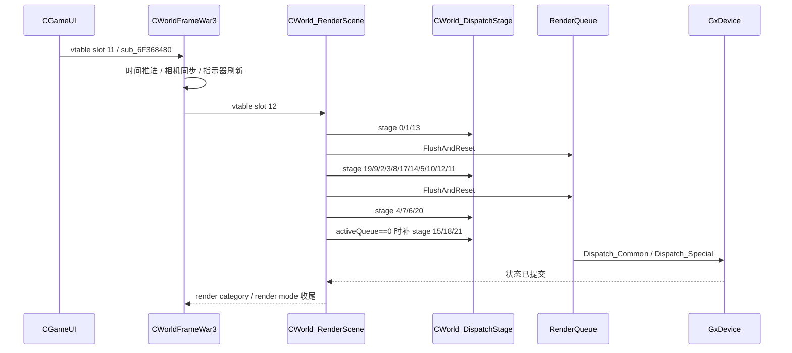
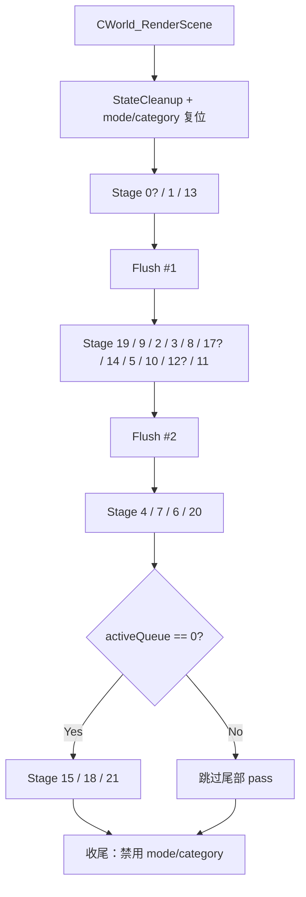
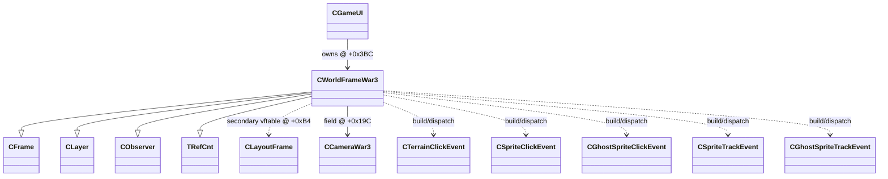

# CWorldFrameWar3 全量逆向（IDA PRO MCP）

> 更新时间：2026-04-03  
> 目标版本：Warcraft III 1.27a（`Game.dll` 基址 `0x6F000000`）  
> 专题标记：`【CWorldFrameWar3专题】`（文档简写：`【CWFW3】`）

## 1. 结论先行

`CWorldFrameWar3` 不是“单一渲染器类”，而是一个同时承担以下职责的世界视口中枢对象：

1. `CGameUI` 持有的 3D 世界主 Frame，对外仍属于 `CFrame/CLayer/CObserver/CLayoutFrame` 体系。
2. 世界相机、世界矩形、鼠标世界坐标、地面指示器、Rally/Waypoint/TargetPointConfirm 等运行时对象的拥有者。
3. `CWorld_RenderScene` 的直接承载者，负责调度 stage、切换 render mode/category、触发两次 `RenderQueue_FlushAndReset`。
4. 世界点击/跟踪事件的组装者，会在 `CTerrainClickEvent` / `CSpriteClickEvent` / `CGhostSpriteClickEvent` / `CSpriteTrackEvent` / `CGhostSpriteTrackEvent` 之间分流。
5. 魔兽原生渲染引擎里“UI 世界窗口层”和“场景提交层”之间的桥。

当前最重要的硬结论：

1. `CWorldFrameWar3` 对象大小为 `0x668`，由 `CGameUI` 构造函数 `sub_6F349FA0` 分配并放入 `CGameUI+0x3BC`。
2. 主虚表位于 `0x6F98DCD0`，共 `57` 个槽位；`CLayoutFrame` 子对象虚表位于 `0x6F98DDB8`，共 `9` 个槽位，子对象偏移 `+0xB4`。
3. `CWorld_RenderScene(0x6F3681C0)` 就是 `CWorldFrameWar3` 的虚表槽位 `12`。
4. `CWorld_DispatchStage(0x6F363020)` 不是全局“世界渲染器”，而是由 `CWorldFrameWar3` 持有状态并驱动的 stage 分发器。
5. 已有 `war3_game_struct.h` 对 `0x19C camera`、`0x1D4~0x1E0 world rect`、`0x300` 一批字段方向并不失真；本轮已继续把 `0x1A4~0x1C8`、`0x53C~0x598`、`0x644~0x648`、`0x660~0x664` 等高置信字段落回共享头和 `native` 头。

## 2. 证据基线

| 项 | 证据 | 结论 |
|---|---|---|
| 类型名 | `docs/War3Class.txt` | `CWorldFrameWar3: CFrame, CLayer, CObserver, TRefCnt, CLayoutFrame` |
| 主虚表 | `.rdata:6F98DCD0` | `57` 槽位主表 |
| 次虚表 | `.rdata:6F98DDB8` | `9` 槽位 `CLayoutFrame` 子对象表 |
| 构造函数 | `sub_6F35EFB0` | 构造体内大量 world/render/indicator 字段 |
| 析构函数 | `sub_6F3602F0 / sub_6F361130` | 会释放世界对象组、路点/集结点/特效对象、颜色/字符串/池 |
| 所有者 | `sub_6F349FA0` (`CGameUI` ctor) | `AllocMemory_Storm_401(1640)` 后调用 `sub_6F35EFB0(this)`，写入 `CGameUI+0x3BC` |
| 主更新 | `sub_6F368480` | 时间推进、相机/矩阵、指示器刷新、最后收口到 `CWorld_RenderScene` 相关链 |
| 渲染总调度 | `CWorld_RenderScene(0x6F3681C0)` | 两段 Flush、三段 stage 调度、尾部收尾 pass |
| Stage 分发 | `RenderWorld_DispatchStage(0x6F363020)` | Terrain/Shadow/WorldObjects/Stage16/18/21 总分发器 |

## 3. 类定位

### 3.1 所有权与生命周期

`CGameUI` 在 `sub_6F349FA0` 中：

1. 申请 `1640` 字节，也就是 `0x668` 字节。
2. 调用 `sub_6F35EFB0` 构造 `CWorldFrameWar3`。
3. 将结果写到 `CGameUI + 0x3BC`，这与仓库现有 `war3_game_struct.h` 一致。

因此可以确认：

1. `CWorldFrameWar3` 是 `CGameUI` 的核心成员，而不是独立全局单例。
2. `CGameUI` 负责 UI 顶层框架和世界窗口装配，`CWorldFrameWar3` 负责世界窗口内部的 3D/交互/render bridge。

### 3.2 继承关系

`War3Class.txt` 与次虚表共同证明：

1. 主对象是 `CFrame` 系对象。
2. 次虚表 `0x6F98DDB8` 明确对应 `CLayoutFrame` 子对象。
3. 构造/析构都对 `this+0xB4` 写次虚表，说明这里不是“嵌套成员”，而是带次级 vptr 的多继承子对象。

## 4. 渲染引擎里的位置

### 4.1 分层模型

可以把 Warcraft III 这条链概括为六层：

1. `UI/Viewport 层`
2. `WorldFrame 状态层`
3. `Stage 编排层`
4. `对象收集层`
5. `队列/批处理层`
6. `GxDevice/D3D 状态提交层`

其中 `CWorldFrameWar3` 横跨前四层，是整个世界渲染入口最核心的“桥”。

### 4.2 每帧时序

### 4.3 `RenderScene` 真实阶段序列

`CWorld_RenderScene(0x6F3681C0)` 已由 IDA MCP 直接反编译确认：

1. 前置清理：`StateCleanup(world+0x338 / 0x33C / 0x354)`。
2. 缓存清空：`world+0x660 = -1`、`world+0x664 = -1`。
3. 第一段：`0(条件), 1, 13`。
4. `RenderQueue_FlushAndReset`。
5. 第二段：`19, 9, 2, 3, 8, 17(条件), 14, 5, 10, 12(条件), 11`。
6. `RenderQueue_FlushAndReset`。
7. 第三段：`4, 7, 6, 20`。
8. 若 `activeQueue == 0`，追加：`15, 18, 21`。
9. 结束时禁用当前 render category / render mode。

## 5. `CWorldFrameWar3` 如何驱动渲染

### 5.1 进入点：`sub_6F368480`

这是 `CWorldFrameWar3` 自身最重要的“世界帧更新”函数之一，职责不是只做 UI，而是：

1. 吃掉积累的时间增量并推进 `ScaledAnimTime`。
2. 准备矩阵、相机、地形/雾/环境状态。
3. 更新地面指示器、路径/Waypoint/Rally 指示器。
4. 在需要时刷新 `0x354/0x338/0x33C` 这一类世界级对象。
5. 拉起 `CWorld_RenderScene` 这条主渲染链的前置状态。

高价值字段证据：

1. `this+0x19C`：被当成对象指针使用，读取 `+52` 成员参与后续世界对象/句柄更新，和现有 `CCameraWar3* camera` 注释相容。
2. `this+0x300`：默认 `-1`，被 `sub_6F76F540 / sub_6F76F190` 这类 terrain 相关函数消费，不是普通 UI flag。
3. `this+0x354/0x358/0x35C`：与 stage0 条件联动，明显是某个世界特效/指示器对象及其激活状态。
4. `this+0x398/0x39C`：构造时写入 `"ScaledAnimTime"` / `"DayHours"` 配置键。

### 5.2 Stage 分发器：`RenderWorld_DispatchStage`

`CWorldFrameWar3` 不是“把事情交给别人然后旁观”，而是自己保存了：

1. 当前 render mode：`0x660`
2. 当前 render category：`0x664`

`RenderWorld_DispatchStage` 先比较并切换这两个状态，再按 stage 号分流：

1. `1/2/3/4/5/6/7/8/9/10/14/17/19/20/21` 主要走 `CWorld_TerrainShadow_Dispatch` 的不同子通道。
2. `11/12/13` 走 `CWorld_WorldObjects_RenderGroup`。
3. `16` 是复杂的 feature-bit 组合 stage，会进入 `sub_6F368A90` 和 `sub_6F369560`。
4. `18` 处理额外 world/UI bridge 收尾。

这说明 Warcraft III 的“stage”不是单纯按物体类别切分，而是混合了：

1. 地形/阴影通道
2. 世界对象组
3. 屏幕空间或覆盖层
4. 收尾/桥接 pass

## 6. 完整主虚表逆向

说明：

1. “归属”列中的 `继承` 表示当前槽位明显来自 `CFrame/CLayer/CObserver/CLayoutFrame` 体系。
2. “建议名称”只对高置信项给出确定命名；中低置信项保守使用“职责名”而不强行伪造暴雪内部原名。
3. 置信度分三档：`高 / 中 / 低`。

| Slot | 地址 | 归属 | 建议名称 | 中文别名 | 说明 | 置信度 |
|---|---|---|---|---|---|---|
| 0 | `0x6F031FB0` | 继承 | `CWorldFrameWar3_scalar_dtor` | 标量析构 thunk | 调 `vf+4(this,1)` | 高 |
| 1 | `0x6F361130` | 自身 | `CWorldFrameWar3_dtor` | 析构函数 | 调 `sub_6F3602F0` 后按标志 `free` | 高 |
| 2 | `0x6F056AF0` | 继承 | `CObserver_EventRegisterBridge` | 观察者事件注册桥 | 与 ctor 中事件注册逻辑同源 | 低 |
| 3 | `0x6F367970` | 自身 | `CWorldFrameWar3_OnEnterWorldFrameThunk` | 进入世界窗口 thunk | 直接转 `sub_6F09B470` | 中 |
| 4 | `0x6F0991F0` | 继承 | `CFrame_BindObserverContext` | 绑定事件上下文 | 把 `this` 写进事件对象 `+12` | 中 |
| 5 | `0x6F056300` | 继承 | `CObserver_DispatchEvent` | 事件转发 | 进入 `sub_6F056340` | 中 |
| 6 | `0x6F09CA30` | 继承 | `CFrame_SetGlobalHoverFocus` | 设置全局 hover 焦点 | 内部切 `dword_6FBB9D88` | 中 |
| 7 | `0x6F09D000` | 继承 | `CFrame_SetGlobalInputFocus` | 设置全局输入焦点 | 内部切 `dword_6FBB9D90` | 中 |
| 8 | `0x6F09CF10` | 继承 | `CFrame_SetGlobalCaptureFocus` | 设置全局捕获焦点 | 内部切 `dword_6FBB9D94` | 中 |
| 9 | `0x6F099210` | 继承 | `CFrame_RenderSelfAndChildren` | Frame 递归绘制 | 递归 children，处理 clip/transform | 中 |
| 10 | `0x6F3683F0` | 自身 | `CWorldFrameWar3_FilterPickResult` | 世界拾取结果过滤 | 结合 `a2+36/+40` 与 world 状态做过滤 | 中 |
| 11 | `0x6F368480` | 自身 | `CWorldFrameWar3_UpdateWorldFrame` | 世界帧更新 | 时间/相机/指示器/环境刷新 | 高 |
| 12 | `0x6F3681C0` | 自身 | `CWorld_RenderScene` | 世界主渲染枢纽 | stage 编排 + 双 flush | 高 |
| 13 | `0x6F0A2270` | 继承 | `CFrame_RenderCategoryCleanup` | Frame 渲染类别收尾 | category 4 的禁用/收尾 | 低 |
| 14 | `0x6F367C70` | 自身 | `CWorldFrameWar3_HandleWorldPickEvent` | 世界点击/跟踪事件分流 | 组装 terrain/sprite/ghost click event | 高 |
| 15 | `0x6F09BA70?` | 继承 | `runtime_slot_15` | 运行时保留槽 | IDA 当前显示为 VC runtime 占位 | 低 |
| 16 | `0x6F368160` | 自身 | `CWorldFrameWar3_PrepareUiBridge` | 世界窗口 UI 桥准备 | 会刷新 camera/`GameUI+588/+592` | 中 |
| 17 | `0x6F09BA50` | 继承 | `CFrame_InvokeRenderPass16` | 触发 slot16 | 若全局对象存在则转发其 `vf+16` | 低 |
| 18 | `unknown_libname_72` | 继承 | `runtime_slot_18` | 运行时保留槽 | 未见业务语义 | 低 |
| 19 | `unknown_libname_75` | 继承 | `runtime_slot_19` | 运行时保留槽 | 未见业务语义 | 低 |
| 20 | `unknown_libname_66` | 继承 | `runtime_slot_20` | 运行时保留槽 | 未见业务语义 | 低 |
| 21 | `unknown_libname_68` | 继承 | `runtime_slot_21` | 运行时保留槽 | 未见业务语义 | 低 |
| 22 | `unknown_libname_69` | 继承 | `runtime_slot_22` | 运行时保留槽 | 未见业务语义 | 低 |
| 23 | `unknown_libname_70` | 继承 | `runtime_slot_23` | 运行时保留槽 | 未见业务语义 | 低 |
| 24 | `unknown_libname_67` | 继承 | `runtime_slot_24` | 运行时保留槽 | 未见业务语义 | 低 |
| 25 | `0x6F09BAF0` | 继承 | `CFrame_PrepareLayoutPass` | 布局前置 | 若尺寸有效则做布局准备 | 中 |
| 26 | `0x6F09B960` | 继承 | `CFrame_EndLayoutPass` | 布局收尾 | 清 `0x10` 标志 | 中 |
| 27 | `0x6F367B40` | 自身 | `CWorldFrameWar3_ResetRuntimeResources` | 重置运行时资源 | 释放 DNC/indicator/world effect 对象 | 高 |
| 28 | `nullsub_152` | 继承 | `CFrame_NoOp28` | 空槽 28 | 空实现 | 高 |
| 29 | `nullsub_153` | 继承 | `CFrame_NoOp29` | 空槽 29 | 空实现 | 高 |
| 30 | `nullsub_154` | 继承 | `CFrame_NoOp30` | 空槽 30 | 空实现 | 高 |
| 31 | `0x6F09B8B0` | 继承 | `CFrame_PropagateV124` | 向子节点传播 124 槽事件 | children 遍历调 `vf+124` | 中 |
| 32 | `0x6F09B8E0` | 继承 | `CFrame_PropagateV128` | 向子节点传播 128 槽事件 | children 遍历调 `vf+128` | 中 |
| 33 | `0x6F09B7F0` | 继承 | `CFrame_PropagateV132` | 向子节点传播 132 槽事件 | children 遍历调 `vf+132` | 中 |
| 34 | `0x6F3679A0` | 自身 | `CWorldFrameWar3_OnEnterWorldFrame` | 进入世界窗口 | 激活 world frame / 标记 `0x1C4` | 高 |
| 35 | `0x6F367A90` | 自身 | `CWorldFrameWar3_OnLeaveWorldFrame` | 离开世界窗口 | 清理状态、关闭选择/拖拽桥 | 高 |
| 36 | `nullsub_155` | 继承 | `CFrame_NoOp36` | 空槽 36 | 空实现 | 高 |
| 37 | `nullsub_156` | 继承 | `CFrame_NoOp37` | 空槽 37 | 空实现 | 高 |
| 38 | `nullsub_157` | 继承 | `CFrame_NoOp38` | 空槽 38 | 空实现 | 高 |
| 39 | `nullsub_158` | 继承 | `CFrame_NoOp39` | 空槽 39 | 空实现 | 高 |
| 40 | `nullsub_159` | 继承 | `CFrame_NoOp40` | 空槽 40 | 空实现 | 高 |
| 41 | `nullsub_160` | 继承 | `CFrame_NoOp41` | 空槽 41 | 空实现 | 高 |
| 42 | `nullsub_161` | 继承 | `CFrame_NoOp42` | 空槽 42 | 空实现 | 高 |
| 43 | `0x6F09BAD0` | 继承 | `CFrame_ReturnTrue` | 恒真槽位 | 永远返回 1 | 高 |
| 44 | `nullsub_162` | 继承 | `CFrame_NoOp44` | 空槽 44 | 空实现 | 高 |
| 45 | `nullsub_163` | 继承 | `CFrame_NoOp45` | 空槽 45 | 空实现 | 高 |
| 46 | `0x6F0A20F0` | 继承 | `CLayoutFrame_ComputeClipRect` | 计算裁剪矩形 | 依赖 `this+0xB4` 子对象 | 中 |
| 47 | `0x6F0A1F80` | 继承 | `CLayoutFrame_ApplyLocalRect` | 应用局部矩形 | 设置 `0x8` 标志 | 中 |
| 48 | `0x6F09B940` | 继承 | `CFrame_ReturnFalse48` | 恒假槽位 48 | 返回 0 | 高 |
| 49 | `0x6F0985E0` | 继承 | `CFrame_ReturnFalse49` | 恒假槽位 49 | 返回 0 | 高 |
| 50 | `0x6F09AA20` | 继承 | `CFrame_ReturnFalse50` | 恒假槽位 50 | 返回 0 | 高 |
| 51 | `0x6F099A50` | 继承 | `CFrame_GetGlobalRectCache` | 取全局矩形缓存 | 复制 `qword_6FBB9E04` | 中 |
| 52 | `0x6F09A320` | 继承 | `CFrame_Show` | 显示 | 设置 bit1 并向 children 传播 | 中 |
| 53 | `0x6F09D450` | 继承 | `CFrame_Hide` | 隐藏 | 清 bit1 并向 children 传播 | 中 |
| 54 | `0x6F0A1870` | 继承 | `CFrame_ReleaseVertexCache` | 释放顶点/布局缓存 | 释放 `this+0x160` 一带缓存 | 低 |
| 55 | `0x6F0A1960` | 继承 | `CFrame_AlwaysAccept` | 恒真确认槽 | 返回 1 | 高 |
| 56 | `0x6F0A2040` | 继承 | `CLayoutFrame_AccumulateOffset` | 累积布局偏移 | 处理可见性与父级偏移 | 中 |

## 7. `CLayoutFrame` 次虚表逆向

次虚表位于 `0x6F98DDB8`，构造/析构都对 `this+0xB4` 写该表，因此这部分不是成员组合，而是次级基类子对象。

| Slot | 地址 | 建议名称 | 中文别名 | 说明 | 置信度 |
|---|---|---|---|---|---|
| 0 | `0x6F0A1F00` | `CLayoutFrame_SetLayoutRectAndInvalidate` | 设置布局矩形并失效 | 取 `this-0xB4` 的主对象再调 `vf+16` | 中 |
| 1 | `0x6F0BD240` | `CLayoutFrame_QueryLayoutRect` | 查询布局矩形 | 先 `sub_6F0BC910` 再回调 `vf+12` | 中 |
| 2 | `0x6F360B77` | `CLayoutFrame_dtor_thunk` | 次对象析构 thunk | 回到主对象 `sub_6F361130(this-45)` | 高 |
| 3 | `0x6F0A2730` | `CLayoutFrame_SetScaleOrSizeMode` | 设置缩放/尺寸模式 | 依赖 flags 决定是否直接生效 | 低 |
| 4 | `0x6F0BCE10` | `CLayoutFrame_GetLocalRect` | 取本地矩形 | 从 `this+68` 复制 16 字节 rect | 高 |
| 5 | `0x6F0A26B0` | `CLayoutFrame_SetScale` | 设置布局缩放 | 变更后向子节点广播 | 中 |
| 6 | `0x6F0BCE40` | `CLayoutFrame_GetScaledWidth` | 取缩放后宽度 | `rectScaleX * scale` | 中 |
| 7 | `0x6F0BCDF0` | `CLayoutFrame_GetScaledHeight` | 取缩放后高度 | `rectScaleY * scale` | 中 |
| 8 | `0x6F0A1B70` | `CLayoutFrame_IsVisible` | 布局可见性查询 | 读取主对象 flags bit3 | 中 |

## 8. 结构体布局（当前轮）

说明：

1. `已证实`：由 ctor/dtor/关键逻辑直接证明。
2. `高置信`：多处函数交叉一致，但尚未抓到明确类型构造点。
3. `推测`：只能从使用模式判断，需要后续补证。

| 偏移 | 名称 | 证据 | 级别 |
|---|---|---|---|
| `0x000` | `vfptr_primary` | 主虚表 `0x6F98DCD0` | 已证实 |
| `0x0B4` | `vfptr_CLayoutFrame` | 次虚表 `0x6F98DDB8` | 已证实 |
| `0x16C` | `worldObjectGroup0` | `CWorld_WorldObjects_RenderGroup(group0)` | 已证实 |
| `0x170` | `worldObjectGroup1` | `CWorld_WorldObjects_RenderGroup(group1)` | 已证实 |
| `0x174` | `worldObjectGroup2` | `CWorld_WorldObjects_RenderGroup(group2)` | 已证实 |
| `0x19C` | `camera` | 现有 header + `sub_6F368480` 交叉使用 | 高置信 |
| `0x1D4` | `worldMinY` | 现有 `war3_game_struct.h` | 高置信 |
| `0x1D8` | `worldMinX` | 现有 `war3_game_struct.h` | 高置信 |
| `0x1DC` | `worldMaxY` | 现有 `war3_game_struct.h` | 高置信 |
| `0x1E0` | `worldMaxX` | 现有 `war3_game_struct.h` | 高置信 |
| `0x1F8` | `rallyIndexCountA` | ctor 默认 `12`，`sub_6F368E90` 用于 `sub_6F36E8E0` | 推测 |
| `0x214` | `rallyIndexCountB` | ctor 默认 `12` | 推测 |
| `0x2F8` | `groundIndicatorModeA` | `sub_6F368D60` / `sub_6F3679A0` | 推测 |
| `0x2FC` | `groundIndicatorActive` | `sub_6F3679A0/367A90` 设置 | 高置信 |
| `0x300` | `indicatorImageHandle` | 现有 header + `sub_6F76F540/76F190` 消费 | 高置信 |
| `0x30C` | `rangeTintRuntimeHandle` | `sub_6F3621E0` 在 group1 上使用 | 推测 |
| `0x31C` | `activeQueue` | `CWorld_RenderScene` 直接读此字段 | 已证实 |
| `0x320` | `worldPickDisabled` | `sub_6F367C70` 早退 | 高置信 |
| `0x324` | `enableStage17` | `CWorld_RenderScene` 条件调度 stage17 | 高置信 |
| `0x328` | `clickFilterMaskA` | `sub_6F367C70` 参与点击分类过滤 | 高置信 |
| `0x330` | `clickFilterMaskB` | ctor 默认 1，点击路径使用 | 推测 |
| `0x334` | `terrainFogObject` | ctor `sub_6F191320` + `sub_6F36C390` | 高置信 |
| `0x338` | `dncTerrainModel` | `sub_6F366F10` 创建 / `StateCleanup` 使用 | 高置信 |
| `0x33C` | `dncUnitModel` | `sub_6F366F10` 创建 / `StateCleanup` 使用 | 高置信 |
| `0x340` | `extraEnvironmentObject` | ctor `sub_6F1913B0` | 推测 |
| `0x354` | `stage0WorldObject` | `CWorld_RenderScene` 的 stage0 条件对象 | 高置信 |
| `0x358` | `stage0Enabled` | stage0 条件开关 | 高置信 |
| `0x35C` | `stage0RuntimeState` | `sub_6F184F00(this+0x354, ...)` 的结果 | 高置信 |
| `0x370` | `rallyRuntimeArrayMeta` | dtor 调 `sub_6F35FF00` | 推测 |
| `0x378` | `rallyIndicatorSortKeys` | ctor/dtor/`sub_6F367040` | 高置信 |
| `0x388` | `scaledAnimTimeDirty` | ctor 默认 1 | 推测 |
| `0x390` | `scaledAnimTimeAccum` | `sub_6F368480` 直接累加 | 已证实 |
| `0x394` | `dayHoursOrInfinitySeed` | ctor 置 `INF`，后续被采样 | 高置信 |
| `0x398` | `cfgScaledAnimTime` | ctor 写 `"ScaledAnimTime"` | 已证实 |
| `0x39C` | `cfgDayHours` | ctor 写 `"DayHours"` | 已证实 |
| `0x3A0` | `cfgColorFriend` | ctor 写 `"ColorFriend"` | 已证实 |
| `0x3A4` | `cfgColorNeutral` | ctor 写 `"ColorNeutral"` | 已证实 |
| `0x3A8` | `cfgColorEnemy` | ctor 写 `"ColorEnemy"` | 已证实 |
| `0x53C` | `rallyDstCapacity` | ctor/`sub_6F367040` | 高置信 |
| `0x540` | `rallyDstCount` | ctor/`sub_6F367040` | 高置信 |
| `0x544` | `rallyDstArray` | ctor/`sub_6F367040` | 高置信 |
| `0x588` | `targetPointConfirm` | `sub_6F367170` | 已证实 |
| `0x594` | `waypointIndicatorCount` | ctor/dtor/`sub_6F3671C0` | 已证实 |
| `0x598` | `waypointIndicatorArray` | ctor/dtor/`sub_6F3671C0` | 已证实 |
| `0x5A4` | `pendingHookCountA` | `sub_6F368E90` 批处理回调数组 | 推测 |
| `0x5A8` | `pendingHookArrayA` | `sub_6F368E90` | 推测 |
| `0x5B4` | `pendingHookCountB` | `sub_6F368E90` | 推测 |
| `0x5B8` | `pendingHookArrayB` | `sub_6F368E90` | 推测 |
| `0x5C4` | `pendingHookCountC` | `sub_6F368E90` | 推测 |
| `0x5C8` | `pendingHookArrayC` | `sub_6F368E90` | 推测 |
| `0x5E4` | `debugToggleA` | `sub_6F368E90` 从热键读取 | 推测 |
| `0x5F0` | `debugToggleB` | `sub_6F368E90` 从热键读取 | 推测 |
| `0x63C` | `auxCounterA` | ctor/dtor 初始化与清理 | 推测 |
| `0x640` | `auxCounterB` | ctor/dtor 初始化与清理 | 推测 |
| `0x644` | `deferredSelectionCount` | `sub_6F368E00` | 已证实 |
| `0x648` | `deferredSelectionArray` | `sub_6F368E00` | 已证实 |
| `0x660` | `currentRenderMode` | `RenderWorld_DispatchStage` | 已证实 |
| `0x664` | `currentRenderCategory` | `RenderWorld_DispatchStage` | 已证实 |

## 9. 关键函数深拆

### 9.1 构造：`sub_6F35EFB0`

它完成了四类初始化：

1. UI/Frame 体系基类构造。
2. 世界对象组、Rally/Waypoint/TargetPointConfirm 等运行时池与 emitter 的分配。
3. `ScaledAnimTime` / `DayHours` / 阵营颜色等配置键读取。
4. DNC（昼夜）地形/单位模型和 terrain fog 相关对象初始化。

关键证据：

1. 直接写入 `"CWorldFrameWar3.cpp"` 字符串。
2. 直接写入 `"ScaledAnimTime"` / `"DayHours"` / `"ColorFriend"` / `"ColorNeutral"` / `"ColorEnemy"`。
3. 直接创建：
   - `DNCLordaeronTerrain.mdl`
   - `DNCLordaeronUnit.mdl`
   - `RallyIndicatorDst`
   - `RallyIndicatorSrc`
   - `TargetPointConfirm`
   - `WaypointIndicator`

### 9.2 清理：`sub_6F367B40`

这个函数是 `CWorldFrameWar3` 运行时资源回收中心，释放：

1. 地面/世界对象句柄数组。
2. `0x334/0x338/0x33C/0x340/0x354/0x358` 一带环境/特效对象。
3. Waypoint/Rally 相关数组和临时数据。

它说明 `CWorldFrameWar3` 并不是只保存轻量状态，而是直接拥有一批重对象。

### 9.3 点击/跟踪：`sub_6F367C70`

这是世界窗口交互的关键证据。它会：

1. 先检查 world picking 是否被禁用。
2. 读取 `GameUI` 中多个状态对象。
3. 根据传入对象的 flags 决定构造哪一种 event。
4. 通过虚表 `+16` 把事件交给更上层 Frame/Observer 体系。

从 `.rdata:6F98DDDC` 之后的 RTTI 可以确认事件类名：

1. `CTerrainClickEvent`
2. `CSpriteClickEvent`
3. `CGhostSpriteClickEvent`
4. `CSpriteTrackEvent`
5. `CGhostSpriteTrackEvent`

### 9.4 `sub_6F368A90` 与 stage16

`stage16` 是目前 `CWorldFrameWar3` 最像“复合 overlay pass”的一段：

1. 先设置固定 `GxDevice` state block。
2. 根据 feature bit 选择四组不同 callback：
   - `sub_6F36B8A0`
   - `sub_6F36B920`
   - `sub_6F36B4E0`
   - `sub_6F36B7B0`
3. 遍历对象表并按类型执行 callback。
4. 在另一条 bit 路径上还会进入 `sub_6F369560`。

这说明 stage16 不是普通 terrain pass，而是一个多 overlay bucket 的复合可视化阶段。

## 10. 渲染架构图

补充说明：

1. `RenderQueue`、`WorldObjectEntry_Render`、`CWorld_TerrainShadow_Dispatch` 当前在本专题里属于“函数级/子系统级”对象，而不是基于 RTTI 明确落名的类，因此不放进“精确类图”。
2. 如果后续在 IDA 中找到这些对象的 RTTI，再升级类图。

## 11. 与仓库旧结论的对齐和纠偏

### 11.1 可直接复用

这些旧结论可以保留：

1. `CWorld_RenderScene -> CWorld_DispatchStage -> RenderGroup -> RenderQueue` 是主渲染链。
2. `CGameUI+0x3BC` 是 `CWorldFrameWar3*`。
3. `0x19C` 一带相机字段、`0x300` 一带世界指示器字段的方向是对的。

### 11.2 需要纠偏

这些旧表述需要修正：

1. `CWorldFrameWar3` 不是“只有世界渲染”的类，它同时拥有大量 emitter / indicator / UI bridge 状态。
2. `stage21` 不能粗暴写成“普通 UI”；它先走 `TerrainShadow_Dispatch(13)`，然后才做附加收尾。
3. `war3_game_struct.h` 原先只覆盖到 `0x318` 左右；本轮已补齐 `Rally/Waypoint/TargetPointConfirm`、延迟回调数组、延迟选择数组和 `0x660/0x664` 渲染状态缓存，但 stage16 bitmask、若干 RCString 与 callback 语义仍需继续压实命名。

## 12. 已写回 IDA 的命名与专题标记

本轮在 IDA 中实际落地的统一口径：

1. 注释前缀：`【CWorldFrameWar3专题】`
2. 主注释分级：
   - `【CWorldFrameWar3专题/核心】`
   - `【CWorldFrameWar3专题/高置信】`
   - `【CWorldFrameWar3专题/中高置信】`

已重命名的高价值函数：

1. `sub_6F35EFB0` -> `CWorldFrameWar3_Ctor`
2. `sub_6F3602F0` -> `CWorldFrameWar3_Dtor`
3. `sub_6F361130` -> `CWorldFrameWar3_ScalarDeletingDtor`
4. `sub_6F367970` -> `CWorldFrameWar3_ForwardObserverEventToParent`
5. `sub_6F367980` -> `CWorldFrameWar3_RenderSelectionManagerStage`
6. `sub_6F3683F0` -> `CWorldFrameWar3_WorldHitTestEx`
7. `sub_6F368480` -> `CWorldFrameWar3_UpdateWorldFrameAndPreparePasses`
8. `sub_6F367C70` -> `CWorldFrameWar3_RouteTerrainClickEvent`
9. `sub_6F368160` -> `CWorldFrameWar3_EndWorldInteraction`
10. `sub_6F367B40` -> `CWorldFrameWar3_ReleaseWorldResources`
11. `sub_6F3679A0` -> `CWorldFrameWar3_OnShowWorldFrame`
12. `sub_6F367A90` -> `CWorldFrameWar3_OnHideWorldFrame`
13. `sub_6F367040` -> `CWorldFrameWar3_InitRallyIndicators`
14. `sub_6F367170` -> `CWorldFrameWar3_InitTargetPointConfirmSprite`
15. `sub_6F3671C0` -> `CWorldFrameWar3_InitWaypointIndicators`
16. `sub_6F368D60` -> `CWorldFrameWar3_UpdateIndicatorAnchor`
17. `sub_6F368E90` -> `CWorldFrameWar3_RunDeferredWorldCallbacks`
18. `sub_6F368E00` -> `CWorldFrameWar3_FlushDeferredSelectionObjects`
19. `sub_6F369810` -> `CWorldFrameWar3_PushTrackState`
20. `sub_6F3697C0` -> `CWorldFrameWar3_PopTrackState`
21. `sub_6F36D1A0` -> `CWorldFrameWar3_UpdatePlayerColorState`
22. `sub_6F36C240` -> `CWorldFrameWar3_ClearTrackedSpriteAndCursorState`
23. `sub_6F36EC40` -> `CWorldFrameWar3_HandleSpriteTrackEvent`
24. `sub_6F368A90` -> `CWorldFrameWar3_RenderDebugOverlayGroup`
25. `sub_6F369560` -> `CWorldFrameWar3_RenderPathingOrCellOverlay`

已添加专题注释的关键地址：

1. `0x6F98DCD0` 主 vtable
2. `0x6F98DDB8` `CLayoutFrame` 子 vtable
3. `0x6F3681C0` `CWorld_RenderScene`
4. `0x6F363020` `CWorld_DispatchStage`
5. `0x6F368E30` `CWorld_WorldObjects_RenderGroup`
6. `0x6F76F060` `CWorld_TerrainShadow_Dispatch`

本轮继续补写回的函数与中文作用：

1. `0x6F184EE0` -> `WorldObjectEntry_PreRenderAndEnqueue`
2. `0x6F0CB480` -> `WorldObjectList_RenderEntries`
3. `0x6F363350` -> `CWorldFrameWar3_ApplyCategoryMode`
4. `0x6F191300` -> `RenderStateObserver_OnEnable`
5. `0x6F1914D0` -> `RenderStateObserver_OnDisable`
6. `0x6F186300` -> `RenderStage0_PreRenderAndFlushContext`
7. `0x6F3621E0` -> `CWorldFrameWar3_ToggleGroup1ShadowPass`
8. `0x6F0CAE80` / `0x6F0CAE90` -> `List_GetData` / `List_GetCount`（补中文偏移注释）
9. `0x6F76F550` / `0x6F76F190` / `0x6F3C4330` / `0x6F3ACFF0` / `0x6F3597C0` / `0x6F349FA0`
   以上地址本轮以中文函数注释形式固化到 IDA，避免下次还要重新从调用链猜语义。

## 12.1 已落地到 Native 代码

本轮已把高置信度逆向结果直接落到项目代码：

1. `src/d3d9/war3/native/war3_native_renderer.h`
   - `RenderStage` 改成“阶段号 + 已确认作用”命名；
   - `WorldGroupIndex` 收敛为三组；
   - `CWorldFrameWar3` 收敛到 `0x668` 真大小；
   - 新增 `ListHeader` 真布局。
2. `src/d3d9/war3/native/war3_native_renderer.cpp`
   - `RenderScene` 主顺序改成 `0 -> 1/13 -> Flush -> 19/9/2/3/8/(17)/14/5/10/(12)/11 -> Flush -> 4/7/6/20 -> (15/18/21)`；
   - `DispatchStage` 映射按最新 IDA 结果重写；
   - `WorldObjects_RenderGroup` 改成真实三组 + `List_GetData/List_GetCount` 布局。
3. `src/d3d9/war3/native/war3_native_hooks.h/.cpp`
   - 原始函数指针更名为 `RenderCategory_Enable/Disable`、`CWorld_SetShadowMode`、
     `CWorld_ToggleGroup1ShadowPass` 等真实语义名。
4. `src/d3d9/jass/war3_game_struct.h`
   - 公用逆向头新增 `CRenderListNode`、`ListHeader`、`WorldObjectListEntry`、
     `WorldObjectEntry`；
   - `CWorldFrameWar3` 同步补到高置信度字段。

## 13. 下一步

1. 继续向 `0x178~0x214` 和 `0x334~0x35C` 一带追精确类型，把“推测字段”压到最少。
2. 单独拆 `stage16`，确认它到底对应哪些世界覆盖层。
3. 为 `CTerrainClickEvent / CSpriteClickEvent / CSpriteTrackEvent` 再补一页专题，把世界窗口交互链闭环。
4. 如果后续补到 `RenderQueue` / `WorldObjectEntry` RTTI，再升级类图和对象图。
