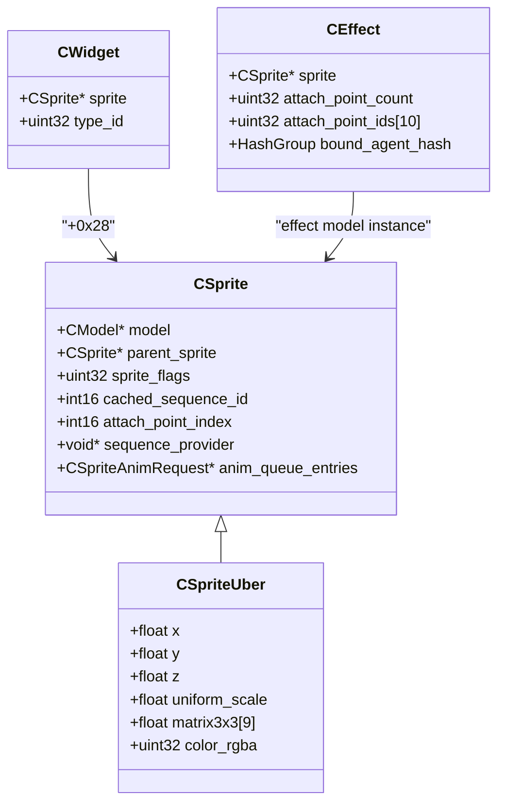
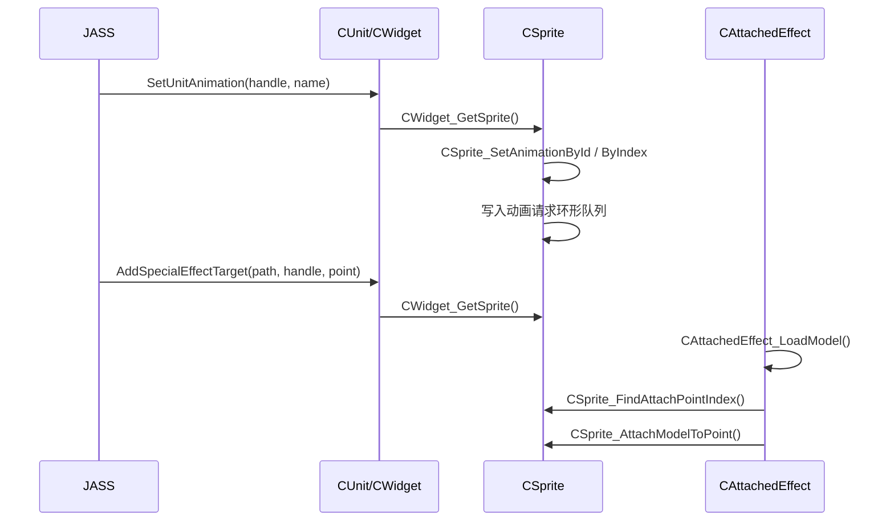

# CSprite / 动画 / 挂点专题逆向

更新日期：2026-04-03

## 1. 范围
本专题聚焦三条直接围绕 `CSprite` 的核心链路：

1. `CSpriteUber` 渲染前更新链
2. `jSetUnitAnimation -> CSprite` 动画切换链
3. `CreateAttachedEffect -> CWidget/CSprite` 挂点附着链

本轮输入来源有两类：

1. 外部补充资料：`sprite_render.cpp`、`set_animation.cpp`、`effect_attach.cpp`
2. IDA PRO MCP 对 `game.dll 1.27a` 的逐地址交叉核对

项目内只落地“IDA 已自证”的高置信度结果；外部资料里仍存疑的推断，本页会明确标成“待继续确认”。

## 2. 已确认主链

### 2.1 Render / PreRender

- `0x6F182300`：`CSpriteUber_PreRender`
- `0x6F12F3B0`：提交当前模型姿态缓存
- `0x6F12FB80`：按当前时间推进动画树
- `0x6F12F500`：直接把动画时间设置到指定毫秒
- `0x6F12F0A0`：把 `CSpriteUber` 的 `3x3` 矩阵 + 位移/缩放写回模型实例

高置信度字段：

- `CSpriteUber + 0x20`：`model`
- `CSpriteUber + 0x94`：动画时间覆盖开关
- `CSpriteUber + 0xA0`：动画时间覆盖值（秒）
- `CSpriteUber + 0xC0/+0xC4/+0xC8`：世界坐标
- `CSpriteUber + 0xE8`：统一缩放
- `CSpriteUber + 0x108`：`3x3` 旋转矩阵
- `CSpriteUber + 0x148`：颜色

### 2.2 Animation

- `0x6F1F7230`：`jSetUnitAnimation`
- `0x6F1F7280`：`jSetUnitAnimation_Impl`
- `0x6F1D1550`：句柄转 `CUnit*`
- `0x6F6A0AD0`：`CWidget_GetSprite`
- `0x6F1F84B0`：动画名字符串拆分为 tag id 数组
- `0x6F322E40`：单位 UI 数据里的动画序列数量
- `0x6F322E10`：单位 UI 数据里的动画序列 ID
- `0x6F186590`：`CSprite_SetAnimationById`
- `0x6F186820`：`CSprite_SetAnimationByIndex`

高置信度结论：

- `CWidget + 0x28` 持有 `CSprite*`
- `CSprite` 内部维护一个 stride=`0x1C` 的动画请求环形队列
- 环形队列头在 `CSprite + 0x34`
- `CSprite + 0x2C` 是动画切换后的缓存序列哨兵，切换后会被置为 `-2`
- `CSprite + 0x30` 持有与动画序列解析相关的 provider/context

### 2.3 Attach / Effect

- `0x6F1D9C70`：`CreateAttachedEffect`
- `0x6F6BA4A0`：`CWidget_CreateAndAttachEffect`
- `0x6F6BA5B0`：`CWidget_CreateAndAttachEffectInternal`
- `0x6F6BB2C0`：`CAttachedEffect_Init`
- `0x6F6BB3A0`：`CAttachedEffectFloating_Init`
- `0x6F6A0F60`：`CAttachedEffect_LoadModel`
- `0x6F185CA0`：`CSprite_FindAttachPointIndex`
- `0x6F184E50`：`CSprite_AttachModelToPoint`
- `0x6F186260`：`CSprite_DetachFromParent`
- `0x6F186280`：`CSprite_DetachFromSpecificParentPoint`

高置信度结论：

- `CreateAttachedEffect` 先把句柄解析成 `CWidget*`，再经 `CWidget + 0x28` 取目标 sprite
- `CAttachedEffect_Init` 会把最多 10 个挂点 ID 拷入 effect 内部数组
- `CAttachedEffect_Init` 会把 `+agl` 对象的 `+0x14/+0x18` 复制到 effect `+0x78/+0x7C`
- `CAttachedEffect_Init` 最终通过 `CSprite_AttachModelToPoint` 把特效模型实例挂到目标 sprite
- `CSprite + 0x2E` 记录当前 `attachPointIndex`
- `CSprite + 0x28` 的 `0x10000 / 0x200000 / 0x400000` 三个位都参与挂点附着刷新逻辑

## 3. 已落地到项目

### 3.1 公用逆向头

- `src/d3d9/jass/war3_game_struct.h`
  - 新增 `CWidget`
  - 新增 `CSpriteAnimPayloadArray`
  - 新增 `CSpriteAnimRequest`
  - 收敛 `CSprite`
  - 收敛 `CSpriteUber`
  - 将 `CEffect` 明确为“附着特效基类布局”

### 3.2 Native 参考头

- `src/d3d9/war3/native/war3_native_renderer.h`
  - 同步补入 `CWidget / CSprite / CSpriteUber / CSpriteAnimRequest`

### 3.3 偏移常量头

- `src/d3d9/war3/core/war3_game_structs.h`
  - 新增 `CWidgetOffsets`
  - 新增 `CSpriteOffsets`
  - 新增 `CSpriteFlagBits`
  - 新增 `CEffectOffsets`

### 3.4 已写回 IDA

本轮已将以下函数以中文作用注释写回 IDA，并统一使用 `【CSprite专题】` 前缀：

- `CSpriteUber_PreRender`
- `jSetUnitAnimation`
- `jSetUnitAnimation_Impl`
- `CWidget_GetSprite`
- `ParseAnimationNameToTagIds`
- `UnitUI_GetAnimationSequenceCount`
- `UnitUI_GetAnimationSequenceIdByIndex`
- `CSprite_SetAnimationById`
- `CSprite_SetAnimationByIndex`
- `CSprite_AllocAnimationRequest`
- `CSprite_BuildAnimationMatchList`
- `CSprite_PopAnimationRequest`
- `CModel_GetAnimationSequenceCount`
- `CModel_GetAnimationSequenceInfoByIndex`
- `CModelSequenceProvider_GetAnimationSequenceInfoByIndex`
- `AnimationSequence_BuildDescriptor`
- `CAnimComplex_SetSequence`
- `CAnimComplex_SetSequenceTimeMs`
- `CAnimComplex_SetTimeScaleRaw`
- `CreateAttachedEffect`
- `CWidget_CreateAndAttachEffect`
- `CWidget_CreateAndAttachEffectInternal`
- `CAttachedEffect_Init`
- `CAttachedEffectFloating_Init`
- `CAttachedEffect_LoadModel`
- `CSprite_FindAttachPointIndex`
- `CSprite_AttachModelToPoint`
- `CSprite_DetachFromParent`
- `CSprite_DetachFromSpecificParentPoint`
- `GetCWidgetTypeId`
- `GetCAttachedEffectStaticTypeId`
- `GetCAttachedEffectFloatingTypeId`

## 4. 类关系图

## 5. 时序图

## 6. 仍待继续确认

1. `CSprite + 0x30` 的 provider 精确类名
2. `CSpriteAnimRequest + 0x18` 的精确业务语义
3. `CSprite + 0x28` 上 `0x200000` 的精确定义
4. `CAttachedEffectFloating_Init` 在 `+0x84` 清零后的后续状态语义
5. `CSpriteUber + 0x94/+0xA0` 是否还参与生命周期/随机起始帧逻辑

## 7. 本轮结论

`CSprite` 这一轮已经不再是“只有占位定义”的状态了。围绕它最重要的三条业务链：

1. 渲染前姿态更新
2. 单位动画切换
3. 特效挂点附着

都已经有了可落到工程头文件、可写回 IDA、可继续深化的基线结构。下一步最值得继续深挖的是：

1. `sequence_provider / CAnimComplex / sequence descriptor` 的精确类名与字段
2. `CSpriteMini` 与 `CSpriteUber` 的继承分界
3. 挂点系统里骨骼表/attach point table 的真实结构
