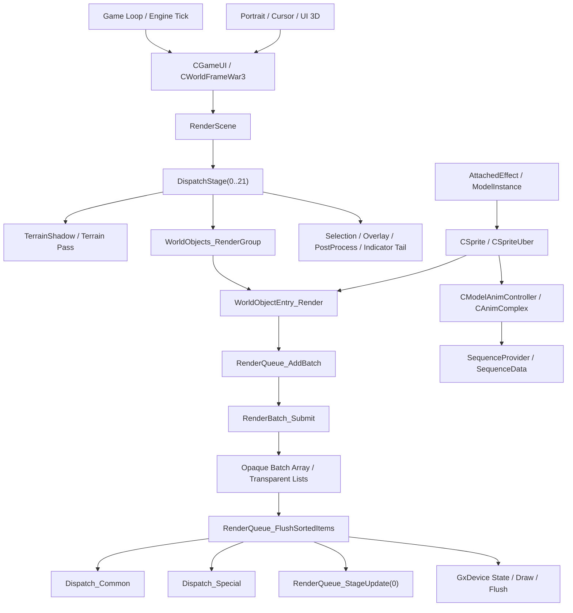
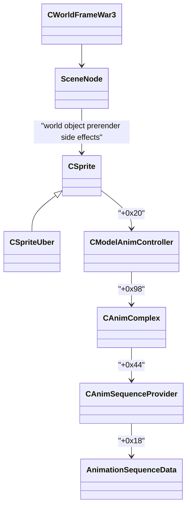

# 魔兽争霸3暴雪原生渲染引擎全景逆向

更新日期：2026-04-04

## 1. 目标
这份文档不是单点类逆向，而是站在“暴雪原生渲染引擎”视角，把当前已确认的所有主干拼成一张完整地图：

1. 世界帧如何驱动一帧渲染
2. 世界对象如何进入 RenderQueue
3. RenderQueue 如何排序、派发、flush
4. `CSprite / CSpriteUber / CAnimComplex` 如何参与模型动画
5. 挂点特效如何附着到 sprite
6. UI 3D（头像/光标/模型 frame）如何与世界帧并存

同时，这份文档会明确指出：

1. 哪些域已经达到“工程可接管”
2. 哪些域仍然是“主链明确，但结构未完全收口”
3. `native` 目录里哪些代码已经是 ASM 基线，哪些仍是语义占位

## 2. 原生引擎分层

## 3. 一帧渲染的真实主链

### 3.1 世界帧入口

已确认入口：

- `CWorld_RenderScene @ 0x6F3681C0`
- `CWorld_DispatchStage @ 0x6F363020`

高置信度顺序：

1. `StateCleanup(world+338 / +33C / +354)`
2. 重置 `world+660 / world+664`
3. 若 `world+300 != -1`，启用 stage12 相关 shadow/indicator handle
4. 条件执行 stage0
5. 第一段：`1 -> 13 -> Flush`
6. 第二段：`19,9,2,3,8,(17),14,5,10,(12),11 -> Flush`
7. 第三段：`4,7,6,20`
8. 若 `activeQueue == 0`：追加 `15,18,21`
9. 关闭 category/mode 状态机并 flush cleanup context

### 3.2 DispatchStage 的语义分层

已经可以把 `0..21` 粗分成 4 组：

1. 地形/阴影阶段
   - `1,2,3,4,5,6,7,8,9,10,14,17,19,20,21(前半)`
2. 世界对象阶段
   - `11,12,13`
3. UI/选择/后处理尾链
   - `15,18,21(后半)`
4. 调试/覆盖层
   - `16`

专题参考：

- [17_cworldframewar3_full_reverse/README.md](/E:/Mycode/Source/Repos/War3MapReforge/Core/Base/Graphics/dxvk/docs/research/war3_render_issues/17_cworldframewar3_full_reverse/README.md)

## 4. 世界对象提交流程

### 4.1 WorldObjects -> RenderQueue

主链：

1. `CWorld_WorldObjects_RenderGroup @ 0x6F368E30`
2. `WorldObjectEntry_Render @ 0x6F184EE0`
3. `RenderQueue_AddBatch @ 0x6F139190`
4. `RenderBatch_Submit @ 0x6F1375C0`

已确认逻辑：

1. `WorldObjectEntry_Render` 先调用对象虚表 `vtable[5]` 做 prerender
2. 若 `entry+0x20` 的 `sceneNode` 非空，则进入 `RenderQueue_AddBatch`
3. `RenderQueue_AddBatch` 并不是简单薄封装，它还会：
   - 处理四条透明列表
   - 递归可见子节点

### 4.2 SceneNode 的关键职责

当前高置信度字段：

- `+0x0C`：renderable 数量
- `+0x10`：renderable 指针数组
- `+0x30`：meshInfo table
- `+0x50/0x54` 附近：layer/renderable 可见性缓存表
- `+0x64`：世界矩阵 `3x4`
- `+0x94`：render flags，`bit0x10` 命中时走透明附加链
- `+0x98`：子节点可见性查询上下文
- `+0x9C`：world 上下文
- `+0xC4`：child bucket 数量
- `+0xC8`：child bucket 数组
- `+0xD4`：子节点可见性缓存字节表

### 4.3 RenderBatch_Submit 的真实语义

`RenderBatch_Submit` 已经不是黑盒，至少以下几点已确认：

1. `part+0x0C = meshData`
2. `part+0x10 != 0` 直接跳过
3. `part+0x14 = sceneNode`
4. `meshData+0x104` 决定是否进入 special/special-like 分支
5. `meshInfo.layerCount + stateBlockBase + layerInfo.layerDataBase` 决定会生成多少 `RenderBatchElement`
6. 同 mesh 后续仍有可见层时，会给批次条目打 `hasMoreLayers` 标记
7. 不透明进主 batch array，透明进 `AUCTransparent`

## 5. RenderQueue CPU 核心

### 5.1 FlushSortedItems

入口：

- `RenderQueue_FlushSortedItems @ 0x6F1380A0`

高置信度流程：

1. 将 `g_RenderQueue_BatchArray` 中前 `min(num,10000)` 项复制到 `g_RenderQueue_SortedPtrs`
2. `qsort`
3. 先对首条 `ApplyStateBlock`
4. 逐条判定：
   - `stateChanged`
   - `layerChanged`
   - `special/common`
5. 调 `Dispatch_Common` 或 `Dispatch_Special`
6. 每条之后都执行一次 `RenderQueue_StageUpdate(0)`
7. 尾部若 `g_RenderQueue_StateCleanupPending != 0`，做 `StateCleanup74/78`

### 5.2 Dispatch_Common / Dispatch_Special

`Dispatch_Common @ 0x6F13A5E0`

已确认：

1. 必做 `RenderQueue_UpdateItemWorldMatrix`
2. 通过 `meshIndex -> dispatch block` 查材质/层描述
3. 绑定 dispatch block
4. 按需要 `ApplyStateBlock`
5. 普通 mesh 尾部会补 `RenderSceneFlush_0E39E0`

`Dispatch_Special @ 0x6F13A780`

已确认：

1. 必做 `RenderQueue_UpdateItemWorldMatrix`
2. 若 special batch 状态一致，走 `DispatchSpecialBatch`
3. 否则清理状态并回退 `FallbackMultiPass`

### 5.3 StageUpdate

`RenderQueue_StageUpdate @ 0x6F13A9B0`

已确认：

1. 首次调用会用 `sub_6F0E2DA0` 初始化 stage 数量
2. `arg=0` 时只刷新未初始化 slot
3. `arg!=0` 时强制刷新全部 slot
4. 这也是为什么“减少 batch 数量”会直接降低 CPU 压力

## 6. 模型动画域

专题参考：

- [18_csprite_animation_attach_reverse/README.md](/E:/Mycode/Source/Repos/War3MapReforge/Core/Base/Graphics/dxvk/docs/research/war3_render_issues/18_csprite_animation_attach_reverse/README.md)

当前高置信度类链：

已确认要点：

1. `CSprite` 内部有一个 stride=`0x1C` 的动画请求环形队列
2. `CSpriteUber_PreRender` 会推进动画时间、写入世界矩阵并同步模型姿态
3. `CAnimComplex` 负责当前序列、过渡、时间缩放、骨骼 blend buffer
4. `SequenceProvider` 持有“外部索引 -> 内部序列”映射和序列数据表

## 7. 附着特效域

主链：

1. `CreateAttachedEffect`
2. `CWidget_CreateAndAttachEffect`
3. `CWidget_CreateAndAttachEffectInternal`
4. `CAttachedEffect_Init / Floating_Init`
5. `CAttachedEffect_LoadModel`
6. `CSprite_FindAttachPointIndex`
7. `CSprite_AttachModelToPoint`

高置信度结论：

1. `CWidget + 0x28 -> CSprite*`
2. `CAttachedEffect + 0x28 -> CModelInstance*`
3. `CModelInstance + 0x28` 的 `0x10000` 位表示已附着
4. `attached_point_index` 在 `CModelInstance + 0x2E`
5. effect 内部保存最多 10 个 attach point id

## 8. UI 3D 域

当前已知但尚未独立专题化的关系：

1. `CGameUI + 0x2C`：`cursor_sprite`
2. `CGameUI + 0x3BC`：`world_frame_war3`
3. `CPortraitButton + 0x140`：头像相机
4. `CPortraitButton + 0x238`：头像单位
5. `CWorldFrameWar3` 的 `stage18/21` 尾链会和 UI/后处理上下文交会

这块目前“组合关系已经清楚”，但仍值得单独再补一页：

1. portrait 渲染如何共用模型/动画系统
2. cursor sprite 如何共用 `CSpriteUber`
3. `model frame` 和 `world frame` 的边界

## 9. stage16 / 18 / 21 尾链

### 9.1 stage16

已确认：

1. `0x6F368A90` 是一个调试/覆盖层总入口
2. 受 `dword_6FB66E24` 的 bitmask 影响
3. 会命中对象调试绘制、地图格/路径/覆盖层等多条分支

### 9.2 stage18

已确认：

1. `0x6F3597C0` 用于判断后处理/预览上下文是否存在
2. `0x6F3C4330` 提交 preview context
3. `0x6F3ACFF0` 遍历全局后处理上下文数组并逐个收尾

### 9.3 stage21

已确认：

1. 前半段继续走 `TerrainShadowDispatch(13)`
2. 若 indicator handle 就绪，则调用 `0x6F76F190`
3. 之后还存在 `dword_6FBE4238` 驱动的 UI/文本尾链，尚未完全收口

## 10. native 工程当前状态

### 10.1 已接近 ASM 基线

- `war3_native_renderer.cpp`
  - `RenderScene`
  - `DispatchStage`
  - `WorldObjects_RenderGroup`
- `war3_native_renderer.h`
  - `CWorldFrameWar3`
  - `CSprite / CSpriteUber`
  - `CAnimComplex / SequenceProvider`
  - `CModelInstance / CAttachedEffect`

### 10.2 仍是语义占位的关键点

- `war3_native_renderer_core.cpp`
  - `Dispatch_Common`
  - `Dispatch_Special`
  - `StageUpdate`
  - `GxDevice_*` 设备调用
- `war3_native_shadow.cpp`
  - 仍有占位调用和待确认结构

### 10.3 这意味着什么

`native` 工程现在已经能作为“原生引擎骨架参考”，但还不是“逐指令级可替换实现”。  
真正还差的，不是主链认知，而是：

1. dispatch block / material block 的完整结构体
2. 设备态更新的真实调用契约
3. special/multipass fallback 的类级字段

## 11. 当前逆向覆盖判断

| 域 | 状态 | 结论 |
|---|---|---|
| 世界帧主链 | 高 | 已足够工程接管 |
| RenderQueue 主链 | 高 | 排序/派发/flush 已清晰 |
| 模型动画 | 中高 | 主对象链已清晰，仍可继续补细节 |
| 挂点特效 | 中高 | 主链清晰，骨骼表仍可继续补 |
| UI 3D | 中 | 组合关系明确，缺独立专题 |
| stage16/18/21 尾链 | 中 | 作用明确，仍有全局依赖未完全命名 |
| GxDevice / dispatch block | 中低 | 仍是当前最值得继续逆的底层块 |

## 12. 深度研究交付建议

若要交给深度研究模型继续扩写/整合，最重要的材料顺序应是：

1. 本文档：全景地图
2. `17_cworldframewar3_full_reverse`
3. `18_csprite_animation_attach_reverse`
4. `docs/research/war3_render_issues/native/README.md`
5. `src/d3d9/war3/native/README.md`
6. `src/d3d9/war3/native/address_book/README.md`
7. `src/d3d9/war3/native/war3_native_renderer.h/.cpp/.core.cpp`
8. `src/d3d9/jass/war3_game_struct.h`
9. `src/d3d9/war3/core/war3_game_structs.h`

## 13. 当前结论

现在不能说“魔兽争霸3原生渲染引擎已经没有剩余可逆的内容”。  
更准确的说法是：

1. **主干已经清楚**
2. **native 工程已经有可用骨架**
3. **仍有值得继续深挖的底层块**

如果以“今天交稿”作为目标，那么当前最合理的交付姿态应该是：

1. 把主链、对象图、阶段图、native 骨架一起交出去
2. 明确说明剩余未知点集中在 `dispatch block / GxDevice / special multipass / UI 3D 尾链`
3. 把这些未知点定义成“下一阶段研究任务”，而不是假装已经没有空白
