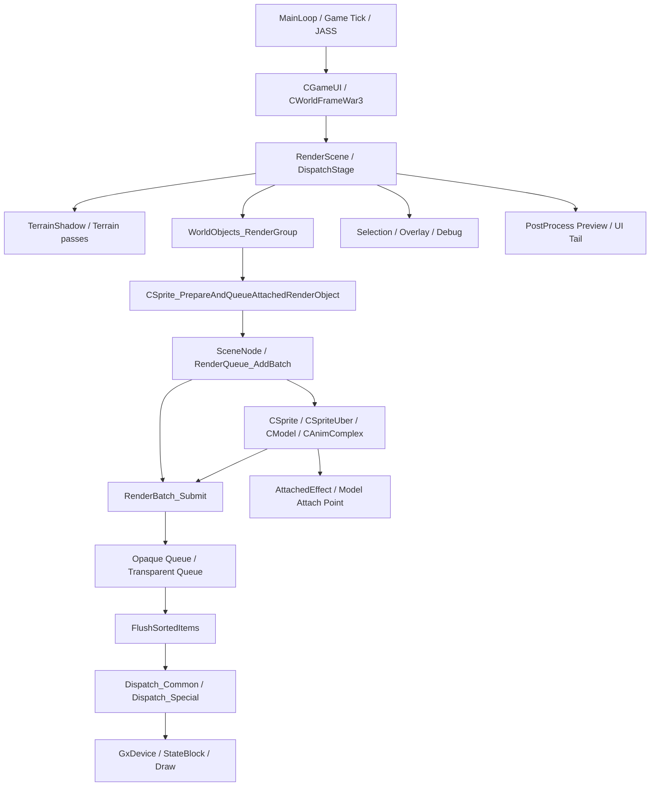
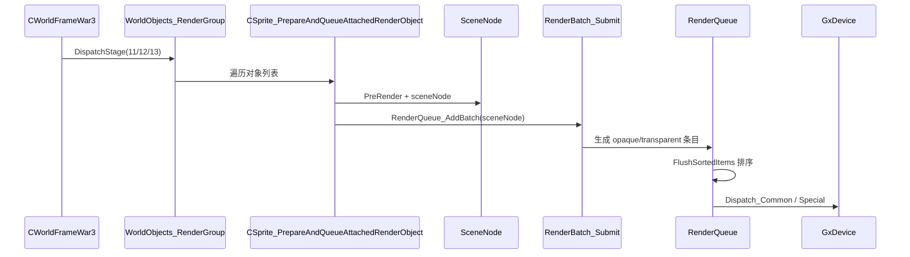
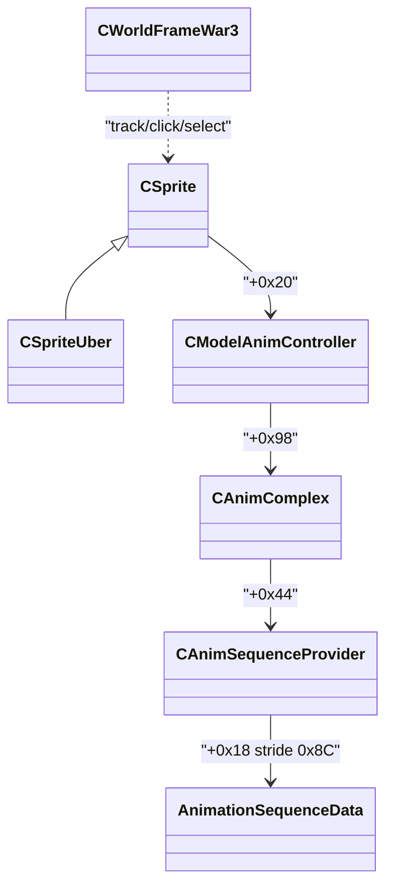
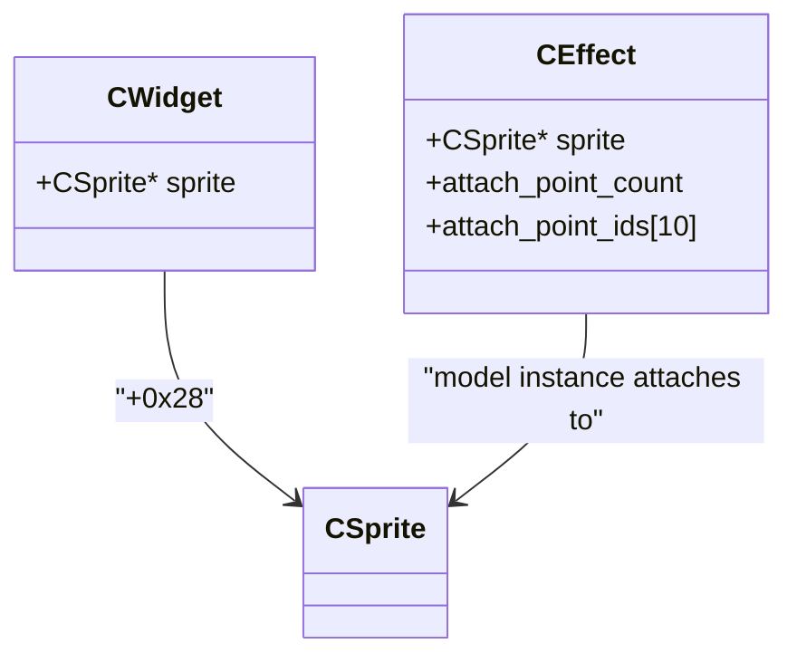
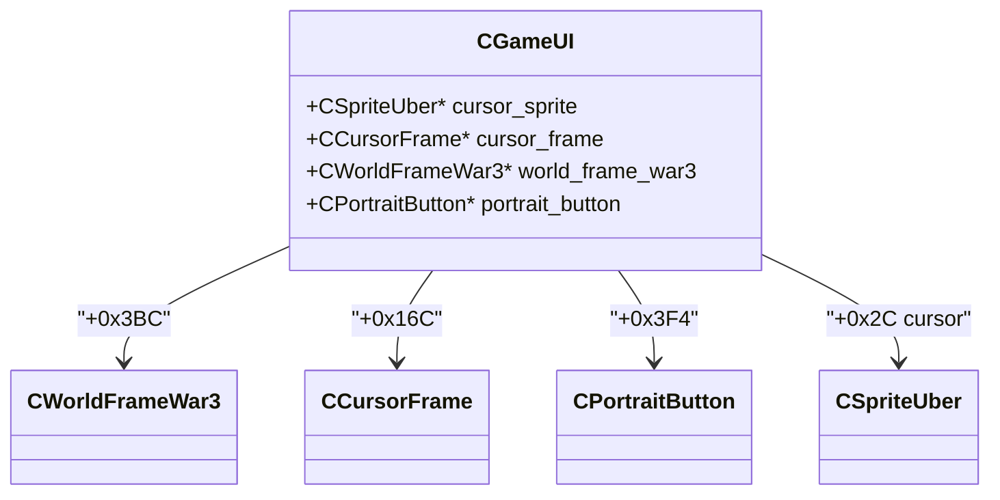

# 魔兽争霸3暴雪原生渲染引擎全景逆向

更新日期：2026-04-04

> 2026-07-15 范围说明：本页保留全景透视，但不代表相关类字段与虚函数均已完成。
> `CWorldFrameWar3`、`CWorldObjects`、`CWorldObjectsClippable`、`CDoodads`、`CBlightPuffs`
> 的 raw RTTI/ASM inventory 与 Unknown 边界见
> [30_cworld_class_family_full_reverse](../30_cworld_class_family_full_reverse/README.md)。
> `0x6F184EE0` 的 canonical receiver 已修正为 `CSprite*`；下文 `WorldObjectEntry` 与
> slot5=PreRender 是历史术语，不再是 authoritative 类型/语义。

## 1. 目标
本页从“暴雪原生渲染引擎视角”统一描述 Warcraft III 1.27a 的 3D 渲染系统，而不是只看某个 Hook 点或某个效果模块。

本页的目的有三项：

1. 给出原生渲染引擎的完整分层视图
2. 把已经写回工程的还原代码、头文件与研究成果统一收口
3. 为“深度研究模型”准备一份可直接继续深化的总入口

本页只采纳以下三类证据：

1. IDA PRO MCP 直接反汇编/反编译
2. 当前项目 `native/` 还原工程中的已核对内容
3. `17_cworldframewar3_full_reverse` 与 `18_csprite_animation_attach_reverse` 两个专题的高置信度结论

## 2. 全局分层

## 3. 引擎主视角

### 3.1 帧入口

原生世界渲染的主控制器是：

- `CWorldFrameWar3::RenderScene @ 0x6F3681C0`

它的职责不是直接绘制所有内容，而是：

1. 清理世界级状态缓存
2. 设置 `RenderCategory / CategoryMode` 状态机
3. 按固定阶段表调用 `DispatchStage`
4. 在两个关键时机 `FlushAndReset`
5. 在尾部补 selection / postprocess / indicator / overlay

### 3.2 阶段分发

`CWorldFrameWar3::DispatchStage @ 0x6F363020` 是原生渲染引擎的阶段路由器。

高置信度阶段图：

| Stage | 作用 |
|---|---|
| `0` | stage0 预渲染上下文 |
| `1/2/3/4/5/6/7/8/9/10/14/17/19/20/21` | Terrain / TerrainShadow 各子阶段 |
| `11/12/13` | WorldObjects 三组列表 |
| `15` | Selection manager |
| `16` | Debug / overlay / editor-style overlay |
| `18` | Postprocess preview tail |
| `21` | TerrainShadow13 + indicator / 尾提交 |

### 3.3 WorldObjects 不是“直接绘制”

`WorldObjects_RenderGroup @ 0x6F368E30` 的本质是：

1. 取 `CWorldFrameWar3 + 0x16C/+0x170/+0x174` 三个列表
2. 遍历 `WorldGroupRecord`（stride `0x18`）
3. 从 record `+0` 取 `CSprite*`，调用 `CSprite_PrepareAndQueueAttachedRenderObject`

而 `CSprite_PrepareAndQueueAttachedRenderObject @ 0x6F184EE0` 也不是 draw call，它做的是：

1. `sprite+0x20` 非空时调 vslot5；该槽不是通用预渲染，base/Mini no-op，Uber 只 flush pending state
2. 把 `[sprite+0x20]` 丢给 `RenderQueue_AddBatch`；visibility/prepare 在 vslot3

这意味着原生引擎的真正“CPU 热点主链”在 `SceneNode -> Batch -> Queue -> Flush -> Dispatch`。

## 4. RenderQueue 引擎

如果后续目标是“接管原生渲染提交层”，建议和本章配套阅读：

1. `../20_renderqueue_dispatch_layer_reverse/README.md`
   - 专门收口 `RenderBatch_Submit / FlushSortedItems / Dispatch_Common / Dispatch_Special / fallback multipass`
   - 以及 `SceneNode / MeshData / LayerState / LayerDispatch` 的可接管结构锚点

### 4.1 提交链

### 4.2 SceneNode / RenderBatch_Submit

`RenderQueue_AddBatch @ 0x6F139190`

1. 先调 `RenderBatch_Submit(sceneNode)`
2. 若 `sceneNode flags & 0x10`
   - 追加四类透明链：`List0/2/3/4`
   - 递归子节点

`RenderBatch_Submit @ 0x6F1375C0`

1. 遍历 `SceneNode.renderableList`
2. 对每个 renderable part：
   - 读取 `meshData`
   - 用可见性/层状态判断 opaque 还是 transparent
3. opaque：
   - 展开每个可见 layer
   - 把条目写入全局 `RenderQueue_BatchArray`
4. transparent：
   - 计算 world position
   - 写入 `AUCTransparent` 队列

### 4.3 Flush / Dispatch

`RenderQueue_FlushSortedItems @ 0x6F1380A0`

1. 截取最多 `10000` 个批次
2. 复制到 `SortedPtrs`
3. `qsort`
4. 首条目先 `ApplyStateBlock`
5. 每个条目走：
   - `Dispatch_Special` 或 `Dispatch_Common`
   - `RenderQueue_StageUpdate(0)`
6. 尾部如果 `StateCleanupPending`
   - `GxDevice_StateCleanup74/78`

`RenderQueue_Dispatch_Common @ 0x6F13A5E0`

1. `RenderQueue_UpdateItemWorldMatrix`
2. 从材质/层状态块里取 dispatch block
3. `RenderQueue_BindDispatchBlock`
4. 绑定颜色/状态
5. 若 `stateChanged`，重新 `ApplyStateBlock`
6. 执行 draw / flush

`RenderQueue_Dispatch_Special @ 0x6F13A780`

1. 同样先更新 world matrix
2. 若 special state 一致
   - 走 special batch 路径
3. 否则
   - 先做 cleanup
   - 再走 fallback multipass

### 4.4 队列层结论

渲染 CPU 热点本质上不在 `CWorldFrameWar3`，而在：

1. `RenderBatch_Submit` 的 layer 展开
2. `FlushSortedItems` 的排序
3. `Dispatch_Common/Special` 的状态切换与 multipass fallback

## 5. 模型/精灵/动画引擎

### 5.1 类关系

### 5.2 关键链

`CSpriteUber_PreRender @ 0x6F182300`

1. 检查动画时间模式
2. 正常模式：按游戏时间推进动画
3. 覆盖模式：直接把时间设置到指定毫秒
4. 从动画控制器更新 pose cache
5. 把 `3x3` 矩阵扩展为 `3x4`
6. 写入模型实例 world matrix

`jSetUnitAnimation @ 0x6F1F7230 -> 0x6F1F7280`

1. handle -> `CUnit`
2. `CWidget + 0x28 -> CSprite*`
3. 解析动画字符串为 tag id
4. 收集候选 sequence id
5. 写入 `CSprite` 的动画环形队列

### 5.3 高置信度结构

已经可稳定使用的结构：

1. `CSprite`
2. `CSpriteUber`
3. `CSpriteAnimRequest`
4. `AnimationSequenceDescriptor`
5. `AnimationSequenceData`
6. `CAnimSequenceProvider`
7. `CAnimComplex`
8. `CModelAnimController`

这些结构已经落在工程头文件里，可作为后续继续深化的基线。

## 6. 附着特效 / 骨骼挂点

### 6.1 主链

`CreateAttachedEffect @ 0x6F1D9C70`

1. handle -> `CWidget*`
2. `CWidget_GetSprite @ 0x6F6A0AD0`
3. 解析挂点字符串 -> attach point id 数组
4. `CSprite_FindAttachPointIndex @ 0x6F185CA0`
5. `CWidget_CreateAndAttachEffectInternal @ 0x6F6BA5B0`
6. `CAttachedEffect_Init @ 0x6F6BB2C0`
7. `CSprite_AttachModelToPoint @ 0x6F184E50`

### 6.2 结构关系

高置信度结论：

1. `CEffect + 0x4C` 是挂点数量
2. `CEffect + 0x50` 起是 10 个挂点 ID
3. `CEffect + 0x78/+0x7C` 是从 `+agl` 对象复制来的绑定目标哈希

## 7. Terrain / Shadow 引擎

### 7.1 主地位

在暴雪原生引擎里，地形/阴影不是附加特效，而是 `DispatchStage` 主表中的第一类阶段。

### 7.2 主链

- `CWorld_TerrainShadow_Dispatch @ 0x6F76F060`
- `TerrainShadow_RenderLayer @ 0x6F737620`
- `TerrainShadow_RenderListA @ 0x6F737500`
- `TerrainShadow_RenderListB @ 0x6F737400`
- `TerrainShadow_RenderListBEntry @ 0x6F737310`
- `ShadowUpdate_WriteEntry @ 0x6F73F7A0`
- `ShadowProjector_Add_Simple @ 0x6F76D790`
- `ShadowProjector_Add_FromObject @ 0x6F76D800`

### 7.3 作用总结

1. Terrain 与 Shadow 在阶段表里高度耦合
2. ListA / ListB 是地形阴影系统的两种主渲染表
3. stage14 / stage21 等尾阶段仍然会落回 terrain shadow 子系统

## 8. UI 3D / PostProcess / Overlay

### 8.1 stage16

`stage16` 不是普通世界对象阶段，而是 debug / overlay / editor-style overlay 汇合点。

已确认：

- `CWorldFrameWar3_RenderDebugOverlayDispatcher @ 0x6F368A90`：主 dispatcher
- mode `0/1/2/3` 会切不同 callback
- 总控全局是 `dword_6FB66E24`
- `0x1000/0x2000` 控制数据源分支
- `0x80` 明确是网格/格子/路径类 overlay
- `0x100` 明确是朝向 marker
- `0x20/0x40` 是对象状态 overlay 的两条子模式
- 既可以走 `CWorldFrameWar3 + 0x624/+0x628` 的 tracked overlay entry，也可以走 `CGameUI` / 全局 runtime 的附加入口

四个 helper 的高置信度语义：

1. `0x6F36B8A0`：点列/折线型 overlay，偏 polyline/path
2. `0x6F36B920`：围绕对象位置/高度范围画框体类 overlay
3. `0x6F36B4E0`：对象状态 overlay；`0x20` 时偏线段/连接图元，`0x40` 时会拼文本状态串
4. `0x6F36B7B0`：朝向 marker；读取对象角度后用 `sin/cos` 画十字/方向短线

### 8.2 stage18

`stage18` 是 postprocess preview tail：

- `CWorldFrameWar3_ShouldRenderPostprocessPreview @ 0x6F3597C0`：门控函数
- `CWorldFrameWar3_RenderPostprocessPreviewContext @ 0x6F3C4330`：执行一次 preview context
- `CWorldFrameWar3_RenderQueuedUi3DOverlays @ 0x6F3ACFF0`：遍历全局 postprocess/preview 队列并提交

更精确的门控条件：

1. `CWorldFrameWar3 + 0x248 = stage18PreviewEnabled`
2. `CWorldFrameWar3 + 0x250 = stage18PreviewContext`
3. `CGameUI + 0x1AC = postprocessPreviewPrimary`
4. `CGameUI + 0x1B0 = postprocessPreviewSecondary`

也就是说 `stage18` 不是泛泛的“后处理”，而是：

1. `preview context` 的一次性绘制
2. 全局 postprocess/preview 队列的尾提交

### 8.3 stage21

`stage21` 是 terrain shadow 13 阶段后的 indicator / tail 提交：

- `CWorldFrameWar3_RenderStage21Tail @ 0x6F76F190`
- `TerrainShadow_RenderListBEntryChain @ 0x6F7373D0`
- `dword_6FBE4238 -> sub_6F1C3200 -> sub_6F26C7F0` 的全局尾链

这里需要特别纠正一个容易误命名的点：

1. `CWorldFrameWar3 + 0x300` 在 `stage21` 里传的是 `ListB entry index`
2. 它不是对象指针
3. 原版先 `GetTerrain_771060`，再把 `terrain + index*0xA0` 的条目交给 `TerrainShadow_RenderListBEntry`

这说明 `stage21` 不是独立 UI pass，而是：

1. 先复用 `TerrainShadow` 的尾部 entry 提交
2. 再走一段全局单例里的 tail render context 提交

### 8.4 UI 3D 三宿主

`UI 3D` 不是一条链，而是三个宿主并存：

高置信度结论：

1. `CGameUI + 0x3BC = CWorldFrameWar3*`
2. `CGameUI + 0x16C = CCursorFrame*`
3. `CGameUI + 0x2C = cursor_sprite`
4. `CGameUI + 0x3F4 = CPortraitButton*`
5. `CPortraitButton` 是独立 3D 视图岛，不直接复用 `CWorldFrameWar3` 的世界相机
6. `CCursorFrame` 走 `CSpriteFrame` 分支，典型用于光标这种屏幕空间 sprite/model 宿主

## 9. 当前已落地到工程

### 9.1 Native 还原工程

关键文件：

- `src/d3d9/war3/native/war3_native_renderer.h`
- `src/d3d9/war3/native/war3_native_renderer.cpp`
- `src/d3d9/war3/native/war3_native_renderer_core.cpp`
- `src/d3d9/war3/native/war3_native_shadow.cpp`
- `src/d3d9/war3/native/war3_native_symbols.cpp`
- `src/d3d9/war3/native/address_book/README.md`

### 9.2 公用逆向头

- `src/d3d9/jass/war3_game_struct.h`
- `src/d3d9/war3/core/war3_game_structs.h`

### 9.3 本轮新增

1. `native/meson.build` 已补入：
   - `war3_native_renderer_core.cpp`
   - `war3_native_symbols.cpp`
2. `native` 相关源码已补构建接线，并通过针对性语法级检查
3. `CSprite / CAnimComplex / Queue / Tail stage` 相关文档继续补强

## 10. 仍未彻底还原的部分

这份“全景逆向”已经能讲清整台机器怎么转，但还没有把每个齿轮都命名完。

剩余高价值未完项：

1. `SequenceRecord (0x8C stride)` 逐字段表
2. `CAnimComplex + 0x70..0xA8` 三组联动数组真实类型
3. `CModel + 0xFC` pose/bone 输出缓存结构
4. `SceneNode` 与 `RenderablePart / MeshInfo / LayerInfo / LayerData` 更严格的字段布局
5. `stage16 mode1` 的精确 gameplay 语义
6. `GameUI + 0x1AC/+0x1B0` 对应的 preview/postprocess 对象真实类名
7. `CPortraitButton` 内部 camera preset / observer 子对象的完整结构

## 11. 交付给深度研究模型的建议阅读顺序

1. 本页：`19_blizzard_native_rendering_engine_full_perspective/README.md`
2. `17_cworldframewar3_full_reverse/README.md`
3. `18_csprite_animation_attach_reverse/README.md`
4. `docs/research/war3_render_issues/native/README.md`
5. `src/d3d9/war3/native/address_book/README.md`
6. `src/d3d9/war3/native/war3_native_renderer.cpp`
7. `src/d3d9/war3/native/war3_native_renderer_core.cpp`
8. `src/d3d9/war3/native/war3_native_shadow.cpp`
9. `src/d3d9/jass/war3_game_struct.h`
10. `src/d3d9/war3/core/war3_game_structs.h`

## 12. 本页结论

从“暴雪原生渲染引擎”视角看，Warcraft III 的渲染系统已经可以稳定拆成这几层：

1. `CWorldFrameWar3` 世界帧编排层
2. `DispatchStage` 阶段路由层
3. `SceneNode / RenderBatch_Submit / RenderQueue` 提交层
4. `Dispatch_Common/Special -> GxDevice` 执行层
5. `CSprite / CModel / CAnimComplex` 模型动画层
6. `AttachedEffect / AttachPoint` 挂点附着层
7. `TerrainShadow` 地形阴影层
8. `Selection / Overlay / PostProcess / UI Tail` 尾链层

也就是说：主骨架已经成型，剩下的是“把每个子系统的内部结构继续雕细”。对交稿来说，这已经足够构成一份完整、可继续深化的原生引擎级研究底稿。
