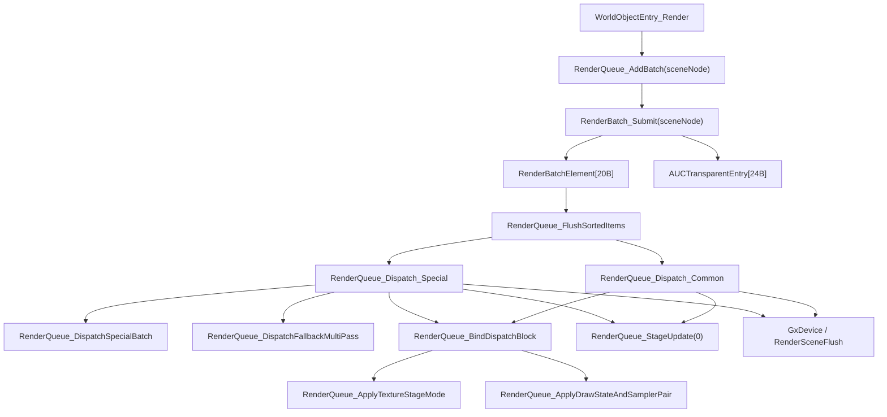
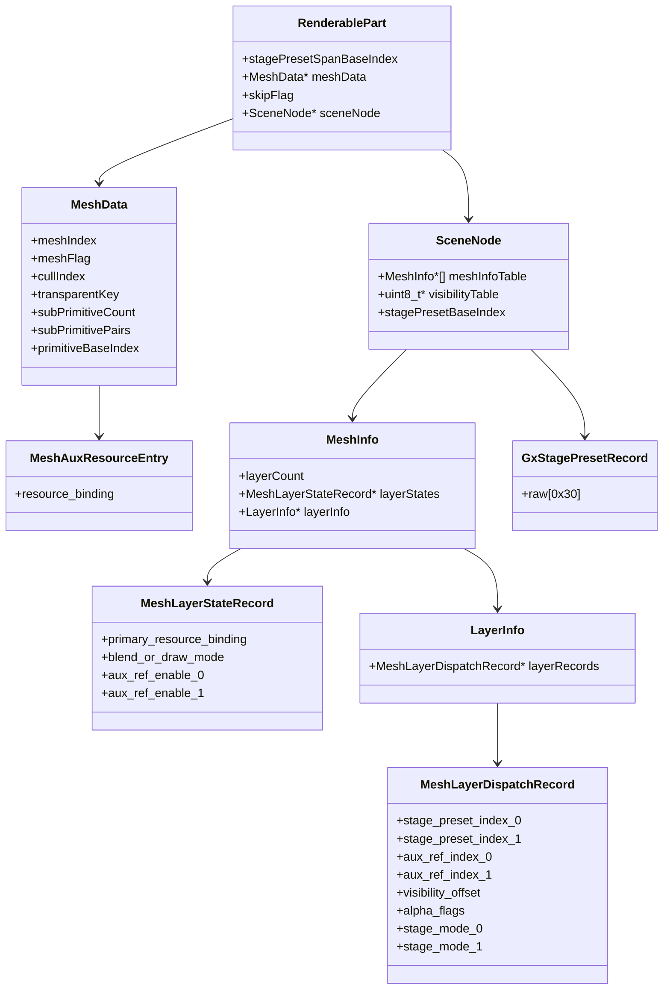

# RenderQueue / Dispatch Layer 深入逆向

更新日期：2026-04-04

## 1. 目标
本页专门收口 Warcraft III 原生渲染引擎中，最适合未来“接管渲染层”的那一小段：

1. `RenderBatch_Submit`
2. `RenderQueue_FlushSortedItems`
3. `RenderQueue_Dispatch_Common`
4. `RenderQueue_Dispatch_Special`
5. `RenderQueue_DispatchFallbackMultiPass`
6. `RenderQueue_StageUpdate`

和前面专题相比，本页重点不是“全景讲解”，而是把接管设计真正会依赖的结构、调用约定、状态切换点尽量钉实。

## 2. 总体主链



## 3. 高置信度结构关系

### 3.1 SceneNode

当前已确认的关键字段：

| 偏移 | 含义 |
|---|---|
| `+0x0C` | `renderableCount` |
| `+0x10` | `renderableList` |
| `+0x20` | 16 字节 `SceneNodeTintRecord` 数组 |
| `+0x30` | `MeshInfo*[]` |
| `+0x50` | layer 可见性/alpha 表 |
| `+0x64` | 3x4 world matrix |
| `+0x94` | flags，`bit4=存在透明附加链` |
| `+0x98` | child visibility context |
| `+0xA0` | 共享 `GxStagePresetRecord[0x30]` 池的起始 index |
| `+0xC4` | child count |
| `+0xC8` | child bucket 数组，stride=`0x0C` |
| `+0xD4` | child visibility cache 字节表 |

`SceneNode + 0x20` 的 16 字节记录不是普通“剔除布尔值”，而是会直接参与颜色乘算，因此更像“对象级 tint/cull record”。

### 3.2 RenderablePart / RenderBatchElement

`RenderablePart`

| 偏移 | 含义 |
|---|---|
| `+0x08` | `stagePresetSpanBaseIndex`，由 stage preset builder 写入 |
| `+0x0C` | `MeshData*` |
| `+0x10` | `skipFlag` |
| `+0x14` | `SceneNode*`，由 `RenderBatch_Submit` 回写 |

`RenderBatchElement`（20 字节）

| 偏移 | 含义 |
|---|---|
| `+0x00` | `RenderablePart*` |
| `+0x04` | flags |
| `+0x08` | `layerIndex` |
| `+0x0C` | `layerCounter` |
| `+0x10` | `MeshLayerStateRecord*` |

flags 的低两位：

1. `0x01`：`meshData->meshFlag != 0`
2. `0x02`：当前 layer 后仍有可见层
3. `(flags & 3) == 3`：进入 `Dispatch_Special`

### 3.3 MeshData / MeshInfo / Layer 两级记录



高置信度字段：

`MeshData`

| 偏移 | 含义 |
|---|---|
| `+0x94` | `aux_layer_resource_table` |
| `+0xC8` | `sub_primitive_count` |
| `+0xCC` | `sub_primitive_pairs`，每项 8 字节 |
| `+0xE0` | `primitive_base_index` |
| `+0xF0` | `transform_or_pose_ctx` |
| `+0x104` | `meshFlag` |
| `+0x108` | `meshIndex` |
| `+0x10C` | `boundingPos[3]` |
| `+0x11C` | `cullIndex` |
| `+0x120` | `transparentKey` |
| `+0x124` | `extraMeshFlags`，当前已确认 `bit2` 影响 `0x6F138510` 过滤 |

`MeshInfo`

| 偏移 | 含义 |
|---|---|
| `+0x0C` | `layerCount` |
| `+0x10` | `MeshLayerStateRecord*`，stride=`0x24` |
| `+0x38` | `LayerInfo*` |

`MeshLayerDispatchRecord`

| 偏移 | 含义 |
|---|---|
| `+0x0C` | `stage_preset_index_0` |
| `+0x10` | `stage_preset_index_1` |
| `+0x14` | `aux_ref_index_0` |
| `+0x18` | `aux_ref_index_1` |
| `+0x1C` | `visibility_offset` |
| `+0x20` | `alpha_flags`，`bit0=双 alpha/color 提交` |
| `+0x24` | `stage_mode_0`，`>=12` 时 stage0 走共享 preset |
| `+0x28` | `stage_mode_1`，`>=12` 时 stage1 走共享 preset |

`MeshLayerStateRecord`

| 偏移 | 含义 |
|---|---|
| `+0x00` | `primary_resource_binding` |
| `+0x18` | `blend_or_draw_mode`，special alpha 路径会判断是否等于 `4` |
| `+0x1C` | `aux_ref_enable_0` |
| `+0x20` | `aux_ref_enable_1` |

`SceneNodeChildLink`

| 偏移 | 含义 |
|---|---|
| `+0x04` | `next_link` |
| `+0x08` | `child_scene` |
| `+0x0C` | `link_flags`，当前已确认 `bit0=允许递归传播到 child_scene` |

`MeshAuxResourceEntry`

| 偏移 | 含义 |
|---|---|
| `+0x08` | `resource_binding`，由 `aux_ref_index_0/1` 查出 |

`GxStagePresetRecord`

| 大小 | 当前语义 |
|---|---|
| `0x30` | 48 字节 3x4 transform-style preset；已确认会做矩阵乘、按轴缩放、点变换和旋转生成 |

## 4. RenderBatch_Submit 真实语义

`RenderBatch_Submit @ 0x6F1375C0`

高置信度流程：

1. 遍历 `SceneNode.renderableList`
2. 跳过 `RenderablePart + 0x10 != 0` 的条目
3. 回写 `RenderablePart + 0x14 = sceneNode`
4. 用 `RenderBatch_CanEnqueueToMainQueue` 判断它是否走 opaque 主队列
5. 若 opaque：
   - 通过 `meshIndex` 找 `MeshInfo`
   - 遍历 `layerCount`
   - 仅对可见 layer 生成 `RenderBatchElement`
6. 若 transparent：
   - 取 `MeshData + 0x10C` 的 `boundingPos`
   - 乘 `SceneNode + 0x64` world matrix
   - 以 `MeshData + 0x120` 作为 `transparentKey` 写入透明队列

`RenderBatch_CanEnqueueToMainQueue @ 0x6F1387E0`

并不是“复杂分类器”，它的核心逻辑更接近：

1. 找到当前 `RenderablePart` 的 `MeshInfo`
2. 找到第一个可见 layer
3. 读取其 `LayerStateRecord + 0x18`
4. 若 `< 2`，判为 opaque，可进主队列
5. 否则视为 transparent

这意味着 opaque / transparent 的判断，本质依赖“第一个可见 layer 的 blend/draw mode”。

## 5. FlushSortedItems 与真实调用约定

`RenderQueue_FlushSortedItems @ 0x6F1380A0`

关键点：

1. 排序对象是 `RenderBatchElement*`
2. 先计算 `stateChanged`
3. 再根据 flags 低两位决定走 `Common` 还是 `Special`
4. 每条之后固定 `RenderQueue_StageUpdate(0)`

真实调用约定：

`RenderQueue_Dispatch_Common @ 0x6F13A5E0`

```text
__fastcall(
  SceneNode* sceneNode,          // ECX
  RenderablePart* part,          // EDX
  int layerIndex,                // stack
  int stateChanged,              // stack
  int layerChanged               // stack
)
```

`RenderQueue_Dispatch_Special @ 0x6F13A780`

```text
__fastcall(
  SceneNode* sceneNode,          // ECX
  RenderablePart* part,          // EDX
  int layerIndex,                // stack
  int layerChanged               // stack
)
```

这对未来接管非常重要，因为当前 `native` wrapper 更像“语义版接口”，不等于二进制原型。

## 6. Dispatch_Common 深拆

### 6.1 主流程

1. `RenderQueue_UpdateItemWorldMatrix(meshData)`
2. `meshIndex -> sceneNode->meshInfoTable[meshIndex] -> MeshInfo`
3. `MeshInfo + 0x38 -> LayerInfo`
4. `RenderQueue_ComposeLayerTintAndAlpha(sceneNode, meshData, visibility_offset, &outColor)`
5. `RenderQueue_BindDispatchBlock(meshInfo, layerInfo, layerIndex, layerChanged)`
6. 提交颜色/alpha 常量
7. 若 `stateChanged`，`GxDevice_ApplyStateBlock(layerState + 4)`
8. draw / flush
9. 若 `meshFlag == 0`，补一次 `RenderSceneFlush`

### 6.2 颜色合成

`0x6F137BD0`

这段逻辑做的是：

1. 从 `SceneNode + 0x20 + 16*cullIndex` 取对象级 tint 记录
2. 读 `LayerDispatchRecord + 0x1C` 对应的可见性/alpha
3. 把对象颜色、layer 颜色和 alpha 乘起来
4. 输出一个最终 RGBA

因此这不是普通“读取颜色字段”，而是 **对象级 tint × layer 可见性/alpha** 的组合器。

### 6.3 BindDispatchBlock

`RenderQueue_BindDispatchBlock @ 0x6F13A710`

职责：

1. `RenderQueue_ApplyTextureStageMode`
2. 若 `layerChanged != 0`
   - 必要时先做 `StateCleanup74/78`
   - 再应用 draw state / sampler pair
   - 标记 `g_RenderQueue_StateCleanupPending = 1`

接管意义：

1. `stateChanged` 和 `layerChanged` 不是一回事
2. `layerChanged` 控制更深一层的纹理 stage / sampler / draw state 重绑定
3. `stateChanged` 则控制是否重新 `ApplyStateBlock`

### 6.4 TextureStageMode 的真实数据来源

这一轮把 `ApplyTextureStageMode` 的参数也钉实了：

1. 它吃的是：
   - `SceneNode*`
   - `MeshLayerStateRecord*`
   - `MeshLayerDispatchRecord*`
2. `RenderQueue_CountEnabledAuxTextureRefs`
   - 只看 `state + 0x1C/+0x20`
   - 和 `dispatch + 0x14/+0x18`
3. `RenderQueue_UpdateTextureStageSlot`
   - 不是读 `MeshLayerStateRecord`
   - 而是读 `MeshLayerDispatchRecord + 0x0C/+0x10/+0x24/+0x28`
4. 当 `dispatch.stage_mode_0/1 >= 12` 时：
   - 会用 `SceneNode + 0xA0` 作为共享 preset 池起点
   - 再用 `dispatch.stage_preset_index_0/1` 选中 48 字节 `GxStagePresetRecord`

这意味着 texture stage 不是 mesh 私有模板，而是“场景实例级共享 preset 池 + layer dispatch 索引”两段式组织。

补充说明：

1. `GxStagePresetRecord` 目前不能简单理解成“普通纹理描述块”
2. `sub_6F1AA2B0 / sub_6F1AB240 / sub_6F1AAAF0 / sub_6F1AAE50`
   已经证明这 48 字节记录会参与：
   - 3x4 变换矩阵相乘
   - 按 X/Y/Z 三轴缩放
   - 点坐标变换
   - 轴角旋转矩阵生成
3. 因此更准确的理解是：
   - 这是“通过 `UpdateStage` 下发的 transform-style stage preset”
   - 而不是单纯的材质/采样器描述

### 6.5 StagePreset 的上游构建链

这一轮继续往上追后，`shared stage preset` 已经不只是“渲染时如何读取”，而是能看到它的构建骨架：

1. `CModel_SetWorldMatrixAndBuildStagePresets @ 0x6F12F0A0`
   - 把当前 3x4 world matrix 写回模型对象
   - push 一份 48 字节 scratch preset
   - `RenderPresetScratch_CopyFromTransform34`
   - 再按 `flags.bit4` 选择：
     - `CModel_BuildVisiblePartStagePresets_WithOverrides`
     - `CModel_BuildVisiblePartStagePresets_Simple`
2. `CModel_BuildVisiblePartStagePresets_WithOverrides @ 0x6F12E900`
   - 会同时申请：
     - 一块 48 字节 `preset temp buffer`
     - 一块 4 字节 `override map temp buffer`
   - 然后通过 `sub_6F77C260` 展开 override graph
   - 最后汇到 `CModel_AssignVisiblePartStagePresetSpan`
3. `CModel_BuildVisiblePartStagePresets_Simple @ 0x6F12EB70`
   - 不走复杂 override map
   - 但最后同样汇到 `CModel_AssignVisiblePartStagePresetSpan`
4. `CModel_AssignVisiblePartStagePresetSpan @ 0x6F12FED0`
   - 会给每个可见部件分配一个连续 preset span
   - 对每个部件把 span 起始 index 写到部件记录 `+0x08`
   - 这里的“部件记录”目前已经能和 `RenderablePart` 对齐：
     - `+0x08 = stagePresetSpanBaseIndex`
     - `+0x0C = meshData`
     - `+0x10 = skipFlag`
5. `CModel_CopyResolvedStagePresetsToOutputBuffer @ 0x6F12FDC0`
   - 把临时缓冲里的 48 字节 preset 拷回模型自己的输出缓冲

这说明原生并不是“临渲染时现算 stage preset”，而是：

1. 先在模型/可见部件构建阶段分配 preset span
2. 再把解析后的 preset 写入输出缓冲
3. 渲染阶段只通过 `SceneNode + 0xA0 + stage_preset_index` 去取结果

补充确认的 scratch arena：

1. `RenderStagePresetTempBuffer_AllocSpan / GetEntry / ReleaseSpan`
   - 一套 48 字节记录缓冲
2. `RenderStagePresetOverrideMap_AllocSpan / GetEntry / FillInvalid / ReleaseSpan`
   - 一套 4 字节 override index 缓冲

再往外一层看，`CModel` 自己也已经能补出一组很实用的 offset：

1. `+0x94 = flags`
   - `bit4` 打开后，模型会走 child bucket + cached visibility 递归链
2. `+0x98 = part state / override graph controller`
   - `sub_6F777FE0`、`sub_6F77A1E0`、`sub_6F77C1D0` 都围着它工作
3. `+0xA8/+0xAC = deferred callback count/array`
   - stride `0x24`
   - 递归推进完成后会按 `+0x10/+0x14/+0x20` 做回调派发
4. `+0xC4/+0xC8/+0xD4 = child bucket count/array/cache`
   - `+0xC8` 的布局和 `SceneNodeChildBucket` 同型
   - `+0xD4` 是 per-bucket cache byte，缓存 `sub_6F777FE0` 结果

其中 `+0xC8` 这组 child bucket 目前看并不是新结构，而是复用了和 `SceneNodeChildBucket/SceneNodeChildLink` 相同的 `0x0C/0x10` 布局。
3. `SceneNodeChildBucket / SceneNodeChildLink`
   - `child_buckets` 的 stride 仍是 `0x0C`
   - 但 link 本体已能扩展到 `0x10`
   - `next_link / child_scene / link_flags.bit0` 已被 `CModel_SetAnimationTimeMs / sub_6F12EE90 / sub_6F12FAA0` 三条递归链共同验证

接管意义：

1. 如果未来要替换 native stage preset 生成，不能只接管 `RenderQueue_UpdateTextureStageSlot`
2. 真正需要同步考虑的是：
   - 模型 world matrix 写入
   - preset scratch push/pop
   - visible-part span 分配
   - override graph 展开
   - 输出缓冲回写

### 6.6 CModel 的 part-state controller 与 child bucket 递归

继续往模型上游追后，`CModel` 这边已经不只是“有个 override graph 指针”，而是能看出一组稳定布局：

1. `CModel + 0x94 = flags`
   - `bit4` 打开后，动画推进、stage preset 构建、pose cache 和 RenderQueue 递归都会走 child bucket 链
2. `CModel + 0x98 = part-state controller`
   - `CModelPartStateController_IsPartEligibleForCurrentState`
   - `CModelPartStateController_AdvanceTimeAndResolvePartFrames`
   - `CModelPartStateController_UpdatePoseOutput`
   都围着它工作
3. `CModel + 0xA8/+0xAC = deferred callback count/array`
   - stride `0x24`
   - 递归推进完成后会按 `+0x10/+0x14/+0x20` 执行回调
4. `CModel + 0xC4/+0xC8/+0xD4 = child bucket count / child bucket array / cached state byte array`
   - `+0xC8` 当前看复用了和 `SceneNodeChildBucket` 相同的 `0x0C` 布局
   - `+0xD4` 缓存 `sub_6F777FE0` 的结果，避免同一轮递归重复判断

`sub_6F777FE0` 现在也能更准确地理解：

1. 它不是“简单 visible flag”
2. 更像 `part eligibility gate`
3. 同时检查：
   - 一张 stride `228` 的 part-state 表
   - 一张 stride `56` 的 weight/visibility 表
4. 它会被：
   - `CModel_BuildVisiblePartStagePresets_WithOverrides`
   - `CModel_PushStagePresetOverridesRecursive`
   - `CModel_SetAnimationTimeMs`
   - `CModel_AdvanceAnimationByGameTime`
   - `RenderQueue_AddBatch`
   共用

这说明“部件当前是否参与递归/构建/提交”在原生里其实是一套统一门控，而不是每条链自己重判一次。

补充交叉证据：

1. `RenderQueue_UpdateItemWorldMatrix @ 0x6F13A510`
   - 会直接读取 `renderablePart + 0x08`
   - 再经 `RenderStagePresetPool_GetEntry(renderablePart->stagePresetSpanBaseIndex)` 取 48 字节 preset
2. 这说明 `RenderablePart + 0x08` 正是 builder 和 dispatch 之间的桥接字段，而不是普通未知缓存

### 6.6 OverrideGraph 当前已确认的层级

`sub_6F77C260` 现在已经能从“黑盒”压缩到“override graph 执行器”这一层，而且可以拆成四层：

1. `RenderOverrideGraphRuntime`
   - 每个模型实例上的 runtime controller
   - `+0x44` 挂着 graph body / immutable definition
   - `+0x54` flags，`bit7` 决定走递归 evaluator 还是扩展 evaluator
   - `+0x84` 状态 flags，求值结束时会被置 dirty/finished bit
2. `RenderOverrideGraphBody`
   - graph 的静态定义数据
   - 两条路径共享的节点对象就属于这层
3. `RenderOverrideGraphEvalContext`
   - 就是 `CModel_BuildVisiblePartStagePresets_WithOverrides` 里组出来的 `v26[0..15]`
   - 它把 temp preset span、shared preset pool、source point/vector table、override map 和模型侧辅助输出块一次性打包给 evaluator
4. `Output Buffers`
   - graph 求值结果最终会落到：
     - 48 字节 temp preset buffer
     - visible-part record `+0x08`
     - 模型最终输出 preset buffer
     - override map 临时缓冲

再落回入口本身：

1. `RenderOverrideGraph_Evaluate @ 0x6F77C260`
   - 本体只做模式分发：
   - `sub_6F77CAB0`
   - `sub_6F77CC30`
2. 两条路径共享一类节点对象，当前能高/中置信度确认的字段有：
   - `+0xA8` (`+168`) = `source_vector_index`
   - `+0xAC` (`+172`) = `output_slot / part index`
   - `+0xB0` (`+176`) = `node_type`
   - `+0xB1` (`+177`) = `node_flag_bits`
   - `+0xB8` (`+184`) = `child_count`
   - `+0xBC` (`+188`) = `child_array`
   - `+0xC4` (`+196`) = `visibility_dependency_index`
3. `sub_6F77E290 / sub_6F77E3C0`
   - 会按节点树递归 push scratch preset
   - 再根据节点类型码把结果写回：
      - 临时 3x4 变换
      - preset 输出缓冲
      - 部件可见性/权重缓存

高置信度总结：

1. 这已经不是“线性 override chain”
2. 而是一棵带 `node type / child array / output slot` 的图形化求值树
3. 它服务于 stage preset，但又不只写 stage preset，还会联动 color/alpha/weight 类输出

节点类型码目前还能继续细化到一张“动作表”：

| `node+0xB0` | 当前动作 |
|---:|---|
| `0` | no-op |
| `1` | 更新指针数组里的 `CGxuLight`，并把当前 transform/颜色/强度写回灯光输出对象 |
| `2` | 先做 gate resolve，再把当前 `48` 字节 scratch preset 直接写到 preset 输出缓冲 |
| `4` | 更新 `0x80 ParticleEmitterOverrideSlot`，再驱动 `0x68 CParticleEmitterRuntime` |
| `5` | 更新 `0x8C PlaneParticleEmitterOverrideSlot`，再同步 `CPlaneParticleEmitter*` |
| `6` | 更新 `0x74 CAnimRibbonObjStatus`，再同步 `0x16C CAnimRibbonObj` |
| `7` | 更新固定 `0x40` stride 的局部点位/向量输出记录 |
| `其他` | 把当前 48 字节 scratch preset 直接拷回输出缓冲 |

再往下追一层后，这张表需要纠偏成“slot 记录 vs 实际对象”两层：

| node_type | override slot | 真正对象 / 最终消费者 | 当前结论 |
|---:|---|---|---|
| `4` | `runtime + 148 + 0x80 * slot` | `CParticleEmitterRuntime[0x68]` | `sub_6F77EEB0` 先更新 slot，再调用 `CParticleEmitterRuntime_UpdateAndRender` |
| `5` | `runtime + 156 + 0x8C * slot` | `CPlaneParticleEmitter*` | `sub_6F77EC10` 先更新 slot，再通过 `slot+0x88` 把矩阵写到 `CPlaneParticleEmitter` |
| `6` | `runtime + 164 + 0x74 * slot` | `CAnimRibbonObjStatus[0x74] -> CAnimRibbonObj[0x16C]` | `sub_6F77F9D0` 先更新 status，再同步 `CAnimRibbonObj`，最后通过 `status+0x70` 推进 ribbon 几何对象 |

高置信度证据：

1. `sub_6F77EEB0`
   - `slot = runtime+148 + 0x80*index`
   - 但启停调用落在 `a1+48 -> +0x18 -> +0x08 + 0x68*index`
   - 说明 `0x80` 是 override slot，`0x68` 才是 `CParticleEmitterRuntime`
2. `sub_6F77EC10`
   - `slot = runtime+156 + 0x8C*index`
   - `CPlaneParticleEmitter_SetEnabled` 走 `a1+48 -> +0x1C -> +0x08[index]`
   - `CPlaneParticleEmitter_SetTransform` 直接吃 `*(slot+0x88)`
3. `sub_6F77F9D0`
   - `status = runtime+164 + 0x74*index`
   - `CAnimRibbonObj_SetEnabled / SetTransform` 走 `a1+48 -> +0x20 -> +0x08 + 0x16C*index`
   - `CAnimRibbonObj_AdvanceAndUpdateVertices` 吃 `*(status+0x70)`
4. RTTI / 分配标签也能和这三条链对上：
   - `.?AVCParticleEmitter@@`
   - `.?AVCPlaneParticleEmitter@@`
   - `.?AUCAnimRibbonObj@@`
   - `.?AUCAnimRibbonObjStatus@@`

### 6.6.1 继续纠偏：node_type 1/2/7 的真实输出

这三类节点之前只知道“会改 scratch preset”，现在已经能把真正消费者拆开：

| node_type | 最终消费者 | 当前高置信度结论 |
|---:|---|---|
| `1` | `CGxuLight*` 指针数组 | `sub_6F77F2D0` 会从 `a1[18]+20` 取出灯光对象，更新颜色/强度，并按当前 scratch 3x4 把点位写回 |
| `2` | `48` 字节 preset 输出缓冲 | `sub_6F77DAA0` 先 `gate resolve`，再把 `dword_6FBEE648` 当前 scratch preset 直接拷到 `a1[18]+36` 指向的输出数组 |
| `7` | `0x40` stride 固定输出槽 | `sub_6F77DA20` 会把部件局部点位写到 `runtime+180 + 0x40*slot`，再按当前 scratch 3x4 变换并减去模型平移基准 |

高置信度证据：

1. `sub_6F77F2D0`
   - `v4 = *(_DWORD **)(*(_DWORD *)(*(_DWORD *)(a1[18] + 20) + 8) + 4 * a2[43])`
   - 取出的不是定长 slot，而是指针数组元素
   - 同一个对象会走 `sub_6F0CC630/sub_6F0CC9B0` 引用计数
2. `sub_6F0CC450`
   - 分配 `44` 字节，标签来自 `GxuLight.cpp`
   - RTTI 命中 `.PAVCGxuLight@@`
   - 默认值正好对应两组 packed color、两组 intensity 和一个三维点位
3. `COmniLight_SyncGxuLight`
   - `sub_6F191210 / sub_6F191280`
   - 会把 `COmniLight` 的两组颜色、两组强度、位置同步到同一套 `CGxuLight` 布局
4. `sub_6F77DAA0`
   - 目标地址固定是 `*(_DWORD *)(a1[18] + 36) + 48 * outputSlot`
   - 说明 node_type=2 最终不是对象，而是直接写 shared preset 输出
5. `sub_6F77DA20`
   - 目标地址固定是 `*(_DWORD *)(*(_DWORD *)ctx + 180) + 0x40 * slot`
   - 输入点位来自 `*(_DWORD *)(ctx + 68) + 12 * transformIndex`
   - 最终结果会减掉 `ctx+56/+60/+64` 的模型基准平移

当前最适合工程落地的保守命名：

1. `ctx->outputs + 0x14`
   - `gxuLightArrayHandle`
2. `ctx->outputs + 0x24`
   - `sharedPresetOutputs`
3. `runtime + 0xB4`
   - `RenderOverrideLocalPointOutputRecord[]`
   - 已确认 `+0x34 = resolvedLocalPoint`

围绕主 `preset` 输出表本身，这轮又能再补两张高置信度子表：

| 结构 | stride | 当前高置信度字段 |
|---|---:|---|
| `RenderOverridePresetChannelDataRecord` | `0x28` | `+0x00 = float3`，`+0x0C = vec4`，`+0x1C = float3` |
| `RenderOverridePresetChannelResolverRecord` | `0x54` | 三段 `0x1C` resolver，分别驱动上面三组 channel |

`sub_6F77C4F0` 的行为现在已经能稳定描述成：

1. 从一张 `0x28 stride` 的 channel data 表取三组默认值
2. 再从一张 `0x54 stride` 的 resolver 表取三组 gate / keyframe 解析器
3. 最终生成一条 `0x30` 的 preset 记录写到 `primaryPresetOutputs`

另外，`sub_6F77C3D0` 这张 `dependencyGateOutputs` 表，也已经能保守落成：

| 偏移 | 当前建议命名 | 说明 |
|---:|---|---|
| `+0x00` | `colorRgb[3]` | `sub_6F77B7A0` 更新 |
| `+0x03` | `enableOrAlpha` | `sub_6F77B710` 更新 |
| `+0x08` | `resolvedWeight` | 后续 eligibility / gate 会消费 |
| `+0x0C` | `alphaScale` | 同样由 gate 解析链更新 |

再往上一层收口后，这个 `ctx->outputs` 现在已经可以保守整理成一张“输出束”：

| 偏移 | 当前建议命名 | 当前高置信度语义 |
|---:|---|---|
| `+0x08` | `primaryPresetOutputs` | `sub_6F77C4F0` 预构建、默认路径 / `sub_6F77DF10` 直接写回的 `48B` preset 输出表 |
| `+0x14` | `gxuLightArrayHandle` | `+0x08 -> CGxuLight*[]`，node_type=`1` 取对象指针数组 |
| `+0x18` | `particleEmitterRuntimeArrayHandle` | `+0x08 -> CParticleEmitterRuntime[]`，node_type=`4` 取 `0x68` 连续运行时对象 |
| `+0x24` | `sharedPresetOutputs` | node_type=`2` 写入的共享 `48B` preset 输出表 |
| `+0x2C` | `dependencyGateOutputs` | `16B stride` 的 dependency/gate 输出表，`sub_6F77C3D0` 更新 |
| `+0x38` | `visibilityByteOutputsHandle` | `+0x08 -> byte` 权重/可见性输出缓冲，`sub_6F77C440` 预构建 |
| `+0x3C` | `compactScalarOutputs` | `4B stride` 紧凑标量输出表，`sub_6F77C360` 预构建，默认常见为 `-1` |

这说明 override graph 现在已经不是“只输出一张 stage preset 表”，而是至少同时维护：

1. 主 preset 输出
2. shared preset 输出
3. 灯光对象输出
4. 粒子运行时对象输出
5. dependency/gate 输出
6. byte 输出
7. 紧凑标量输出

`node_type=1` 对应的 source record 里，也已经能稳定抠出一段“灯光输出通道描述”：

| 偏移 | 当前建议命名 | 说明 |
|---:|---|---|
| `+0x40` | `primaryColorChannel` | `sub_6F77EFE0` 解析为第一组 RGB |
| `+0x4C` | `primaryIntensityChannel` | `sub_6F77F250` 解析为第一组强度 |
| `+0x58` | `enabledChannel` | 失败时会回退到 `node+0xC8` 的默认启用值 |
| `+0x64` | `secondaryColorChannel` | `sub_6F77EFE0` 解析为第二组 RGB |
| `+0x70` | `secondaryIntensityChannel` | `sub_6F77F250` 解析为第二组强度 |

再往对象内部补一层后，这三条链目前还能继续压到下面这一级：

1. `CParticleEmitterRuntime_UpdateAndRender @ 0x6F1991A0`
   - 直接吃 `0x68` 连续数组对象
   - 自己维护 active/free index 栈
   - 粒子实例 stride=`0x28`
   - 每个粒子会经过：
     - `CParticleEmitterRuntime_SpawnParticle`
     - `CParticleEmitterRuntime_AdvanceParticle`
     - `CParticleEmitterRuntime_ResetParticle`
   - 活跃粒子最后会把 `particle+0x24` 喂给 `sub_6F12EE90 / sub_6F12F270`
2. `CPlaneParticleEmitterManager_AllocEmitter @ 0x6F199940`
   - 分配标签直接命中 `AVCPlaneParticleEmitter`
   - 说明 node_type=5 这条链最终确实落到平面粒子对象，而不是普通 layer/preset 缓冲
   - `CPlaneParticleEmitter_SetTransform @ 0x6F19F390`
     会把 3x4 矩阵写到对象 `+0x198`
3. `CAnimRibbonObj_InitFromRibbonEmitterData @ 0x6F19B0E0`
   - 只被 `CModel_InitAnimRibbonRuntimeObjects` 调用
   - 会吃三组顶点/颜色/索引样式数组
   - 负责初始化真正的 `0x16C CAnimRibbonObj`
4. `CAnimRibbonObj_AdvanceAndUpdateVertices @ 0x6F19C520`
   - 明确依赖 `GetTickCount`
   - 会维护 segment/队列/UV 相关状态
   - 更像 ribbon 几何条带的时间推进器，而不是普通布尔 enable helper
5. `sub_6F787DF0 / sub_6F787EE0`
   - `sub_6F787DF0` 的 `eh vector constructor iterator(..., 0x16C, ..., sub_6F7820C0)` 对齐 `CAnimRibbonObj`
   - `sub_6F787EE0` 的 `116 * count` 分配和 `.?AUCAnimRibbonObjStatus@@` 对齐 `CAnimRibbonObjStatus`
   - 说明 `0x74` 不是“无名 slot”，而是 ribbon status 的真实类对象

这里最稳妥的理解不是“已经知道每个业务名”，而是：

1. override node 不只是控制 texture stage
2. 它还会决定：
   - 当前 scratch 3x4 如何被改写
   - 哪些附加表项需要同步更新
   - 哪些部件输出缓冲要直接收当前 preset

目前最保守、最适合工程文档的命名是：

1. `sub_6F77C260`
   - `RenderStagePresetOverrideGraph_Execute`
2. 节点对象
   - `RenderStagePresetOverrideNode`
3. builder 栈上传入的 16 dword 参数块
   - `RenderStagePresetOverrideBuildContext`

这些名字目前更像“职责命名”，还不是最终类名。

### 6.6.2 Builder 传入的 16 dword 参数块

`sub_6F12E900` 和 `sub_6F12EB70` 现在已经能把 override graph 的 builder 入参边界钉出来：

1. `sub_6F12E900`
   - 会构造一块 `16 dword` 的局部参数块再调用 `sub_6F77C260`
   - 当前高置信度成员包括：
     - source point/vector 句柄
     - source base/count
     - `primaryPresetOutputs`
     - `particleEmitterSlots`
     - `planeParticleSlots`
     - `animRibbonStatuses`
     - `sharedPreset` 相关句柄
     - child visibility cache
2. `sub_6F12EB70`
   - 是另一条更轻的 builder 入口
   - 只填一部分 source/输出参数，但最终仍落到同一个 `sub_6F77C260`

3. 当 `model+0x98 / override graph` 为空时，不会走上面的 builder
   - `sub_6F12FF90`
     - 为符合条件的 part 直接分配主 preset 输出
   - `sub_6F12FF50`
     - 把当前 scratch `48B` preset 连续拷到输出缓冲
   - 这两条路径说明：
     - “无 override graph”并不是没有输出阶段
     - 而是退化成“当前 scratch preset 直接广播到可见 part”

这两条 caller 进一步说明：

1. `RenderOverrideGraph_EvaluateOutputs`
   不是独立子系统，而是模型/动画 builder 明确调用的“输出阶段”
2. 它的输入不是单一对象，而是：
   - source point/vector 集合
   - 多张输出表/句柄
   - 可见性缓存
   - 粒子/缎带运行时对象数组

### 6.7 Part-State Controller 的三张核心表

这一层现在也已经能从“有个 controller 指针”收口到几张稳定表：

| 所在对象 | 偏移 | stride / 类型 | 当前作用 |
|---|---:|---|---|
| `CModel + 0x98` | `controller + 0x08` | `0x10` | `CModelPartFrameWindowRecord[]`，保存每个 part 的当前 frame、loop bit 和 per-part 回调 |
| `controller + 0x44` 指向的定义头 | `+0x18` | `0x8C` | `CModelPartSequenceFrameRecord[]`，保存每个 part 的 frame start/end 和 loop/clamp 标志 |
| `controller + 0x44` 指向的定义头 | `+0x20` | `uint32_t[]` | `wrappedFramePeriods[]`，给 wrapped 路径做取模 |
| `controller->eval/runtime[17]` | `+0x58 -> ptr` | `0xE4` | `CModelPartStateDefRecord[]`，当前已确认 `+0xE0=visibilityDependencyIndex` |
| `controller->eval/runtime[30]` | 基址 | `0x38` | `CModelPartWeightVisibilityRecord[]`，当前已确认 `+0x34=resolvedWeight` |
| `controller->eval/runtime[13]` | 基址 | `0x1C` | `CModelVisibilityDependencyRecord[]`，当前已确认 `+0x18.flags bit0=dependency ready` |

已确认调用关系：

1. `CModelPartStateController_IsPartEligibleForCurrentState`
   - 条件一：`weightVisibility[part].resolvedWeight > 0`
   - 条件二：`dependencyIndex == 0xFF` 或 `dependency[dependencyIndex].flags & 1`
2. `CModelPartStateController_SetSequenceTimeMs`
   - 直接取：
     - `controller + 0x08 + 0x10 * partIndex`
     - `sequenceDefHeader + 0x18 + 0x8C * partIndex`
   - 再交给 `ResolveSinglePartFrame`
3. `CModelPartStateController_AdvanceWrappedFrameOffsets`
   - 使用 `controller + 0x5C/+0x60`
   - 对 `sequenceDefHeader + 0x20` 的每个周期长度做取模推进
4. `CModelPartStateController_AdvanceTimeAndResolvePartFrames`
   - 会把 `deltaTimeSec * 0.001`
   - 广播写到：
     - `particleEmitterSlots[i] + 0x7C`
     - `planeParticleSlots[i] + 0x88`
     - `animRibbonSlots[i] + 0x70`

工程上最重要的结论是：

1. `part-state controller` 不只是“动画时间推进器”
2. 它同时桥接了：
   - part 的 frame/segment 解析
   - visibility dependency gating
   - override graph runtime
   - 粒子/平面粒子/ribbon 三条运行时 delta time 广播

所以未来如果我们要完整接管模型渲染前状态准备，不能只抄 `CModel_SetAnimationTimeMs`，还得把这张 controller 一并建模出来。

## 7. Dispatch_Special 深拆

### 7.1 判断一致性

`RenderQueue_IsSpecialBatchStateConsistent @ 0x6F13AC70`

它会遍历可见 layer，检查：

1. 当前可见性值是否一致
2. `LayerDispatchRecord + 0x14/+0x18` 是否一致

一致则可复用 special 批次状态，否则退到 fallback multipass。

### 7.2 两条路径

1. 一致：
   - `RenderQueue_DispatchSpecialBatch`
2. 不一致：
   - 若有 pending cleanup，先 `StateCleanup74/78`
   - `RenderQueue_DispatchFallbackMultiPass`

### 7.3 SpecialBatch vs FallbackMultiPass

`RenderQueue_DispatchSpecialBatch @ 0x6F13A4A0`

1. 先生成当前 layer 的 tint/alpha
2. `BindDispatchBlock`
3. 调 `RenderQueue_DispatchSpecialAlphaBatches`

`RenderQueue_DispatchFallbackMultiPass @ 0x6F13A180`

1. 遍历所有 layer
2. 对每个可见 layer：
   - 重新计算 alpha
   - `ApplyTextureStageMode`
   - `ApplyDrawStateAndSamplerPair`
   - `ApplyStateBlock`
   - draw
   - `StateCleanup78`

这就是为什么 special fallback 在 CPU 上很重：它不是一次 dispatch，而是 **按 layer 重新过整套状态绑定和 draw**。

### 7.4 Draw Helper 这一跳现在已经明确到什么程度

和前一轮相比，这一层现在已经不是纯黑盒了：

1. `sub_6F0E35B0`
   - 不是 draw
   - 更像一次“多槽顶点/资源绑定”提交
   - `RenderQueue_ApplyDrawStateAndSamplerPair`、地形阴影、若干 image-like primitive 都会先走它
2. `sub_6F0E3550`
   - 才是真正的底层 draw 调用
   - 调用约定是 `ECX/EDX + 栈` 混合传参
   - `sub_6F0E3520` 只是它的一个“draw 后补 `sub_6F0E3540 + StateCleanup74`”包装器
3. `sub_6F13ABA0`
   - 负责把 `ComposeLayerTintAndAlpha` 的结果写进两个 color/alpha 寄存槽
   - `bit0` 置位时会走“主色写槽2、alpha 写槽1”的交换路径

更进一步地说，`sub_6F0E35B0` 这一跳的 13 个参数现在已经能保守拆成：

1. `primary_stream_arg0`
2. `primary_stream_ptr`
3. `primary_stream_stride`
4. `stream1_ptr`
5. `stream1_stride`

`GxDevice_BindPrimaryResource` 的 `1/2/3` 目前已经能从“场景分类”进一步压到“图元契约”这一层：

1. `profile 1`
   - 最稳妥的描述是：`debug immediate line/cell profile`
   - 代表调用：
     - `CWorldFrameWar3_RenderDebugOverlayDispatcher @ 0x6F368ADB`
     - `CWorldFrameWar3_RenderOverlayGridAndCells @ 0x6F36958B`
   - 共同特征：
     - 先 `ResetSecondaryResource(0)` 再 `BindPrimaryResource(1)`
     - 紧接简化 state block（常见 `29`）
     - 调用者自己不显式喂 `BindMultiSlotResourceSet`
     - 后续主要通过 `sub_6F364E70` 这类 helper 逐段提交 debug line / cell marker
   - 因此它不像“通用贴图 profile”，更像一套专门给调试覆盖层、网格和格子标记准备的内建即时线框/标记 profile
2. `profile 2`
   - 最稳妥的描述是：`projected shadow mesh / topology-adaptive profile`
   - 代表调用：
     - `TerrainShadow_ListA_RenderSubBatch @ 0x6F736C39`
     - `TerrainShadow_RenderListA @ 0x6F73752E`
     - `TerrainShadow_Node7E4_Render @ 0x6F6F4D03`
   - 共同特征：
     - 调用前会先经 `sub_6F704950(..., 2)` 选地形阴影材质/变体
     - 顶点常见为 world-space `12B position` + `12B/8B` 的辅助流
     - draw 不直接落到底层，而是统一经 `sub_6F705090 / sub_6F705120`
     - `sub_6F705120` 会对 primitive type `3/4` 做 CPU 侧索引展开/拓扑转换，再下发 draw
   - 这说明 `profile 2` 不是泛用 overlay，而是偏向“地形投影阴影网格”的专用 profile：它默认接受 strip/fan/分组条带这类上游拓扑，再在 draw 前适配成设备真正要吃的 index 形态
3. `profile 3`
   - 最稳妥的描述是：`generic textured prepared-primitive profile`
   - 代表调用：
     - `RenderImageLikePrimitiveBatch @ 0x6F19E0BF`
     - `TerrainShadow_RenderListBEntry @ 0x6F737325`
     - `sub_6F19BC20`（一条基于 ring/segment 缓冲的 strip-like 批次）
     - `sub_6F0C0260 / sub_6F0DC380 / sub_6F0DF3F0`
   - 共同特征：
     - 绑定后通常马上接 `BindMultiSlotResourceSet` 或 `sub_6F0E3580`
     - 允许两类典型输入：
       - `12B position + 8B uv` 的分离流
       - `20B interleaved(pos12 + uv8)` 的单流
     - 后续 draw 多直接落到 `GxDevice_DrawPreparedPrimitive / WithCleanup`
   - 常见于 image-like primitive、ListB 贴图阴影、小型动态条带/四边形批次
   - 所以它不像“某个具体系统的 profile”，更像原生里那套通用的“带 uv 的 prepared primitive 贴图批次 profile”

### 7.5 profile3 的准备 / 绑定 / draw 契约（2026-04-04 再补）

围绕 `0x6F0E3580 / 0x6F0E35B0 / 0x6F0E3550`，现在已经可以把 `profile3` 的提交链拆成三段：

1. `sub_6F0E3580 @ 0x6F0E3580`
   - 不是第二个 `BindMultiSlotResourceSet`
   - 当前更像 `profile3` 专用的“动态 prepared primitive 预备器”
   - 代表现场：`RenderImageLikePrimitiveBatch @ 0x6F19E180`
   - 汇编级实参可稳定对成：
     - `ECX = totalVertexCount`
     - `EDX = 3`（即 `profile3`）
     - `stack arg0 = totalIndexCount`
     - `stack arg4 = caller + 0xA0` 这类 reservation/output slot
     - `stack arg8 = caller + 0xA4` 这类 reservation/output slot
   - `RenderImageLikePrimitiveBatch` 会在 `sub_6F0E3660` 之后把这两个 output slot 清零，所以它们更像“本轮动态 primitive 的 reservation/lock token”，不是最终的顶点内容本身
   - 真正的 CPU 写入发生在 `sub_6F19EBF0 -> sub_6F19E1D0`

2. `sub_6F0E35B0 @ 0x6F0E35B0`
   - 不是 draw，也不是 texture bind
   - 当前高置信度可以理解成：一次“多槽 attribute / vertex-source 绑定”
   - 13 个参数的稳定骨架是：
     - `arg0 = slot0_header`
     - `arg1 = slot0_ptr`
     - `arg2 = slot0_stride`
     - `arg3 = slot1_ptr`
     - `arg4 = slot1_aux`
     - `arg5 = slot2_ptr`
     - `arg6 = slot2_aux`
     - `arg7 = slot3_ptr`
     - `arg8 = slot3_aux`
     - `arg9 = slot4_ptr`
     - `arg10 = slot4_aux`
     - `arg11 = slot5_ptr`
     - `arg12 = slot5_aux`
   - 汇编里能直接看到：若某个 `slotN_ptr == 0`，对应的 `slotN_aux` 会被自动清零
   - 因而后五组参数都更像“可选槽位的 ptr + aux/stride”，不是 texture handle，也不是 state object
   - `slot0_header` 的精确语义还没完全钉死，但高置信度已经可以确认：它属于“首槽提交头”，不是 texture/state 指针

3. `sub_6F0E3550 @ 0x6F0E3550`
   - 才是真正的底层 draw
   - 当前高置信度可保守理解成：
     - `ECX = primitiveType/topology id`
     - `EDX = preparedCount`
     - `stack arg0 = prepared primitive backing`
   - `sub_6F0E3520 @ 0x6F0E3520` 只是它的包装器：
     - 保留调用前的 `ECX/EDX`
     - 只额外压一个 `stack arg0`
     - draw 后补 `sub_6F0E3540 + StateCleanup74`
   - 所以不少“看起来只给 3520 传了一个参数”的 callsite，实际是在借它转发 `3550` 的三参 fastcall

4. `prepared primitive backing` 现在已能看到两种稳定形态
   - 静态 index 模板
     - `sub_6F0C0260` 里会以 `ECX=4, EDX=4, arg0=unk_6FB66500` 调 `sub_6F0E3520`
     - `unk_6FB66500` 开头 8 字节就是 `u16 {0,1,2,3}`
     - 当前更像“固定 quad/strip 的静态 prepared index 模板”
   - 每条目自己的 prepared backing
     - `TerrainShadow_RenderListBEntry` 传 `v1[38]`
     - `RenderQueue` 常规条目传 `entry + 0xE0`
     - 这类指针都落在 `3550/3520` 的第三实参位置
     - 当前更像“已准备好的 index / primitive backing”

5. `sub_6F0C0260 @ 0x6F0C0260` 给 profile3 提供了一个很有价值的样板
   - 它会把 4 个 `float3` 顶点临时拼到栈上
   - 然后按下面的方式调用 `35B0`：
     - `slot0_ptr = local 4-vertex position buffer`
     - `slot0_stride = 12`
     - `slot1_ptr = unk_6FB66508`
     - `slot1_aux = 0`
     - `slot2_ptr = entry + 0x10`
     - `slot2_aux = 0`
     - `slot4_ptr = entry + 0x08`
     - `slot4_aux = 8`
   - 再接 `sub_6F0E3520(ECX=4, EDX=4, arg0=unk_6FB66500)`
   - 这说明 `profile3` 支持：
     - `CPU 临时 position quad`
     - `共享 sideband block`
     - `静态 prepared index 模板`
     - 三者拼起来的小型提交模式

6. 当前已经确认的三种 profile3 顶点/流布局
   - 分离流：
     - `TerrainShadow_RenderListBEntry @ 0x6F73737D`
     - `RenderQueue_ApplyDrawStateAndSamplerPair @ 0x6F138F55`
     - 典型形态：
       - `slot0 = position stream, stride 12`
       - `slot3/slot4 = 8-byte aux stream`
       - 中间可插一个 `slot1/slot2` 的额外 sideband / secondary source
   - 单流交错：
     - `sub_6F19BC20 @ 0x6F19BC65`
     - `slot0_ptr = base`
     - `slot0_stride = 20`
     - `slot4_ptr = base + 12`
     - `slot4_aux = 20`
     - 当前最稳妥的描述是：`20B interleaved primary vertex + secondary attribute view`
   - 动态 scratch：
     - `RenderImageLikePrimitiveBatch @ 0x6F19E180`
     - 先 `sub_6F0E3580` 预备总顶点/总索引预算
     - 再由 `sub_6F19EBF0 / sub_6F19E1D0` 填动态 vertex/index
     - 最后 `sub_6F0E3660` 收口

7. 对“35B0 各槽位更像什么”的最终判断
   - 高置信度：
     - `slot0_ptr/slot1_ptr/.../slot5_ptr` 更像 vertex stream / aux attribute source
     - `slotN_aux` 更像 stride、元素宽度或 enable/mode 小标量
     - 不是 texture binding
     - 也不是 state object / declaration object 本体
   - 证据是：
     - texture/stage 选择发生在 `RenderQueue_ApplyTextureStageMode / sub_6F0E3710`
     - state block 发生在 `GxDevice_ApplyStateBlock`
     - `35B0` 的参数大多直接来自 vertex base、mesh aux stream、栈上临时顶点块、静态 sideband block

当前高置信度结论是：

1. `1/2/3` 不是普通纹理 handle
2. 它们更像 `GxDevice` 内建的三种 primary binding contract：
   - `1 = debug immediate line/cell`
   - `2 = projected shadow mesh with topology adaptation`
   - `3 = generic textured prepared primitive`
3. 这个粒度已经值得写回地址簿和 IDA 注释，因为它能直接指导后续 takeover 时如何选择重放路径

补充一点对接管很重要的细节：

1. `1/2/3` 目前更像“内建 primary binding contract 选择”
2. 它们出现的位置不是随机的：
   - `1` 基本卡在 debug/grid/cell，而且后续不要求调用者显式绑定常规 uv/texture 流
   - `2` 明显和地形投影阴影条带、拓扑转换 helper 绑定得更紧
   - `3` 则是 prepared primitive 贴图批次的通用入口，既吃 interleaved 20B 顶点，也吃 position/uv 分离流
   - `2` 更偏 overlay、beam/ribbon-like 几何和部分阴影辅助路径
   - `3` 更偏 textured/image-like primitive、terrain shadow ListB 和 2D 贴图批次
3. 所以 native takeover 如果只复刻 `ApplyStateBlock + stream binding + draw`，但丢掉这层 profile 选择，视觉行为仍然会偏
6. `stream2_ptr`
7. `stream2_stride`
8. `stream3_ptr`
9. `stream3_stride_or_width`
10. `stream4_ptr`
11. `stream4_stride`
12. `stream5_ptr`
13. `stream5_stride`

其中高置信度部分是“后 10 个参数都以 `ptr + stride/format` 成对出现”，而 RenderQueue 常用的 `MeshData + 0x0C/+0x10/+0x48/+0x4C/+0x58` 目前已经能对应到：

1. `primary_stream_arg0`
2. `primary_stream_ptr`
3. `primary_stream_stride`
4. `stream1_ptr`
5. `stream1_stride`

### 7.5 GxDevice 主资源 profile 的已知分层

`GxDevice_BindPrimaryResource` 目前已经能确认一件事：传进去的 `1/2/3` 不是普通纹理 handle，更像 GxDevice 内建的几组 primary resource / binding profile。

当前能保守归纳为：

1. `1`
   - 几乎只落在 debug overlay / grid / cell 这类调试绘制路径
2. `2`
   - 更常见于 overlay/grid、beam/ribbon-like 生成几何、部分 terrain shadow 子路径
3. `3`
   - 更常见于 image-like primitive、若干 textured batch、terrain shadow ListB

这里最重要的结论不是“已经知道它们的最终类名”，而是：

1. 世界对象路径通常直接传 `MeshLayerStateRecord::primary_resource_binding`
2. 非世界对象/即时图元路径则频繁回落到内建的 `1/2/3`
3. 所以如果未来要接管原生提交层，除了重放 `state block + stream binding + draw`，还需要保留这一层“primary resource profile 选择”

已经抓到的现场证据：

1. `profile=1`
   - `CWorldFrameWar3_RenderOverlayGridAndCells`
   - 这是 stage16 的 grid/cell debug overlay 路径
2. `profile=2`
   - `TerrainShadow_ListA_RenderSubBatch`
   - `sub_6F133F00` 这类插值 strip / generated geometry 路径
   - 更偏 line / strip / ribbon-like 生成几何
3. `profile=3`
   - `RenderImageLikePrimitiveBatch`
   - `TerrainShadow_RenderListBEntry`
   - `sub_6F0C0260` 这类 textured immediate batch
   - 更偏 image-like / textured primitive / ListB

因此比前一轮更稳的表述是：

1. `1 = debug/grid/cell overlay profile`
2. `2 = strip/line/ribbon-like generated geometry profile`
3. `3 = image-like / textured primitive profile`

这意味着如果未来要自己重放 native multipass，不能只盯 `ApplyStateBlock`，还要同时保留：

1. color/alpha 寄存槽写入顺序
2. `draw -> sub_6F0E3540 -> StateCleanup74/78` 的 cleanup 时机
3. `special` 和 `fallback` 对这两套 helper 的不同组合方式

## 8. StageUpdate 的真实含义

`RenderQueue_StageUpdate @ 0x6F13A9B0`

高置信度结论：

1. 首次调用时通过 `sub_6F0E2DA0` 初始化 stage 描述块和数量
2. `arg = 0`
   - 仅更新尚未初始化的 stage slot
3. `arg != 0`
   - 强制刷新所有 stage slot

关键全局：

1. `g_RenderQueue_StageInitialized @ 0x6FBDA4D8`
2. `g_RenderQueue_StageCount @ 0x6FBDA4E0`
3. `g_RenderQueue_StageCountInit @ 0x6FBDA4E4`

接管意义：

1. 这能减少冗余 `UpdateStage`
2. 但也意味着“每个 batch 都跑一次循环判断”
3. 所以只要 batch 数很多，`StageUpdate(0)` 仍然会成为热路径放大器

## 9. 对接管设计最重要的结论

### 9.1 真正要接管的不是 `RenderScene`，而是这一层

如果未来要做原生渲染层接管，最关键的不是 `CWorldFrameWar3` 外层编排，而是：

1. `RenderBatch_Submit`
2. `RenderQueue_FlushSortedItems`
3. `Dispatch_Common`
4. `Dispatch_Special`
5. `FallbackMultiPass`

### 9.2 接管时必须保留的语义

1. `stateChanged` 与 `layerChanged` 的分离
2. `meshFlag` 对 special / flush 的影响
3. `LayerDispatchRecord + 0x1C/+0x20`
   - 可见性偏移
   - alpha 提交模式
4. `SceneNode + 0xA0`
   - 指向实例级共享 stage preset 池，而不是 mesh 私有数据
5. `LayerStateRecord + 0x18/+0x1C/+0x20`
   - blend/draw mode
   - aux ref enable gate
6. `StageUpdate(0)` 的“增量更新”语义
7. `sub_6F0E3520` 只是 draw wrapper，真正 draw 在 `sub_6F0E3550`
8. `ComposeLayerTintAndAlpha -> sub_6F13ABA0` 之间的 color/alpha 槽写入规则

### 9.3 目前还没完全吃透但很关键的点

1. `MeshData + 0x0C/+0x10/+0x48/+0x4C/+0x58`
   - 已能保守命名为主流参数 + 主流指针/stride + 第二流指针/stride
   - 但第二流究竟是 normal、tangent 还是别的 attribute 仍待补
2. `MeshData + 0x94` 指向的辅助资源表对象类型
3. `sub_6F0E35B0` 的五组资源/顶点槽参数到底各自对应什么语义
4. `LayerStateRecord + 0x00` 的 `primary_resource_binding` 真实类名
5. `MeshData + 0x124` 的额外标志位具体含义（目前只确认 bit2 会影响 `0x6F138510` 过滤）
6. `MeshLayerDispatchRecord + 0x24/+0x28` 的 stage mode 数值语义
7. `sub_6F77C260 / sub_6F77CAB0 / sub_6F77CC30`
   - 已知是 override graph 的两条 walker
   - 但 graph 根对象和每种节点类型的严格类名还没收口

## 10. 本页产出

本页对应的已落地产物：

1. `src/d3d9/war3/native/war3_native_renderer.h`
   - 已补 `SceneNodeTintRecord`
   - 已补 `GxStagePresetRecord`
   - 已补 `MeshLayerStateRecord`
   - 已补 `MeshLayerDispatchRecord`
   - 已补 `MeshAuxResourceEntry`
   - 已补 `MeshData / MeshInfo / LayerInfo` 高置信度字段
   - 已补 `SceneNodeChildLink + 0x0C` 递归传播标志
   - 已把 `MeshData + 0x0C/+0x10/+0x48/+0x4C/+0x58` 提升为主流/第二流字段命名
   - 已修正 `MeshData` 真实最小尺寸到 `0x128`
2. `src/d3d9/jass/war3_game_struct.h`
   - 已同步上述公用逆向结构
   - 已同步 `MeshData + 0x124` 额外标志字段
3. `src/d3d9/war3/core/war3_game_structs.h`
   - 已补偏移常量
   - 已补 `SceneNode + 0xA0` 与 `MeshLayerDispatchRecord + 0x0C/+0x10/+0x24/+0x28`
4. IDA 写回
   - 已新增 `RenderQueue_ComposeLayerTintAndAlpha`
   - 已新增 `RenderQueue_CountEnabledAuxTextureRefs`
   - 已新增 `RenderQueue_UpdateTextureStageSlot`
   - 已新增 `RenderQueue_DispatchSpecialLayeredSubBatches`
   - 已新增 `RenderQueue_ApplyLayerColorAlphaRegisters`
   - 已新增 `GxDevice_BindMultiSlotResourceSet`
   - 已新增 `GxDevice_DrawPreparedPrimitive`
   - 已新增 `GxDevice_DrawPreparedPrimitiveWithCleanup`
   - 已新增 `GxDevice_BindPrimaryResource`
   - 已新增 `GxDevice_ResetSecondaryResource`
   - 已新增 `RenderStagePresetPool_AllocSpan`
   - 已新增 `RenderStagePresetPool_GetEntry`

## 11. 后续建议

接下来最值得继续深入的三个点：

1. `sub_6F0E35B0`
   - 彻底搞清五组资源/顶点槽布局
2. `MeshData + 0x94` 资源表
   - 搞清 auxiliary texture/stage 引用链
3. `primary_binding / transform_or_pose_ctx`
   - 把 world matrix、pose cache、材质绑定之间的关系再收紧一层
