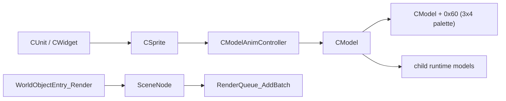

# 22. CModel Pose Palette 与 Resource Remap 专题逆向

## 1. 范围

本页只收口动态单位阴影/未来 GPU 动画最关键的一层：

1. `CModelData/HMODELDATA` 资源层的 `geoset / material / matrix-group / matrix indices`
2. `resource geoset -> runtime pose array` 的 remap 规则
3. `CModel` 本帧最终稳定的 3x4 姿态 palette
4. `parent runtimeModel -> child runtimeModel / attachment / light / plane emitter`
5. 未来被动采样或接管时最合适的 hook 点

本页不重复 `RenderScene / DispatchStage / RenderQueue` 主链。

## 2. 资源层：`CModelData / CGeosetData`

### 2.1 关键创建链

1. `0x6F127610`
   - 分配 `HMODELDATA`
   - 调 `CModelData::ctor`
   - 把结果写到调用者 `+0x9C`
2. `0x6F12A400`
   - 分配 `HMODEL`
   - 调 `CModel::ctor`
   - 再分配 `HMODELDATA`
   - `CModelData + 0x54 = 1`
   - `CModel + 0x9C = retain(modelData)`
3. `0x6F185250`
   - 更上游的 `sprite -> runtimeModel` 创建/绑定点
   - 若 source 带模型资源，则会直接创建 runtime `CModel`
4. `0x6F6BD110`
   - 比 `0x6F185250` 更高一层的 host 绑定点
   - 同一栈里同时拥有 source object、sprite 与新建 runtimeModel
5. `0x6F12A6A0`
   - 资源侧“添加 geoset + material + layout/matrix-group”的高层入口
6. `0x6F126250`
   - 从原始 positions / normals / uvs / indices 构建 `CGeosetData`
7. `0x6F130CD0 / 0x6F130D90`
   - `CModelData -> CModel` 运行时复制

### 2.2 `CGeosetData` 高置信度布局

```text
CGeosetData
+0x08  InlineVec3Array4 positions
+0x44  vertex_group_indices array header
+0x50  InlineVec3Array4 normals
+0x8C  InlineUvLayerRecordArray1 uv_layers
+0xC4  PrimitiveRecordArray1 primitive_records
+0xD8  InlineU16Array4 indices
+0xEC  u32 array header: matrix_group_sizes
+0xF0  matrix_group_count
+0xF4  uint32_t* matrix_group_sizes
+0xF8  u32 array header: matrix_indices
+0xFC  total_matrix_index_count
+0x100 uint32_t* matrix_indices
+0x104 unknown
+0x108 layout_or_material_slot
+0x10C unknown
+0x11C merged_geoset_slot_or_source_slot
```

### 2.3 `CGeosetData` 关键证据

`0x6F126250` 的原始汇编已经把关键偏移钉死：

1. `lea ecx, [ebx+8] ; call sub_6F12CFB0`
   - `+0x08` 是 `Vec3[12B]` 数组
2. `lea ecx, [ebx+50h] ; call sub_6F12CFB0`
   - `+0x50` 是第二个 `Vec3[12B]` 数组
3. `0x6F131320`
   - `+0x44/+0x48/+0x4C` 会被当作 `uint8_t` 顶点 matrix-group slot 表使用
   - 这张表记录的是“每顶点引用哪个 matrix-group slot”，不是直接 bone id
4. `lea ecx, [ebx+8Ch] ; call sub_6F12D710`
   - `+0x8C` 是“44B UV layer record”数组头
5. `mov ecx, [ebx+94h] ; call sub_6F12CF20`
   - `+0x94` 指向第一条 UV layer record
6. `lea edi, [ebx+0C4h] ; call sub_6F12C390`
   - `+0xC4` 是 primitive record 数组头
7. `lea ecx, [ebx+0D8h] ; call sub_6F12CEA0`
   - `+0xD8` 是 `uint16 index buffer` 数组头
8. `mov edi, [ebx+0F0h] / mov edx, [ebx+0F4h]`
   - `+0xF0/+0xF4` 明确参与 matrix-group 计数和 size-array 遍历
9. `mov eax, [edi+100h]`
   - `+0x100` 明确是 flat matrix index array

### 2.4 `geoset -> material/layout` 绑定

`0x6F12A6A0` 的高置信度资源头布局：

```text
CModelData
+0x08  geoset handle array header
+0x18  geoset binding record array header (stride 0x10)
+0x28  material handle array header
+0x48  per-material byte table header
+0x58  extra resource handle array header
+0x94  resource flags
+0x98  part-state/override prototype
+0x9C  retained model-data/self handle
```

其中：

1. `sub_6F12AD70(this+0x08)`
   - 追加 `HGEOSET*`
2. `sub_6F12AE10(this+0x18)`
   - 追加 16 字节 `geoset binding record`
   - 默认值为 `{ -1, -1, 1.0, 1.0 }`
   - 当前保守理解为 `layout/material/scale-like binding record`
3. `this+0x28`
   - material handle 数组
4. `this+0x48`
   - 每 material 对应的 `0xFF` byte 表

## 3. Matrix-group Remap：从资源骨骼索引到 runtime pose slot

### 3.1 关键函数

1. `0x6F131150`
2. `0x6F131210`
3. `0x6F132A10`
4. `0x6F1312F0`
5. `0x6F132790`
6. `0x6F132700`

### 3.2 真实规则

`CGeosetData` 资源侧不是“每 geoset 直接存骨骼 palette”，而是：

1. `+0xF0 = matrix_group_count`
2. `+0xF4 = 每组使用多少个 matrix index`
3. `+0x100 = flat matrix index list`

`0x6F131150` 会先根据 `matrix_group_sizes` 构建 prefix-sum：

```text
group0 base = 0
group1 base = size[0]
group2 base = size[0] + size[1]
...
```

然后 `0x6F131210` 对每个 group 做两件事：

1. 取出 `matrix_indices + prefix[group]`
2. 用 `0x6F132A10` 在目标 runtime/merged geoset 里查重

如果这一组 index 序列是新的：

1. `0x6F1312F0` 分配一个新 slot
2. 把这组 `uint32 bone/matrix indices` 复制到目标 `+0x100`
3. 把组大小写入目标 `+0xF4[slot]`

无论是否新建，都会：

1. 把最终 slot id 写入 `a7 + groupIndex` 的 byte remap 表

### 3.3 `0x6F132A10` 的 20B 查重节点

高置信度节点布局：

```text
MatrixGroupRemapNode (20B)
+0x00 source_indices_ptr
+0x04 source_index_count
+0x08 result_slot
+0x0C overlap_or_prefix_branch
+0x10 non_overlap_branch
```

判定逻辑：

1. `0x6F132790`
   - 完全相等才命中
2. `0x6F132700`
   - 更像“字典序前缀/重叠关系”
   - 为树形查重决定走哪条分支

### 3.4 结论

这条链已经足够明确地回答：

**War3 的资源骨骼索引不是直接对应 runtime pose slot，而是要先经过 matrix-group dedup/remap。**

这也是“静态 geoset + 每帧 pose/palette 更新”能成立的关键桥梁。

## 4. Runtime：本帧最终稳定姿态输入

### 4.1 关键函数

1. `0x6F182300`
2. `0x6F1826C0`
3. `0x6F12F3B0`
4. `0x6F12F0A0`
5. `0x6F12E900`
6. `0x6F12EB70`
7. `0x6F12FED0`
8. `0x6F12FDC0`
9. `0x6F12F7E0`

### 4.2 `CModel` 高置信度布局

```text
CModel
+0x08  runtime geoset array header
+0x18  runtime geoset binding record array header
+0x28  runtime material handle array header
+0x48  extra resource array header
+0x5C  final_pose_matrix_count
+0x60  final_pose_matrix_array
+0x64  current_world_matrix_3x4
+0x94  flags
+0x98  CModelPartStateController*
+0x9C  CModelData / model-data handle
+0xC4  child_bucket_count
+0xC8  child_bucket_array
+0xD4  child_visibility_cache
```

### 4.3 `0x6F12FDC0`：权威 palette 输出

这是这轮最关键的证据。

`0x6F12FDC0` 直接做：

1. `v5 = *(a1 + 0x5C)` 作为循环次数
2. `v4 = *(a1 + 0x60)` 作为目标输出指针
3. 以 `48B` 为 stride，把 scratch 里的 3x4 矩阵拷到 runtime 输出缓冲

也就是说：

1. `CModel + 0x5C = 最终姿态矩阵数量`
2. `CModel + 0x60 = 最终姿态矩阵数组`
3. `stride = 0x30 = 48 字节 = 3x4 matrix`

### 4.4 这块数据的生命周期

1. `0x6F12F0A0`
   - 设置当前 world 3x4
   - push 一层 48B scratch matrix
   - 分流到 `0x6F12E900 / 0x6F12EB70`
2. `0x6F12E900 / 0x6F12EB70`
   - 展开 override graph
   - 给可见部件分配 stage preset span
   - `0x6F12FDC0` 把 resolved 3x4 拷回 `CModel + 0x60`
3. `0x6F12F7E0`
   - 再做 child runtime model / attachment / local-point 链的递归推进

所以：

1. scratch arena 不是稳定采样点
2. `CModel + 0x60` 才是本帧稳定输出

## 5. 推荐 Hook 点

### 5.1 如果目标是“主模型最终 palette”

推荐：

1. `post 0x6F12F0A0`

原因：

1. 它统一覆盖 simple / complex 两条分支
2. 返回时 `0x6F12FDC0` 已经完成
3. `CModel + 0x5C/+0x60` 对本帧渲染已定稿

### 5.2 如果目标是“连 child runtime / attachment 一起稳定”

推荐：

1. `post 0x6F12F7E0`

原因：

1. `0x6F12EC90` 会递归 child runtime model
2. 这时 local point / attach chain / plane emitter / ribbon 也已经跟上
3. 适合做“全树姿态/附着已稳定”的被动采样点

### 5.3 为什么不优先选别的点

1. 不优先只 hook `0x6F12E900 / 0x6F12EB70`
   - 因为需要双点维护
2. 不优先只 hook `0x6F12FDC0`
   - 太窄，只看得到 root model palette copy
   - 看不到 attachment/child runtime 后续递归
3. 不优先只 hook `0x6F182300`
   - 这是 sprite 侧总包装点，混合了动画推进、显示状态和 palette 构建，不如 `post 0x6F12F0A0` 聚焦

## 6. Attachment / Child Runtime Model

### 6.1 `0x6F131F60`

高置信度结论：

1. 它会把资源侧 child link 克隆成 runtime child link
2. 每个 link 节点大小 16B
3. 关键字段：
   - `+0x08 = child runtimeModel = sub_6F12A5C0(sourceChild->modelData)`
   - `+0x0C = attach_tag_or_attach_index`

所以：

**child runtime model 不是“逻辑引用”，而是真正独立创建出来的一棵 runtime 子树。**

### 6.2 哪些对象跟随主 pose

直接跟随主 pose / child runtime tree：

1. child runtime model
2. local point / attach point 输出
3. override graph 驱动的 ribbon status
4. particle / plane emitter 的门控和 transform

独立 runtime object，但创建时从主模型克隆出来：

1. `0x6F1322B0`
   - `CGxuLight` 数组
2. `0x6F132190`
   - `CPlaneParticleEmitter` 数组
3. `0x6F1320D0`
   - 一组 camera-like runtime object（当前仍保守）

### 6.3 `0x6F12EC90`

这是 child runtime 递归传播的关键点：

1. 先 `sub_6F77C280(controller, a2 + 92)`
   - 写 local point / attach 输出
2. 如果 `flags & 0x10`
   - 遍历 `child_bucket_array`
   - 逐个 child runtime model 递归 `sub_6F12EC90`

## 7. 更上游的对象直传锚点

这轮对动态模型更有价值的上游锚点是：

1. `0x6F6BD110`
   - 更高层的 `source object -> sprite -> runtimeModel` 绑定点
   - 同一栈里更容易一次性登记 `sprite/runtimeModel/rawcode/jHandle`
2. `0x6F185250`
   - `sprite ctor / bind runtime model`
   - 若 source 带模型资源，则直接创建 runtime `CModel`
3. `WorldObjectEntry_Render -> RenderQueue_AddBatch`
   - 这是逻辑对象到 sceneNode/batch 的高层桥
4. `CWidget + 0x28 -> CSprite*`
5. `CSprite + 0x20 -> CModelAnimController*`

因此，比 `SceneCollector + ExecBatch` 更上游、更便宜的链路可以表述成：



工程上更稳妥的做法是两段式桥接：

1. 上游在 `0x6F6BD110 / 0x6F185250` 登记 `source object -> sprite -> runtimeModel -> rawcode/jHandle`
2. 下游只在 `WorldObjectEntry_Render -> RenderQueue_AddBatch` 这段补 `worldObjectEntry -> sceneNode`

这样可以把 render 热路径里的“语义恢复”继续降级成 fallback，而不是每次 dispatch 再倒查

## 8. 最终结论

这轮已经可以明确回答：

**War3 的动态单位，应优先走 palette 路线，而不是 CPU skinned output 路线。**

具体原因：

1. 资源层已经能明确给出 `geoset -> matrix-group -> matrix indices`
2. runtime 层已经能明确给出 `CModel + 0x5C/+0x60` 的最终 3x4 pose palette
3. `0x6F12E600` 证明 War3 在 runtime 里按 matrix-group 组合 3x4 矩阵
4. 到目前为止，没有找到比这块 palette 更稳定、也更权威的“最终 CPU skin 顶点缓存”

所以未来动态阴影/未来 GPU 动画的推荐路线是：

1. 静态缓存模型资源：positions / normals / uvs / indices / matrix-group / matrix indices
2. 每帧采样 `CModel + 0x60`
3. 按 geoset 的 matrix-group remap 规则喂给阴影或 GPU skin

只有在后续进一步发现“更便宜且同样稳定的 post-skin vertex cache”时，才需要改走 CPU skin output 路线。
