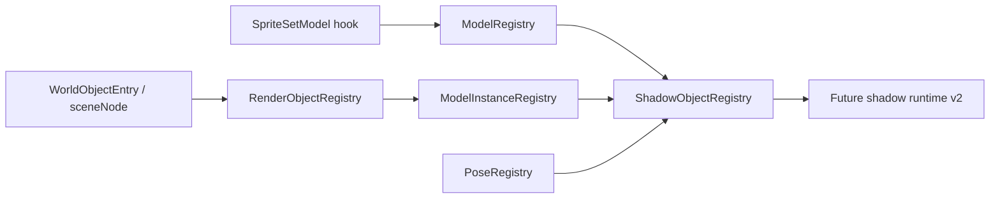
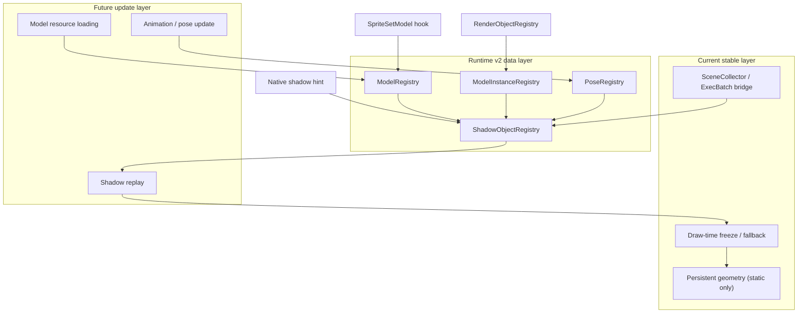
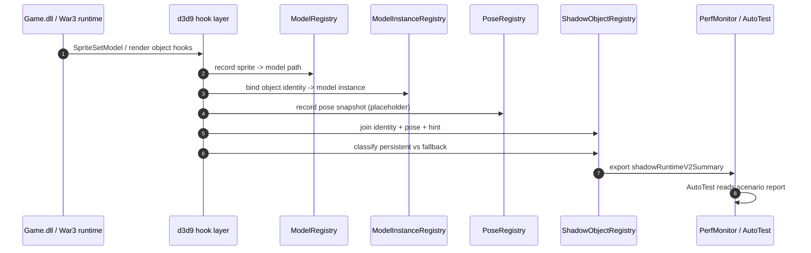
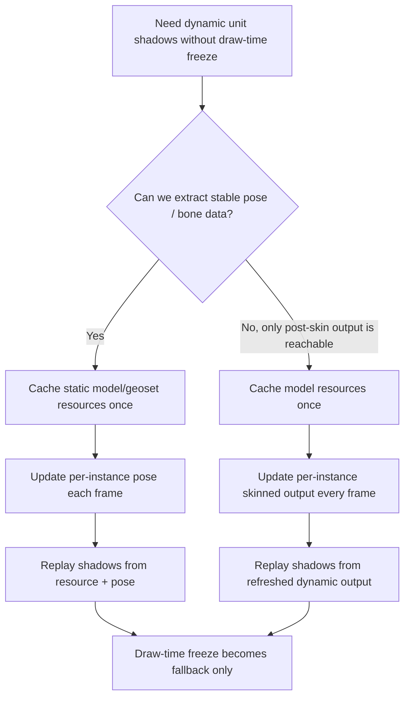

# War3 Shadow Runtime v2 - Scaffolding Note

This directory records the long-term shadow-runtime direction without changing current rendering behavior.

## Core Idea

Keep the current draw-time pipeline as-is for now, but prepare a future path that separates:

- model resource identity
- model instance identity
- pose / animation state
- shadow object identity

## Target Architecture

## Update Sequence

## Current Scope

- `ModelRegistry`: records sprite/model path bindings.
- `ModelInstanceRegistry`: records unit, scene node, and handle links.
- `PoseRegistry`: stores pose snapshots as read-only runtime metadata.
- `ShadowObjectRegistry`: aggregates the above for later v2 shadow runtime work.

## Milestone 1 status

- `PerfMonitor` now exports a top-level `shadowRuntimeV2Summary`.
- `AutoTest` named scenarios can record and return that summary without hand
  parsing.
- Current v2 summary is still scaffold-level:
  - static persistent counts are real
  - semantic bridge hit/miss/bypassed counts are real
  - model/pose/bone counters remain placeholder `0` until animation/runtime
    reverse engineering lands

## New reverse-engineering conclusions (2026-04-03)

The first meaningful runtime-model / animation chain is now concrete enough to
drive the v2 design.

### Confirmed runtime chain

- `sub_6F185250`
  - creates `CSpriteUber` / `CSpriteMini`
  - binds `sub_6F12A5C0(this->model)` into `sprite + 0x20`
  - this is the most trustworthy currently known `sprite -> runtime-model`
    binding point
- `sub_6F1820C0 / sub_6F182300 / sub_6F1825E0 / sub_6F1826C0`
  - are the main per-frame `CSpriteUber` update paths
  - they advance animation time and refresh per-instance runtime model state
- `sub_6F12F0A0 + sub_6F12F7E0`
  - are the clearest currently known pose-update points
  - they write / propagate 3x4 transforms through the runtime-model tree
- `sub_6F12EC90 -> sub_6F77C280 -> sub_6F77CDD0`
  - recursively apply pose refresh over child animation/model links

### Design implication

This strongly suggests that War3 exposes a **runtime pose graph** on the CPU
before draw submission.

It does **not** currently look like:

- a ready-to-reuse D3D fixed-function matrix palette at draw time
- or a safe "cache one frame of final skinned vertices and reuse forever"
  model

Therefore the future v2 mainline should not try to persist "final dynamic unit
vertices" across frames.

Instead it should aim for:

1. static model/geoset resources cached once
2. per-instance animation/pose updated every frame
3. shadow replay driven by resource + pose, not by draw-time identity recovery

### Important correction

The current project's `SpriteSetModel` vtable-slot assumption is not trusted.
IDA inspection shows the assumed `CSpriteUber` slot at offset `0xE8` resolves
to `sub_6F183570`, which is only a getter and **not** a model-binding
function.

Until a verified replacement hook is installed, production `ModelRegistry`
work should treat:

- `sub_6F185250`
- callers of `sub_6F12A5C0`

as the authoritative reference chain.

## Runtime v2 decision tree

## Proposed takeover stages

### Stage A: Passive capture only

- record `sprite -> runtime-model` at `sub_6F185250`
- record per-instance pose snapshots near `sub_6F12F0A0 / sub_6F12F7E0`
- do not change current shadow rendering behavior

### Stage B: Static model resource cache

- move static geoset/material/layout ownership into `ModelRegistry`
- bind `sceneNode / sprite / unit` to persistent model-resource identity
- keep dynamic units on fallback until pose extraction is proven correct

### Stage C: Dynamic pose path

If stable pose data is available:

- upload pose/palette data per instance every frame
- keep geometry static in GPU memory
- let shadow replay consume `geometry + pose`

If only post-skin output is available:

- keep model resource identity static
- refresh dynamic skinned output per instance every frame
- still avoid draw-time semantic recovery as the primary world model

### Stage D: Semantic hot-path reduction

- once runtime-model / pose identity is reliable, demote:
  - `SceneCollector shadow-lite`
  - `ExecBatch TLS semantic bridge`
  - draw-time identity recovery
- retain them only as fallback for objects that miss the new runtime contract

## Current recommendation

Do **not** reopen dynamic `CUnit` persistent caching.

Do **not** try to keep final animated vertices static.

Do continue the v2 route as:

- verified runtime-model binding
- pose extraction
- static resource cache

## Runtime bridge status (2026-04-04)

`runtime-shadow-bridge-v1` is now wired into the project as the single
aggregation layer for this roadmap:

- feed side:
  - `NoteShadowRuntimeRenderObject`
  - `NoteShadowRuntimeIdentity`
  - `NoteShadowRuntimeModelBinding`
  - `NoteShadowRuntimePose`
  - `NoteShadowRuntimeSpriteFramePose`
- consume side:
  - `AugmentShadowSemanticContext`
  - `ComputeShadowRuntimeBridgeTracking`
  - `QueryShadowRuntimeBridgeSummary`

This means:

1. `d3d9_device.cpp` no longer needs to own registry join logic directly.
2. `render_objects` only needs to feed the bridge when identity tracking is
   actually enabled.
3. future upper-layer work can inject `sceneNode/unit/sprite/runtimeModel`
   directly into the bridge without re-entering the old draw-time recovery
   path.

Current production posture remains conservative:

- pose hooks stay default-off
- draw-time fallback remains authoritative for dynamic animated units
- runtime-model / pose chain is gathered and summarized, but not yet promoted
  to the default animated shadow path

## Known Bugs (2026-04-04)

The following issues are currently treated as known bugs and are intentionally
**not** the target of the current runtime-v2 scaffolding work:

1. dynamic unit shadows can be spatially offset from the unit feet
2. some animated/skinned casters still rotate/lag inconsistently relative to
   unit facing
3. flying-unit shadows can appear fixed or fail to update correctly

These are recorded as downstream correctness bugs. The current development
focus is to finish the authoritative runtime-model + pose capture chain first,
then move shadow replay over to that chain before revisiting spatial
correction.
- dynamic per-instance update
- draw-time freeze fallback only

## Module boundaries

Must split:

- `ModelRegistry`, `ModelInstanceRegistry`, `PoseRegistry`, `ShadowObjectRegistry`
- future model loading / pose update glue
- semantic-cost research and shadow-runtime-v2 reporting

Can continue patching:

- `war3_render_state` layered intent flags
- `war3_hook_render` / `war3_render_exec_batch` / `war3_scene_collector`
- `d3d9_device` persistent gate and fallback classification
- `PerfMonitor` / `AutoTest` scaffolding

## Scenario presets used for the roadmap

- `low_pressure_static_reuse`
  - map: `E:\Work\War3\Maps\ShadowTest\光影测试低压.w3x`
  - purpose: static reuse baseline and persistent-cache evidence
- `dynamic_shadow_pressure`
  - map: `E:\Work\War3\Maps\光影测试.w3x`
  - purpose: dynamic unit correctness and fallback pressure
- `model_runtime_probe`
  - purpose: model resource / instance / animation reverse-engineering runs
- `semantic_cost_probe`
  - purpose: hot-path semantic bridge cost and future upstream contract study

## Non-goals

- No change to current shadow output.
- No animation takeover yet.
- No persistent geometry policy changes yet.
- No runtime behavior change beyond passive bookkeeping.
